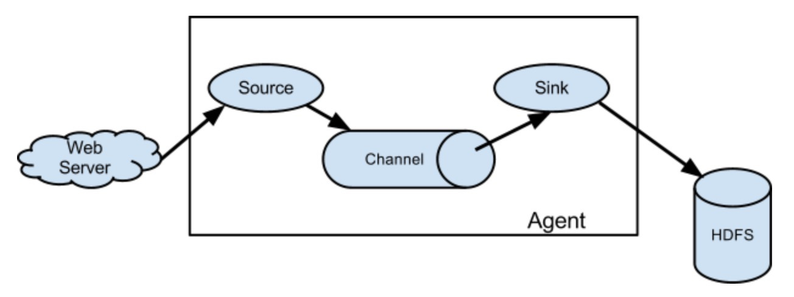

## Flume

* 如何解决我们的数据从其他的server上移动到Hadoop之上？

> webserver ==> flume ==> hdfs

#### 概述

* [官网](http://flume.apache.org)
* Flume是由Cloudera提供的一个分布式、高可靠、高可用的服务，用于分布式的海量日志的高效收集、聚合、移动系统
* 设计目标：
  - 可靠性
  - 扩展性
  - 管理性
* 同类比较
  - Flume: Cloudera/Apache  Java
  - Scribe: Facebook C/C++  不再维护
  - Chukwa: Yahoo/Apache  Java 不再维护
  - Fluentd: Ruby
  - Logstash: ELK 

#### 架构及核心组件



* Source 收集
* Channel 聚集
* Sink 输出

#### 环境及部署

* 前置条件
  - Java
  - Memory Sufficient
  - Disk Sufficient
  - Directory Permissions
* 下载Flume配置环境变量
* flume-env.sh配置: export JAVA_HOME=/jdk

#### Flume实战

> 使用Flume的关键就是写配置文件

1. 配置Source
2. 配置Channel
3. 配置Sink
4. 把以上三个组件串连起来

* 从指定网络端口采集数据输出到控制台

a1: agent的名称

r1: source的名称

k1: sink的名称

c1: channel的名称

```
# example.conf: A single-node Flume configuration

# Name the components on this agent
a1.sources = r1
a1.sinks = k1
a1.channels = c1

# Describe/configure the source
a1.sources.r1.type = netcat
a1.sources.r1.bind = localhost
a1.sources.r1.port = 44444

# Describe the sink
a1.sinks.k1.type = logger

# Use a channel which buffers events in memory
a1.channels.c1.type = memory
a1.channels.c1.capacity = 1000
a1.channels.c1.transactionCapacity = 100

# Bind the source and sink to the channel
a1.sources.r1.channels = c1
a1.sinks.k1.channel = c1
```

```shell
flume-ng agent --conf $FLUME_HOME/conf --conf-file $FLUME_HOME/conf/example.conf --name a1 -Dflume.root.logger=INFO,console
```

