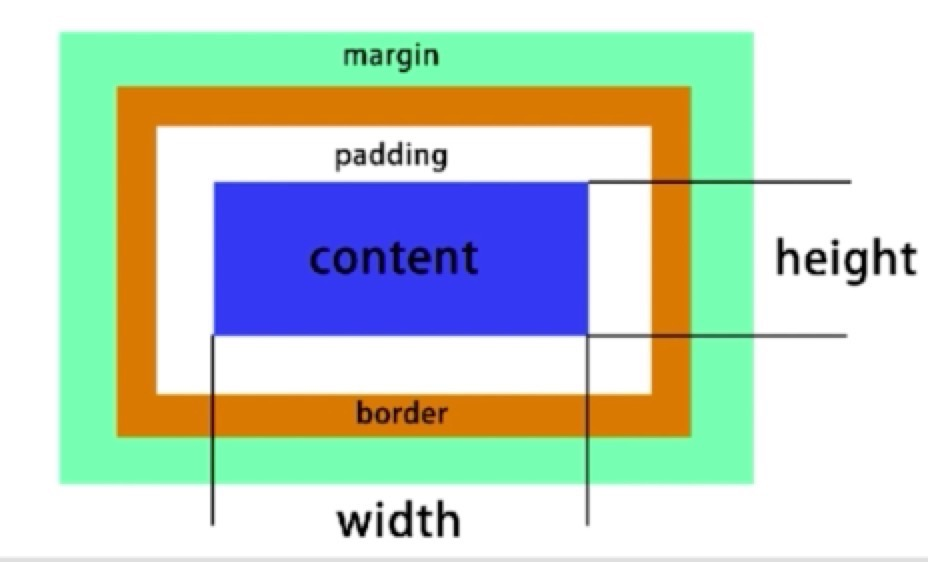

## CSS布局

* 常用布局方法

  > table表格布局
  >
  > float浮动+margin
  >
  > inline-block布局
  >
  > flexbox布局

#### 表格布局

#### 布局属性

* 盒模型

* display/position

  > 确定元素的显示类型:block/inline/inline-block
  >
  > 确定元素的显示位置:static/relative/absolute/fixed

#### flexbox布局

* 弹性盒子
* 盒子本来就是并列的
* 指定宽度即可

#### float

* 元素“浮动”
* 脱离文档流
* 但不脱离文本流
* 对自身的影响

> 形成“块”(BFC):比如span可以设置宽和高
>
> 位置尽量靠上
>
> 位置尽量靠左(右)

* 对兄弟的影响

> 上面贴非float元素
>
> 旁边贴float元素
>
> 不影响其它块元素位置
>
> 影响其他块级元素内部文本

* 对父级元素的影响

  > 从布局上“消失”
  >
  > 高度塌陷

* 如何清除浮动

  > 让盒子负责自己的布局
  >
  > overflow:hidden(auto)
  >
  > ::after{clear:both}

#### inline-block

* 像文本一样排block元素
* 没有清除浮动等问题
* 需要处理间隙