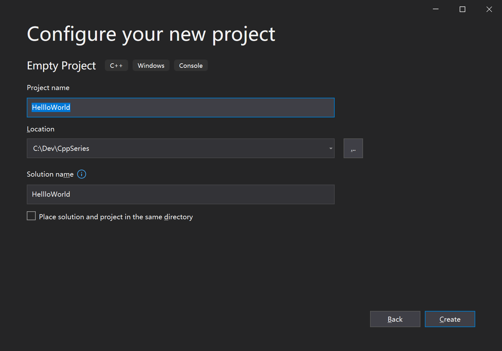

## 01-Cpp 第一课



- 解决方案(Solution)就是一组相互关联的项目(Project),它们可以是各种项目类型。基本上，解决方案就像工作台 ，每个项目本质上就是一组文件，它们被编译成某种目标二进制文件。不管它是一个库还是一个实际的可执行文件。
- Location项目所放位置不用默认的用户名下，路径太长，直接放到C盘目录下即可

```c++
#include <iostream>

int main() {
	std::cout << "Hello World!" << std::endl;
	std::cin.get();
}
```

# Visual Studio快捷键

- F9可以设置断点和取消断点
- F5如果已经生成了exe文件，那么就是运行程序，如果没有生成exe文件，那就就是生成并且运行
- F10单步步过
- F11单步步入
- Release发行版 更小 做了优化 运行速度快
- Debug 调式版 更大  优化更少 附带调试信息
- #include如果在本目录下寻找头文件，就用"",如果使用系统的头文件就用<>
