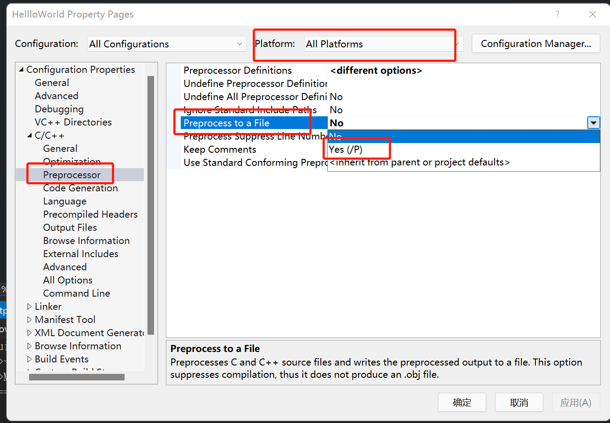
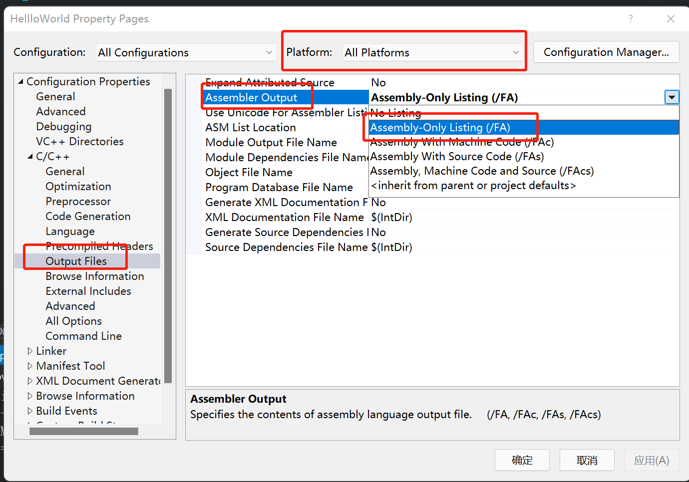

- visual studio右键项目选择properties弹出以上对话框，C/C++ -> Preprocessor -> Preprocess to a File选择Yes,然后编译对应的文件会生成对应后缀为.i的文件，是当前文件的预处理后的文件。设置此项不会生成对应的.obj文件

- 预处理会处理以#开头的语句

```c++
#if 0
void Log(const char* message) {
	std::cout << message << std::endl;
}
#endif
```
上述代码生成的预处理文件不会包含，直接忽略

```c++
#include <iostream>

int main() {
	std::cout << "Hello World!" << std::endl;
	std::cin.get();
#include "EndBrace.h"
```
EndBrace.h文件只有一行代码 }
预处理时会把 #include "EndBrace.h"直接替换成 }，所以上述代码会运行成功。




C/C++ -> Output Files -> Assembler Output -> Assembly-Only Listing

设置以上选项，编译时会生成对应的.asm文件，为编译后对应的汇编语言代码。设置上述时要注意Platform对应的平台，如果设置了Win32平台,编译时选择了x64会不起作用的。