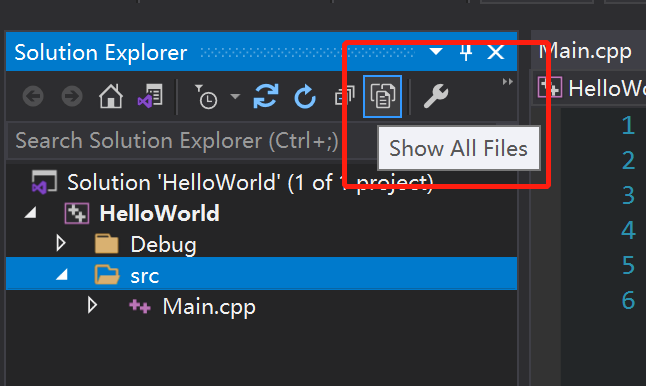
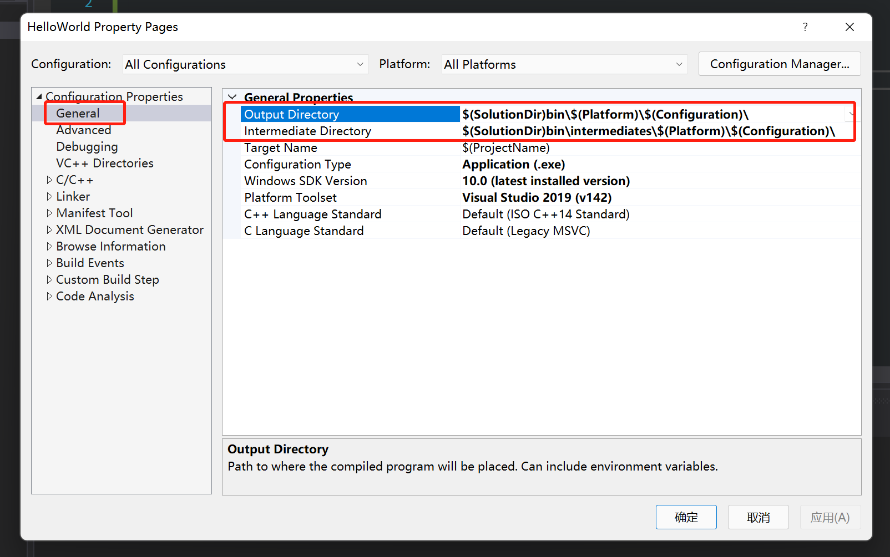

- visual studio创建项目默认会有一个虚拟的文件夹，实际上在磁盘是不存在的。我们可以点击Show All Files按钮来显示磁盘上实际的文件夹

- 切换到此视图，然后在项目里右键新建文件夹 src，将源文件放到src目录下
- 项目编译构建生成的文件设置如下图所示，将编译构建的文件都放到Solution的目录下。防止污染项目里源文件的目录结构

  - Output Directory -> $(SolutionDir)bin\$(Platform)\$(Configuration)\		
  - Intermediate Directory -> $(SolutionDir)bin\intermediates\$(Platform)\$(Configuration)\
  - $()的变量在visual studio中称为宏Macro,类似于一个k-v键值对