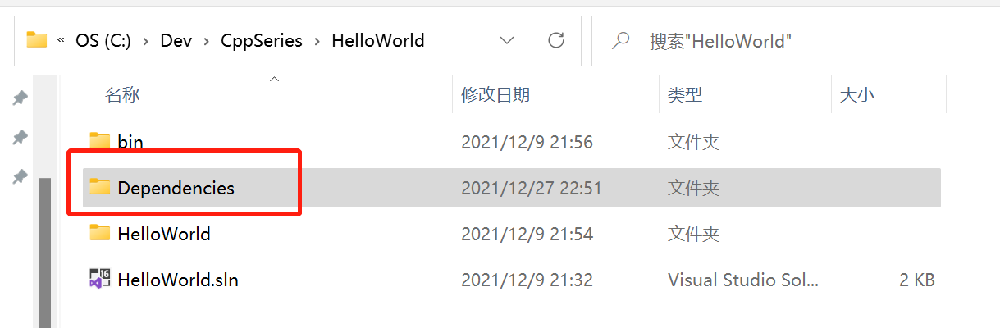
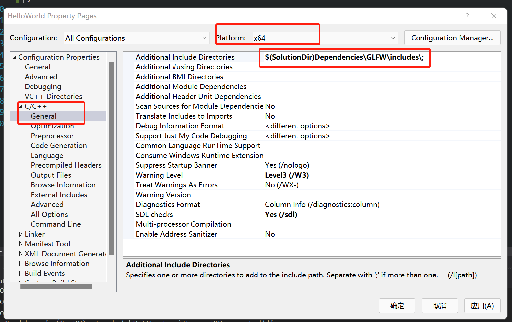
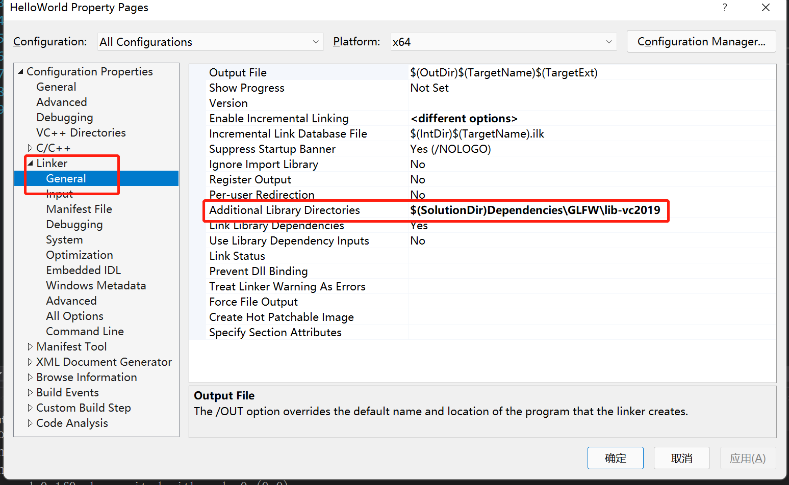
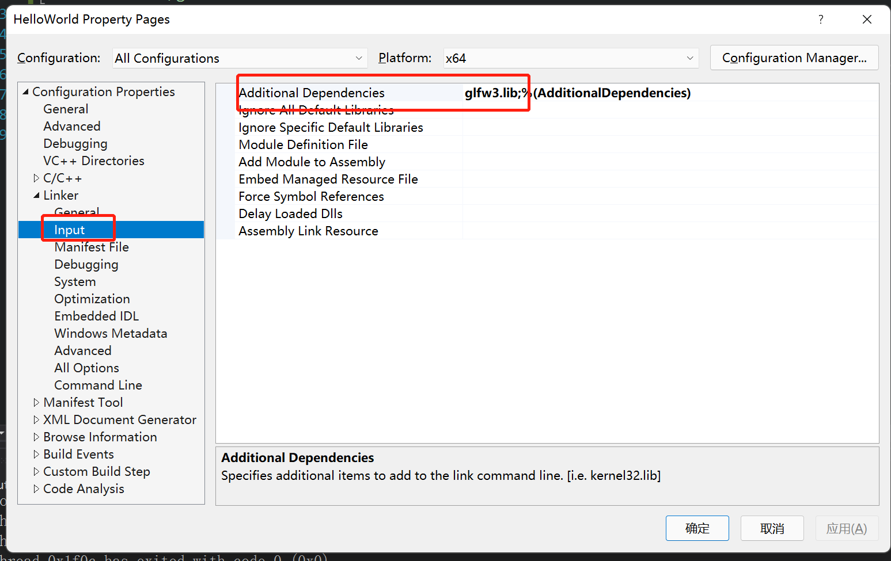

- 库通常包含两部分，include和library，包含目录和库目录，include目录是一堆头文件，这样我们就可以实际使用预构建的二进制文件中的函数，然后lib目录有哪些预先构建的二进制文件，这里通常有两部分文件，有动态库和静态库，并不是所有的库都提供了这两种库
- 静态链接意味着这个库会被放到可执行文件中，它在exe文件中或者其他操作系统下的可执行文件中
- 动态链接库是在运行时被链接的，所以仍然有一些链接，可以选择在程序运行时，装载动态链接库， 有一个叫做loadLibrary的函数，可以在WindowsAPI中使用它作为例子，它会载入动态库，可以从中拉出函数，然后开始调用函数，也可以在应用程序启动时，加载dll文件，这就是动态链接库
- 动态链接静态链接主要区别是库文件是否被编译到exe文件中或链接到exe文件中，或者只是一个单独的文件在运行时需要把它加载到exe文件旁边或某个地方
- 静态链接在技术上更快，因为编译器或链接器实际上可以执行链接时优化之类的

- SolutionDir目录下新建Dependencies/GLFW文件夹,将include和lib-vs2019文件夹拷入



s

- 引入头文件右键项目properties -> Configuration Properties -> C/C++ -> General -> Additional Include Directories添加$(SolutionDir)Dependencies\GLFW\include\



- 引入静态库文件，右键项目properties -> Configuration Properties -> Linker -> General -> Additional Library Directories添加$(SolutionDir)Dependencies\GLFW\lib-vc2019



- 右键项目properties -> Configuration Properties -> Linker -> Input -> Additional Dependencies 添加 glfw3.lib



- 引入对应的头文件即可，尖括号和引号的实际上没有区别，因为如果是引号的话，会先检查相对路径，如果它没有找到任何相对于这个文件的东西，它就会去找编译器，它会检查编译器的include路径。如果这个源文件在visual studio中，所以如果GLFW.h在我的解决方案中的某个地方，那么就用引号。如果它是一个完全的外部依赖，或者外部的库，不在visual studio中和我的实际解决方案一起编译，那么就用尖括号，来表示它实际上是外部的

```c++
#include <iostream>
#include <GLFW/glfw3.h>

int main() {
    int a = glfwInit();
    std::cout << a << std::endl;
    std::cin.get();
}
```

- 如果我们不引用GLFW/glfw2.h头文件,自己定义一个int glfwInit();函数，会得到一个链接错误，因为GLFW库实际上是一个C语言库，我们在这里用C++,混淆了名字(Name mangling), 我们需要在函数声明前面添加extern "C",意思是要保持这个名字的原貌，因为会链接到一个在C语言建立的库

```c++
#include <iostream>

extern "C" int glfwInit();

int main() {
    int a = glfwInit();
    std::cout << a << std::endl;
    std::cin.get();
}
```

