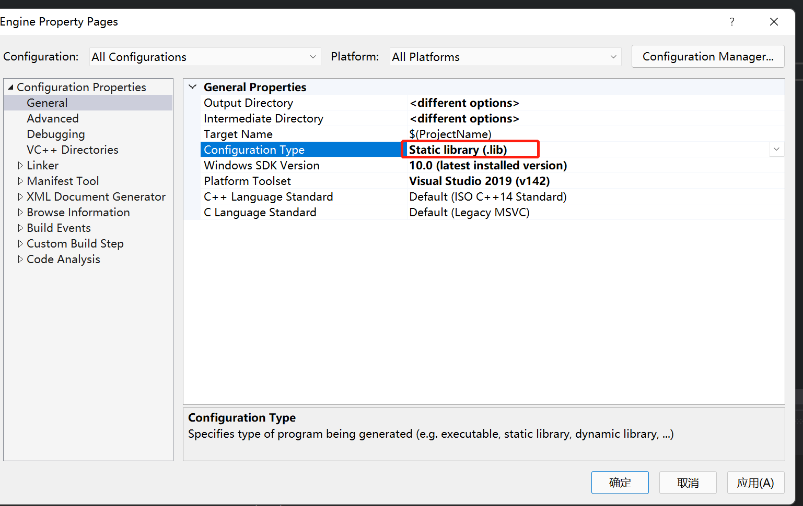
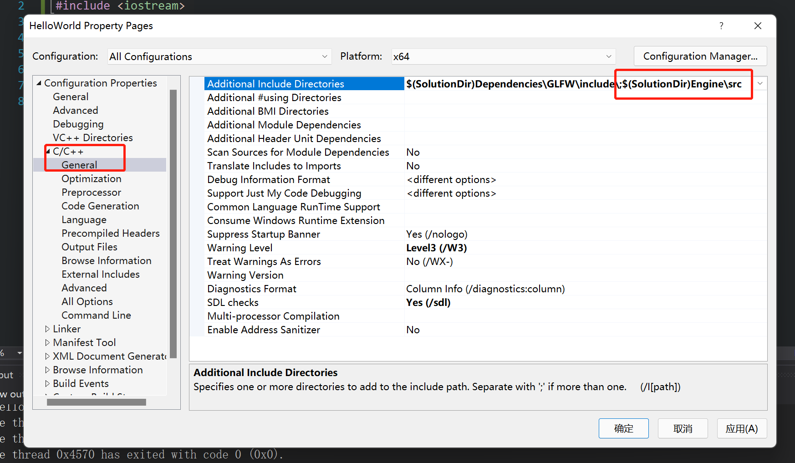
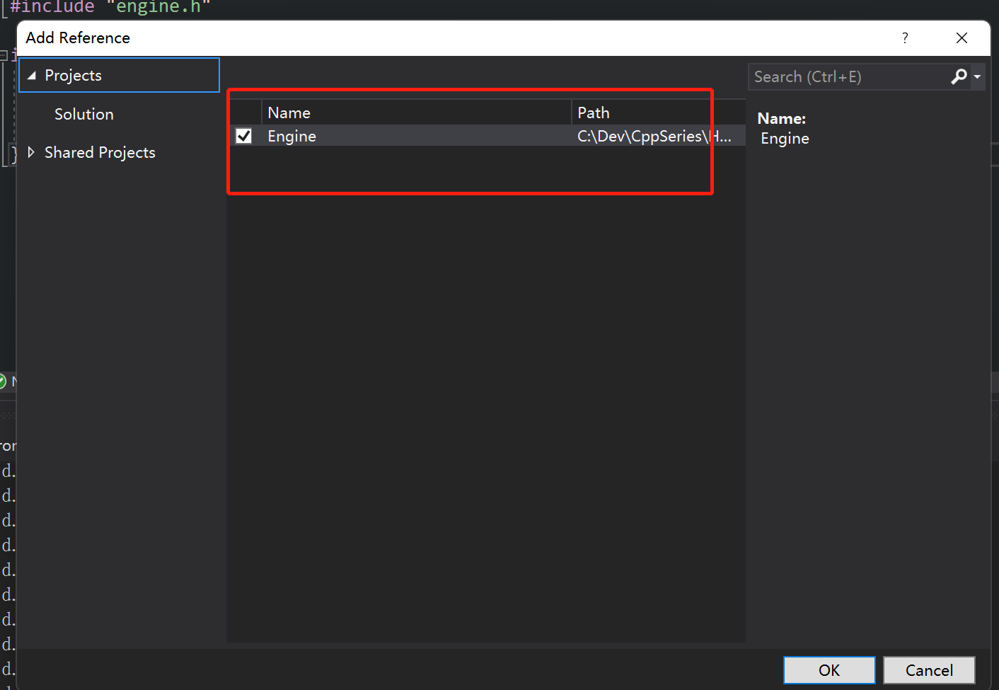

- 在同一个解决方案的目录下创建一个Engine的项目，并设置Engine项目为static library



- Engine项目里新建src/engine.h, src/engine.cpp文件
- engine.h

```c++
#pragma once

namespace engine {
	void PrintMessage();
}
```

- engine.cpp

```c++
#include "engine.h"
#include <iostream>

namespace engine {
	void PrintMessage() {
		std::cout << "Hello World" << std::endl;
	}
}
```

- 和Engine项目平级的HelloWorld项目(即在同一个SolutionDir目录下)引入Engine的头文件



- 右键HelloWorld项目 Add -> Reference引入Engine项目



- 在HelloWorld项目里可以引入engine.h头文件，然后调用Engine的库了

```c++
#include <iostream>
#include "engine.h"

int main() {
    engine::PrintMessage();

    std::cin.get();
}
```

