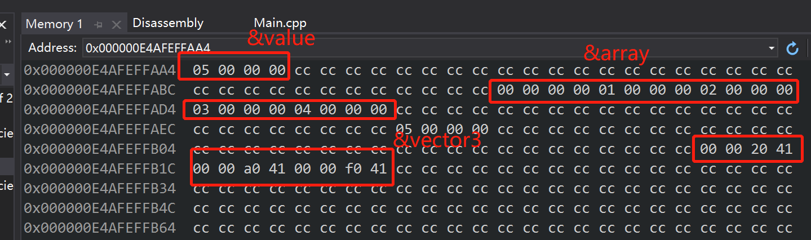

- 在应用程序启动后，操作系统要做的就是会将整个程序加载到内存，并分配一大堆物理ram以便我们的实际应用程序可以运行。堆和栈是ram中实际存在的两个区域，栈通常是一个预定义大小的内存区域，通常约为2M左右。堆也是一个预定义了默认值的区域，但是它可以增长，并随着应用程序的进行而改变。重要的是，要知道这两个内存区域的实际位置（物理位置），在我们的ram中是完全一样的
- 我们的程序中，内存是用来实际存储数据的 ，我们需要一个地方来存储运行程序所需的数据，不管是局部变量还是从文件中读取的东西，我们需要处理这些数据，需要一个地方来存储这些数据。堆和栈不同之处在于，是如何为我们分配内存

```c++
#include <iostream>
struct Vector3 {
    float x, y, z;
    Vector3() : x(10), y(20), z(30) {}
};
int main() {
    int value = 5;
    int array[5];
    for (int i = 0; i < 5; i++) {
        array[i] = i;
    }
    Vector3 vector3;

    int* hvalue = new int;
    *hvalue = 5;
    int* harray = new int[5];
    for (int i = 0; i < 5; i++) {
        harray[i] = i;
    }
    Vector3* hvector = new Vector3();
    delete hvalue;
    delete harray;
    delete hvector;
    std::cin.get();
}
```



- 从内存视图上来看value, array, vector3的值很接近，中间的cc是一堆安全守卫，在Debug模式下。当我们在栈中分配变量时，栈指针也就是栈顶部的指针，基本上就是移动这么多字节，如果我想分配一个4字节的整数，我们把栈指针移动4个字节，如果我想分配一个数组，比如5个整数，就移动20个字节。我们只是移动栈指针。栈的做法就是只是把东西堆在一起，这就是为什么栈分配非常块，它就像一条cpu指令，我们所做的就是移动栈指针，然后返回栈指针的地址
- 栈释放内存与分配一样，需要将栈指针反向移动然后返回栈指针地址 
- new实际上调用了一个叫做malloc的函数，memory allocate的缩写，这样做通常会调用底层操作系统或平台的特定函数，这将在堆上分配内存，这样做的方式是，当启动应用时，会得到一定数量的物理ram,分配给应用程序，应用程序会维护一个叫做空闲列表(free list)的东西，它是跟踪哪些内存块是空闲的还有他们在哪里等等。所以你需要动态内存的时候，使用动态堆内存
- 在栈上分配内存或在栈上存储变量他们在内存中挨的很近，因此它们可以放到cpu缓存线上（Cache Line可以理解为CPU Cache中的最小缓存单位 ）。我们使用堆时可能会是一些cache miss(CPU要访问的数据在Cache中有称为hit, 反之称为miss),相比之下，在栈中分配，可能不会得到Cache miss

```assembly
; 2    :     int value = 5;
	mov	DWORD PTR value$[rbp], 5
; 3    :     int* hvalue = new int;
	mov	ecx, 4
	call	??2@YAPEAX_K@Z				; operator new
	mov	QWORD PTR $T1[rbp], rax
	mov	rax, QWORD PTR $T1[rbp]
	mov	QWORD PTR hvalue$[rbp], rax
; 4    :     *hvalue = 5;
	mov	rax, QWORD PTR hvalue$[rbp]
	mov	DWORD PTR [rax], 5
; 5    :     delete hvalue;
	mov	rax, QWORD PTR hvalue$[rbp]
	mov	QWORD PTR $T2[rbp], rax
	mov	edx, 4
	mov	rcx, QWORD PTR $T2[rbp]
	call	??3@YAXPEAX_K@Z				; operator delete
	cmp	QWORD PTR $T2[rbp], 0
	jne	SHORT $LN3@main
	mov	QWORD PTR tv72[rbp], 0
	jmp	SHORT $LN4@main
$LN3@main:
	mov	QWORD PTR hvalue$[rbp], 33059		; 00008123H
	mov	rax, QWORD PTR hvalue$[rbp]
	mov	QWORD PTR tv72[rbp], rax
$LN4@main:
```

- 上述汇编代码可以看出栈内存分配就一行cpu指令，而new，delete是一大堆汇编指令
