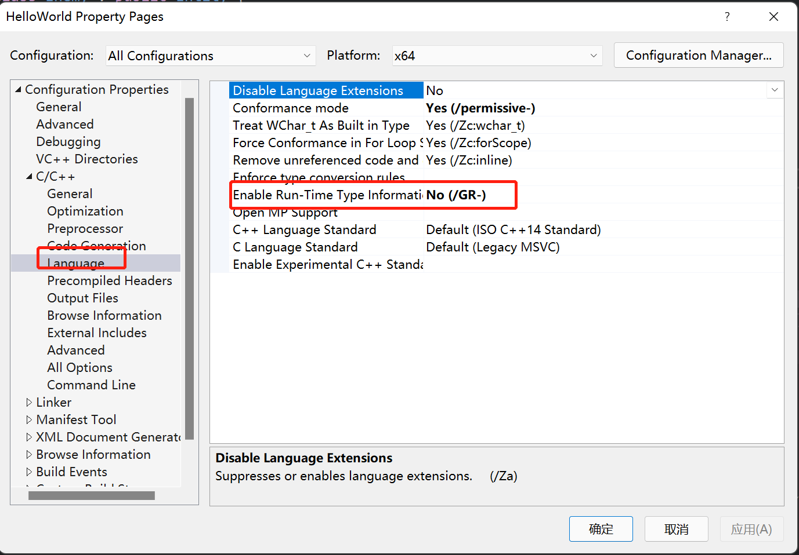

- dynamic_cast是C++风格的类型转换，仅适用于C++,不能在C中使用，它做了额外的工作来确保，我们实际的类型转换，是有效的类型转换
- dynamic_cast不是编译时进行的类型转换，而是在运行时计算。正因为如此，它确实有相关的运行成本
- dynamic_cast是专门用于沿继承层次结构进行的强制类型转换

```c++
#include "pch.h"

class Entity {
public:
	virtual void print() {}
};

class Player : public Entity {

};

class Enemy : public Entity {

};

int main() {

	Entity* e1 = new Player();
	Entity* e2 = new Enemy();
	
	Player* player1 = dynamic_cast<Player*>(e1);
	std::cout << player1 << std::endl;
	Player* player2 = dynamic_cast<Player*>(e2);
	std::cout << player2 << std::endl; //NULL
	std::cin.get();
}
```

- 如果我们关闭运行时类型检查，Player* player1 = dynamic_cast<Player*>(e1);会导致运行终止
- visual studio关闭运行时类型检查右键项目 -> Properties -> Configuration Properties -> C/C++ -> Language -> Enable Run-Time Type Information设为No

