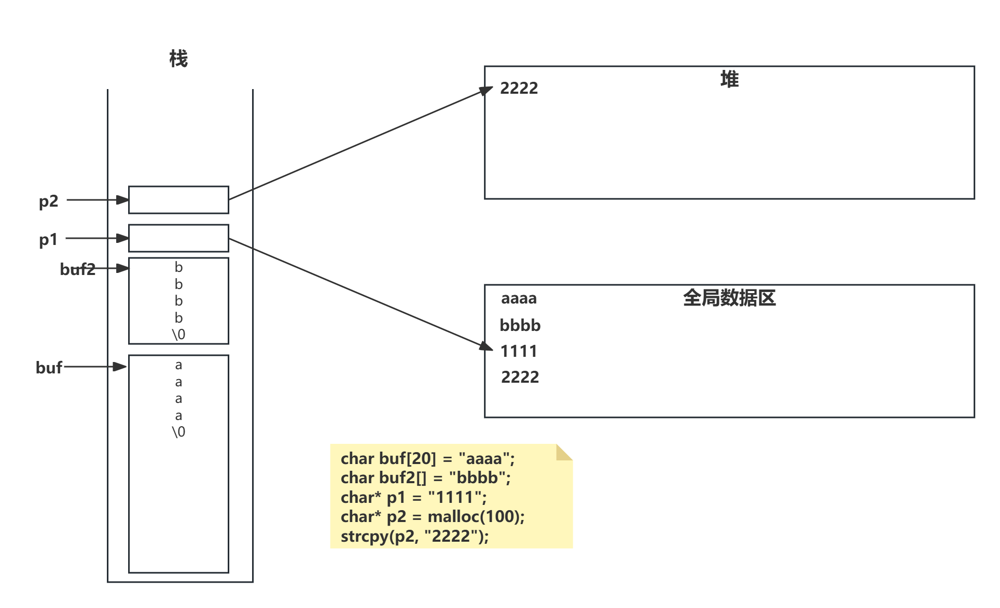
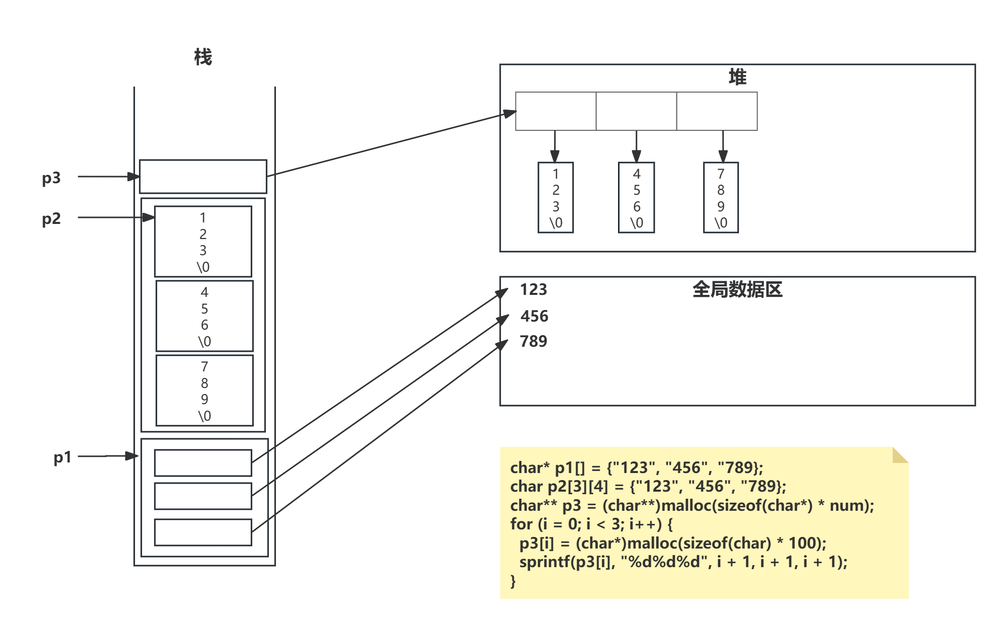

# 数组
- 数组做函数参数的退回问题：退回为一个指针。
- 结论：把数组的内存首地址和数组的有效长度传给被调用参数
- 实参a和形参a的数据类型本质不一样;在形参中的数组，编译器会把它当初指针处理，这是C语言的特色
- 形参写在函数上和写在函数内是一样的，只不过是具有对外的属性而已
```c
#include "stdlib.h"
#include "string.h"
#include "stdio.h"

//static void printArray(int a[7], int length) {
//static void printArray(int a[], int length) {
static void printArray(int *a, int length) {
	int i = 0;
	for (i = 0; i < length; i++) {
		printf("%d ", a[i]);
	}
	printf("\n");
}

//static void sortArray(int a[7], int length) {
//static void sortArray(int a[], int length) {
static void sortArray(int *a, int length) {
	int in_length = sizeof(a) / sizeof(a[0]);
	// in_length 32位 1，64位 2
	// 实参a和形参a的数据类型本质不一样
	// 在形参中的数组，编译器会把它当初指针处理，这是C语言的特色
	int i = 0, j = 0;
	for (i = 0; i < length; i++) {
		for (j = i + 1; j < length; j++) {
			if (a[i] <= a[j]) {
				continue;
			}
			int temp = a[j];
			a[j] = a[i];
			a[i] = temp;
		}
	}
}

// 排序
void main() {
	
	int a[] = { 33,654,4,456,6,33,4 };
	int length = sizeof(a) / sizeof(a[0]);
	printArray(a, length);
	// 排序
	sortArray(a, length);
	printArray(a, length);
	printf("hello...\n");
	system("pause");
}
```
## 数组基本概念
```c
#include <stdlib.h>
#include <string.h>
#include <stdio.h>

int main() {
	int c[10] = { 0 }; // 编译的时候就已经确定所有的值为零
	memset(c, 0, sizeof(c)); // 显示的重置内存块
	// 对一维数组C规定：
	// c是数组首元素的地址， &c是整个数组的地址
	// c+1步长4个字节 &c+1步长10*4=40个字节

	// 定义数组类型, 定义了一个数据类型：数组数据类型
	typedef int(MYINT5)[5];
	MYINT5 array; // int array[5];
	for (int i = 0; i < 5; i++) {
		array[i] = i + 1;
	}
	for (int i = 0; i < 5; i++) {
		printf("%d\n", array[i]);
	}
	// array:1701644 array+1:1701648
	// &array:1701644 & array + 1 : 1701664
	printf("array:%d array+1:%d\n", array, array + 1);
	printf("&array:%d &array+1:%d\n", &array, &array + 1);
	
	printf("hello...\n");
	system("pause");
	return 0;
}
```
## 数组指针
- 定义数组指针变量的方法1：用数组类型 *
```c
#include <stdlib.h>
#include <string.h>
#include <stdio.h>

int main() {
	char* array[] = { "1111", "aaaa" }; // 指针数组
	// 数组指针 用一个指针来指向一个数组
	typedef int(MyArrayType)[5]; //定义了一个数据类型 数组数据类型
	int i = 0;
	MyArrayType myArray; // 用类型定义变量
	MyArrayType* pArray; // 定义一个指针变量 这个指针变量指向一个数组

	int myArray2[5]; //相当于一级指针
	pArray = &myArray2; //相当于二级指针
	for (int i = 0; i < 5; i++) {
		(*pArray)[i] = i + 1;
	}
	for (int i = 0; i < 5; i++) {
		printf("%d ", (*pArray)[i]);
	}
	printf("\n");
	printf("hello...\n");
	system("pause");
	return 0;
}
```
- 定义数组指针变量的方法2：声明一个数组指针类型typedef int(*PArrayType)[5];
```c
int main() {
	// 定义声明一个数组指针类型
	typedef int(*PArrayType)[5];
	PArrayType pArray; //告诉编译器 给我分配一个指针变量
	int c[5];
	pArray = &c;
	for (int i = 0; i < 5; i++) {
		(*pArray)[i] = i + 1;
	}
	for (int i = 0; i < 5; i++) {
		printf("%d %d \n", c[i], (*pArray)[i]);
	}
	printf("\n");
	printf("hello...\n");
	system("pause");
	return 0;
}
```
- 定义数组指针变量的方法3：直接定义 int (*pointer)[n];
```c
int main() {
	int (*pArray)[5]; //直接定义一个指向数组的数组指针变量
	int c[5];
	pArray = &c;
	for (int i = 0; i < 5; i++) {
		(*pArray)[i] = i + 1;
	}
	for (int i = 0; i < 5; i++) {
		printf("%d %d \n", c[i], (*pArray)[i]);
	}
	printf("hello...\n");
	system("pause");
	return 0;
}
```
## 多维数组名的本质：数组指针
```c
#include <stdlib.h>
#include <string.h>
#include <stdio.h>

int main() {
	int a[3][5], i = 0, j = 0;
	int tmp = 1;

	for (i = 0; i < 3; i++) {
		for (j = 0; j < 5; j++) {
			a[i][j] = tmp++;
		}
	}
	for (i = 0; i < 3; i++) {
		for (j = 0; j < 5; j++) {
			printf("%2d ", a[i][j]);
		}
		printf("\n");
	}
	//a=14810232, a+1=14810252
	//&a = 14810232, & a + 1 = 14810292
	printf("a=%d, a+1=%d\n", a, a + 1); //a+1的步长是20
	printf("&a=%d, &a+1=%d\n", &a, &a + 1);//&a+1的步长是60
	// 定义一个指向数组的指针变量
	int(*pArray)[5]; //告诉编译器给我分配4个字节的内存 32bit
	pArray = a;
	for (i = 0; i < 3; i++) {
		for (j = 0; j < 5; j++) {
			printf("%2d ", pArray[i][j]);
		}
		printf("\n");
	}
	// 多维数组名的本质：数组指针
	// a+i 代表的是整个第i行的地址 二级指针
	// *(a+i) 代表的是第i行首地址 一级指针
	// *(a+i)+j ==> &a[i][j]
	// *(*(a+i)+j) ==> a[i][j]
	// a[i] ==> a[0+i] ==> *(a+i)
	// a[i][j] ==> a[0+i][j] ==> *(a+i)[j] ==> *(a+i)[0+j] ==> *(*(a+i)+j)
	printf("(a+1):%d\t*(a+1):%d\t*(a+1)+1:%d\n", (a + 1), *(a + 1), *(a + 1) + 1);
	
	printf("hello...\n");
	system("pause");
	return 0;
}
```
# 数据类型
- 数据类型的本质: 固定大小内存块的别名
- 数组数据类型(1. 定义一个数组类型 2数组指针 3数组类型和数组指针类型的关系)
```c
#include "stdlib.h"
#include "string.h"
#include "stdio.h"

void main() {
	int a; //告诉c编译器分配4个字节的内存
	int b[10]; //告诉c编译器分配40个字节的内存
	// b:20183088, b+1:20183092, &b:20183088, &b+1:20183128
	// b+1与&b+1结果不一样；b和&b所代表的数据类型不一样
	// b代表数组首元素的地址，&b代表的是整个数组的地址
	printf("b:%d, b+1:%d, &b:%d, &b+1:%d \n", b, b+1, &b, &b+1);

	printf("sizeof(b): %d\n", sizeof(b)); // 40
	printf("sizeof(a): %d\n", sizeof(a)); // 4
	printf("hello\n");
}
```
- 数据类型别名
```c
struct Teacher {
	char name[64];
	int age;
}Teacher;

// 数据别名typedef
typedef struct Teacher2 {
	char name[64];
	int age;
}Teacher2;

typedef int u32;

void main() {
	struct Teacher t1;
	Teacher2 t2;
	printf("u32:%d\n", sizeof(u32)); // 4
	printf("hello\n");
}
```
- 数据类型的封装：void的字面意思时“无类型”，void *则为“无类型指针”，void *可以指向任何类型的数据
# 变量
- 变量的本质是一段连续内存空间的别名（是一个门牌号）
- 对内存空间能不能再取别名 C++ 引用
- 对内存可读可写；通过变量往内存读写数据；不是向变量读写数据
```c
#include "stdlib.h"
#include "string.h"
#include "stdio.h"

void main() {
	int a;
	// 直接赋值
	a = 10;
	printf("&a: %d\n", &a);
	// 间接赋值
	*((int*)(&a)) = 200;
	printf("%d\n", a);
	int* p;
	p = &a;
	*p = 300;
	printf("%d\n", a);
	printf("hello\n");
}
```
# 内存四区
## 静态存储区理解（全局区）
- 指针指向谁，就把谁的地址赋给指针
- 指针变量和他所指向的内存空间变量是两个不同的概念
```c
#include "stdlib.h"
#include "string.h"
#include "stdio.h"

char* getStr1() {
	char* p1 = "hello world2";
	return p1;
}
char* getStr2() {
	char* p2 = "hello world2";
	return p2;
}

void main() {
	char* p1 = NULL;
	char* p2 = NULL;
	p1 = getStr1();
	p2 = getStr2();
	// 打印p1, p2所指向内存空间的数据
	printf("p1: %s, p2: %s \n", p1, p2);
	//p1: hello world2, p2: hello world2
	// "hello world2"存在全局区里
	//p1: 13474924, p2 : 13474924
	// 打印p1, p2的值
	printf("p1: %d, p2: %d \n", p1, p2);
	printf("hello\n");
}
```
## 堆栈
```c
#include "stdlib.h"
#include "string.h"
#include "stdio.h"

//堆
char* getMem(int num) {
	char* p1 = NULL;
	p1 = (char*)malloc(sizeof(char) * num);
	if (p1 == NULL) {
		return NULL;
	}
	return p1;
}
//栈
//注意 return不是把内存块64个字节给return出来，而是把内存块的首地址（内存标号0xaa11）返回给tmp
//理解指针的关键是内存，没有内存哪来的指针 
char* getMem2() {
	char buf[64]; // 临时变量 栈区存放
	strcpy(buf, "123456789");
	printf("buf:%s\n", buf);
	return buf;
}

void main() {
	char* tmp = NULL;
	tmp = getMem(10);
	if (tmp == NULL) {
		return;
	}
	// 向tmp指向的内存空间中copy数据
	strcpy(tmp, "hello");
	printf("%s\n", tmp);

	// 不要这样使用，栈区调用完可能会被释放掉
	tmp = getMem2();
	printf("%s\n", tmp);
	printf("hello\n");
}
```
## 函数调用模型
```c
void fb() {}
void fa() {
	fb();
}
void main() {
	fa();
}
```
- main函数中可以在栈分配内存/可以在堆上分配内存/全局区分配内存。分配的内存可以被fa,fb使用
- fb申请的内存，可以被main使用吗？
	1. fb中在栈上分配的内存，不能被fa和main函数使用
	2. fb中malloc的内存（堆），可以被main和fa函数使用
	3. fb中全局区分配"abcdefg"内存是可以被fa和main函数使用的
- 主调函数如何使用被调用函数分配的内存（技术关键点：指针做函数参数）
# 指针
## 指针是一种数据类型
- 指针也是一种变量，占有内存空间，用来保存内存地址
```c
#include "stdlib.h"
#include "string.h"
#include "stdio.h"

void main() {
	int a = 10;
	char* p1 = 100; //分配4个字节的内存
	char**** p2 = 100;
	printf("a:%d, p1:%d, p2:%d\n", sizeof(a), sizeof(p1), sizeof(p2));
	printf("hello\n");
}
```
- *p 操作内存
	- 在指针声明时，* 表示所声明的变量为指针
	- 在指针使用时，* 表示操作指针所指向的内存空间中的值
	- *p 放在等号的左边赋值 （给内存赋值）
	- *p 放在等号的右边取值 （从内存获取值）
- 不断的给指针赋值，相当于不停的改变指针的指向
```c
#include "stdlib.h"
#include "string.h"
#include "stdio.h"

void main() {
	int a = 10;
	int* p3 = NULL;
	p3 = &a;
	*p3 = 20; // 间接的修改a的值
	// 就像一把钥匙通过一个地址&a,去修改a变量标识的内存空间
	int b = *p3; //*p放在=左边，写内存；*p放在=右边，读内存
	printf("a:%d, b:%d \n", a, b); // a:20, b:20
	printf("hello\n");
}
```
- 保证所指向的内存块能修改
```c
char* getStr() {
	char* tmp = NULL;
	tmp = "abcdefg";
	return tmp;
}

void main() {
	char* p = getStr();
	printf("p:%s\n", p);
	*(p + 2) = 'r'; //执行报错，"abcdefg"存在常量区，不能被修改
	printf("p:%s\n", p);
	printf("hello\n");
}
```
- 指针做函数参数 形参又多级指针的时候，站在编译器的角度，只需要分配4个字节的内存(32bit),当我们使用内存的时候，我们才关心指针所指向的内存是一维的还是二维的
- 指针是一种数据类型，是指它指向的内存空间的数据类型
	- 指针步长(p++),根据所指向内存空间的数据类型来确定
	- 指针的步长，根据所指向内存空间类型来定
```c
int getABC1(char* p1);
int getABC2(char** p2);
int getABC3(char*** p3);
int getABC4(char (*p4)[30]);
int getABC5(char p5[10][30]);
```
- 野指针
```c
#include <stdlib.h>
#include <string.h>
#include <stdio.h>

//野指针函数的原因
// 指针变量和它所指向的内存空间变量是两个不同的概念
// 释放了指针所指向的内存空间 但是指针变量本身没有重置成NULL
// 造成释放的时候 通过if(p1 != NULL)
// 避免方法： 1.定义指针的时候初始化成NULL 2. 释放指针所指向的内存空间后，把指针重置成NULL
void main() {
	char* p1 = NULL;
	p1 = (char*)malloc(100);
	if (p1 == NULL) {
		return;
	}
	strcpy(p1, "1234567890");
	printf("p1: %s\n", p1);
	if (p1 != NULL) {
		free(p1);
		p1 = NULL;
	}
	if (p1 != NULL) {
		free(p1);
	}
	printf("hello...\n");
}
```
- 向null地址处copy数据，向指定的内存空间copy数据，提示指定的值
```c
#include <stdlib.h>
#include <string.h>
#include <stdio.h>

void main20() {
	char* p1 = NULL;
	strcpy(p1, "abc");
	printf("hello...\n");
}

void main() {
	char* p1 = NULL;
	p1 = 0x000077;
	strcpy(p1, "abc");
	printf("hello...\n");
}
```
- 不断的改变指针的指向
```c
void main() {
	char buf[128];
	int i;
	int j = 0;
	
	char* p1 = NULL;
	p1 = &buf[0]; //不断的改变p1的值，相当于不断的改变指针的指向
	p1 = &buf[1];
	p1 = &buf[2];
	for (i = 0; i < 10; i++) {
		p1 = buf[i];
	}
	
	char* p2 = NULL;
	p2 = (char*)malloc(100);
	strcpy(p2, "0123456789");
	for (i = 0; i < 10; i++) {
		p1 = p2 + i;
		printf("%c ", *p1);
	}
	printf("hello...\n");
	system("pause"); 
}
```
## 间接赋值(*p)是指针存在的最大意义
- 1级指针技术推演
```c
#include <stdlib.h>
#include <string.h>
#include <stdio.h>

int getFileLen(int* p) {
	*p = 100;
}

// return只能返回一个结果
int getFileLen2() {
	int a = 200;
	return a;
}

int getFileLen3(int a) {
	a = 300;
}

// 1级指针的技术推演
void main() {
	int a = 10;
	int* p = NULL;
	// 修改a的值
	a = 20; //直接修改
	p = &a;
	*p = 30; //p的值是a的地址， *就像一把钥匙通过地址找到一块内存空间，就间接修改了a的值
	printf("a: %d\n", a);

	getFileLen(&a);
	printf("getFileLen a: %d\n", a);

	getFileLen3(a);
	printf("getFileLen3 a: %d\n", a);

	printf("hello...\n");
	system("pause");
}
```
- 2级指针技术推演
```c
void getMem(char** p2) {
	*p2 = 200;
}

void main() {
	char* p1 = NULL;
	char** p2 = NULL;
	p1 = 0x11;
	p2 = 0x22;

	// 直接修改p1的值
	p1 = 0x111;
	// 间接修改p1的值
	p2 = &p1;
	*p2 = 100; //间接赋值 p2是p1的地址
	printf("p1:%d\n", p1); //100
	getMem(&p1);
	printf("p1:%d\n", p1); //200
	printf("hello...\n");
	system("pause");
}
```
- 间接赋值的工程意义
	- 函数调用时，形参传给实参，用实参取地址，传给形参，在被调用函数里面用*p,来改变实参，把运算结果传出来。
	- 指针做函数参数的精髓，C语言特有的现象，是C语言的精华。
	- 主函数和被调用函数直接通过内存交换运算结果
```c
int getMem3(char** p1, int* len1, char** p2, int* len2) {
	int ret = 0;
	char* tmp1 = NULL;
	char* tmp2 = NULL;

	tmp1 = (char*)malloc(100);
	strcpy(tmp1, "1234567890");
	*len1 = strlen(tmp1); //1级指针
	*p1 = tmp1; //2级指针间接赋值

	tmp2 = (char*)malloc(200);
	strcpy(tmp2, "abcdefg");
	*len2 = strlen(tmp2); //1级指针
	*p2 = tmp2; //2级指针间接赋值

	return ret;
}

void main() {
	char* p1 = NULL;
	int len1 = 0;
	char* p2 = NULL;
	int len2 = 0;
	int ret = getMem3(&p1, &len1, &p2, &len2);
	if (ret != 0) {
		printf("func getMem3() err:%d\n", ret);
		return;
	}

	printf("p1:%s, len1:%d, p2:%s, len2:%d\n", p1, len1, p2, len2);

	if (p1 != NULL) {
		free(p1);
		p1 = NULL;
	}
	if (p2 != NULL) {
		free(p2);
		p2 = NULL;
	}

	printf("hello...\n");
	system("pause");
}
```
- 间接赋值成立的条件
	- 1. 定义1个变量（实参），定义1个变量（形参）
	- 2. 建立关联：把实参取地址传给形参
	- 3. 形参去间接的修改实参的值
	- 三个条件三种组合，分别产生三种语法现象：123一个函数里；12一个函数3一个函数；1一个函数23一个函数
```c
void main() {
	// 123三个条件写在同一个函数
	char buf_from[128];
	char buf_to[128] = { 0 };
	char* p1 = buf_from;
	char* p2 = buf_to;
	strcpy(buf_from, "1234567890");
	while (*p1 != '\0') {
		*p2 = *p1;
		p2++;
		p1++;
	}
	printf("buf_to: %s\n", buf_to);
	// 12写在一块 3单独写在一个函数 ===> 函数调用
	// 1单独写  23写在一块 ===> 抛砖 ===> C++语法

	printf("hello...\n");
	system("pause");
}
 ```
## 理解指针必须和内存四区概念相结合
- 主调函数、被调函数
	- 主调函数可把堆区、栈区、全局数据内存地址传给被调用函数
	- 被调用函数只能返回堆区、全局数据
- 内存分配方式
	- 指针做函数参数，是有输入和输出特性的
```c
#include <stdlib.h>
#include <string.h>
#include <stdio.h>

static int getMem(char** p1 /*out*/, int* len1 /*out*/, char** p2 /*out*/, int* len2 /*out*/) {
	int ret = 0;
	char* tmp1 = NULL;
	char* tmp2 = NULL;

	tmp1 = (char*)malloc(100);
	strcpy(tmp1, "1234567890");
	*len1 = strlen(tmp1); //1级指针
	*p1 = tmp1; //2级指针间接赋值

	tmp2 = (char*)malloc(200);
	strcpy(tmp2, "abcdefg");
	*len2 = strlen(tmp2); //1级指针
	*p2 = tmp2; //2级指针间接赋值

	return ret;
}

static char* getMem2(int num) {
	int ret = 0;
	char* tmp = NULL;
	tmp = (char*)malloc(num);
	strcpy(tmp, "abcdefg1234");
	return tmp;
}

void main() {
	char* p1 = NULL;
	int len1 = 0;
	char* p2 = NULL;
	int len2 = 0;
	int ret = getMem(&p1, &len1, &p2, &len2);
	if (ret != 0) {
		printf("func getMem3() err:%d\n", ret);
		return;
	}

	printf("p1:%s, len1:%d, p2:%s, len2:%d\n", p1, len1, p2, len2);

	if (p1 != NULL) {
		free(p1);
		p1 = NULL;
	}
	if (p2 != NULL) {
		free(p2);
		p2 = NULL;
	}

	p1 = getMem2(100);
	printf("p1: %s\n", p1);
	if (p1 != NULL) {
		free(p1);
		p1 = NULL;
	}

	printf("hello...\n");
	system("pause");
}
```
## 应用指针必须和参数调用相结合（指针做函数参数）
## 字符串
### 字符串的基本操作
```c
#include <stdlib.h>
#include <string.h>
#include <stdio.h>

// 一级指针的典型用法
// 数组 int a[10]
// 字符串
// 1.C语言的字符串： 以0结尾的字符串
// 2.在C语言中没有字符串类型 通过字符数组来模拟字符串
// 3.字符串的内存分配：堆上、栈上、全局区

// 字符数组
void main50() {
	//1.指定长度
	//char buf[2] = { 'a', 'b', 'c', 'd' }; // 如果初始化的个数大于内存个数 编译错误
	char buf1[100] = { 'a', 'b', 'c', 'd' }; //buf1[4] - buf1[99] 0
	printf("buf1: %s\n", buf1);
	printf("buf1[88]: %d\n", buf1[88]);
	//2.不指定长度, C编译器会自动求元素个数
	char buf2[] = { 'a', 'b', 'c', 'd' }; //buf2是一个数组，不是一个以0结尾的字符串

	printf("hello...\n");
	system("pause");
}

// 用字符串来初始化字符数组
void main51() {
	char buf[] = "abcd"; //buf作为字符数组，应该是5个字节；作为字符串应该是4个字节
	printf("buf字符的长度: strlen(buf): %d\n", strlen(buf)); //4
	// buf作为数组， 数组是一种数据类型 本质(固定大小内存块的别名)
	printf("buf数组所占内存空间大小：sizeof(buf): %d\n", sizeof(buf)); //5
	printf("hello...\n");
	system("pause");
}

// 通过数组下标和指针遍历字符串
void main() {
	int i = 0;
	char* p = NULL;
	char buf[128] = "abcdefg";
	for (i = 0; i < strlen(buf); i++) {
		printf("%c ", buf[i]);
	}
	printf("\n");
	p = buf; //buf代表数组首元素的地址
	for (i = 0; i < strlen(buf); i++) {
		printf("%c ", *(p+i));
	}
	printf("\n");
	for (i = 0; i < strlen(buf); i++) {
		printf("%c ", *(buf + i));
	}
	//[] *的推导过程
	// buf[i] ===> buf[0+i] ===> *(buf+i)
	// []的本质：和*p是一样的，只不过是符合程序员的阅读习惯
	// buf是一个指针，只读的常量，buf是一个常量指针，析构内存的时候，保证buf所指向的内存空间安全释放
	// buf = buf+1; buf=0x11; 编译都报错
	printf("\n");
	printf("hello...\n");
	system("pause");
}
```
### 一级指针内存模型

### 字符串拷贝函数
```c
#include <stdlib.h>
#include <string.h>
#include <stdio.h>

void main70 () {
	char a[] = "I'm a student";
	char b[64];
	int i = 0;
	for (i = 0; *(a + i) != '\0'; i++) {
		*(b + i) = *(a + i);
	}
	// \0需要copy到b里
	b[i] = '\0';
	printf("a:%s\n", a);
	printf("b:%s\n", b);
	printf("hello...\n");
	system("pause");
}

//字符串copy函数技术推演
void copy_str1(char* from, char* to) {
	while (*from != '\0') {
		*to = *from;
		from++;
		to++;
	}
	*to = '\0';
}
void copy_str2(char* from, char* to) {
	while (*from != '\0') {
		*to++ = *from++;
	}
	*to = '\0';
}
void copy_str3(char* from, char* to) {
	while ((*to = *from) != '\0') {
		from++;
		to++;
	}
}
void copy_str4(char* from, char* to) {
	while ((*to++ = *from++) != '\0');
}
int copy_str5(char* from, char* to) {
	if (from == NULL || to == NULL) {
		return -1;
	}
	while ((*to++ = *from++));
	return 0;
}
// 不要轻易改变形参的值，要引入一个辅助的指针变量，把形参给接过来
int copy_str6(char* from, char* to) {
	if (from == NULL || to == NULL) {
		return -1;
	}
	char* tmp_from = from;
	char* tmp_to = to;
	while ((*tmp_to++ = *tmp_from++));
	return 0;
}
void main() {
	char* from = "abcdefg";
	char buf[100];
	copy_str5(from, buf);
	printf("buf:%s\n", buf);
	char* to = NULL;
	int ret = copy_str5(from, to);
	if (ret != 0) {
		printf("copy_str5 error, to is NULL\n");
	}
	char buf2[100];
	copy_str6(from, buf2);
	printf("buf2:%s\n", buf2);
	printf("hello...\n");
	system("pause");
}
```
### 求字符串p中abcd出现的次数
```c
#include <stdlib.h>
#include <string.h>
#include <stdio.h>

int count_sub(char* p /*in*/, char* sub /*in*/, int* count) {
	if (p == NULL || sub == NULL || count == NULL) {
		printf("func count_sub err:%d\n", -1);
		return -1;
	}
	char* tmp = p; //不要轻易改变形参的值
	int tmp_count = 0;
	while (tmp = strstr(tmp, sub)) {
		tmp_count++;
		tmp = tmp + strlen(sub);
	}
	*count = tmp_count; //间接赋值是指针存在的最大意义
	return 0;
}

void main() {
	// 求字符串p中abcd出现的次数
	char* p = "abcd1abcd22abcd333abcd4444";
	int count = 0;
	/*while (p = strstr(p, "abcd")) {
		count++;
		p = p + strlen("abcd");
	}
	printf("count:%d\n", count);*/
	int ret = count_sub(p, "abcd", &count);
	if (ret != 0) {
		return;
	}
	printf("count:%d\n", count);

	printf("hello...\n");
	system("pause");
}
```
### 两头堵模型
```c
#include <stdlib.h>
#include <string.h>
#include <stdio.h>

void main90() {
	// 求非空格的字符串长度
	char* p = "		abcdefg		 ";
	int i, j;
	i = 0;
	j = strlen(p) - 1;
	while (isspace(p[i]) && p[i] != '\0') {
		i++;
	}
	while (isspace(p[j]) && p[j] != '\0') {
		j--;
	}
	int count = j - i + 1;
	printf("count:%d\n", count);

	printf("hello...\n");
	system("pause");
}

//求非空格的字符串长度
int getCount(char* str, int* count) {
	if (str == NULL || count == NULL) {
		return -1;
	}
	char* p = str;//不要轻易改变形参的值
	int i, j;
	i = 0;
	j = strlen(p) - 1;
	while (isspace(p[i]) && p[i] != '\0') {
		i++;
	}
	while (isspace(p[j]) && p[j] != '\0') {
		j--;
	}
	*count = j - i + 1;
	return 0;
}

//去除字符串前后的空格
int trimSpace(char* str, char* out) {
	if (str == NULL || out == NULL) {
		printf("func trimSpace error");
		return -1;
	}
	char* p = str;//不要轻易改变形参的值
	int i, j;
	i = 0;
	j = strlen(p) - 1;
	while (isspace(p[i]) && p[i] != '\0') {
		i++;
	}
	while (isspace(p[j]) && p[j] != '\0') {
		j--;
	}
	strncpy(out, p + i, j - i + 1);
	out[j - i + 1] = '\0';
	return 0;
}
// str所指向的内存空间可以被修改才行
int trimSpace2(char* str) {
	if (str == NULL) {
		printf("func trimSpace error");
		return -1;
	}
	char* p = str;//不要轻易改变形参的值
	int i, j;
	i = 0;
	j = strlen(p) - 1;
	while (isspace(p[i]) && p[i] != '\0') {
		i++;
	}
	while (isspace(p[j]) && p[j] != '\0') {
		j--;
	}
	strncpy(str, str + i, j - i + 1);
	str[j - i + 1] = '\0';
	return 0;
}

void main() {
	char* p = "		abcdefg		 ";
	int count = 0;
	getCount(p, &count);
	printf("count:%d\n", count);
	char buf[1024];
	trimSpace(p, buf);
	printf("buf:%s\n", buf);
	//char* p2 = "		123		 "; 存在全局区，不能被修改
	//trimSpace2(p2);
	char p2[] = "		123		 ";
	trimSpace2(p2);
	printf("p2:%s\n", p2);
	printf("hello...\n");
	system("pause");
}
```
### 字符串反转
```c
#include <stdlib.h>
#include <string.h>
#include <stdio.h>

void inverse(char* buf) {
	int length = strlen(buf);
	char* p1 = buf;
	char* p2 = buf + length - 1;
	while (p1 < p2) {
		char c = *p1;
		*p1 = *p2;
		*p2 = c;
		p1++;
		p2--;
	}
}

char g_buf[1000];

// 通过递归的方式，逆向打印
// 递归和全局变量（把逆序的结果存入全局变量）
void inverse2(char* p) {
	// 递归结束的一次条件||递归结束的条件
	if (p == NULL || *p == '\0') {
		return;
	}
	inverse2(p + 1); //注意此时没有执行打印，而是执行了让字符串的每一个地址入栈
	printf("%c", *p);
	strncat(g_buf, p, 1);
}

// 地推和非全局变量（递归指针做函数参数）
void inverse3(char* p, char* res) {
	if (p == NULL || *p == '\0' || res == NULL) {
		return;
	}
	inverse3(p + 1, res);
	strncat(res, p, 1);
}

void main() {
	char buf[] = "abcdefg";
	/*
	int length = strlen(buf);
	char* p1 = buf;
	char* p2 = buf + length - 1;
	while (p1 < p2) {
		char c = *p1;
		*p1 = *p2;
		*p2 = c;
		p1++;
		p2--;
	}
	*/
	inverse(buf);
	printf("buf:%s\n", buf);

	char buf2[] = "123456789";
	memset(g_buf, 0, sizeof(g_buf));
	inverse2(buf2);
	printf("\n");
	printf("g_buf:%s\n", g_buf);

	char buf3[100] = { 0 };
	inverse3(buf2, buf3);
	printf("buf3:%s\n", buf3);

	printf("hello...\n");
	system("pause");
}
```
### 字符串kv
```c
#include <stdlib.h>
#include <string.h>
#include <stdio.h>

static int trimSpace(char* str, char* out) {
	if (str == NULL || out == NULL) {
		printf("func trimSpace error");
		return -1;
	}
	char* p = str;//不要轻易改变形参的值
	int i, j;
	i = 0;
	j = strlen(p) - 1;
	while (isspace(p[i]) && p[i] != '\0') {
		i++;
	}
	while (isspace(p[j]) && p[j] != '\0') {
		j--;
	}
	if (i >= j) {
		out[0] = '\0';
		return 0;
	}
	strncpy(out, p + i, j - i + 1);
	out[j - i + 1] = '\0';
	return 0;
}
/*
	键值对 key=value
	1. 定义一个方法，实现根据key获取value
	2. 编写测试用例
	3. 键值对中间可以有多个空格，请去除空格
*/
int getKeyByValue(char* keyvalue, char* key, char* value) {
	if (keyvalue == NULL || key == NULL || value == NULL) {
		return -1;
	}
	char* p = NULL;
	p = keyvalue; //初始化辅助指针变量
	// 查找key是不是在母串中
	p = strstr(p, key);
	if (p == NULL) {
		return -1;
	}
	// 让辅助指针变量重新达到下一次检索的条件
	p = p + strlen(key);
	// 看有没有=号
	p = strstr(p, "=");
	if (p == NULL) {
		return -1;
	}
	p = p + strlen("=");
	// 在等号后面去除空格
	int ret = trimSpace(p, value);
	if (ret != 0) {
		printf("func getKeyByValue error");
		return -1;
	}
	return 0;
}

void main() {
	char* keyvalue = " china =   ";
	char* key = "china";
	char value[100];
	getKeyByValue(keyvalue, key, value);
	printf("value:%s\n", value);
	printf("hello...\n");
	system("pause");
}
```
### char* 易错点
- char* 做函数参数：先判断 p == NULL
- 数组越界：char buf[3] = "abc";
- 不断修改指针变量的值: 不要轻易改变形参的值
```c
char* a = (char*)malloc(10);
a++;
free(a); //a改变了指向，free释放了不是最开始的a
```
## const
- const int a; int const b; 含义一样，代表一个常整数
- const char* c; c是一个指向常整形数的指针（所指向的内存数据不能被修改，但是本身可以修改）
- char* const d; d常指针（指针变量不能被修改，但是它所指向的内存空间可以被修改）
- const char* const e; e一个常整形的常指针（指针和它所指向的内存空间，均不能被下修改）
 ```c
#include <stdlib.h>
#include <string.h>
#include <stdio.h>

void main() {
	char* const p1 = (char*)malloc(10);
	// p1 = 1;编译error,指针本身不能被修改
	*p1 = 1;
	const char* p2 = NULL;
	p2 = 1;
	// *p2 = 1; 编译error,指针所指向的内存空间不能被修改

	const int a = 10;
	// a = 11; compile error
	int* p = &a;
	*p = 100;
	printf("a:%d\n", a); // 100 被修改成功，C语言中的const被修改成功
	printf("hello...\n"); 
	system("pause");
}
 ```
## 指针的输入输出特性
 - 指针做输出：被调用函数分配内存
 - 指针做输入：主调函数分配内存
 ```c
#include <stdlib.h>
#include <string.h>
#include <stdio.h>

//指针做输出：被调用函数分配内存
//指针做输入：主调函数分配内存
int getMem(char** p1, char* len1, char** p2, char* len2) {
	char* tmp1 = NULL;
	char* tmp2 = NULL;
	tmp1 = (char*)malloc(100);
	tmp2 = (char*)malloc(100);
	if (tmp1 == NULL || tmp2 == NULL) {
		return -1;
	}
	strcpy(tmp1, "abcdefg");
	*p1 = tmp1;
	*len1 = strlen(tmp1);
	strcpy(tmp2, "123456789");
	*p2 = tmp2;
	*len2 = strlen(tmp2);
	return 0;
}

void memFree0(char** p) {
	if (p == NULL) {
		return 0;
	}
	free(*p);
	*p = NULL;
}

void memFree1(char* p) {
	if (p == NULL) {
		return; 
	}
	free(p);
}

void main() {
	char* p1 = NULL;
	int len1 = 0;
	char* p2 = NULL;
	int len2 = 0;
	int ret = 0;
	ret = getMem(&p1, &len1, &p2, &len2);
	printf("p1:%s\np2:%s\n", p1, p2);
	memFree0(&p1);
	memFree1(p2); //在被调用函数中把p2所指向的内存给释放掉，但是实参p2不能被修改为NULL有野指针现象
	printf("hello...\n");
	system("pause");
}
 ```
## 二级指针做输入_第一种内存模型
 ```c
 #include <stdlib.h>
#include <string.h>
#include <stdio.h>

void printArr(char** arr, int num) {
	int i = 0;
	for (i = 0; i < num; i++) {
		printf("%s\n", arr[i]);
	}
}

void sortArr(char** arr, int num) {
	int i = 0, j = 0;
	char* tmp = NULL;
	for (i = 0; i < num; i++) {
		for (j = i; j < num; j++) {
			if (strcmp(arr[i], arr[j]) <= 0) {
				continue;
			}
			tmp = arr[i];
			arr[i] = arr[j];
			arr[j] = tmp;
		}
	}
}

void main() {
	//数组， 数组中的每一个元素是指针 指针数组
	char* myArray[] = { "bbbb", "aaa", "ccccc" };
	//打印
	int i = 0, j = 0;
	int num = 0;
	// sizeof(myArray) 总共有3个指针，32bit下=3*4 = 12
	// sizeof(myArray[0]) 指针长度 32bit下=4
	num = sizeof(myArray) / sizeof(myArray[0]);
	for (i = 0; i < num; i++) {
		printf("%s\n", myArray[i]);
		printf("%s\n", *(myArray+i));
	}
	//排序
	/*char* tmp = NULL;
	for (i = 0; i < num; i++) {
		for (j = i; j < num; j++) {
			if (strcmp(myArray[i], myArray[j]) <=0 ) {
				continue;
			}
			// 注意：交换的是数组元素，交换的是指针的值
			tmp = myArray[i];
			myArray[i] = myArray[j];
			myArray[j] = tmp;
		}
	}*/
	sortArr(myArray, num);
	printf("sort after:\n");
	printArr(myArray, num);
	printf("hello...\n");
	system("pause");
}
 ```
## 二级指针做输入_第二种内存模型
 ```c
 #include <stdlib.h>
#include <string.h>
#include <stdio.h>

// 问题的本质：二级指针做输入第一种内存模型: arr+1 32位下跳4个字节
//           二级指针做输入第二种内存模型: arr + 1 跳30个单位
static void printArrError(char** arr, int num) {
	int i = 0;
	for (i = 0; i < num; i++) {
		printf("%s\n", arr[i]); //指针步长不一样
	}
}

static void printArr(char arr[10][30], int num) {
	int i = 0;
	for (i = 0; i < num; i++) {
		printf("%s\n", arr[i]);
	}
}

static void sortArr(char arr[10][30], int num) {
	int i = 0, j = 0;
	char tmp[30];
	for (i = 0; i < num; i++) {
		for (j = i; j < num; j++) {
			if (strcmp(arr[i], arr[j]) <= 0) {
				continue;
			}
			strcpy(tmp, arr[i]);
			strcpy(arr[i], arr[j]);
			strcpy(arr[j], tmp);
		}
	}
}

void main() {
	char arr[10][30] = { "aaaa", "cccc", "bbbbbb" };
	int i = 0;
	int num = 3;
	for (i = 0; i < num; i++) {
		printf("%s\n", arr[i]);
	}
	sortArr(arr, num);
	printArr(arr, num);
	// arr:编译器只会关系：有10行30列， arr+1往后跳30个单元：多维数组的本质
	int len1 = sizeof(arr); //300
	int len2 = sizeof(arr[0]); //30
	int size = len1 / len2; //10
	printf("len1:%d, len2:%d, size:%d\n", len1, len2, size);
	printf("hello...\n");
	system("pause");
}
 ```
## 二级指针做输入_第三种内存模型
 ```c
 #include <stdlib.h>
#include <string.h>
#include <stdio.h>

void main40() {
	int i = 0, j = 0;
	char** p = NULL;
	int num = 5;
	char* tmp = NULL;
	char tmp_buf[100];
	p = (char**)malloc(sizeof(char*) * num);
	for (i = 0; i < num; i++) {
		p[i] = (char*)malloc(sizeof(char) * 100); // char buf[100];
		sprintf(p[i], "%d%d%d", i + 1, i + 1, i + 1);
	}
	printf("sort begin:\n");
	for (i = 0; i < num; i++) {
		printf("%s\n", p[i]);
	}
	//排序: 交换的是指针
	for (i = 0; i < num; i++) {
		for (j = i + 1; j < num; j++) {
			if (strcmp(p[i], p[j]) >= 0) {
				continue;
			}
			tmp = p[i];
			p[i] = p[j];
			p[j] = tmp;
		}
	}
	printf("sort after:\n");
	for (i = 0; i < num; i++) {
		printf("%s\n", p[i]);
	}
	//排序: 交换的是内存
	for (i = 0; i < num; i++) {
		for (j = i + 1; j < num; j++) {
			if (strcmp(p[i], p[j]) <= 0) {
				continue;
			}
			strcpy(tmp_buf, p[i]);
			strcpy(p[i], p[j]);
			strcpy(p[j], tmp_buf);
		}
	}
	printf("sort after:\n");
	for (i = 0; i < num; i++) {
		printf("%s\n", p[i]);
	}
	//释放
	for (i = 0; i < num; i++) {
		if (p[i] != NULL) {
			free(p[i]);
			p[i] = NULL;
		}
	}
	if (p != NULL) {
		free(p);
		p = NULL;
	}
	printf("hello...\n");
	system("pause");
}
static char** getMem(int num) {
	char** p = NULL;
	int i = 0;
	p = (char**)malloc(sizeof(char*) * num);
	if (p == NULL) {
		return NULL;
	}
	for (i = 0; i < num; i++) {
		p[i] = (char*)malloc(sizeof(char) * 100); // char buf[100]
		sprintf(p[i], "%d%d%d", i + 1, i + 1, i + 1);
	}
	return p;
}
static void printArr(char** arr, int num) {
	int i = 0;
	for (i = 0; i < num; i++) {
		printf("%s\n", arr[i]);
	}
}


static void sortArr(char** arr, int num) {
	int i = 0, j = 0;
	char* tmp = NULL;
	for (i = 0; i < num; i++) {
		for (j = i; j < num; j++) {
			if (strcmp(arr[i], arr[j]) >= 0) {
				continue;
			}
			tmp = arr[i];
			arr[i] = arr[j];
			arr[j] = tmp;
		}
	}
}

static void memFree(char** p, int num) {
	int i = 0;
	for (i = 0; i < num; i++) {
		if (p[i] != NULL) {
			free(p[i]);
			p[i] = NULL;
		}
	}
	if (p != NULL) {
		free(p);
	}
}

void main() {
	char** p = NULL;
	int num = 5;
	p = getMem(num);
	printArr(p, num);
	sortArr(p, num);
	printArr(p, num);
	memFree(p, num);
	printf("hello...\n");
	system("pause");
}
```

## 玩转多级指针
```c
#include <stdlib.h>
#include <string.h>
#include <stdio.h>

static int getMem(char*** p, int num) {
	char** tmp = NULL;
	int i = 0;
	if (p == NULL) {
		return -1;
	}
	tmp = (char**)malloc(sizeof(char*) * num);
	if (tmp == NULL) {
		return NULL;
	}
	for (i = 0; i < num; i++) {
		tmp[i] = (char*)malloc(sizeof(char) * 100); // char buf[100]
		sprintf(tmp[i], "%d%d%d", i + 1, i + 1, i + 1);
	}
	*p = tmp;
	return 0;
}

static void memFree(char*** p, int num) {
	char** tmp = NULL;
	if (p == NULL) {
		return;
	}
	int i = 0;
	tmp = *p;
	for (i = 0; i < num; i++) {
		if (tmp[i] != NULL) {
			free(tmp[i]);
			tmp[i] = NULL;
		}
	}
	if (tmp != NULL) {
		free(tmp);
	}
	*p = NULL; //把实参赋值成NULL
}

void main() {
	char** p = NULL;
	int num = 5;
	getMem(&p, num);
	int i = 0;
	for (i = 0; i < num; i++) {
		printf("%s\n", p[i]);
	}
	memFree(&p, num);
	printf("hello...\n");
	system("pause");
} 
```
## 两个辅助指针变量挖字符串
```c
#include <stdlib.h>
#include <string.h>
#include <stdio.h>

int splitString(const char* buf1, char c, char buf2[10][30], int* count) {
	char* p = NULL;
	char* tmp = NULL;
	int tmpCount = 0;
	p = buf1;
	tmp = buf1;
	do {
		// 检索符合条件的位置p后移，形成差值 挖字符串
		p = strchr(p, c);
		if (p != NULL) {
			if (p - tmp > 0) {
				strncpy(buf2[tmpCount], tmp, p - tmp);
				buf2[tmpCount][p - tmp] = '\0';
				tmpCount++;
				tmp = p = p + 1;
			}
		}
		else {
			break;
		}
	} while (*p != '\0');
	*count = tmpCount;
	return 0;
}

void main() {
	int ret = 0;
	char* p = "abcdefg,accd,123456,bdadcsa,hello,world,";
	char cTem = ',';
	int count;
	char arr[10][30];
	ret = splitString(p, cTem, arr, &count);
	if (ret != 0) {
		printf("func splitString() err:%d\n", ret);
	}
	int i = 0;
	for (i = 0; i < count; i++) {
		printf("%s\n", arr[i]);
	}
	printf("hello...\n");
	system("pause");
}
```