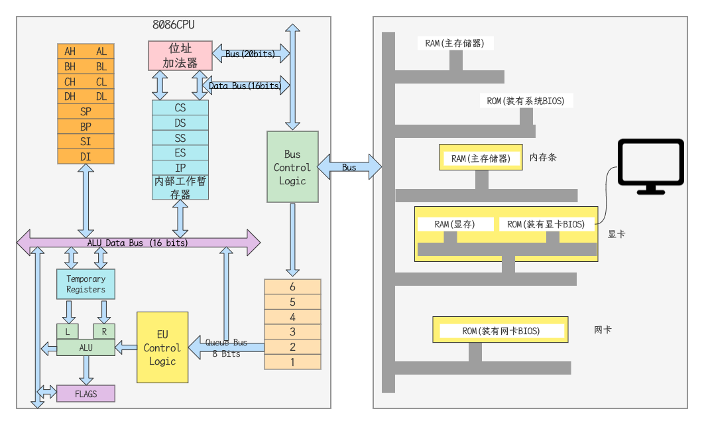

## 学习汇编的理由

- 汇编语言仍在发挥不可替代的左右
  - 效率
    - 运行效率：开发软件的核心部件，快速执行和实时响应
    - 开发效率：做合适的事，开发效率无敌
  - 底层：计算机及外围设备的驱动程序
    - 操作系统的内核
    - 嵌入式系统：家用电器，仪器仪表，物联网
- 汇编语言在学习计算机中起到独特的作用 -- 直击计算机系统的核心
  - 便于加深对计算机原理和操作系统等课程的理解
  - 通过学习和使用汇编语言，能够感知，体会和理解机器的逻辑功能
    - 向上为理解各种软件系统的原理，打下技术理论基础
    - 向下为掌握硬件系统的原理，打下实践应用基础
  - 学会底层的程序调试和错误分析方法

## 机器语言与机器指令

- 机器语言是机器指令的集合
- 机器指令是一台机器可以正确执行的命令
- 机器指令由一串二进制数表示，例01010000
- 电平脉冲
- 早期程序员的工作状态：将0，1数字编程的程序代码打在纸带或卡片上，1打孔，0不打孔，再将程序通过纸带机或卡片机输入计算机，进行运算

## 汇编语言与汇编指令

- 汇编语言的主体是汇编指令
- 汇编指令和机器指令的差别在于指令的表示方法上
  - 汇编指令是机器指令便于记忆的书写格式
  - 汇编指令是机器指令的助记符

```
机器指令： 1000100111011000
操作： 将寄存器BX的内容送到AX中
汇编指令：MOV AX, BX
```

- 寄存器：CPU中可以存储数据的器件，一个CPU中有多个寄存器

## 用汇编语言编写程序的工作过程

- 程序员 -> 汇编指令 -> 编译器 -> 机器码 -> 计算机执行

```assembly
; 汇编语言程序示例
assume cs:codesg ; assume伪指令：由编译器执行
codesg segment
start:  ; start其他符合：由编译器执行
	mov ax, 0123H ; 汇编指令：机器码的助记符
	mov bx, 0456H
	add ax, bx
	add ax, ax
	
	mov ax, 4c00h
	int 21h
codesg ends
end
```

## 计算机的组成



- CPU是计算机的核心部件，它控制这个计算机的运行并进行运算。要想让一个CPU工作，就必须向他提供指令和数据
- 指令和数据在存储器（内存）中存放。离开了内存，性能再好的CPU也无法工作

## 指令和数据的标识

- 计算机中的数据和指令，存储在内存或磁盘上
- 数据和指令，都是二进制信息
- 数量量：B, KB, MB, GB, TB, PB

## 计算机中的存储单元

- 存储器被划分为若干个存储单元，每个存储单元从0开始顺序编号
- 例如：一个存储器有128个存储单元，编号从0-127
- 8086有20条数据线，寻址空间`2^20`为1MB

## 计算机中的总线

- 在计算机中专门有连接CPU和其他芯片的导线，通常称为总线
- 物理上：一根根导线的集合
- 逻辑上划分为：地址总线，数据总线，控制总线

### 地址总线

- CPU是通过地址总线来指定存储单元的
- 地址总线宽度，决定了可寻址的存储单元大小
- N根地址总线（宽度为N），对应寻址空间为`2^N`

### 数据总线

- CPU与内存或其它器件之间的数据传送是通过数据总线来进行的
- 数据总线的宽度决定了CPU与外界的数据传送速度
- 8088CPU(8位数据总线)一次传送8bit数据
- 8086CPU(16为数据总线)一次传送16bit数据

### 控制总线

- CPU通过控制总线对外部器件进行控制
- 控制总线是一些不同控制线的集合
- 控制总线宽度决定了CPU对外部器件的控制能力

### X86CPU性能一览

| CPU   | 地址总线宽度 | 寻址能力 | 数据总线宽度 | 一次传送数据 | 读取1KB数据需要读几次 |
| ----- | ------------ | -------- | ------------ | ------------ | --------------------- |
| 8080  | 16           | 640KB    | 8            | 1B           | 1024                  |
| 8088  | 20           | 1MB      | 8            | 1B           | 1024                  |
| 8086  | 20           | 1MB      | 16           | 2B           | 512                   |
| 80286 | 24           | 16MB     | 16           | 3B           | 512                   |
| 80386 | 32           | 4GB      | 32           | 4B           | 256                   |

