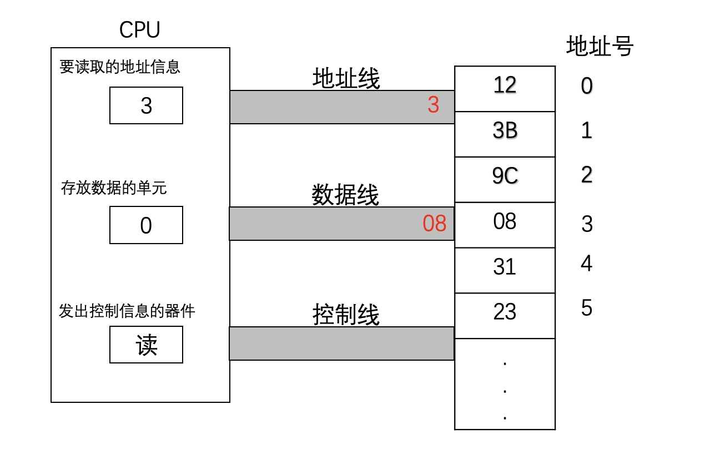
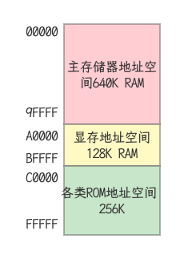

## CPU对存储器的读写

CPU要想进行数据的读写，必须和外部器件进行三类信息的交互

- 存储单元的地址（地址信息）
- 器件的选择，读或写命令（控制信息）
- 读或写的数据（数据信息）

- 从3号单元读取数据送入寄存器AL `mov al, [3]`

## 内存地址空间

- 什么是内存地址空间
  - CPU地址总线宽度为N, 寻址空间为 `2^N B`
  - 8086CPU的地址总线宽度为20， 那么可以寻址1MB个内存单元，其内存地址空间为1MB
- 从CPU角度看地址空间分配
  - RAM: 主板上的RAM; 扩展槽上的RAM(显卡)
  - ROM: 系统BIOS; 接口卡上的BIOS
- 统一编址
  - 所有物理存储器被看作一个由若干存储单元组成的逻辑存储器
  - 每个物理存储器在这个逻辑存储器中占有一个地址段，即一段地址空间
  - CPU在这段地址空间中读写数据，实际上就是在相对应的物理存储器中读写数据
- 8086内存地址空间的分配方案

