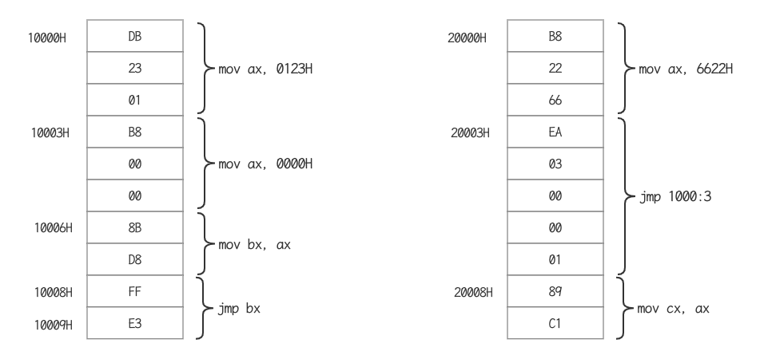
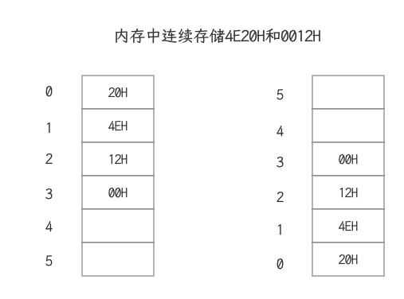
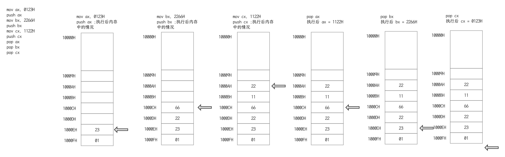

## CPU的组成

- 运算器进行信息处理
- 寄存器进行信息存储
- 控制器协调各种器件进行工作
- 内部总线实现CPU内各个器件之间的联系

## 寄存器是CPU内部的信息存储单元

- 8086CPU有14个寄存器

  - 通用寄存器：AX, BX, CX, DX
  - 变址寄存器：SI, DI
  - 指针寄存器：SP, BP
  - 指令指针寄存器：IP
  - 段寄存器：CS, SS, DS, ES
  - 标志寄存器：PSW
- 共性：8086CPU所有的寄存器都是16位的，可以存放两个字节
- 8086上一代CPU中寄存器都是8位的，如何保证程序的兼容性？通用寄存器均可以分为两个独立的8位寄存器

  - AX可以分为AH, AL 
  - BX可以分为BH, BL 
  - CX可以分为CH, CL 
  - DX可以分为DH, DL
- 8086是16位CPU, 8086的字长(word size)为16bit

## mov和add指令

- 汇编指令不区分大小写

| 汇编指令    | 控制CPU完成的操作                  | 用高级语言的语法描述 |
| ----------- | ---------------------------------- | -------------------- |
| mov ax, 18H | 将18送入ax                         | ax = 18              |
| mov ah, 78H | 将78送入ah                         | ah = 78              |
| add ax, 8   | 将寄存器ax中的数值加8              | ax = ax + 8          |
| mov ax, bx  | 将寄存器bx中的数据送入寄存器ax     | ax = bx              |
| add ax, bx  | 将ax, bx中的内容相加，结果存入ax中 | ax = ax + bx         |

- 设原ax, bx中的值均为0000H

| 程序段中的指令 | 指令执行后ax中的数据 | 指令执行后bx中的数据 |
| -------------- | -------------------- | -------------------- |
| mov ax, 4e20   | 4e20                 | 0000                 |
| mov ax, 1406H  | 6226H                | 0000H                |
| mov bx, 2000H  | 6226H                | 2000H                |
| add ax, bx     | 8226H                | 2000H                |
| mov bx, ax     | 8226H                | 8226H                |
| add ax, bx     | 044CH                | 8226H                |

- 设原ax, bx中的值均为0000H

| 程序段中的指令 | 执行指令后ax中的数据 | 执行指令后bx中的数据 |
| -------------- | -------------------- | -------------------- |
| mov ax, 001AH  | 001AH                | 0000H                |
| mov bx, 0026H  | 001AH                | 0026H                |
| add al, bl     | 0040H                | 0026H                |
| add ah, bl     | 2640H                | 0026H                |
| add bh, al     | 2640H                | 4026H                |
| mov ah, 0      | 0040H                | 4026H                |
| add al, 85H    | 00C5H                | 4026H                |
| add al, 93H    | 0058H                | 4026H                |

## 确定物理地址的方法

### 物理地址

- CPU访问内存单元时要给出内存单元的地址
- 所有的内存单元构成的存储空间是一个一维的线性空间
- 每一个内存单元在这个空间中都有唯一的地址，这个唯一的地址称为物理地址
- 8086有20位地址总线，可传送20位地址，寻址能力为1M
- 8086是16位结构的CPU
  - 运算器一次最多可以处理16位的数据，寄存器的最大宽度为16位
  - 在8086内部处理的，传输，暂存的地址也是16位，寻址能力也只有64KB
  - 问题：8086如何处理在寻址空间上的这个矛盾？

### 8086CPU给出物理地址的方法

- 用两个16位地址（段地址，偏移地址）合成一个20位的物理地址
- 地址加法器合成物理地址的方法：物理地址 = 段地址 * 16 + 偏移地址
- CPU在访问内存时，用一个基础地址（段地址*16）和一个相对于基础地址的偏移地址相加，给出内存单元的物理地址

## 内存的分段表示法

- 内存并没有分段，段的划分来自于CPU
- 段地址*16必然是16的倍数，所以一个段的起始地址也一定是16的倍数
- 偏移地址为16位，16位地址的寻址能力为64K, 所以一个段的长度最大为64K
- 不用的段地址和偏移地址形成同一个物理地址

| 物理地址 | 段地址 | 偏移地址 |
| -------- | ------ | -------- |
| 21F60H   | 2000H  | 1F60H    |
|          | 2100H  | 0F60H    |
|          | 21F0H  | 0060H    |
|          | 21F6H  | 0000H    |
|          | 1F00H  | 2F60H    |

- 偏移地址16位，变化范围为0000 - FFFFH,用偏移地址最大寻址64KB
- 例：给定段地址2000H, 用偏移地址寻址的范围是： 20000H - 2FFFFH ,共64K
- 数据21F60H内存单元中，段地址是2000H, 说法
  - 数据存在内存2000:1F60单元中
  - 数据存在内存的2000H段中的1F60H单元中
- 段地址很重要==专门的寄存器存放段地址
  - CS:  代码段寄存器
  - DS: 数据段寄存器
  - SS: 栈段寄存器
  - ES: 附加段寄存器

## Debug

- 用R命令查看，改变CPU寄存器的内容
  - R - 查看寄存器内容
  - R 寄存器名 - 改变指定寄存器内容

- 用D命令查看内存中的内容
  - D - 列出预设地址内存储的128个字节内容
  - D 段地址:偏移地址 - 列出内存中指定地址处的内容
  - D 端地址:便宜地址 结尾便宜地址 - 列出内存中指定地址范围内的内容
- 用E命令改变内存中的内容
  - E 段地址：偏移地址 数据1， 数据2，。。。
  - E 段地址: 偏移地址：逐个询问式修改；空格 - 接受，继续；回车-结束

- 用U命令将内存中的机器指令翻译成汇编指
  - e地址 数据-写入
  - d地址 - 查看
  - u地址 - 查看代码

```assembly
mov ax, 0123H
mov bx, 0003H
mov ax, bx
add ax, bx
; 对应的机器码为
; B8 23 01
; BB 03 00
; 89 D8
; 01 D8
```

- 用A命令以汇编指令的格式在内存中写入机器指令
  - a 地址-写入汇编指令
  - d 地址-查看数据
  - u 地址-查看代码
- 用T命令执行机器指令 t - 执行CS:IP处的指令
- q - 退出debug

## CS, IP与代码段

- CS: 代码段寄存器
- IP: 指令指针寄存器
- CS:IP : CPU将内存中CS:IP指向的内容当做指令执行

### 8086PC读取和执行指令的过程

- 从CS:IP指向内存单元读取指令，读取的指令进入指令缓冲区
- IP = IP + 所读取指令的长度，从而指向下一条指令
- 执行指令。转到步骤1，重复这个过程

## jmp指令

### 修改CS, IP的指令

- 执行何处的指令，取决于CS:IP
- 可以通过改变CS, IP中的内容，来控制CPU要执行的目标指令
- 如何改变CS, IP的值
  - Debug中的R命令可以改变寄存器的值：rcs, rip.  Debug是调试手段，并非程序方式
  - 指令修改：mov cs, 2000H 8086不提供对CS和IP修改的指令
  - 转移指令jmp

### 转移指令jmp

- 同时修改CS, IP的内容

```assembly
; jmp 段地址: 偏移地址
jmp 2AE3:3
jmp 2:0B16
; 功能：用指令中给出的段地址修改CS, 偏移地址修改IP
```

- 仅修改IP的内容

```assembly
; jmp 某一合法寄存器
jmp ax ; (类似于mov IP, ax)
jmp bx
; 功能：用寄存器中的值修改IP
```

### 问题分析



从20000H开始，执行的顺序是：

1. mov ax, 6622H
2. jmp 1000:3
3. mov ax, 0000
4. mov bx, ax
5. jmp bx
6. mov ax, 0123H
7. 转到第3步执行

## 内存中字的存储

- 对于8086CPU, 16位作为一个字
- 16位的字存储在一个16位的寄存器中，如何存储：高8位放高字节，低8位放低字节
- 16位的字在内存中需要2个连续字节存储，怎么存放？
  - 低位字节存在低地址单元，高位字节存在高地址单元
  - 例：20000D(4E20H)存放0，1两个单元，18D(0012H)存放在2，3两个单元



- 0地址单元中存放的字节型数据是：20H
- 0地址单元中存放的字型数据是：4E20H
- 2地址单元中存放的字节型数据是：12H
- 2地址单元中触发的字型数据是：0012H
- 字单元：由两个地址连续的内存单元组成，存放一个字型数据（16位）

## 用DS和[address]实现字的传送

### 要解决的问题：CPU从内存单元中要读取数据

- 要求：CPU要读取一个内存单元的时候，必须先给出这个内存单元的地址

- 原理：在8086PC中，内存地址由段地址和偏移地址组成（段地址:偏移地址）

- 解决方案：DS和[address]配合

  - 用DS寄存器存放要访问数据的段地址
  - 偏移地址用[...]形式直接给出
  - 例1：将10000H(1000:0)中的数据读到al中

  ```assembly
  mov bx, 1000H
  mov ds, bx
  mov al, [0]
  ```

  - 例2：将al中的数据写到10000H(1000:0)中

  ```assembly
  mov bx, 1000H
  mov ds, bx
  mov [0], al
  ```

  - ds寄存器不可以直接付常量值，必须用通用寄存器中转才行；原因8086CPU不支持将数据直接送入段寄存器（硬件设计的问题）
  - 套路：数据 -> 通用寄存器 -> 段寄存器

### 字的传送

- 8086CPU可以一次性传送一个字(16位的数据)

```assembly
mov bx, 1000H
mov ds, bx
mov ax, [0]   ;1000:0处的字型数据送入ax
mov [0], cx   ;cx中的16位数据送到1000:0处
```

### 案例分析

- 将下面两个案例代码在debug中a输入，然后按t调试，观察各个寄存器的变化

- 案例1

```assembly
mov ax, 1000H
mov ds, ax
mov ax, [0]
mov bx, [2]
mov cx, [1]
add bx, [1]
add cx, [2]
```

- 案例2

```assembly
mov ax, 1000H
mov ds, ax
mov ax, 2C31
mov [0], ax
mov bx, [0]
sub bx, [2]
mov [2], bx
```

## DS与数据段

### 对内存单元中数据的访问

- 对于8086PC机，可以根据需要将一组内存单元定义为一个段。
  - 物理地址 = 段地址 * 16 + 偏移地址
  - 将一组长度为N(N <= 64),地址连续，起始地址为16的倍数的内存单元当做专门存储数据的内存空间，从而定义了一个数据段
  - 将哪段内存当做数据段，段地址如何定，在编程时安排
- 例：用123B0H - 123B9H 的空间来存放数据
  - 段地址：123BH 起始偏移地址：0000H 长度: 10字节
  - 段地址：1230H 起始偏移地址：00B0H 长度：10字节
  - ......
- 处理方法: (DS): ([address])
  - 用DS存放数据段的段地址
  - 用相关指令访问数据段中的具体单元，单元地址由[address]指出

### 将123B0H - 123BAH的内存单元定义为数据段

- 累加数据段中的前3个单元中的数据

```assembly
mov ax, 123BH
mov ds, ax
mov al, 0
add al, [0]
add al, [1]
add al, [2]
```

- 累加数据段中的前3个字型数据

```assembly
mov ax, 123BH
mov ds, ax
mov ax, 0
add ax, [0]
add ax, [2]
add ax, [4]
```

### 用mov指令操作数据

| 指令形式             | 例子        |
| -------------------- | ----------- |
| mov 寄存器, 数据     | mov ax, 8   |
| mov 寄存器, 寄存器   | mov ax, bx  |
| mov 寄存器, 内存单元 | mov ax, [0] |
| mov 内存单元, 寄存器 | mov [0], ax |
| mov 段寄存器, 寄存器 | mov ds, ax  |

### 加法add和减法sub指令

| add指令形式          | 例子        |
| -------------------- | ----------- |
| add 寄存器, 数据     | add ax, 8   |
| add 寄存器, 寄存器   | add ax, bx  |
| add 寄存器, 内存单元 | add ax, [0] |
| add 内存单元, 寄存器 | add [0], ax |

| sub指令形式          | 例子        |
| -------------------- | ----------- |
| sub 寄存器, 数据     | sub ax, 8   |
| sub 寄存器, 寄存器   | sub ax, bx  |
| sub 寄存器, 内存单元 | sub ax, [0] |
| sub 内存单元, 寄存器 | sub [0], ax |

### DS和[address]形式访问数据段小结

- 字在内存中存储时，要用两个地址连续的内存单元来存放，字的低位字节存放低地址单元中，高位字节存放在高地址单元中
- 用mov指令要访问内存单元，可以在mov指令中只给出单元的便宜地址，此事，段地址默认在DS寄存器中
- [address]表示一个偏移地址为address的内存单元
- 在内存和寄存器之间传送字型数据时，高地址单元和高8位寄存器，低地址单元和低8位寄存器相对应
- mov, add, sub是具有两个操作对象的指令，访问内存中的数据段（对照：jmp是具有一个操作对象的指令，对应内存中的代码段）

## 栈及栈操作的实现

### 栈结构

- 栈是一种只能在一端进行插入或删除操作的数据结构
- 栈有两个基本的操作：入栈和出栈
  - 入栈：将一个新的元素放到栈顶
  - 出栈：从栈顶取出一个元素
- 栈顶元素总是最后入栈，需要出栈时，又最先被从栈中取出
- 栈的操作规则：LIFO
- CPU提供的栈机制
  - 现今CPU中都有栈的设计
  - 8086CPU提供相关的指令，支持用栈的方式访问内存空间
  - 基于8086CPU的编程，可以将一段内存当作栈来使用
- PUSH和POP指令
  - push ax 将ax中的数据送入栈总
  - pop ax 从栈顶取出数据送入ax
  - 以字为单位对栈进行操作



- CPU如何知道一段内存空间被当做栈使用
  - 8086CPU中有两个与栈相关的寄存器
  - 栈段寄存器SS:存放栈顶的段地址
  - 栈顶指针寄存器SP:存放栈顶的偏移地址
- 执行push和pop的时候，如何知道哪个单元是栈顶单元：任意时刻，SS:SP指向栈顶元素

### 栈的操作示例

```assembly
mov ax, 1000H
mov ss, ax
mov sp, 0010H

mov ax, 001AH
mov bx, 001BH

push ax
push bx

pop ax
pop bx
```

- 执行`mov ax, 1000H;  mov ss, ax;  mov sp, 0100H`后各个寄存器的值为

| ax    | bx   | ss    | sp    |
| ----- | ---- | ----- | ----- |
| 1000H |      | 1000H | 0010H |

- 执行`mov ax, 001AH;  mov bx, 001BH`后各个寄存器的值为

| ax    | bx    | ss    | sp    |
| ----- | ----- | ----- | ----- |
| 001AH | 001BH | 1000H | 0010H |

- 执行`push ax`后各个寄存器的值如下，1000FH设置为00， 1000EH设置为1A

| ax    | bx    | ss    | sp    |
| ----- | ----- | ----- | ----- |
| 001AH | 001BH | 1000H | 000EH |

- 执行`push bx`后各个寄存器的值如下，1000DH设置为00，1000CH设置为1BH

| ax    | bx    | ss    | sp    |
| ----- | ----- | ----- | ----- |
| 001AH | 001BH | 1000H | 000CH |

- 执行`pop ax`后各个寄存器的值如下

| ax    | bx    | ss    | sp    |
| ----- | ----- | ----- | ----- |
| 001BH | 001BH | 1000H | 000EH |

- 执行`pop bx`后各个寄存器的值如下

| ax    | bx    | ss    | sp    |
| ----- | ----- | ----- | ----- |
| 001BH | 001AH | 1000H | 0010H |

- 从以上步骤可以看出，这个程序的作用是交换寄存器ax, bx的值
- push ax
  - SP = SP - 2
  - 将ax中的内容送入SS:SP指向的内存单元处，SS:SP此时指向新栈顶
- pop ax
  - 将SS:SP指向的内存单元处的数据送入ax中
  - SP = SP + 2, SS:SP指向当前栈顶下面的单元，以当前栈顶下面的单元为新的栈顶
- 栈顶越界为题：只能程序员手动控制。
  - 8086CPU不保证对栈的操作不会越界。只知道栈顶在何处（由SS:SP指示），不知道程序安排的栈空间有多大
  - 我们在编程的时候要自己操心栈顶越界的问题，要根据可能用到的最大栈空间，来安排栈的大小，防止入栈的数据太多而到最后的越界；防止出栈时栈空了仍然继续出栈而导致的越界

### 栈的小结

- push, pop实质上就是一种内存传送指令，可以在寄存器和内存之间传送数据，与mov指令不同的是，push和pop指令访问的内存单元的地址不是在指令中给出的，而是由SS:SP指出的
- 执行push和pop指令时，SP中的内容自动改变
- 8086CPU提供的栈操作机制
  - 在SS, SP中存放栈顶的段地址和偏移地址，入栈和出栈指令根据SS:SP指示的地址，按照栈的方式访问内存单元
  - push指令的执行步骤：SP = SP - 2; 像SS:SP指向的字单元中传送数据
  - pop指令的执行步骤：从SS:SP指向的的字单元中读取数据；SP = SP - 2

## 关于“段”的总结

### 各种段

- 物理地址 = 段地址 * 16 + 偏移地址
- 做法
  - 编程时，可以根据需要将一组内存单元定义为一个段
  - 可以将起始地址为16的倍数，长度为N(N<=64K)的一组地址连续的内存单元，定义为一个段
  - 将一段内存定义为一个段，用一个段地址指示段，用偏移地址访问段内存的单元--在程序中可以完全由程序员安排
- 数据段
  - 将段地址存放在DS中
  - 用mov, add, sub等访问内存单元的指令时，CPU将我们定义的数据段中的内容当作数据段来访问
- 代码段
  - 将段地址放在CS中，将段中第一条指令的偏移地址放在IP中
  - CPU将执行我们定义的代码段中的指令
- 栈段
  - 将段地址放在SS中，将栈顶单元的偏移地址放在SP中
  - CPU在需要进行栈操作(push, pop)时，就将我们定义的栈段当作栈空间来用
