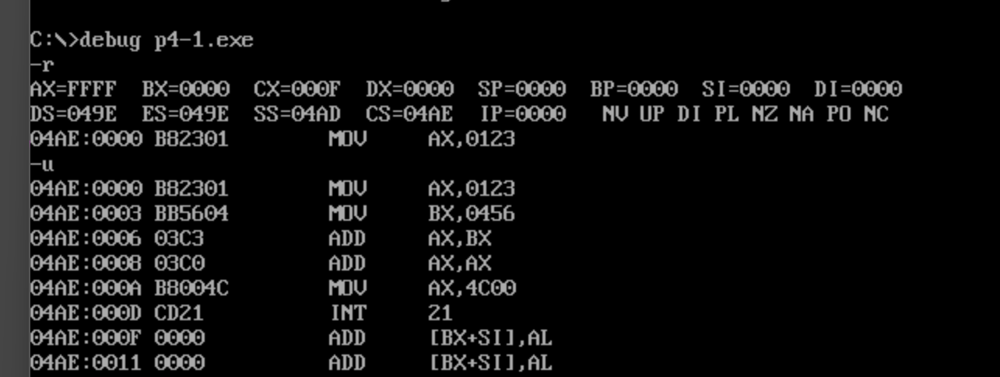
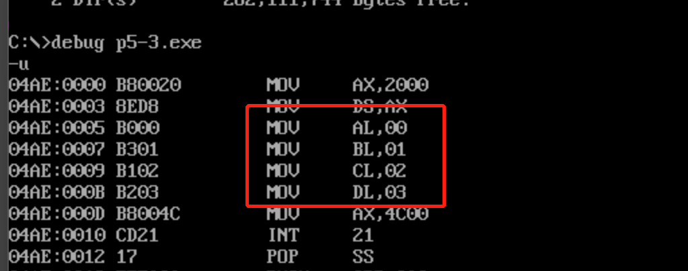
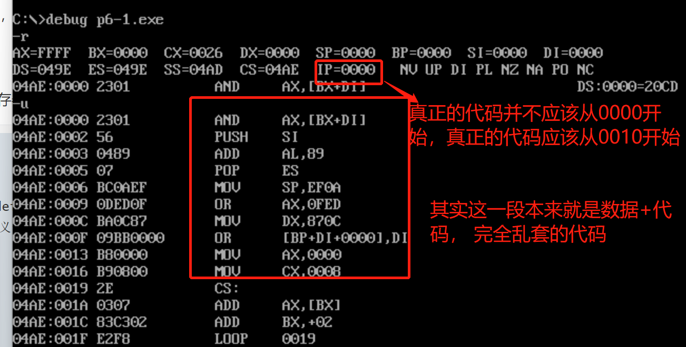
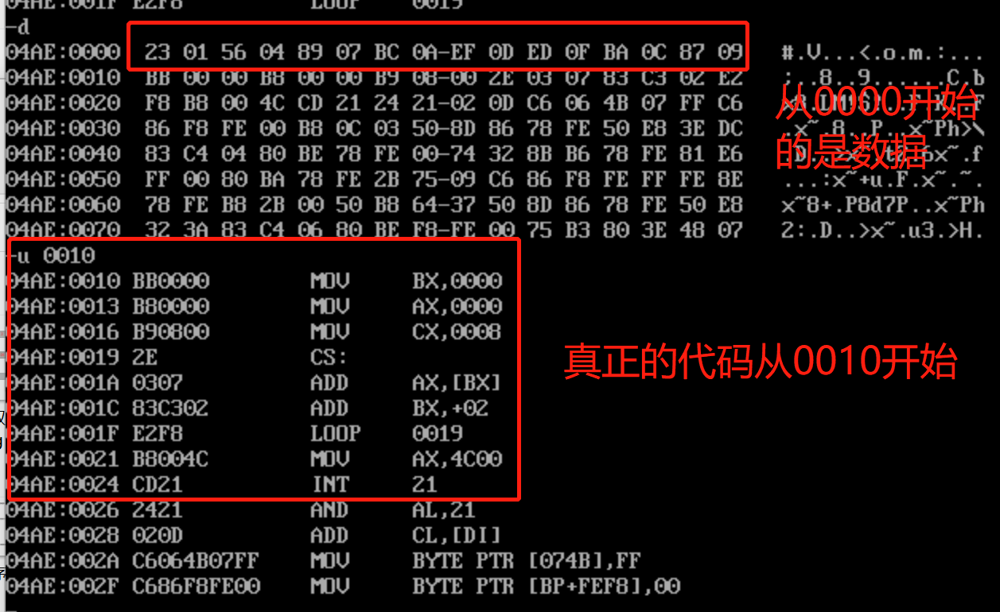

## 由源程序到程序运行

- 程序员 -> 汇编程序 -> 编译器 -> 机器码 -> 计算机执行
- 汇编指令：对应有机器码的指令，可以被编译为机器指令，最终被CPU执行
- 伪指令：没有对应的机器码指令，最终不被CPU所执行
- 谁来执行伪指令：伪指令是由编译器来执行的指令，编译器根据伪指令来进行相关的编译工作
- 程序返回（套路）：程序结束运行后，将CPU的控制权交还给使他得以运行的程序（常为DOS系统）

```assembly
assume cs:codesg
codesg segment
	mov ax, 0123H
	mov bx, 0456H
	add ax, bx
	add ax, ax
	
	mov ax, 4c00H
	int 21h
codesg ends
end
```

### 程序中的三种伪指令

- 段定义

  - 一个汇编程序是由多个段组成的，这些段被用来存放代码，数据或当作栈空间来使用
  - 一个有意义的汇编程序中至少要有一个段，这个段用来存放代码
  - 定义程序中的段：每个段都需要有段名

  ```assembly
  段名 segment -- 段的开始
  ......
  段名 ends -- 段的结束
  ```

- end(不是ends):汇编程序的结束标记。若程序结尾处不加end, 编译器在编译程序时，无法知道程序在何处结束

- assume(假设)：含义是假设某一段寄存器和程序中的某一个用segment...ends定义的段相关联--assume cs:codesg 指CS寄存器与codesg关联，将定义的codesg当作程序的代码段使用

### 汇编程序的结构

- 在debug中直接写入指令编写的汇编程序
  - 适用于功能简单，短小精悍的程序
  - 只需要包含汇编指令即可
- 单独编写成源文件后再编译为可执行文件的程序
  - 适用于编写大程序
  - 需要包括汇编指令，还要有指导编译器工作的伪指令
  - 源程序由一些段构成，这些段存放代码，数据，或将某个段当作栈空间
- ; 注释

```assembly
assume cs:code ds:data ss:stack
data segment
	dw 0123H, 0456H, 0789H, 0abcH, 0defH
data ends
stack segment
	dw 0,0,0,0,0,0,0,0,0,0,0,0,0,0
stack ends
code segment
	mov ax, stack
	mov ss, ax
	mov sp, 20H
	mov ax, data
	mov ds, ax
	mov bx, 0
	mov cx, 8
 s: push [bx]
 	add bx, 2
 	loop s
 	
 	mov ax, 4c00H
 	int 21h
code ends
end
```

### 如何写出一个程序来

- 例：编程求2^3

1. 定义一个段

  ```assembly
  abc segment
  abc ends
  ```

2. 实现处理任务

```assembly
abc segment
	mov ax, 2
	add ax, ax
	add ax, ax
abc ends
```

3. 指出程序在何处结束

```assembly
abc segment
	mov ax, 2
	add ax, ax
	add ax, ax
abc ends
end
```

4. 段与段寄存器关联

```assembly
assume cs:abc
abc segment
	mov ax, 2
	add ax, ax
	add ax, ax
abc ends
end
```

5. 加上程序返回的代码

```assembly
assumen cs:abc
abc segment
	mov ax, 2
	add ax, ax
	add ax, ax
	
	mov ax, 4c00H
	int 21h
abc ends
end
```

### 程序中可能的错误

- 语法错误：程序在编译时被编译器发现的错误
- 逻辑错误：程序在编译时不能表现出来的，在运行时发生的错误

### 由源程序到程序运行

- 源程序文件.asm --编译--> 目标文件.obj --连接--> 可执行文件.exe --运行-->计算机

#### 编译

- 目标文件(*.obj)是我们对一个源程序进行编译要得到的最终结果
- 列表文件(*.lst)是编译器将源程序编译为目标文件的过程中产生的中间结果
- 交叉引用文件(*.crf)同列表文件一样，是编译器将源程序编译为目标文件过程中产生的中间结果
- 对源程序的编译结束，编译器输出的最后两行告诉我们这个源程序没有警告错误和必须要改正的错误
- 命令后加;以简化过程

```
masm p4-1.asm 
masm p4-1.asm;
```

#### 连接

- 可以执行文件(*.exe)是我们对一个程序进行连接要得到的最终结果
- 映像文件(*.map)是连接程序将目标文件连接为可执行文件过程中产生的中间结果
- 库文件(*.lib)里包含了一些可以调用的子程序，如果我们的程序中调用了某一个库文件中的子程序，就需要在连接的时候，将这个库文件和我们的目标文件连接到一起，生成可执行文件
- no stack segment, 一个没有栈段的警告错误，可以不用理会

```
link p4-1;
```

#### 提示语法错误

- Serve Errors
- 找不到所给出的源程序文件

## 用Debug跟踪程序的执行

### debug加载程序



- 程序加载后，DS中存放着程序所在内存区的段地址，这个内存区的偏移地址为0， 则程序所在的内存区的地址为 DS:0
- 这个内存区的前256个字节存PSP(程序段前缀)，作为数据区；DOS用来和程序进行通信
- 从256字节处向后的空间存放的是程序，CS的值为DS+10H
- 程序加载后，CX中存放代码的长度
- 继续命令p(proceed):类似t命令，逐条执行指令，显示结果。但遇到子程序，终端等待时，直接执行，然后显示结果
- 运行命令g(go):从指定地址处开始运行程序，直到遇到断点或者程序正常结束

### 程序执行的不同方式

- 在dos中执行`p4-1`
  - 程序执行的“常态”
  - DOS启动后，计算机由“命令解释器”（程序command.com）控制
  - 运行可执行程序时，command将程序加载入内存，设置CPU的CS:IP指向程序的第一条指令（即程序的入口），使程序得以运行
  - 程序运行结束后，返回到“命令解释器”，CPU继续运行command
- 在debug中执行
  - 程序执行处于开发周期的运行方式
  - 运行debug时，command程序加载debug.exe, debug将程序加载入内存，程序运行结束后要返回到debug中，使用q命令退出debug, 将返回到command中

## [...]和(...)

### [...]的规定与(...)的约定

- [...] ：(汇编语法规定)表示一个内存单元

| 指令         | 段地址 | 偏移地址 | 操作单位 |
| ------------ | ------ | -------- | -------- |
| mov ax, [0]  | 在DS中 | 在[0]中  | 字       |
| mov al, [0]  | 在DS中 | 在[0]中  | 字节     |
| mov ax, [bx] | 在DS中 | 在[bx]中 | 字       |
| mov al, [bx] | 在DS中 | 在[bx]中 | 字节     |

- (...) ：(为学习方便做出的约定)表示一个内存单元或寄存器中的内容

| 描述对象                 | 描述方法                                       |
| ------------------------ | ---------------------------------------------- |
| ax中的内容为0010H        | (ax) = 0010H                                   |
| 2000:1000处的内容为0010H | (21000H) = 0010H                               |
| mov ax, [2]的功能        | (ax) = ((ds) * 16 + 2)                         |
| mov [2], ax的功能        | ((ds) * 16 + 2) = (ax)                         |
| add ax, 2的功能          | (ax) = (ax) + 2                                |
| add ax, bx的功能         | (ax) = (ax) + (bx)                             |
| push ax的功能            | (sp) = (sp) - 2<br />((ss) * 16 + (sp)) = (ax) |
| pop ax的功能             | (ax) = ((ss) * 16 + (sp))<br />(sp) = (sp) + 2 |

- 一个内存单元的描述
  - 内存单元的地址：段地址，偏移地址
  - 内存单元的长度（类型）

### 约定符合idata表示常量

- mov ax, [idata]: 代表mov ax, [1]  、mov ax, [2] 、mov ax, [3]
- mov bx, idata: 代表 mov bx, 1、mov bx, 2、mov bx, 3
- mov ds, idata: 代表mov ds, 1、 mov ds, 2、mov ds, 3(都是非法指令)

## Loop指令

### loop指令

- 功能：实现循环（计数循环）
- 指令的格式：loop 标号
- CPU执行loop指令时要进行的操作
  - (cx) = (cx) - 1
  - 判断cx中的值：不为零则转至标号处执行程序；为零则向下执行
- 要求
  - cx中要提前存放循环次数，因为(cx)影响着loop指令的执行结果
  - 要定义一个标号

```assembly
; loop指令示例程序
assume cs:code
code segment
	mov ax, 2
	mov cx, 11
  s:add ax, ax
  	loop s
  	
  	mov ax, 4c00h
  	int 21h
code ends
end
```

- 上述程序功能: 2 -> 4 -> 8 -> 16 -> 32
- 用cx和loop指令相配合实现循环功能的三个要点
  - cx中存放循环次数
  - 用标号指定循环开始的位置
  - 在标号和loop指令中间，写上要循环执行的程序段（循环体）

### 计算1233 * 256,结果存储在ax中

```assembly
assume cs:code
code segment
	mov ax, 0
	mov cx, 256
  s:add ax, 123
  	loop s
  	
  	mov ax, 4c00h
  	int 21h
code ends
end
```

### 计算ffff:0006字节单元中的数乘以3，结果存储在dx中

- 先将内存中数据取出，连加3次，即乘以3
- 其它考虑：运算后的结果是否会超过dx的存储范围：ffff:0006单元中的数时一个字节型数据，范围0-255,最大255*3 < 65535不会越界

```assembly
assume cs:code
code segment
	mov ax, 0ffffh   ;在汇编源程序中，数据不能以字母开头，要在ffff前面加0
	mov ds, ax
	mov bx, 6
	mov al, [ax]     ; (ax) = ((ds) * 16 + (bx))
	mov ah, 0
	
	mov dx, 0
	mov cx, 3        ; 设置循环次数
  s:add dx, ax
  	loop s
	
	mov ax, 4c00h
	int 21h
code ends
end
```

## 段前缀

### 引入段前缀：一个异常现象及对策

```assembly
assume cs:code
code segment
	mov ax, 2000h
	mov ds, ax
	mov al, [0]
	mov bl, [1]
	mov cl, [2]
	mov dl, [3]

	mov ax, 4c00h
	int 21h
code ends
end
```

- 上述代码编译，连接后用debug装入程序，然后u查看，发现mov al, [0]变成了常量0传给了al



- 对策：在[idata]前显示的写上段寄存器；mov al, ds:[0]
- 这些出现在访问内存单元的指令中，用于显示的指明内存单元的短地址的"ds:", "cs:", "ss:", "es:"在汇编语言中称为段前缀

### 访问连续的内存单元-loop和[bx]联手

- 问题：计算ffff:0 - ffff:b字节单元中的数据和，结果存储在dx中

- 分析：

  - 运算后的结果是否会超出dx所能存储的范围：ffff:0 - ffff:b内存单元中的数据是字节型数据，范围在0-255之间，12个这样的数据相加，结果不会大于65535,可以在dx中存放
  - 是否可以将ffff:0 - ffff:b中的数据直接累加到dx中，add dx, ds:[addr]; dx = (dx) + ?
    - 期望：取出内存中的8位数据进行相加
    - 实际：取出的是内存中的16位数据
  - 是否可以将ffff:0 - ffff:b中的数据直接累加到dl中
    - 期望：取出内存中的8位数据相加
    - 实际：很有可能越界超过dl的范围

- 对策：取出8位数据，加到16位的寄存器

  ```assembly
  mov al, ds:[addr]
  mov ah, 0
  add dx, ax
  ```

- 方法

  - 循环次数由cx控制
  - 循环中要访问的内存单元的偏移地址放到bx中，随循环递增，访问连续的内存单元

```assembly
assume cs:code
code segment
	mov ax, 0ffffh
	mov ds, ax
	mov bx, 0
	mov dx, 0
	mov cx, 12
	
  s:mov al, ds:[bx]
  	mov ah, 0
  	add dx, ax
  	inc bx
  	loop s

	mov ax, 4c00h
	int 21h
code ends
end
```

### 段前缀的使用

- 将内存ffff:0 - ffff:b中的数据拷贝到0:200 - 0:20b单元中

```assembly
; 初始方案
assume cs:code
code segment
	mov bx, 0
	mov cx, 12
	
 s: mov ax, 0ffffh
 	mov ds, ax
 	mov dl, [bx]
 	
 	mov ax, 0020h
 	mov ds, ax
 	mov [bx], dl
 	
 	inc bx
 	loop s

	mov ax, 4c00h
	int 21h
code ends
end
```

```assembly
; 使用附加段寄存器
assume cs:code
code segment
	mov ax, 0ffffh
	mov ds, ax
	mov ax, 0020h
	mov es, ax
	
	mov bx, 0
	mov cx, 0
	
 s: mov dl, [bx]
 	mov es:[bx], dl
 	inc bx
 	loop s

	mov ax, 4c00h
	int 21h
code ends
end
```

## 在代码段中使用数据

### 问题

- 将内存ffff:0 - ffff:b中的数据拷贝到0:200 - 0:20b单元中
- 问题
  - 程序中直接写地址，危险
  - 安全位置存放数据，存哪里
- 对策
  - 在程序的段中存放数据，运行时由操作系统分配空间
  - 段的类别：数据段，代码段，栈段
  - 各种段中均可以有数据
  - 可以在单个的段中安置，也可以将数据，代码，栈放入不同的段中

### 应用案例

- 编程计算以下8个数据的和，结果存在ax寄存器中；0123H, 0456H, 0789H, 0abcH, 0defH, 0fedH, 0cbaH, 0987H

```assembly
assume cs:code
code segment
	; 代码段中定义数据
	dw 0123H, 0456H, 0789H, 0abcH, 0defH, 0fedH, 0cbaH, 0987H  ; dw define word, 定义字型数据
	; dw 定义一个字， db定义一个字节 dd定义一个双字
	
	mov bx, 0
	mov ax, 0
	mov cx, 8

 s: add ax, cs:[bx]
 	add bx, 2
 	loop s
	
	mov ax, 4c00h
	int 21h
code ends
end
```

- 上述代码编译，连接，后debug运行





- 解决问题的关键：让数据从CS:0000开始，让代码从CS:0010开始

```assembly
assume cs:code
code segment
	    dw 0123H, 0456H, 0789H, 0abcH, 0defH, 0fedH, 0cbaH, 0987H  ; dw define word, 定义字型数据
start:  mov bx, 0    ; 定义一个标号，指示代码开始的位置
		mov ax, 0
		mov cx, 8
	s:  add ax, cs:[bx]
		add bx, 2
		loop s
	
	mov ax, 4c00h
	int 21h
code ends
end start  ; end的作用：除了通知编译器程序结束外，还可以通知编译器程序的入口在什么地方
```

- 程序的一般框架

```assembly
assume cs:code
code segment
	...
	数据
	...
begin: 
	...
	代码
	...
code ends
end begin
```

## 在代码段中使用栈

## 将数据，代码，栈放入不同段

