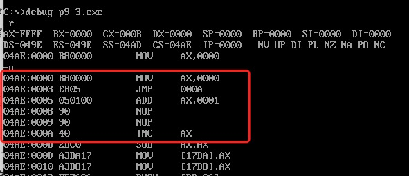

## "转移"综述

- 背景：一般情况下指令是顺序逐条执行的，而在实际中，常需要改变程序的执行流程
- 转移指令
  - 可以控制CPU执行内存中某处代码的指令
  - 可以修改IP，或同时修改CS和IP的指令
- 转移指令的分类
  - 按转移行为
    - 段内转移：只修改IP,如jmp ax
    - 段间转移：同时修改CS和IP, 如jmp 1000:0
  - 根据指令对IP修改的范围不同
    - 段内短转移：IP修改范围为-128 - 127
    - 段内近转移：IP修改范围为-32768 - 32767
  - 按转移指令
    - 无条件转移指令 jmp
    - 条件转移指令 jcxz
    - 循环指令 loop
    - 过程
    - 中断

## 操作符offset

- 用操作符offset取得标号的偏移地址
- 格式： offset 标号

```assembly
assume cs:codesg
codesg segment
start: mov ax, offset start    ; 想当于mov ax, 0
	  s: mov ax, offset s        ; 想当于mov ax, 3
codesg ends
end start
```

- 问题：有如下程序段，填写两条指令，使该程序在运行中将s处的一条指令复制到s0处

```assembly
assume cs:codesg
codesg segment
s: mov ax, bx
	 mov si, offset s
	 mov di, offset s0
	 mov ax, cs:[si]
	 mov cs:[di], ax
s0:nop ; nop的机器码占一个字节，起占位作用
	 nop 
codesg ends
end
```

- 分析
  - s和s0处的指令所在的内存单元的地址是多少？cs:offset s 和 cs:offset s0
  - 将s处的指令复制到s0处，就是将cs:offset s处的数据复制到cs:offset s0处
  - 地址如何表示？段地址已知在cs中，偏移地址已经送入si和di中
  - 要复制的数据有多长？mov ax, bx指令的长度为两个字节，即1个字

## jmp指令

### 无条件转移

- jmp指令的功能：无条件转移，可以只修改IP也可以同时修改CS和IP
- jmp指令要给出两种信息：
  - 转移的目的地址
  - 转移的距离
    - 段间转移（远转移）：jmp 2000:1000
    - 段内短转移：jmp short 标号; IP的修改范围为-128 - 127, 8位的位移
    - 段内近转移：jmp near ptr 标号； IP的修改范围为-32768 - 32767, 16位的位移

### 根据位移进行转移

- 常见指令中的立即数均在机器指令中有体现
- 问题：jmp short指令中，转移到了哪里？jmp short的机器指令中，包含的是跳转到指令的相对位置，而不是转移的目标地址

```assembly
assume cs:codesg
codesg segment
start: mov ax, 0
		   jmp short s
		   add ax, 1
		   nop
		   nop
		s: inc ax
codesg ends
end start
```



- (IP)=0003, CS:IP指向EB05(jmp的机器码)
- 读取指令码EB05进入指令缓冲区
- (IP)=(IP)+所读取指令的长度=(IP)+2=0005, CS:IP指向add ax, 0001
- CPU执行指令缓冲区中的指令EB05
- 指令EB05执行后，(IP)=(IP)+05=000AH, CS:IP指向inc ax

### 两种段内转移

- 短转移：jmp short 标号

  - 功能：(IP) = (IP) + 8位位移
  - 8位位移 = 标号处的地址 - jmp指令后第一个字节的地址
  - short指明此处的位移为8位位移
  - 8位位移的范围为-128 - 127，用补码表示
  - 8位位移由编译程序在编译时算出

  ```assembly
  assume cs:codesg
  codesg segment
  start: jmp short s
  			 db 128 dup (0)
  		s: mov ax, 0ffffh
  codesg ends
  end start
  ```

  - 编译出错：jump out of range by 1byte, 转移位移超界

- 近转移：jmp near ptr标号

  - 功能：(IP) = (IP) + 16位位移
  - 16位位移=标号处的地址 - jmp指令后的第一个字节的地址
  - near ptr指明此处的位移为16位位移，进行的是段内近转移
  - 16位位移的范围为-32768 - 32767，用补码表示
  - 16位位移由编译程序在编译时算出

  ```assembly
  assume cs:codesg
  codesg segment
  start: mov ax, 0
  			 mov bx, 0
  			 jmp near ptr s
  			 db 256 dup (0)
  		s: add ax, 1
  		   inc ax
  codesg ends
  end start
  ```

### 远转移：jmp far ptr 标号

- 段间转移：far ptr 指明了跳转的目的地址，即包含了标号的段地址CS和偏移地址IP

```assembly
assume cs:codesg
codesg segment
start: mov ax, 0
	     mov bx, 0
	     jmp far ptr s
	  	 db 256 dup (0)
	  s: add ax, 1
	     inc ax
codesg ends
end start
```

### 转移地址在寄存器中的jmp指令

- 指令格式： jmp 16位寄存器
- 功能： IP = (16位寄存器)
- jmp ax    jmp bx

```assembly
assume cs:codesg
codesg segment
start: mov ax, 0
 			 mov bx, ax
 			 jmp bx
 			 mov ax, 0123H
codesg ends
end start
```

### 转移地址在内存中的jmp指令


## 其他转移指令

## call指令和ret指令

## call和ret的配合使用

## mul指令

## 汇编语言的模块化程序设计

## 寄存器冲突的问题

## 标志寄存器

## 带进(借)位的加减法

## cmp和条件转移指令

## 条件转移指令应用

## DF标志和串传送指令

