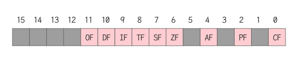

## "转移"综述

- 背景：一般情况下指令是顺序逐条执行的，而在实际中，常需要改变程序的执行流程
- 转移指令
  - 可以控制CPU执行内存中某处代码的指令
  - 可以修改IP，或同时修改CS和IP的指令
- 转移指令的分类
  - 按转移行为
    - 段内转移：只修改IP,如jmp ax
    - 段间转移：同时修改CS和IP, 如jmp 1000:0
  - 根据指令对IP修改的范围不同
    - 段内短转移：IP修改范围为-128 - 127
    - 段内近转移：IP修改范围为-32768 - 32767
  - 按转移指令
    - 无条件转移指令 jmp
    - 条件转移指令 jcxz
    - 循环指令 loop
    - 过程
    - 中断

## 操作符offset

- 用操作符offset取得标号的偏移地址
- 格式： offset 标号

```assembly
assume cs:codesg
codesg segment
start: mov ax, offset start    ; 想当于mov ax, 0
	  s: mov ax, offset s        ; 想当于mov ax, 3
codesg ends
end start
```

- 问题：有如下程序段，填写两条指令，使该程序在运行中将s处的一条指令复制到s0处

```assembly
assume cs:codesg
codesg segment
s: mov ax, bx
	; ...在省略号之间填写
	 mov si, offset s
	 mov di, offset s0
	; ...
	 mov ax, cs:[si]
	 mov cs:[di], ax
s0:nop ; nop的机器码占一个字节，起占位作用
	 nop 
codesg ends
end
```

- 分析
  - s和s0处的指令所在的内存单元的地址是多少？cs:offset s 和 cs:offset s0
  - 将s处的指令复制到s0处，就是将cs:offset s处的数据复制到cs:offset s0处
  - 地址如何表示？段地址已知在cs中，偏移地址已经送入si和di中
  - 要复制的数据有多长？mov ax, bx指令的长度为两个字节，即1个字

## jmp指令

### 无条件转移

- jmp指令的功能：无条件转移，可以只修改IP也可以同时修改CS和IP
- jmp指令要给出两种信息：
  - 转移的目的地址
  - 转移的距离
    - 段间转移（远转移）：jmp 2000:1000
    - 段内短转移：jmp short 标号; IP的修改范围为-128 - 127, 8位的位移
    - 段内近转移：jmp near ptr 标号； IP的修改范围为-32768 - 32767, 16位的位移

### 根据位移进行转移

- 常见指令中的立即数均在机器指令中有体现
- 问题：jmp short指令中，转移到了哪里？jmp short的机器指令中，包含的是跳转到指令的相对位置，而不是转移的目标地址

```assembly
assume cs:codesg
codesg segment
start: mov ax, 0
		   jmp short s
		   add ax, 1
		   nop
		   nop
		s: inc ax
codesg ends
end start
```


- (IP)=0003, CS:IP指向EB05(jmp的机器码)
- 读取指令码EB05进入指令缓冲区
- (IP)=(IP)+所读取指令的长度=(IP)+2=0005, CS:IP指向add ax, 0001
- CPU执行指令缓冲区中的指令EB05
- 指令EB05执行后，(IP)=(IP)+05=000AH, CS:IP指向inc ax

### 两种段内转移

- 短转移：jmp short 标号

  - 功能：(IP) = (IP) + 8位位移
  - 8位位移 = 标号处的地址 - jmp指令后第一个字节的地址
  - short指明此处的位移为8位位移
  - 8位位移的范围为-128 - 127，用补码表示
  - 8位位移由编译程序在编译时算出

  ```assembly
  assume cs:codesg
  codesg segment
  start: jmp short s
  			 db 128 dup (0)
  		s: mov ax, 0ffffh
  codesg ends
  end start
  ```

  - 编译出错：jump out of range by 1byte, 转移位移超界

- 近转移：jmp near ptr标号

  - 功能：(IP) = (IP) + 16位位移
  - 16位位移=标号处的地址 - jmp指令后的第一个字节的地址
  - near ptr指明此处的位移为16位位移，进行的是段内近转移
  - 16位位移的范围为-32768 - 32767，用补码表示
  - 16位位移由编译程序在编译时算出

  ```assembly
  assume cs:codesg
  codesg segment
  start: mov ax, 0
  			 mov bx, 0
  			 jmp near ptr s
  			 db 256 dup (0)
  		s: add ax, 1
  		   inc ax
  codesg ends
  end start
  ```

### 远转移：jmp far ptr 标号

- 段间转移：far ptr 指明了跳转的目的地址，即包含了标号的段地址CS和偏移地址IP

```assembly
assume cs:codesg
codesg segment
start: mov ax, 0
	     mov bx, 0
	     jmp far ptr s
	  	 db 256 dup (0)
	  s: add ax, 1
	     inc ax
codesg ends
end start
```

### 转移地址在寄存器中的jmp指令

- 指令格式： jmp 16位寄存器
- 功能： IP = (16位寄存器)
- jmp ax    jmp bx

```assembly
assume cs:codesg
codesg segment
start: mov ax, 0
 			 mov bx, ax
 			 jmp bx
 			 mov ax, 0123H
codesg ends
end start
```

### 转移地址在内存中的jmp指令

- jmp word ptr 内存单元地址

  - 段内转移
  - 功能：从内存单元地址处开始存放着一个字，是转移的目的偏移地址

  ```assembly
  mov ax, 0123H
  mov ds:[0], ax
  jmp word ptr ds:[0]
  ; 执行后 (IP)=0123H
  
  mov ax, 0123H
  mov [bx], ax
  jmp word ptr [bx]
  ; 执行后 (IP)=0123H
  ```

- jmp dword ptr 内存单元地址

  - 段间转移
  - 功能：从内存单元地址处开始存放着两个字，高地址处的字是转移的目的段地址，低地址处是转移的目的的偏移地址
  - 00 (IP), 02 (CS)

  ```assembly
  mov ax, 0123H
  mov ds:[0], ax
  mov word ptr ds:[2], 0
  jmp dword ptr ds:[0]
  ; 执行后(CS)=0, (IP)=0123H; CS:IP指向0000:0123
  
  mov ax, 0123H
  mov [bx], ax
  mov word ptr [bx+2], 0
  jmp dword ptr [bx]
  ; 执行后(CS)=0, (IP)=0123H, CS:IP指向0000:0123
  ```

### jmp指令小结

- jmp 标号
  - 段间转移（远转移）： jmp far ptr 标号
  - 段内短转移： jmp short 标号， 8位的位移
  - 段内近转移： jmp near ptr 标号， 16位的位移
- jmp 寄存器
  - jmp bx; 16位的位移
- jmp 内存单元（表示跳转的地址）
  - 段内转移： jmp word ptr 内存单元地址; jmp word ptr [bx]
  - 段间转移： jmp dword ptr 内存单元地址; jmp dword ptr [bx]

> 在源程序中，不允许使用 jmp 2000:1000 的转移指令实现段间转移
>
> - 这是在debug中使用的汇编指令，汇编编译器并不认识
> - 如果在源程序中使用，编译时也会报错

## 其他转移指令

### jcxz指令

- 指令格式： jcxz 标号
- 功能：如果(cx)=0, 则转移到标号处执行，当(cx)!=0时，什么也不做（程序向下执行）
  - 当(cx)=0时，(IP)=(IP)+8位位移
  - 8位位移 = 标号处的地址 - jcxz指令后的第一个字节的地址
  - 8位位移的范围为-128 ~ 127，用补码表示
  - 8位位移由编译器程序在编译时算出
- jcxz是有条件转移指令
  - 所有的有条件转移指令都是短转移
  - 对IP的修改范围都为-128 ~ 127
  - 在对应的机器码中包含转移的位移，而不是目的地址

```assembly
assume cs:codesg
codesg segment
start:
    mov ax, 2000H
    mov ds, ax
    mov bx, 0
 s: mov cx, [bx]
 	  jcxz ok
 	  inc bx
 	  inc bx
 	  jmp short s
ok: mov dx, bx
    mov ax, 4C00H
    int 21H
codesg ends
end start
```

### loop指令

- 指令格式： loop 标号
- 指令操作
  - (cx) = (cx) - 1
  - 当(cx)!=0时，则转移到标号处执行；当(cx)=0时，程序向下执行
- 如果(cx)!=0, （IP)=(IP)+8位位移
  - 8位位移=标号处的地址 - loop指令后的第一个字节的地址
  - 8位位移的范围为-128 ~ 127，用补码表示
  - 8位位移由编译程序在编译时算出

### 根据位移进行相对转移的意义

- 对IP的修改是根据转移目的地址和转移起始地址之间的位移来进行
  - jmp short 标号
  - jmp near ptr 标号
  - jcxz 标号
  - loop 标号
- 在它们对应的机器码中不包含转移的目的地址，而包含的是到目的地址的位移
  - 如果loop s的机器码中包含的是s的地址，则就对程序段在内存中的偏移地址有了严格的限制，易引发错误
  - 当机器码中包含的是转移的位移，无论s处的指令的实际地址是多少, loop指令转移的相对位移是不变的
- 这样的设计，方便了程序段在内存中的浮动装配

## call指令和ret指令

### 模块化程序设计

```c
#include <stdio.h>
int cube(int x);
int main() {
  printf("%d\n", cube(2));
  return 0;
}
int cube(int x) {
  int f = 0;
  f = x * x;
  f = f * x;
  return f;
}
```

- 调用子程序: call指令
- 返回：ret指令

```assembly
mov ax, 0
call s
mov ax, 4c00h
int 21h

s: add, ax 1
	 ret
```

- 实质：流程转移指令，它们都修改IP, 或同时修改CS和IP

### call 指令

- 字面意思：调用子程序

- 实质：流程转移。call指令实现转移的方法和jmp指令的原理类似

- 格式：call 标号

- CPU执行call指令，进行两步操作：

  - 将当前的IP或CS和IP压入栈中
  - 转移到标号处执行指令

- call 标号

  - 16位位移 = 标号处的地址 - call指令后的第一个字节的地址
  - 16位位移的范围为-32768 ~ 32767，用补码表示
  - 16位位移由编译程序在编译时算出

  ```
  (sp) = (sp) - 2; (ip) = ((ss) * 16 + (sp))
  (ip) = (ip) + 16位位移
  相当于： push IP
  			 jmp near ptr 标号
  ```

### 指令call far ptr 标号实现的是段间转移

- CPU执行call far ptr标号时的操作
  - (sp) = (sp) - 2
  - ((ss) * 16 + (sp)) = (cs)
  - (sp) = (sp) - 2
  - ((ss) * 16 + (sp)) = (ip)
  - (CS) = 标号所在的段地址
  - (IP) = 标号所在的偏移地址
- call far ptr标号相当于
  - push CS
  - push IP
  - jmp far ptr 标号
- call 标号类似于jmp near ptr标号，对应的机器指令中为相对于当前IP的转移位移，而不是转移的目的地址，实现段内转移
- 指令call far ptr标号，实现的是段间转移

### 转移地址在寄存器中的call指令

- 指令格式：call 16位寄存器
- 功能：
  - (sp) = (sp) - 2
  - ((ss) * 16 + (sp)) = (ip)
  - (ip) = (16位寄存器)
- 相当于进行
  - push IP
  - jmp 16位寄存器
- call ax

### 转移地址在内存中的call指令

- call word ptr内存单元地址，相当于

  - push IP
  - jmp word ptr 内存单元地址

  ```assembly
  mov sp, 10H
  mov ax, 0123H
  mov ds:[0], ax
  call word ptr ds:[0]
  ;执行后 (IP)=0123H, (sp)=0EH
  ```

- call dword ptr 内存单元地址，相当于

  - push CS
  - push IP
  - jmp dword ptr 内存单元地址

  ```assembly
  mov sp, 10H
  mov ax, 0123H
  mov ds:[0], ax          ; 低地址放偏移地址
  mov word ptr ds:[2], 0  ; 高地址放段地址
  call dword ptr ds:[0]
  ; 执行后，(CS)=0, (IP)=0123H, (sp)=0CH
  ```

### 返回指令： ret 和retf

- ret指令

  - 功能：用栈中的数据，修改IP的内容，从而实现近转移
  - 相当于 pop IP

  ```assembly
  assume cs:codesg, ss:stack
  stack segment
  	db 16 dup (0)
  stack ends
  codesg segment
  		mov ax, 4C00H
  		int 21H
  start:
  	  mov ax, stack
  	  mov ss, ax
  	  mov sp, 16
  	  mov ax, 0
  	  push ax
  	  mov bx, 0
  	  ret
  codesg ends
  end start
  ```

- retf指令

  - 功能：用栈中的数据，修改CS和IP的内容，从而实现远转移
  - 相当于：pop IP    pop CS

  ```assembly
  assume cs:codesg, ss:stack
  stack segment
  	db 16 dup (0)
  stack ends
  codesg segment
  		mov ax, 4C00H
  		int 21H
  start:
  		mov ax, stack
  		mov ss, ax
  		mov sp, 16
  		mov ax, 0
  		push cs
  		push ax
  		mov bx, 0
  		retf
  codesg ends
  end start
  ```

## call和ret的配合使用

### 具有子程序的源程序的框架

```assembly
assume cs:code
code segment
main: ...
		call sub1     ; 调用子程序sub1
		...
		mov ax, 4C00H
		int 21H

sub1: ...         ; 子程序sub1开始
		call sub2     ; 调用子程序sub2
		...
		ret           ; 子程序返回
		
sub2: ...         ; 子程序sub2开始
    ...
    ret           ; 子程序返回
code ends
end main
```

### call和reg配合使用

- 计算2的N次方，计算前, N的值由cx提供

```assembly
assume cs:code
code segment
start:
		mov ax, 1
		mov cx, 3
		call s
		mov bx, ax
		mov ax, 4c00h
		int 21h
  s:add ax, ax
  	loop s
  	ret
code ends
end start
```

- 上述代码有问题，没有设置调用call和ret指令的栈

```assembly
assume cs:code, ss:stack
stack segment
		db 16 dup (0)
stack ends
code segment
start:
		mov ax, stack
		mov ss, ax
		mov sp, 16
		mov ax, 1000
		call s
		mov ax, 4c00h
		int 21h
 s: add ax, ax
 		ret
code ends
end start
```

## mul指令

### 回顾：除法div指令

- div是除法指令，格式为： div 寄存器或div 内存单元
- 使用div作除法的时候
  - 被除数：（默认）放在ax或dx和ax中
  - 除数：8位或16位，在寄存器或内存单元中

### 用mul指令做乘法

- 格式 mul 寄存器 或 mul 内存单元

- 8位乘法

  - 被乘数（默认）： al
  - 乘数：8位寄存器或内存单元自己
  - 结果：ax

  ```assembly
  mul bl ; (ax) = (al) * (bl)
  mul byte ptr ds:[0] ; (ax) = (al) * ((ds)*16+)
  ```

- 16位乘法

  - 被乘数（默认）：ax
  - 乘数：16位寄存器或内存字单元
  - 结果：dx(高位)和ax(低位)

  ```assembly
  mul word ptr [bx+si+8]
  ; (ax)=(ax)*((ds)*16+(bx)+(si)+8)结果的低16位
  ; (dx)=(ax)*((ds)*16+(bx)+(si)+8)结果的高16位
  ```

### 应用实例

- 计算100 * 10

  - 分析：100和10小于255,可以做8位乘法

  ```assembly
  mov al, 100
  mov bl, 10
  mul bl
  ; 结果(ax)=1000(03E8H)
  ```

- 计算100 * 10000

  - 分析100小于255， 10000大于255，所以必须做16位乘法

  ```assembly
  mov ax, 100
  mov bx, 10000
  mul bx
  ; 结果(dx)=000FH, (ax)=4240H, 即F4240H=1000000
  ```

## 汇编语言的模块化程序设计

### 模块化程序设计

```assembly
assume cs:code
code segment
main: 
	...
	call sub1
	...
	mov ax, 4c00h
	int 21h
sub1:
	...
	call sub2
	ret
sub2:
	...
	ret
code ends
end main
```

- 调用子程序：call指令
- 返回：ret指令
- 子程序：根据提供的参数处理一定的事务，处理后，将结果（返回值）提供给调用者

### 参数和结果传递的问题

- 问题：根据提供的N, 计算N的3次方
- 考虑：
  - 我们讲参数N存储在什么地方
  - 计算得到的数值，存储在什么地方
- 方案：
  - 用寄存器传递参数
  - 用内存单元传递参数
  - 用栈传递参数

### 用寄存器来存储参数和结果是最常用的方法

- 参数存放到bx中，即bx=N
- 子程序中用多个mul指令计算N^3
- 将结果放到dx和ax中：(dx:ax)=N^3

```assembly
cube:
	mov ax, bx
	mul bx
	mul bx
	ret
```

- 编程任务：计算data段中第一组数据的3次方，结果保存在后面一组dword单元中

```assembly
assume cs:code, ds:data
data segment
	dw 1,2,3,4,5,6,7,8
	dd 0,0,0,0,0,0,0,0
data ends
code segment
start:
	mov ax, data
	mov ds, ax
	mov si, 0
	mov di, 16
	; 循环处理
	mov cx, 8
s: 
	mov bx, [si]
	call cube
	mov [di], ax
	mov [di+2], dx
	add si, 2
	add di, 4
	loop s
	mov ax, 4c00h
	int 21h
cube:
	mov ax, bx
	mul bx
	mul bx
	ret
code ends
end start
```

### 用内存单元批量传递数据

- 编程：将data段中的字符串转化为大写
- 方案：
  - 将批量数据放到内存中，然后将它们所在内存空间的首地址放在寄存器中，传递给需要的子程序
  - 对于具有批量数据的返回结果，也可用同样的方法

```assembly
assume cs:code, ds:data
data segment
	db 'conversation'
date ends
code segment
start:
	mov ax, data
	mov ds, ax
	mov si, 0
	mov cx, 12
	call capital
	mov 4c00h
	int 21h
capital:
	and byte ptr [si], 11011111b
	inc si
	loop capital
	ret
code ends
end start
```

### 用栈传递参数

- 原理：由调用者将需要传递给子程序的参数压入栈中，子程序从栈中取得参数
- 任务：计算(a-b)^3, a, b为word型数据
  - 进入子程序前，参数a,b入栈
  - 调用子程序，将使栈顶存放IP
  - 结果：(dx:ax) = (a-b)^3
- 例子：a = 3, b = 1, 计算(a-b)^3

```assembly
assume cs:code
code segment
code ends
start:
	mov ax, 1
	push ax
	mov ax, 3
	push ax
	call difcube    ; 调用子程序IP入栈
	mov ax, 4c00h
	int 21h
difcube:
	push bp         ; 在栈中保存bp的值（重要技术：子程序要用bp, 避免丢失有用数据，先入栈，返回前出栈）
	mov bp, sp
	mov ax, [bp+4]  ; 将栈中a的值送入ax
	sub ax, [bp+6]  ; 减栈中b的值
	mov bp, ax
	mul bp
	mul bp
	pop bp          ; 恢复栈中保存bp的值
	ret 4
	; ret n的含义
	; pop ip
	; add sp, n
end start
```

## 寄存器冲突的问题

### 将data段中的字符串转大写

```assembly
assume cs:code, ds:data
data segment
  db 'converstion', 0
data ends
code segment
start:
  mov ax, data
  mov ds, ax
  mov si, 0
  call capital
  mov ax, 4c00h
  int 21h
; 子程序依次读取每个字符进行检测，如果不是0，进行大写的转换，如果是0，结束处理
; 这样做的好处不再需要字符串的长度作为参数
capital:
  mov cl, [si]
  mov ch, 0
  jcxz ok
  and byte ptr [si], 11011111b
  inc si
  jmp short capital
ok:
  ret
code ends
end start
```

```assembly
assume cs:code, ds:data
data segment
  db 'word', 0
  db 'unix', 0
  db 'wind', 0
  db 'good', 0
data ends
code segment
start:
  mov ax, data
  mov ds, ax
  mov bx, 0
  mov cx, 4
s:
  mov si, bx
  call capital
  add bx, 5
  loop s

  mov ax, 4c00h
  int 21h
capital:
  ; cx既用于循环，又用于读取数据-冲突
  mov cl, [si]
  mov ch, 0
  jcxz ok
  and byte ptr [si], 11011111b
  inc si
  jmp short capital
ok:
  ret
code ends
end start
```

### 寄存器冲突问题的解决

- 两种可能的方案
  - 在编写调用子程序时，注意看看子程序中有没有用到会产生冲突的寄存器，如果有调用者使用别的寄存器（调用子程序会很麻烦，必须小心检查所调用的子程序中是否有将产生冲突的寄存器；要调用子程序必须看到子程序的源码？）
  - 在编写子程序的时候，不要使用会产生冲突的寄存器（子程序是独立的，编写子程序的时候无法知道也不必知道将来的调用情况）
- 我们希望
  - 编写调用子程序的程序的时候不必关心子程序到底使用了哪些寄存器
  - 编写子程序的时候不必关心调用者使用了哪些寄存器
  - 不会发生寄存器冲突
- 可行的解决方案：在子程序的开始，将要用到的所有寄存器中的内容都保存起来，在子程序返回前再恢复
- 子程序标准框架

```
子程序开始：
	子程序中使用的寄存器入栈
	子程序内容
	子程序使用的寄存器出栈
	返回(ret, retf)
```

```assembly
assume cs:code, ds:data
data segment
  db 'word', 0
  db 'unix', 0
  db 'wind', 0
  db 'good', 0
data ends
code segment
start:
  mov ax, data
  mov ds, ax
  mov bx, 0
  mov cx, 4
s:
  mov si, bx
  call capital
  add bx, 5
  loop s

  mov ax, 4c00h
  int 21h
capital:
  ; cx既用于循环，又用于读取数据-冲突
  ; 解决方案将capital子程序中使用到的寄存器先入栈
  push cx
  push si
change:
  mov cl, [si]
  mov ch, 0
  jcxz ok
  and byte ptr [si], 11011111b
  inc si
  jmp short change
ok:
  pop si
  pop cx
  ret
code ends
end start
```

## 标志寄存器

### 寄存器

8086有14个寄存器

- 通用寄存器：ax, bx, cx, dx
- 变址寄存器：si, di
- 指针寄存器：sp, bp
- 指令指针寄存器： ip
- 段寄存器：cs, ds, es, ss
- 标志寄存器(flag): PSW(别称：程序状态字)/FLAGS

### 认识标志寄存器的特殊之处

- 标志寄存器的结构

  - flag寄存器是按位起作用的，也就是说，它的每一位都有专门的含义，记录特定的信息
  - 8086CPU中没有使用flag的1，3，5，12，13，14，15位，这些位不具有任何含义

  

- 标志寄存器的作用

  - 用来存储相关指令的某些执行结果
  - 用来为CPU执行相关指令提供行为依据
  - 用来控制CPU的相关工作方式

- 标志寄存器的值

| 标志          | 值为1        | 值为0        | 意义 |
| ------------- | ------------ | ------------ | ---- |
| OF(Overflow)  | OV           | NV           | 溢出 |
| DF(Direction) | DN           | UP           | 方向 |
| SF(Sign)      | NG(Negative) | PL(Positive) | 符号 |
| ZF(Zero)      | ZR           | NZ           | 零值 |
| PF(Parity)    | PE(even偶数) | PO(odd奇数)  | 奇偶 |
| CF            | CY           | NC           | 进位 |

- 直接访问标志寄存器的方法
  - pushf: 将标志寄存器的值压入栈
  - popf: 从栈中弹出数据，送入标志寄存器

### ZF零标志(Zero Flag)

- ZF标记相关指令的计算结果是否为0
  - ZF=1, 表示结果是0，1表示逻辑真
  - ZF=0表示结果不是0，0表示逻辑假
  - mov ax, 1   and ax, 0; ZF=1, 表示结果为0
  - mov ax, 1   or ax, 0; ZF=0, 表示结果非0
- 在8086CPU的指令集中，有的指令的执行是影响标志寄存器的，比如: add, sub, mul, div, inc, or, and等，他们大都是运算指令，进行逻辑或算术运算
- 有的指令的执行对标志寄存器没有影响，比如：mov, push, pop等，他们大都是传送指令
- 使用一条指令的时候，要注意这条指令的全部功能，其中包括执行结果对标记寄存器的哪些标志位造成影响

### PF奇偶标志(Parity Flag)

- PF记录指令执行后，结果的所有二进制位中1的个数
  - 1的个数为偶数，PF=1
  - 1的个数为奇数，PF=0
- 示例

| 指令                      | 执行结果                                                     |
| ------------------------- | ------------------------------------------------------------ |
| mov al, 0<br />add al, 10 | 结果为0000 1011B = 0000 0001B + 0000 1010B; 其中有3（奇数）个1， PF=0 |
| mov al, 1<br />or al, 2   | 结果为 0000 0001B \| 0000 0010B = 0000 0011B,其中有2（偶数）个1，PF=1 |

### SF符号标志(Sign Flag)

- SF记录指令执行后，将结果视为有符号数
  - 结果为负，SF=1
  - 结果为非负，SF=0
- 示例

| 指令                             | 执行结果                          |
| -------------------------------- | --------------------------------- |
| mov al, 10000001B<br />add al, 1 | 结果al为10000010B，位负数，则SF=1 |
| sub ax, ax                       | 结果ax为0，为非负数，SF=0         |

- SF标志是CPU对有符号数运算结果的一种记录。将数据当做有符号数来运算的时候，通过SF可知结果的正负，将数据当做无符号数来运算，SF的值则没有意义，虽然相关的指令影响了它的值

### CF进位标志(Carry Flag)

- 在进行无符号数运算的时候，CF记录了运算结果的最高有效位向更高的进位值，或从更高位的借位值
- CF记录指令执行后
  - 有进位或借位，CF=1
  - 无进位或借位，CF=0
- 示例

| 指令                        | 执行结果                                           |
| --------------------------- | -------------------------------------------------- |
| mov al, 98H<br />add al, al | (al)=30H, CF=1, CF记录了最高有效位向更高位的进位值 |
| add al, al                  | al=60H, CF=0, CF记录了最高有效位向更高位的进位值   |
| sub al, 98H                 | al=C8H, CF=1, CF记录了向更高位的借位值             |

### OF溢出标志(Overflow Flag)

- 在进行有符号数运算的时候，如果结果超过了机器所能表示的范围称为溢出
- OF记录有符号数操作指令执行后
  - 有溢出，OF=1
  - 无溢出，OF=0
- 示例

| 指令                          | 执行结果                                            |
| ----------------------------- | --------------------------------------------------- |
| mov al, 98<br />add al, 99    | al=197, 超出了8位有符号数的范围（-128 ~ 127），OF=1 |
| mov al, 0F0H<br />add al, 88H | al=(-16)+(-120)=-136, 有溢出，OF=1                  |

- 机器所能表达的范围
  - 以8位运算为例，结果用8位寄存器或内存单元来存放，机器所能表示的范围就是-128~127
  - 同理，对于16位有符号数，机器所能表示的范围是-32768~32767
  - 注意，此处溢出只是对有符号数运算而言
- CF和OF的区别
  - CF是对无符号数运算有意义的进位/借位标志位
  - OF是对有符号数运算有意义的溢出标志位

## 带进(借)位的加减法

### adc带进位加法指令

- adc是带进位加法指令，它利用了CF位上记录的进位值
  - 格式：adc 操作对象1， 操作对象2
  - 功能：操作对象1 = 操作对象1 + 操作对象2 + CF
  - 例：adc ax, bx实现的功能是：(ax)=(ax)+(bx)+CF
- 示例

| 指令                                                    | 结果     | 解释                                         |
| ------------------------------------------------------- | -------- | -------------------------------------------- |
| mov al, 98H<br />add al, al<br />adc al, 3              | (ax)=34H | adc执行时，相当于计算：(ax)+3+CF=30H+3+1=34H |
| mov ax, 1<br />add ax, ax<br />adc ax, 3                | (ax)=5   | (ax)+3+CF=2+3+0=5                            |
| mov ax, 2<br />mov bx, 1<br />sub bx, ax<br />adc ax, 1 | (ax)=4   | (ax)+1+CF=2+1+1=4                            |

### adc指令应用：大数相加

- 问题：8086指令提供add指令，完成8位或16位加法，有更大的数相加，如何做
- 编程计算1EF000H + 201000H，结果放在ax(高16位)和bx(低16位)中
  - 解决思路：先将低16位相加，然后将高16位和进位值相加

```assembly
assume cs:code
code segment
start:
  mov ax, 001EH
  mov bx, 0F000H
  add bx, 1000H
  adc ax, 0020H

  mov ax, 4c00h
  int 21h
code ends
end start
```

- 计算1E F000 1000H + 20 1000 1EF0H, 结果放在ax(高16位)， bx(次高16位)，cx(低16位)中

```assembly
assume cs:code
code segment
start:
  mov ax, 001EH
  mov bx, 0F000H
  mov cx, 1000H
  add cx, 1EF0H
  adc bx, 1000H
  adc ax, 0020H
  
  mov ax, 4c00h
  int 21h
code ends
end start
```

### 128位数据相加

- 编写一个子程序，对两个128位数据进行相加

```assembly
data segment
	dw 0A452H, 0A8F5H, 78F6H, 0A8EH, 8B7AH, 54F6H, 0F04H, 671EH
	dw 0E71EH, 0EF04H, 54F6H, 8B7AH, 0A8EH, 78E6H, 58F5H, 0452H
data ends
```

- 数据为128位，需要8个字单元，由低地址单元到高地址单元，一次存放由低到高的各个字
- 分析
  - ds:si指向存储第一个数的内存空间
  - ds:di指向存储第二个数的内存空间
  - 运算结果存储在第一个数的存储空间中

```assembly
assume cs:code, ds:data
data segment
	dw 0A452H, 0A8F5H, 78F6H, 0A8EH, 8B7AH, 54F6H, 0F04H, 671EH
	dw 0E71EH, 0EF04H, 54F6H, 8B7AH, 0A8EH, 78E6H, 58F5H, 0452H
data ends
code segment
start:
  mov ax, data
  mov ds, ax
  mov si, 0
  mov di, 16
  mov cx, 8
  call add128
  mov ax, 4c00h
  int 21h
; 定义子程序
add128:
  ; 寄存器入栈
  push ax
  push cx
  push si
  push di
  ; sub ax, ax是否可替换为mov ax, 0(不可以, sub ax, ax除了将ax置为0, 也会把CF置为0)
  sub ax, ax
s:
  mov ax, [si]
  adc ax, [di]
  mov [si], ax
  inc si
  inc si
  ; 两个inc di是否可以替换为add di, 2(不可以，add di, 2可能会导致进位标志CF置为1，inc不会影响CF的值)
  inc di
  inc di
  loop s
  ; 寄存器出栈
  pop di
  pop si
  pop cx
  pop ax
  ret
code ends
end start
```

### sbb指令

- 带借位减法指令
  - 格式：sbb 操作对象1， 操作对象2
  - 功能：操作对象1 = 操作对象1 - 操作对象2 - CF
  - 与sub区别：利用CF位上记录的借位值
  - sbb ax, bx;  (ax)=(ax)-(bx)-CF
- 应用：对任意大的数据进行减法运算
- 例：计算003E 1000H - 0020 2000H,结果放在ax, bx中

```assembly
assume cs:code
code segment
start:
  mov ax, 003EH
  mov bx, 1000H
  sub bx, 2000H
  sbb ax, 0020H

  mov ax, 4c00h
  int 21h
code ends
end start
```

## cmp和条件转移指令

### cmp指令

- 格式：cmp 操作对象1，操作对象2
- 功能：计算操作对象1-操作对象2
- cmp指令是比较指令，功能相当于减法指令，只是不保存结果
- cmp指令执行后，将对标志寄存器产生影响
- 应用：其他相关指令通过识别这些被影响的标志寄存器位来得知比较结果

| 指令                                     | 功能                                                      | 标志寄存器               |
| ---------------------------------------- | --------------------------------------------------------- | ------------------------ |
| cmp ax, ax                               | 做(ax)-(ax)的运算，但并不在ax中保存，仅影响flag的相关各位 | ZF=1;PF=1;SF=0;CF=0;OF=0 |
| mov ax, 8<br />mov bx, 3<br />cmp ax, bx | (ax)=8, (bx=3)                                            | ZF=0;PF=1;SF=0;CF=0;OF=0 |

### 无符号数比较与标志位取值

- 通过cmp指令执行后相关标志位的值，可以看出比较的结果
- 指令：cmp ax, bx

| 比较关系 | (ax)?(bx)  | (ax)-(bx)特点                  | 标志寄存器 |
| -------- | ---------- | ------------------------------ | ---------- |
| 等于     | (ax)=(bx)  | (ax)-(bx)=0                    | ZF=1       |
| 不等于   | (ax)!=(bx) | (ax)-(bx)!=0                   | ZF=0       |
| 小于     | (ax)<(bx)  | (ax)-(bx)将产生借位            | CF=1       |
| 大于等于 | (ax)>=(bx) | (ax)-(bx)不必借位              | CF=0       |
| 大于     | (ax)>(bx)  | (ax)-(bx)既不借位，结果又不为0 | CF=0且ZF=0 |
| 小于等于 | (ax)<=(bx) | (ax)-(bx)或者借位，或者结果为0 | CF=1或ZF=1 |

- 比较指令的设计思路：即：通过做减法运算影响标志寄存器，标志寄存器的相关位的取值，体现比较的结果

### 有符号数比较与标志位取值

- 指令：cmp ax, bx

| 比较关系 | (ax)?(bx)  | (ax)-(bx)特点           | 标志寄存器 |
| -------- | ---------- | ----------------------- | ---------- |
| 等于     | (ax)=(bx)  | (ax)-(bx)=0             | ZF=1       |
| 不等于   | (ax)!=(bx) | (ax)-(bx)!=0            | ZF=0       |
| 小于     | (ax)<(bx)  | (ax)-(bx)为负，且不溢出 | SF=1且OF=0 |

### 条件转移指令

-  根据单个标志位转移的指令

| 指令        | 含义                     | 测试条件 |
| ----------- | ------------------------ | -------- |
| je/jz       | 相等、结果为0            | ZF=1     |
| jne/jnz     | 不等、结果不为0          | ZF=0     |
| js          | 结果为负                 | SF=1     |
| jns         | 结果非负                 | SF=0     |
| jo          | 结果溢出                 | OF=1     |
| jno         | 结果没有溢出             | OF=0     |
| jp          | 奇偶位为1                | PF=1     |
| jnp         | 奇偶位不为1              | PF=0     |
| jb/jnae/jc  | 低于、不高于等于、有借位 | CF=1     |
| jnb/jae/jnc | 不低于、高于等于、无借位 | CF=0     |

- 根据无符号数比较结果进行转移的指令

| 指令        | 含义         | 测试条件   |
| ----------- | ------------ | ---------- |
| jb/jnae/jc  | 低于则转移   | CF=1       |
| jnb/jae/jnc | 不低于则转移 | CF=0       |
| jna/jbe     | 不高于则转移 | CF=1或ZF=1 |
| ja/jnbe     | 高于则转移   | CF=0且ZF=0 |

- 根据有符号数比较结果进行转移的指令

| 指令    | 含义           | 测试条件   |
| ------- | -------------- | ---------- |
| jl/jnge | 小于则转移     | SF=1且OF=0 |
| jnl/jge | 不小于则转移   | SF=0且OF=0 |
| jle/jng | 不于等于则转移 | SF=0或OF=1 |
| jnle/jg | 大于则转移     | SF=1且OF=1 |

### 条件转移指令的使用

- jxxx系列指令和cmp指令配合，构造条件转移指令
  - 不必再考虑cmp指令对相关标志位的影响和jxxx指令对相关标志位的检测
  - 可以直接考虑cmp和jxxx指令配合使用时表现出来的逻辑含义
- jxxx系列指令和cmp指令配合实现高级语言中if语句的功能

## 条件转移指令应用

- 给出下面一组数据

```assembly
data segment
	db 8, 11, 8, 1, 8, 5, 63, 38
data ends
```

- 统计数值为8的字节个数

```assembly
code segment
start:
	mov ax, data
	mov ds, ax
	mov bx, 0
	mov ax, 0
	mov cx, 8
s:
	cmp byte ptr [bx], 8
	jne next
	inc ax
next:
	inc bx
	loop s
code ends
end start
```

- 统计数值大于8的字节个数

```assembly
code segment
start:
	mov ax, data
	mov ds, ax
	mov bx, 0
	mov ax, 0
	mov cx, 8
s:
	cmp byte ptr [bx], 8
	jna next
	inc ax
next:
	inc bx
	loop s
code ends
end start
```

- 统计数值小于8的字节个数

```assembly
code segment
start:
	mov ax, data
	mov ds, ax
	mov bx, 0
	mov ax, 0
	mov cx, 8
s:
	cmp byte ptr [bx], 8
	jnb next
	inc ax
next:
	inc bx
	loop s
code ends
end start
```

## DF标志和串传送指令

### 问题的提出

- 将data段中的第一个字符串赋值到它后面的空姐中

```assembly
assume cs:code, ds:data
data segment
  db 'Welcome to masm!'
  db 16 dup (0)
data ends
code segment
start:
  mov ax, data
  mov ds, ax
  mov si, 0
  mov di, 16
  mov cx, 8
s:
  mov ax, [si]
  mov [di], ax
  add si, 2
  add di, 2
  loop s

  mov ax, 4c00h
  int 21h
code ends
end start
```

- 还能再简洁些吗？

### DF标志和串传送指令

- DF方向标志位(Direction Flag)
- 功能
  - 在串处理指令中，控制每次操作后si, di的增减
  - DF=0, 每次操作后si, di递增
  - DF=1, 每次操作后si, di递减
- 对DF位进行设置的指令
  - cld指令：将标志寄存器DF位设置为0(clear)
  - std指令：将标志寄存器DF位设置为1(set)

```assembly
assume cs:code, ds:data
data segment
  db 'Welcome to masm!'
  db 16 dup (0)
data ends
code segment
start:
  mov ax, data
  mov ds, ax
  mov si, 0
  mov es, ax
  mov di, 16
  cld
  mov cx, 16
s:
  movsb
  loop s

  mov ax, 4c00h
  int 21h
code ends
end start
```

### rep指令

- rep指令常和串传送指令搭配使用
- 功能：根据cx的值，重复执行后面的指令
- rep movsb 等价于 s: movsb loops

```assembly
assume cs:code, ds:data
data segment
  db 'Welcome to masm!'
  db 16 dup (0)
data ends
code segment
start:
  mov ax, data
  mov ds, ax
  mov si, 0
  mov es, ax
  mov di, 16
  cld
  mov cx, 8
	rep movsw

  mov ax, 4c00h
  int 21h
code ends
end start
```

