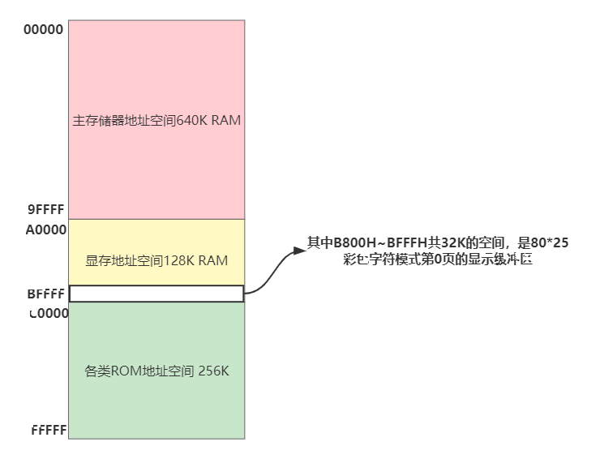
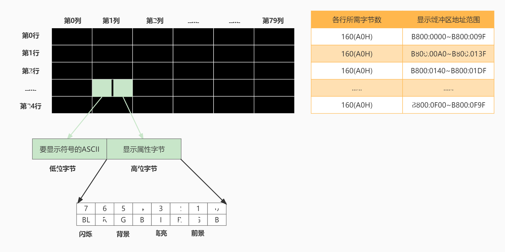

## 移位指令

- SHL OPR, CNT 将OPR逻辑左移CNT位
  - 将寄存器或内存单元中的数据左移
  - 将最后移出的一位写入CF中
  - 最低位用0补充
- shl指令示例

```assembly
mov al, 01010001b
mov cl, 3   ; 移动位数大于1时，必须用cl
shl al, cl  ; 结果(al)=10001000b, CF=0
```

- s将x逻辑左移一位，相当于执行x=x*2; 右移一位，相当于执行x=x/2

```assembly
mov al, 0000 0001b
shl al, 1           ; (al)=0000 0010b
shl al, 1           ; (al)=0000 0100b
shl al, 1           ; (al)=0000 1000b
mov cl, 3
shl al, cl          ; (al)=0100 0000b
mov cl, 2
shr al, cl          ; (al)=0001 0000b
```

## 操作显存数据

#### 显示的原理

- 屏幕上的内容 = 显存中的数据



### 显示缓冲区的结构



### 显示信息的一种“直接方式”

- 编程序，在屏幕的中间，白底黑字，显示'Welcome to masm!'

```assembly
assume cs:code, ds:data
data segment
    db 'Welcome to masm!'
data ends
code segment
start:
    ; 初始化寄存器
    mov ax, data
    mov ds, ax
    mov ax, 0b800h
    mov es, ax
    mov si, 0
    mov di, 160 * 12 + 80 - 16

    ; 显示字符串
    mov cx, 16
w:
    mov al, [si]
    mov es:[di], al
    inc di
    mov al, 71h  ;01110001
    mov es:[di], al
    inc si
    inc di
    loop w

    mov ax, 4c00h
    int 21h
code ends
end start
```

## 描述内存单元的标号

### 关于标号

- 代码段中的标号可以用来标记指令、段的起始地址
- 代码段中的数据也可以用标号

```assembly
assume cs:code
code segment
start:
	mov ax, 1
	mov cx, 8
s:
	add ax, ax
	loop s
	mov ax, 4c00h
	int 21h
code ends
end start
```

- 将a标号处的8个字节数据累加，结果存储到b标号处的字节中

```assembly
assume cs:code
code segment
	a: db 1,2,3,4,5,6,7,8
	b: dw 0
start:
	mov si, offset a
	mov bx, offset b
	mov cx, 8
s:
	mov al, cs:[si]
	mov ah, 0
	add cs:[bx], ax
	inc si
	loop s
	mov ax, 4c00h
	int 21h
code ends
end start
```

### 去了冒号的数据标号

- 数据标号
  - 数据标号标记了存储数据的单元的地址和长度
  - 数据标号不同于仅仅表示地址的地址标号

```assembly
assume cs:code
code segment
	a db 1,2,3,4,5,6,7,8
	b dw 0
start:
	mov si, 0
	mov cx, 8
s:
	mov al, a[si]
	mov ah, 0
	add b, ax
	inc si
	loop s
	mov ax, 4c00h
	int 21h
code ends
end start
```

- 我们在code段中使用的标号a, b后面没有加“:”, 他们同时描述内存地址和单元长度的标号
- 标号a
  - 地址code:0
  - 以后的内存单元都是字节
- 标号b
  - 地址code:8
  - 以后的内存单元都是字

### 数据段中的数据标号

- 扩展用法：将标号当做数据来定义

- 对比：地址标号只能在代码段中使用

```assembly
data segment
	a db 1,2,3,4,5,6,7,8
	b dw 0
	c dw a, b
data ends
; 上述代码与下面的代码等价
data segment
	a db 1,2,3,4,5,6,7,8
	b dw 0
	c dw offset a, offset b
data ends

data segment
	a db 1,2,3,4,5,6,7,8
	b dw 0
	c dd a, b
data ends
; 上述代码与下面的代码等价
data segment
	a db 1,2,3,4,5,6,7,8
	b dw 0
	c dw offset a, seg a, offset b, seg b
data ends
; seg操作符：取段地址
```

```assembly
assume cs:code, ds:data
data segment
  a db 1,2,3,4,5,6,7,8
  b dw 0
data ends
code segment
start:
  mov ax, data
  mov ds, ax
  mov si, 0
  mov cx, 8
s:
  mov al, a[si]
  mov ah, 0
  add b, ax
  inc si
  loop s

  mov ax, 4c00h
  int 21h
code ends
end start
```

## 数据的直接定址表

### 直接定址表：用查表的方法解决问题

- 问题：以十六进制的形式在屏幕中间显示给定的byte型数据
- 分析：先将一个byte的高4位和低4位分开，显示对应的数码字符
- 解决方案一：直接方案

```assembly
; 逐个比较并显示
; 如果数值为0，则显示'0';
; 如果数值为1，则显示'1';
...
; 如果数值为15，则显示'F';
; 要使用多条比较，转移指令，程序长且混乱
```

- 解决方案二：改进方案

```assembly
; 在数值0~15和字符'0'~'9', 'A'~'F'之间找到一种映射关系
; 数值0~9和字符'0'~'9'之间的映射关系：数值+30h=对应字符的ASCII值
; 0+30h='0'的ASCII值
; 1+30h='1'的ASCII值

; 10~15和'A'~'F'之间的映射关系：数值+37h=对应字符的ASCII值
; 0Ah+37h='A'的ASCII值
; 0Bh=37h='B'的ASCII值

; 仍需要进行一些比较，对于0~9和10~15的值，要用不同的计算方法
```

- 解决方法三：最简方案

```assembly
; 建立一张表，表中依次存储字符'0'~'F'，我们可以通过数值0~15直接查找到对应的字符
table db '0123456789ABCDEF'   ; 字符表
```

```assembly
assume cs:code
code segment
start:
  mov al, 2bh
  call showbyte
  mov ax, 4c00h
  int 21h

; 子程序
; 用al传送要显示的数据
showbyte:
  jmp short show
  table db '0123456789ABCDEF'
show:
  push bx
  push es
  push cx

  mov ah, al
  mov cl, 4
  shr ah, cl ; 右移4位，ah中得到高4位的值
  and al, 00001111b ; al中为低4位的值

  ; 用高4位的值(ah)作为相对于table的偏移，取得对应的字符并显示
  mov bl, ah
  mov bh, 0
  mov ah, table[bx]
  mov bx, 0b800h
  mov es, bx
  mov es:[160*12+40*2], ah

  ; 用低4位的值(al)作为相对于table的偏移，取得对应的字符
  mov bl, al
  mov bh, 0
  mov al, table[bx]
  mov es:[160*12+40*2+2], al

  pop cx
  pop es
  pop bx
  ret
code ends
end start
```

### 直接定址表

- 问题求解思路：利用表，在两个数据集合之间建立一种映射关系，用查表的方法根据给出的数据得到其在另一集合中的对应数据
- 优点：
  - 算法清晰和简洁
  - 加快运算速度
  - 使程序易于扩充

### 应用示例：为加快运算速度而采用查表方法

- 问题：编写程序，计算sin(x), x{0, 30, 60, 90, 120, 150, 180},并在屏幕中间显示计算结果
- 常规解法：利用麦克劳林公式来计算sin(x), 将角度x转换为弧度

$$
y=x/180*3.1415926; sin(x)=sin(y)=\frac{1}{3!}y^3+\frac{1}{5!}y^5
$$

- 评价：

  - 计算sin(x)需要进行多次乘法和除法
  - 乘除是昂贵的操作

- 空间换时间方案

  - 将所要计算的sin(x)的结果都存储到一张表中，然后用角度值来查表，找到对应的sin(x)的值
  - 具体方法：用ax向子程序传递角度；以角度值/30为table表中的偏移，可以找到对应的字符串的首地址

  `sin(0)=0; sin(30)=0.5; sin(60)=0.866; sin(90)=1; sin(120)=0.866; sin(150)=0.5; sin(180)=0`

## 代码的直接定址表

## 中断及其处理

## 编制中断处理程序

## 单步中断

## 由int指令引发的中断

## BIOS和DOS中断处理

## 端口的读写

## 操作CMOS RAM芯片

## 外设连接与中断

## PC机键盘的处理过程

## 定制键盘输入处理

## 改写中断例程的方法

## 用中断响应外设

## 应用：字符串的输入

## 磁盘读写

## 发声程序

