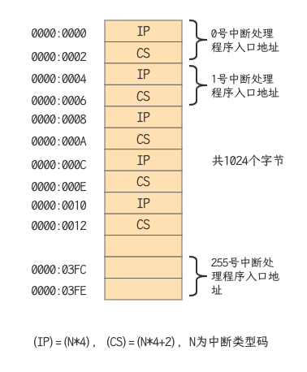
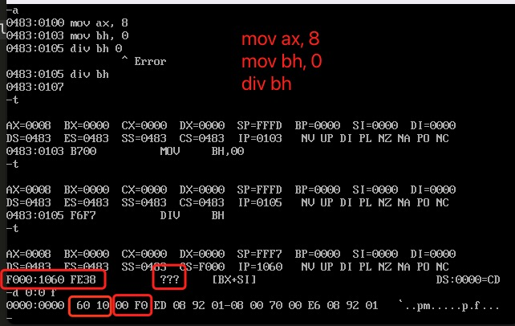
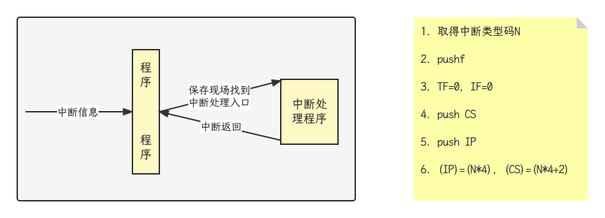
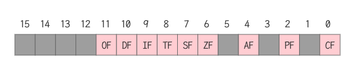

## 移位指令

- SHL OPR, CNT 将OPR逻辑左移CNT位
  - 将寄存器或内存单元中的数据左移
  - 将最后移出的一位写入CF中
  - 最低位用0补充
- shl指令示例

```assembly
mov al, 01010001b
mov cl, 3   ; 移动位数大于1时，必须用cl
shl al, cl  ; 结果(al)=10001000b, CF=0
```

- s将x逻辑左移一位，相当于执行x=x*2; 右移一位，相当于执行x=x/2

```assembly
mov al, 0000 0001b
shl al, 1           ; (al)=0000 0010b
shl al, 1           ; (al)=0000 0100b
shl al, 1           ; (al)=0000 1000b
mov cl, 3
shl al, cl          ; (al)=0100 0000b
mov cl, 2
shr al, cl          ; (al)=0001 0000b
```

## 操作显存数据

#### 显示的原理

- 屏幕上的内容 = 显存中的数据


### 显示缓冲区的结构


### 显示信息的一种“直接方式”

- 编程序，在屏幕的中间，白底黑字，显示'Welcome to masm!'

```assembly
assume cs:code, ds:data
data segment
    db 'Welcome to masm!'
data ends
code segment
start:
    ; 初始化寄存器
    mov ax, data
    mov ds, ax
    mov ax, 0b800h
    mov es, ax
    mov si, 0
    mov di, 160 * 12 + 80 - 16

    ; 显示字符串
    mov cx, 16
w:
    mov al, [si]
    mov es:[di], al
    inc di
    mov al, 71h  ;01110001
    mov es:[di], al
    inc si
    inc di
    loop w

    mov ax, 4c00h
    int 21h
code ends
end start
```

## 描述内存单元的标号

### 关于标号

- 代码段中的标号可以用来标记指令、段的起始地址
- 代码段中的数据也可以用标号

```assembly
assume cs:code
code segment
start:
	mov ax, 1
	mov cx, 8
s:
	add ax, ax
	loop s
	mov ax, 4c00h
	int 21h
code ends
end start
```

- 将a标号处的8个字节数据累加，结果存储到b标号处的字节中

```assembly
assume cs:code
code segment
	a: db 1,2,3,4,5,6,7,8
	b: dw 0
start:
	mov si, offset a
	mov bx, offset b
	mov cx, 8
s:
	mov al, cs:[si]
	mov ah, 0
	add cs:[bx], ax
	inc si
	loop s
	mov ax, 4c00h
	int 21h
code ends
end start
```

### 去了冒号的数据标号

- 数据标号
  - 数据标号标记了存储数据的单元的地址和长度
  - 数据标号不同于仅仅表示地址的地址标号

```assembly
assume cs:code
code segment
	a db 1,2,3,4,5,6,7,8
	b dw 0
start:
	mov si, 0
	mov cx, 8
s:
	mov al, a[si]
	mov ah, 0
	add b, ax
	inc si
	loop s
	mov ax, 4c00h
	int 21h
code ends
end start
```

- 我们在code段中使用的标号a, b后面没有加“:”, 他们同时描述内存地址和单元长度的标号
- 标号a
  - 地址code:0
  - 以后的内存单元都是字节
- 标号b
  - 地址code:8
  - 以后的内存单元都是字

### 数据段中的数据标号

- 扩展用法：将标号当做数据来定义

- 对比：地址标号只能在代码段中使用

```assembly
data segment
	a db 1,2,3,4,5,6,7,8
	b dw 0
	c dw a, b
data ends
; 上述代码与下面的代码等价
data segment
	a db 1,2,3,4,5,6,7,8
	b dw 0
	c dw offset a, offset b
data ends

data segment
	a db 1,2,3,4,5,6,7,8
	b dw 0
	c dd a, b
data ends
; 上述代码与下面的代码等价
data segment
	a db 1,2,3,4,5,6,7,8
	b dw 0
	c dw offset a, seg a, offset b, seg b
data ends
; seg操作符：取段地址
```

```assembly
assume cs:code, ds:data
data segment
  a db 1,2,3,4,5,6,7,8
  b dw 0
data ends
code segment
start:
  mov ax, data
  mov ds, ax
  mov si, 0
  mov cx, 8
s:
  mov al, a[si]
  mov ah, 0
  add b, ax
  inc si
  loop s

  mov ax, 4c00h
  int 21h
code ends
end start
```

## 数据的直接定址表

### 直接定址表：用查表的方法解决问题

- 问题：以十六进制的形式在屏幕中间显示给定的byte型数据
- 分析：先将一个byte的高4位和低4位分开，显示对应的数码字符
- 解决方案一：直接方案

```assembly
; 逐个比较并显示
; 如果数值为0，则显示'0';
; 如果数值为1，则显示'1';
...
; 如果数值为15，则显示'F';
; 要使用多条比较，转移指令，程序长且混乱
```

- 解决方案二：改进方案

```assembly
; 在数值0~15和字符'0'~'9', 'A'~'F'之间找到一种映射关系
; 数值0~9和字符'0'~'9'之间的映射关系：数值+30h=对应字符的ASCII值
; 0+30h='0'的ASCII值
; 1+30h='1'的ASCII值

; 10~15和'A'~'F'之间的映射关系：数值+37h=对应字符的ASCII值
; 0Ah+37h='A'的ASCII值
; 0Bh=37h='B'的ASCII值

; 仍需要进行一些比较，对于0~9和10~15的值，要用不同的计算方法
```

- 解决方法三：最简方案

```assembly
; 建立一张表，表中依次存储字符'0'~'F'，我们可以通过数值0~15直接查找到对应的字符
table db '0123456789ABCDEF'   ; 字符表
```

```assembly
assume cs:code
code segment
start:
  mov al, 2bh
  call showbyte
  mov ax, 4c00h
  int 21h

; 子程序
; 用al传送要显示的数据
showbyte:
  jmp short show
  table db '0123456789ABCDEF'
show:
  push bx
  push es
  push cx

  mov ah, al
  mov cl, 4
  shr ah, cl ; 右移4位，ah中得到高4位的值
  and al, 00001111b ; al中为低4位的值

  ; 用高4位的值(ah)作为相对于table的偏移，取得对应的字符并显示
  mov bl, ah
  mov bh, 0
  mov ah, table[bx]
  mov bx, 0b800h
  mov es, bx
  mov es:[160*12+40*2], ah

  ; 用低4位的值(al)作为相对于table的偏移，取得对应的字符
  mov bl, al
  mov bh, 0
  mov al, table[bx]
  mov es:[160*12+40*2+2], al

  pop cx
  pop es
  pop bx
  ret
code ends
end start
```

### 直接定址表

- 问题求解思路：利用表，在两个数据集合之间建立一种映射关系，用查表的方法根据给出的数据得到其在另一集合中的对应数据
- 优点：
  - 算法清晰和简洁
  - 加快运算速度
  - 使程序易于扩充

### 应用示例：为加快运算速度而采用查表方法

- 问题：编写程序，计算sin(x), x{0, 30, 60, 90, 120, 150, 180},并在屏幕中间显示计算结果
- 常规解法：利用麦克劳林公式来计算sin(x), 将角度x转换为弧度

$$
y=x/180*3.1415926; sin(x)=sin(y)=\frac{1}{3!}y^3+\frac{1}{5!}y^5
$$

- 评价：

  - 计算sin(x)需要进行多次乘法和除法
  - 乘除是昂贵的操作

- 空间换时间方案

  - 将所要计算的sin(x)的结果都存储到一张表中，然后用角度值来查表，找到对应的sin(x)的值
  - 具体方法：用ax向子程序传递角度；以角度值/30为table表中的偏移，可以找到对应的字符串的首地址

  `sin(0)=0; sin(30)=0.5; sin(60)=0.866; sin(90)=1; sin(120)=0.866; sin(150)=0.5; sin(180)=0`

```assembly
assume cs:code
code segment
start:
	mov al, 60
	cal showsin
	mov ax, 4c00h
	int 21h
	
showsin:
	jmp short show
	; 字符串便宜地址表
	table dw ag0, ag30, ag60, ag90, ag120, ag150, ag180
		ag0   db '0',0        ;sin(0)对应的字符串为'0'
		ag30  db '0.5',0      ;sin(30)对应的字符串为'0.5'
		ag60  db '0.866',0    ;sin(60)对应的字符串为'0.866'
		ag90  db '1',0        ;sin(90)对应的字符串为'1'
		ag120 db '0.866',0    ;sin(120)对应的字符串为'0.866'
		ag150 db '0.5',0      ;sin(150)对应的字符串为'0.5'
		ag180 db '0',0        ;sin(180)对应的字符串为'0'
show:
	; 预备
	push bx
	push es
	push si
	mov bx, b800h
	mov es, bx
	; 用角度值/30作为相对于table的偏移量，取得对应的字符串的偏移地址，放在bx中
	mov ah, 0
	mov bl, 80
	div bl
	mov bl, al
	mov bh, 0
	add bx, bx
	mov bx, table[bx]
	; 显示sin(x)对应的字符串
	mov si, 160*12+40*2
shows:
	mov ah, cs:[bx]
	cmp ah, 0
	je showret
	mov es:[si], ah
	inc bx
	add si, 2
	jmp shows
showret:
	pop si
	pop es
	pop bx
	ret
code ends
end start
```

- 功能拓展：考虑程序的容错性，加上对提供的角度值是否超范围的检测，定位不到正确的字符串，将出现错误
- 方法拓展：直接定制表中存储子程序的地址，从而方便实现不同子程序的调用

## 代码的直接定址表

### 使用代码的直接定制表解决问题

- 直接定址表法：用查表的方式，通过依据数据，直接计算出所要找的元素的位置
- 直接定址表分类：
  - 数据的直接定址表
  - 代码的直接定址表
- 要解决的问题：实现一个子程序setscreen, 为显示输出提供如下功能
  - 清屏
  - 设置前景色
  - 设置背景色
  - 向上滚动一行
  
- 解决方案
  - 将4个功能写成4个子程序
  - 将这些功能子程序的入口地址存储在一个表中，他们在表中的位置和功能号对应
  - 对应关系为：功能号*2=对应的功能子程序在地址表中的偏移
  
- 子程序入口参数说明
  - 用ah寄存器传递功能号
    - 0表示清屏
    - 1表示设置前景色
    - 2表示设置背景色
    - 3表示向上滚动一行
  
  - 对2，3号功能，用al传送颜色值，al(0,1,2,3,4,5,6,7)
  

```assembly
; 编程实现一个子程序setscreen,为显示输出提供如下功能
; 1. 清屏
; 2. 设置前景色
; 3. 设置背景色
; 4. 向上滚动一行
assume cs:code
code segment
start:
  mov ah, 3
  mov al, 2
  call setscreen
  mov ax, 4c00h
  int 21h
setscreen:
  jmp short set
  table dw sub1, sub2, sub3, sub4
set:
  push bx
  cmp ah, 3                      ; 判断传递的值是否大于3
  ja sret
  mov bl, ah
  mov bh, 0
  add bx, bx                     ; 根据ah中的功能号计算对应子程序的地址再table表中的偏移
  call word ptr table[bx]        ; 调用对应的功能子程序
sret:
  pop bx
  ret

; 功能子程序入口参数说明
; 1. 用ah寄存器传递功能号：0表示清屏，1表示设置前景色，2表示设置背景色，3表示向上滚动一行
; 2. 对于2，3号功能，用al传送颜色值al = (0,1,2,3,4,5,6,7)
sub1:
  push bx
  push cx
  push es

  mov bx, 0b800h
  mov es, bx
  mov bx, 0
  mov cx, 2000
sub1s:
  mov byte ptr es:[bx],' '
  add bx, 2
  loop sub1s

  pop es
  pop cx
  pop bx
  ret

sub2:
  push bx
  push cx
  push es

  mov bx, 0b800h
  mov es, bx
  mov bx, 1
  mov cx, 2000
sub2s:
  and byte ptr es:[bx], 11111000b
  or es:[bx], al
  add bx, 2
  loop sub2s

  pop es
  pop cx
  pop bx
  ret

sub3:
  push bx
  push cx
  push es

  mov cl, 4
  shl al, cl
  mov bx, 0b800h
  mov es, bx
  mov bx, 1
  mov cx, 2000
sub3s:
  and byte ptr es:[bx], 10001111b
  or es:[bx], al
  add bx, 2
  loop sub3s

  pop es
  pop cx
  pop bx
  ret

sub4:
  push cx
  push si
  push di
  push es
  push ds

  ;准备
  mov si, 0b800h
  mov es, si
  mov ds, si
  mov si, 160     ; ds:si指向第n+1行
  mov di, 0       ; es:di指向第n行
  cld
  mov cx, 24      ; 共复制24行
  ;复制前24行
sub4s:
  push cx
  mov cx, 160
  rep movsb
  pop cx
  loop sub4s
  ;清空最后一行
  mov cx, 80
  mov si, 0
sub4s1:
  mov byte ptr es:[160*24+si], ' '
  add si, 2
  loop sub4s1

  pop ds
  pop es
  pop di
  pop si
  pop cx
  ret
code ends
end start
```

### 直接写址表的优势

- 要在setscreen中再加入新功能，只需要在地址表中加入他的入口地址就可以了。结构清晰，便于扩充

## 中断及其处理

### 中断的概念

- 中断：CPU不再接着（刚执行完的指令）向下执行，而是转去处理中断信息
- 内中断：由CPU内部发生的事件而引起的中断
- 外中断：由外部设备发生的事件引起的中断

### 8086的内中断

- CPU内部产生的中断信息
  - 除法错误：比如：执行div指令产生的除法溢出
  - 单步执行
  - 执行into指令
  - 执行int指令
- 8086的中断类型码
  - 除法错误：0
  - 单步执行：1
  - 执行into指令：4
  - 执行int n指令，立即数n为中断类型码

```assembly
assume cs:code, ds:data, ss:stack
stack segment
  db 200h dup (0)
stack ends
data segment
  szmsg db 13,10,'hello world!',13,10,'$'
data ends
code segment
start:
  mov ax, data
  mov ds, ax
  lea dx, szmsg
  mov ah, 9
  int 21h

  mov ax, 4c00h
  int 21h
code ends
end start
```

### 中断处理程序

- CPU接到中断信息怎么办？执行中断处理程序
- 中断处理程序在哪里？中断信息和其处理程序的入口地址之间有某种联系，CPU根据中断信息可以找到要执行的处理程序
- 中断向量表：由中断类型码，查表得到中断处理程序的入口地址，从而定位中断处理程序



### 案例：系统中的0号中断



- DOS中，都是微软编写的代码，有些代码，是他们内部掌握的，DEBUG不给显示
- 如果想要用FE38这条指令，只能用机器语言来编程。因为，微软没有公告对应的汇编语言

### 中断过程

- 中断过程
  - 中断过程由CPU的硬件自动完成
  - 用中断类型码找到中断向量，并用它设置CS和IP
- 8086CPU的中断过程
  - 从中断信息中取得中断类型码
  - 标志寄存器的值入栈--中断过程中要改变标志寄存器的值，需要先行保护
  - 设置标志寄存器的第8位TF和第9位IF的值为0
  - CS的内容入栈
  - IP的内容入栈
  - 从中断向量表取中断处理程序的入口地址，设置IP和CS



## 编制中断处理程序

### 中断处理程序及其结构

- CPU随时都可能检测到中断信息，所以中断处理程序必须常驻内存（一直存储再内存某段空间之中）
- 中断处理程序的入口地址，即中断向量，必须存储再对应的中断向量表表项中（0000:0000 - 0000:03FF）

### 编制中断处理程序--以除法错误中断为例

- 问题：如何编制中断处理程序？
- 方案：通过对0号中断，即除法错误的中断处理，体会中断处理的技术问题
- 预期效果：编写一个0号中断处理程序，它的功能在屏幕中间显示"overflow!"后，然后返回到操作系统
- do0:
  - 相关处理
  - 向显示缓冲区送字符串"overflow!"
  - 返回DOS

### do0子程序应该放在哪里？

- 要求：do0子程序应该存放在内存的确定位置：我们要重新找个地方，不破坏系统
- 事实：在操作系统之上使用计算机，所有的硬件资源都在操作系统的管理之下，应该向操作系统申请获得存放do0的内存
- 简便方案：绕过操作系统，直接找到一块别的程序不会用到的内存区，将do0传送到其中即可
- 找到哪儿好呢？内存0000:0000 - 0000:03FF,大小为1KB的空间是系统存放中断向量表，DOS系统和其他应用程序都不会随便使用这段空间。8086支持256个中断，但实际上系统中要处理的中断事件远没有达到256个
- 就这样做了！利用中断向量表中空闲单元来存放我们的程序。估计出，do0的长度不可能超过256个字节，就选用从0000:0200至02FF的256个字节空间
- 确定的方案：将do0程序传送到内存0000:0200处

### 程序框架

- 编写可以显示"overflow!"的中断处理程序:do0
- 安装程序：将do0送入内存0000:0200处；
- 将do0中断处理程序的入口地址0000:0200存储在中断向量表0号表项中

```assembly
assume cs:code
code segment
start:
	; do0安装程序
	; 设置ds:si指向源地址cs:do0
	mov ax, cs
	mov ds, ax
	mov si, offset do0
	; 设置es:di指向目的地址0000:0200h
	mov ax, 0
	mov es, ax
	mov di, 0200h
	; 设置cx为传输长度
	mov cx, offset do0end-offset do0
	; 设置传输方向为正
	cld
	rep movsb
	
	; 设置中断向量表:将do0的入口地址0000:0200h，写到中断向量表的0号表项中
	mov ax, 0
	mov es, ax
	mov word ptr es:[0*4], 0200h
	mov word ptr es:[0*4+2], 0
	
	mov ax, 4c00h
	int 21h
do0:
	; 显示字符串"overflow!"
	jmp short do0start
	db 'overflow!'
do0start:
	mov ax, cs
	mov ds, ax
	mov si, 0202h
	
	mov ax, 0b800h
	mov es, ax
	mov di, 12*160+36*2
	mov cx, 9
s:
	mov al, [si]
	mov es:[di], al
	inc si
	add di, 2
	loop s
do0end:
	nop
	
	mov ax 4c00h
	int 21h
code ends
end start
```

## 单步中断

### 由Debug中的t命令说起

- 程序的正常执行：取指令、改变CS:IP、执行指令、取指令
- Debug提供了单步中断的中断处理程序，功能为显示所有寄存器中的内容后等待输入命令
- 是什么，让CPU能执行一条指令就停下来？
  - Debug利用了CPU提供的单步中断的功能
  - 使用t命令时，Debug将TF标志设为1，使CPU工作在单步中断方式下
- 自定义单步中断处理程序，还可以实现特殊的功能
- 让指令停下来，能做不少事

### 单步中断过程与处理

- 两个和中断相关的寄存器标志位
  - TF-陷阱标志(trap flag): 用于调试的单步方式操作。当TF=1时，每条指令执行完后产生陷阱，由系统控制计算机；当TF=0时，CPU正常工作，不产生陷阱
  - IF-中断标志(interrupt flag): 当IF=1时，允许CPU响应可屏蔽中断请求；当IF=0时，关闭中断



- CPU在执行完一条指令之后，如果检测到标志寄存器的TF为1，则产生单步中断（中断类型码为1），引发中断过程，执行中断处理程序
- 中断过程
  - 取得中断类型码1
  - 标志寄存器入栈，TF，IF设置为0
  - CS, IP入栈
  - (IP) = (1 * 4), (CS)=(1 * 4 + 2)

- 中断处理程序也由一条条指令组成的
- 如果在执行中断处理程序之前，TF=1,则CPU在执行完中断处理程序的第一条指令后，又要产生单步中断，转去执行单步中断的中断处理程序的第一条指令
- 上面的过程将陷入一个永远不能结束的循环，CPU永远执行单步中断处理程序的第一条指令
- 所以，在进入中断处理程序之前，设置TF=0

### 应用：中断不响应的情况

- 一般情况下，CPU在执行完当前指令后，如果检测到中断信息，就响应中断，引发中断过程
- 在有些情况下，CPU在执行完当前指令后，即便发生中断，也不会响应
- 例：在执行完向ss寄存器传送数据的指令后，即便是发生中断，CPU也不会响应
  - 原因：ss:ip联合指向栈顶，而对它们的设置应该连续完成
  - 以此保证对栈的正确操作

## 由int指令引发的中断


## BIOS和DOS中断处理

## 端口的读写

## 操作CMOS RAM芯片

## 外设连接与中断

## PC机键盘的处理过程

## 定制键盘输入处理

## 改写中断例程的方法

## 用中断响应外设

## 应用：字符串的输入

## 磁盘读写

## 发声程序

