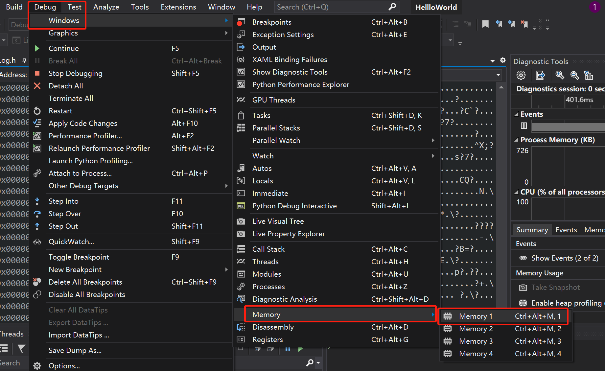
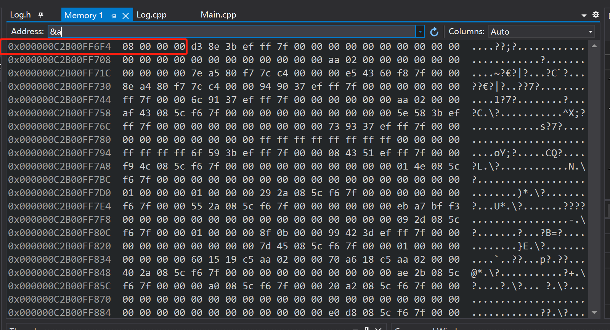

- Debug -> Windows -> Memory -> Memory1 调出内存透视图

- 在Address输入框中输入&变量，可以看到对应变量在内存中的地址值，以及地址保存的变量的值
- 鼠标放置在源文件中的某一行上，visual studio按F9功能键可以给该行代码加上断点，再按一次取消断点
- 代码中定义了int a = 8; int占4字节，内存透视图上显示为 08 00 00 00，为小端字节序