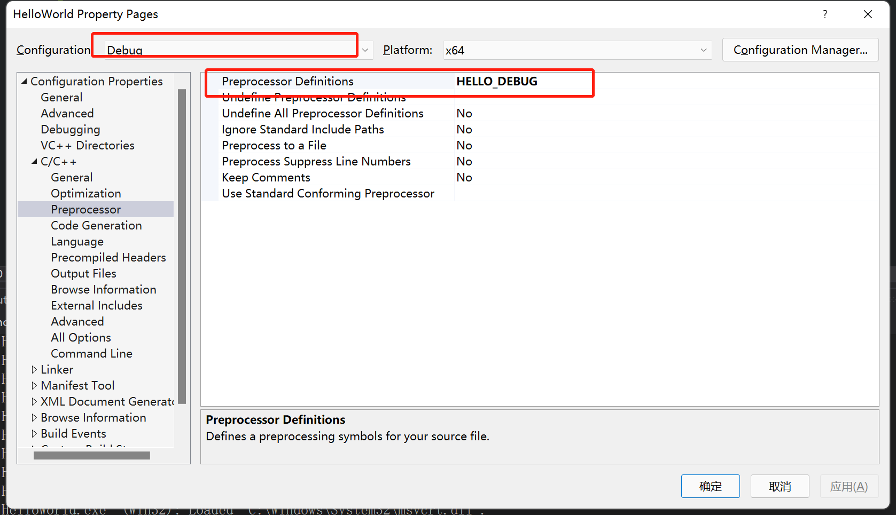
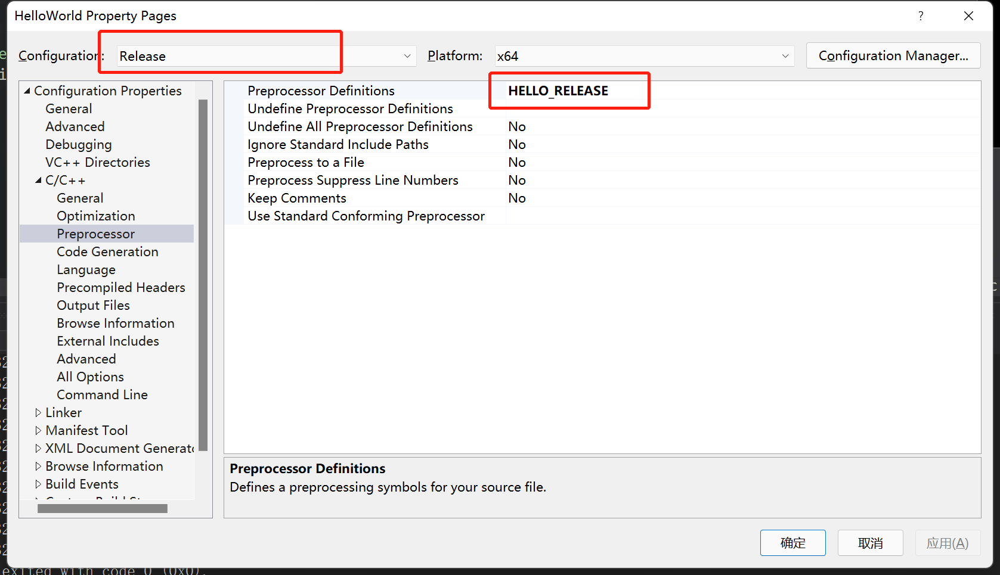

- 宏会将代码中的文本替换为其他东西，这基本上就像遍历我们的代码然后执行查找和替换，它不一定是简单的直接进行查找与替换。它可以用形参，实参和变量这些来查找和替换。我们可以自定义调用宏的方式，定义宏是如何展开的

```c++
#include <iostream>
//不推荐这样使用，会使人迷惑
#define WAIT std::cin.get()
int main() {
    WAIT;
}
```

- 在日志系统中使用宏，你记录日志的方法可能基于设置发生变化。debug模式下我们可能想把所有的东西记录下来，但是在release模式下，我们却不想这么做。因为release模式可能是我们的发布版本，不想泄露系统的一些信息，而且考虑到性能，日志需要时间

- 右键项目properties -> C/C++ -> Preprocessor -> Preprocessor Definitions设置HELLO_DEBUG，Configuration选择Debug模式



- Configuration选择Release模式，上述选项设置为HELLO_RELEASE



```c++
#include <iostream>

#ifdef HELLO_DEBUG
#define LOG(x) std::cout << x << std::endl;
#else
#define LOG(x)
#endif
int main() {
    LOG("Hello World");
    std::cin.get();
}
//Debug模式下打印Hello World, Release模式不打印
```

- 定义宏为多行代码时

```c++
#include <iostream>
#define MAIN int main() {\
    std::cin.get();\
}
MAIN
```

