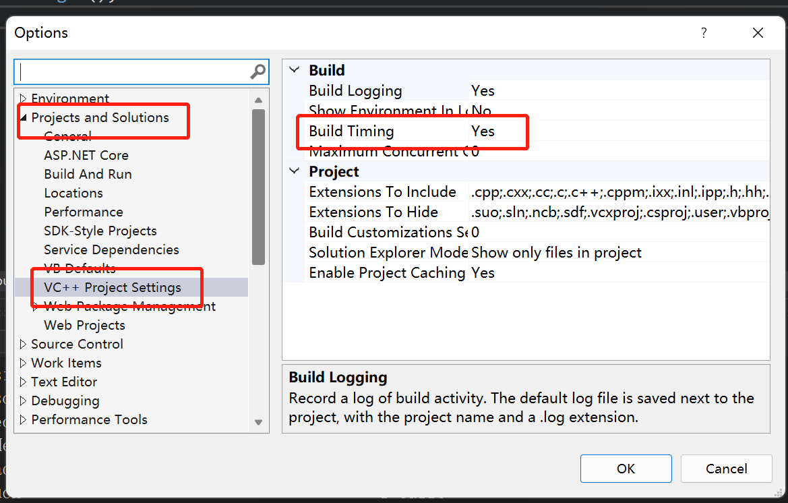
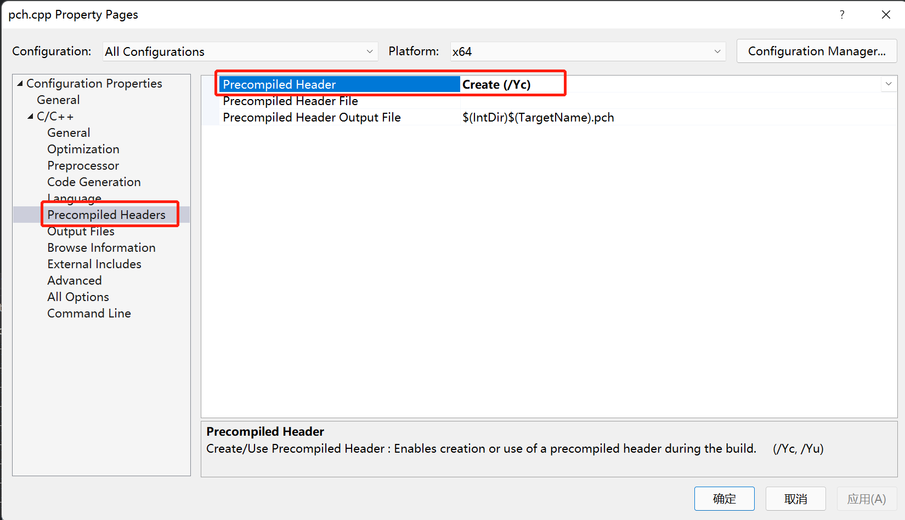
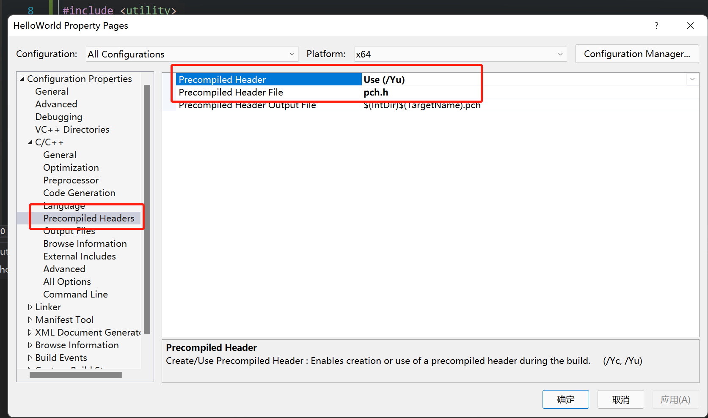

- 预编译头文件实际上是让你抓取一堆头文件，并将它们转换成编译器可以使用的格式，而不必一遍又一遍地读取这些头文件
- 与编译头文件真正有用地是外部依赖。本质上，它主要用于，不是你写地代码。比如stl,标准模板库或标准C++库中的代码或者是Windows API
- visual studio编译时显示时间设置Tools -> Options -> Project And Solutions -> VC++ Project Settings -> Build -> Build Timing设置为Yes



- 创建预编译头文件创建pch.h文件，然后创建pch.cpp文件。pch.cpp引入pch.h文件。然后右键pch.cpp文件 -> Properties -> Congiguration Properties -> C/C++ -> Precompiled Headers -> Precompiled Header 设为Create



- 右键项目件 -> Properties -> Configuration Properties -> C/C++ -> Precompiled Headers -> Precompiled Header 设为Yes. Precompiled Header File设为具体的预编译头文件

```c++
#pragma once

#include <iostream>
#include <algorithm>
#include <functional>
#include <memory>
#include <thread>
#include <utility>

//Data structures
#include <string>
#include <stack>
#include <deque>
#include <array>
#include <vector>
#include <set>
#include <map>
#include <unordered_map>
#include <unordered_set>

//Windows API
#include <Windows.h>
```

