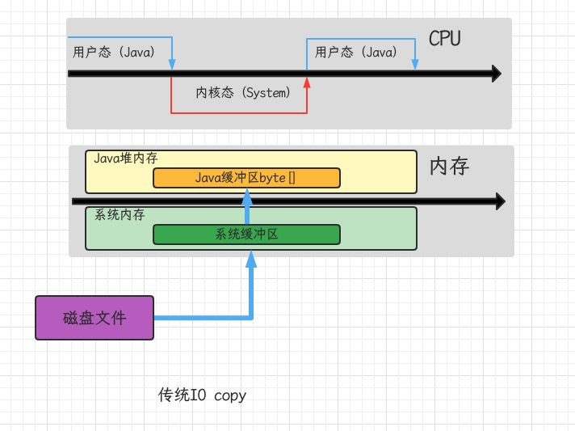
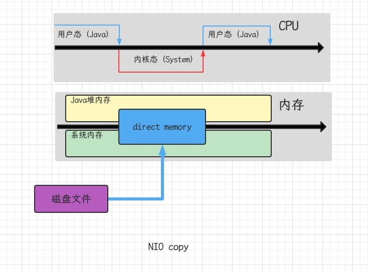

## 1.程序计数器

- Program Counter Register 程序计数器（寄存器）
- 作用：是记住下一条JVM指令的执行地址
- 特点：线程私有，不会存在内存溢出

## 2.虚拟机栈

### 2.1定义

- Java Virtual Machine Stacks(Java 虚拟机栈)
- 每个线程运行时所需要的内存，称为虚拟机栈
- 每个栈由多个栈桢(Frame)组成，对应着每次方法调用时所占用的内存
- 每个线程只能有一个活动栈桢，对应着当前正在执行的那个方法

### 2.2问题辨析

- 垃圾回收是否涉及栈内存
- 占内存分配越大越好吗
- 方法内的局部变量是否是线程安全的
  - 如果方法内局部变量没有逃离方法的作用访问，它是线程安全的
  - 如果是局部变量引用了对象，并逃离方法的作用方法，需要考虑线程安全

- 演示栈内存溢出 -Xss256K

```java
/**
 * 栈内存溢出 -Xss256K
 * @author zhangxinzheng
 * @date 2022/6/16 09:53
 */
@Slf4j
public class Demo1_2 {
    private static int count;

    public static void main(String[] args) {
        try {
            method1();
        } catch (Throwable e) {
            log.error("count is " + count);
        }
    }

    private static void method1() {
        count++;
        method1();
    }
}
```

- json数据转换出错

```java
/**
 * json数据转换出错，互相引用
 * @author zhangxinzheng
 * @date 2022/6/16 09:56
 */
public class Demo2 {
    public static void main(String[] args) throws JsonProcessingException {
        Dept d = new Dept();
        d.setName("Market");
        Emp e1 = new Emp();
        e1.setName("zhang");
        e1.setDept(d);
        Emp e2 = new Emp();
        e2.setName("li");
        e2.setDept(d);
        d.setEmps(Arrays.asList(e1, e2));
        ObjectMapper mapper = new ObjectMapper();
        System.out.println(mapper.writeValueAsString(d));
    }
}
@Data
class Emp {
    private String name;
    //@JsonIgnore
    private Dept dept;
}
@Data
class Dept {
    private String name;
    private List<Emp> emps;
}
```

### 2.3线程运行诊断

- 案例1： cpu占用过多

- 定位：

  - 用top定位哪个进程对cpu的占用过高
  - `ps H -eo pid,tid,%cpu | grep 进程id` (用ps命令进一步定位是哪个线程引起的cpu占用过高)

  ```
  [root@VM-0-2-centos ~]# ps H -eo pid,tid,%cpu | grep 1687398
  1687398 1687398  0.0
  1687398 1687399  0.1
  1687398 1687400  0.0
  1687398 1687401  0.0
  1687398 1687402  0.0
  1687398 1687403  0.0
  1687398 1687404  0.0
  1687398 1687405  0.0
  1687398 1687406  0.0
  1687398 1687407  0.0
  1687398 1687408  0.0
  1687398 1687409  0.0
  1687398 1687410  0.0
  1687398 1687411  0.0
  1687398 1687412  0.0
  1687398 1687413 98.8
  1687398 1687414  0.0
  1687398 1687415  0.0
  ```

  - jstack 进程id : 可以根据线程id找到有问题的线程，进一步定位到问题代码的源码行号
  - hex(1687413) = 0x19bf75（查询jsatck打印结果中nid为0x19bf75的线程信息）

  ```
  "Attach Listener" #13 daemon prio=9 os_prio=0 tid=0x00007fe1b8001000 nid=0x19c06f waiting on condition [0x0000000000000000]
     java.lang.Thread.State: RUNNABLE
  
  "DestroyJavaVM" #12 prio=5 os_prio=0 tid=0x00007fe1f004c800 nid=0x19bf67 waiting on condition [0x0000000000000000]
     java.lang.Thread.State: RUNNABLE
  
  "thread3" #11 prio=5 os_prio=0 tid=0x00007fe1f01d6800 nid=0x19bf77 waiting on condition [0x00007fe1d9ade000]
     java.lang.Thread.State: TIMED_WAITING (sleeping)
  	at java.lang.Thread.sleep(Native Method)
  	at Demo3.lambda$main$2(Demo3.java:24)
  	at Demo3$$Lambda$3/135721597.run(Unknown Source)
  	at java.lang.Thread.run(Thread.java:748)
  
  "thread2" #10 prio=5 os_prio=0 tid=0x00007fe1f01d4800 nid=0x19bf76 waiting on condition [0x00007fe1d9bdf000]
     java.lang.Thread.State: TIMED_WAITING (sleeping)
  	at java.lang.Thread.sleep(Native Method)
  	at Demo3.lambda$main$1(Demo3.java:16)
  	at Demo3$$Lambda$2/303563356.run(Unknown Source)
  	at java.lang.Thread.run(Thread.java:748)
  
  "thread1" #9 prio=5 os_prio=0 tid=0x00007fe1f01d3000 nid=0x19bf75 runnable [0x00007fe1d9ce0000]
     java.lang.Thread.State: RUNNABLE
  	at Demo3.lambda$main$0(Demo3.java:9)
  	at Demo3$$Lambda$1/471910020.run(Unknown Source)
  	at java.lang.Thread.run(Thread.java:748)
  ```

```java
public class Demo3 {
    public static void main(String[] args) {
        new Thread(() -> {
            System.out.println("1....");
            while (true) {

            }
        }, "thread1").start();
        new Thread(() -> {
            System.out.println("2....");
            try {
                Thread.sleep(1000000L);
            } catch (InterruptedException e) {
                e.printStackTrace();
            }
        }, "thread2").start();
        new Thread(() -> {
            System.out.println("3....");
            try {
                Thread.sleep(1000000L);
            } catch (InterruptedException e) {
                e.printStackTrace();
            }
        }, "thread3").start();
    }
}
```

- 案例2：程序运行很长时间没有结果

```java
class A {}
class B {}
public class Demo4 {
    static A a = new A();
    static B b = new B();

    public static void main(String[] args) throws InterruptedException {
        new Thread(() -> {
            synchronized (a) {
                try {
                    Thread.sleep(2000);
                } catch (InterruptedException e) {
                    e.printStackTrace();
                }
                synchronized (b) {
                    System.out.println("我获得了a 和 b");
                }
            }
        }).start();
        Thread.sleep(1000);
        new Thread(() -> {
            synchronized (b) {
                synchronized (a) {
                    System.out.println("我获得了a 和 b");
                }
            }
        }).start();
    }
}
```

- 运行上面程序jstack pid

```
Found one Java-level deadlock:
=============================
"Thread-1":
  waiting to lock monitor 0x00007f5544002418 (object 0x00000000d785f880, a A),
  which is held by "Thread-0"
"Thread-0":
  waiting to lock monitor 0x00007f55440064b8 (object 0x00000000d7860220, a B),
  which is held by "Thread-1"

Java stack information for the threads listed above:
===================================================
"Thread-1":
	at Demo4.lambda$main$1(Demo4.java:28)
	- waiting to lock <0x00000000d785f880> (a A)
	- locked <0x00000000d7860220> (a B)
	at Demo4$$Lambda$2/303563356.run(Unknown Source)
	at java.lang.Thread.run(Thread.java:748)
"Thread-0":
	at Demo4.lambda$main$0(Demo4.java:20)
	- waiting to lock <0x00000000d7860220> (a B)
	- locked <0x00000000d785f880> (a A)
	at Demo4$$Lambda$1/471910020.run(Unknown Source)
	at java.lang.Thread.run(Thread.java:748)

Found 1 deadlock.
```

## 3. 本地方法栈

## 4. 堆

### 4.1 定义

- Heap堆：通过new关键字创建对象都会使用堆内存
- 特点：
  - 它是线程共享的，堆中对象都需要考虑线程安全的问题
  - 有垃圾回收机制

### 4.2 堆内存溢出

```java
/**
 * 演示堆内存溢出 -Xmx8m
 * @author zhangxinzheng
 * @date 2022/6/17 09:32
 */
public class Demo5 {
    public static void main(String[] args) {
        int i = 0;
        try {
            List<String> list = new ArrayList<>();
            String a = "hello";
            while (true) {
                list.add(a);
                a = a + a;
                i++;
            }
        } catch (Throwable e) {
            e.printStackTrace();
            System.out.println(i);
        }
    }
}
```

### 4.3堆内存诊断

- jps工具：查看当前系统中有哪些java进程
- jmap工具：查看堆内存占用情况 `jmap -heap pid`
- jconsole工具：图形界面，多功能监测工具，可以连续监测

```java
/**
 * 演示堆内存
 * @author zhangxinzheng
 * @date 2022/6/17 09:36
 */
public class Demo6 {
    public static void main(String[] args) throws InterruptedException {
        System.out.println("1...");
        Thread.sleep(30000);
        //10MB
        byte[] array = new byte[1024 * 1024 * 10];
        System.out.println("2...");
        Thread.sleep(30000);
        array = null;
        System.gc();
        System.out.println("3...");
        Thread.sleep(1000000);
    }
}
```

## 5. 方法区

### 5.1 方法区内存溢出

- 演示元空间内存溢出 `-XX:MaxMetaspaceSize=20m`

```java
/**
 * 演示元空间内存溢出 -XX:MaxMetaspaceSize=20m
 * @author zhangxinzheng
 * @date 2022/6/17 09:45
 */
//ClassLoader可以用来加载类二进制字节码
public class Demo7 extends ClassLoader {
    public static void main(String[] args) {
        int j = 0;
        try {
            Demo7 test = new Demo7();
            for (int i = 0; i < 100000; i++) {
              	//ClassWriter作用是生成类的二进制字节码
                ClassWriter cw = new ClassWriter(0);
                //版本号，public, 类名，包名，父类，接口
                cw.visit(Opcodes.V1_8, Opcodes.ACC_PUBLIC, "Class" + i, null, "java/lang/Object", null);
                //返回byte[]
                byte[] code = cw.toByteArray();
                //执行了类的加载
                test.defineClass("Class" + i, code, 0, code.length);
            }
        } finally {
            System.out.println(j);
        }
    }
}
```

`Exception in thread "main" java.lang.OutOfMemoryError: Metaspace`

- 1.8以前会导致永久代内存溢出

```
Exception in thread "main" java.lang.OutOfMemoryError: PerGen space
-XX:MaxPermSize=20M
```

- 1.8之后会导致元空间内存溢出

```
Exception in thread "main" java.lang.OutOfMemoryError: Metaspace
-XX:MaxMetaspace=20M
```

- 场景：spring, mybatis框架会大量运用反射技术，创建了很多类的信息，放入到方法区中

### 5.2 运行时常量池

- 常量池，就是一张表，虚拟机指令会根据这张常量表找到要执行的类名，方法名，参数类型，字面量等信息
- 运行时常量池，常量池是*.class文件中的，当该类被加载，它的常量池信息就会放入运行时常量池，并把里面的符号地址变为真是地址

### 5.3 StringTable

```java
//StringTable["a", "b", "ab"] hashTable结构不能扩容
public class Demo8 {
    //常量池中的信息，都会被加载到运行时常量池中，这时 a b ab都是常量池中的符号，还没有变为java字符串对象
    public static void main(String[] args) {
        String s1 = "a"; //懒惰的
        String s2 = "b";
        String s3 = "ab";
    }
}
```

`javap -v -c Demo8`

```java
public static void main(java.lang.String[]);
    descriptor: ([Ljava/lang/String;)V
    flags: ACC_PUBLIC, ACC_STATIC
    Code:
      stack=1, locals=4, args_size=1
         //ldc #2 会把符号a变为"a"字符串对象
         0: ldc           #2                  // String a
         2: astore_1
         //ldc #3 会把符号ab变为"b字符串对象
         3: ldc           #3                  // String b
         5: astore_2
         //ldc #4 会把符号ab变为"ab"字符串对象
         6: ldc           #4                  // String ab
         8: astore_3
         9: return
      LineNumberTable:
        line 11: 0
        line 12: 3
        line 13: 6
        line 14: 9
      LocalVariableTable:
        Start  Length  Slot  Name   Signature
            0      10     0  args   [Ljava/lang/String;
            3       7     1    s1   Ljava/lang/String;
            6       4     2    s2   Ljava/lang/String;
            9       1     3    s3   Ljava/lang/String;
    MethodParameters:
      Name                           Flags
      args
}
```

### 5.4 StringTable特性

- 常量池中的字符串仅是符号，第一次用到时才变为对象
- 利用串池的机制，来避免重复创建字符串对象
- 字符串对象拼接的原理是StringBuilder(1.8)
- 字符串常量拼接的原理是编译器优化
- 可以使用intern方法，主动将串池中还没有的字符串对象放入串池
  - 1.8将这个字符串对象尝试放入串池，如果有则并不会放入，如果没有则放入串池，会把串池中的对象返回
  - 1.6将这个字符串对象尝试放入串池，如果有则并不会放入，如果没有会把此对象复制一份，放入串池，会把串池中的对象返回

### 5.5 StringTable性能调优

- 调整-XX:StringTableSize=桶个数
- 考虑将字符串对象是否入池

## 6. 直接内存

### 6.1 定义

Direct Memory

- 常见于NIO操作，用于数据缓冲区
- 分配回收成本较高，但读写性能高
- 不受JVM内存回收管理

```java
public class Demo9 {
    private static final String FROM = "/Users/portlet/Downloads/1546514505.mp4";
    private static final String TO = "/Users/portlet/Downloads/1.mp4";
    private static final int _1MB = 1024 * 1024;

    public static void main(String[] args) {
        io();
        directBuffer();
    }
    private static void directBuffer() {
        long start = System.nanoTime();
        try(FileChannel from = new FileInputStream(FROM).getChannel();
            FileChannel to = new FileOutputStream(TO).getChannel()) {
            ByteBuffer bb = ByteBuffer.allocate(_1MB);
            while (true) {
                int len = from.read(bb);
                if (len == -1) {
                    break;
                }
                bb.flip();
                to.write(bb);
                bb.clear();
            }
        } catch (IOException e) {
            e.printStackTrace();
        }
        System.out.println("directBuffer 耗时：" + (System.nanoTime() - start) / 1000 / 1000);
    }
    private static void io() {
        long start = System.nanoTime();
        try (FileInputStream from = new FileInputStream(FROM);
             FileOutputStream to = new FileOutputStream(TO)) {
            byte[] buf = new byte[_1MB];
            while (true) {
                int len = from.read(buf);
                if (len == -1) {
                    break;
                }
                to.write(buf, 0, len);
            }
        } catch (IOException e) {
            e.printStackTrace();
        }
        System.out.println("io 耗时：" + (System.nanoTime() - start) / 1000 / 1000);
    }
}
```





- 演示直接内存溢出

```java
public class Demo10 {
    public static int _100MB = 1024 * 1024 * 100;

    public static void main(String[] args) {
        List<ByteBuffer> list = new ArrayList<>();
        int i=0;
        try {
            while (true) {
                ByteBuffer byteBuffer = ByteBuffer.allocateDirect(_100MB);
                list.add(byteBuffer);
                i++;
            }
        } finally {
            System.out.println(i);
        }
    }
}
```

`Exception in thread "main" java.lang.OutOfMemoryError: Direct buffer memory`

### 6.2 分配和回收原理

- 直接内存使用Unsafe类来实现内存的分配与回收的，并且回收需要主动调用freeMemory方法
- ByteBuffer的实现类内部，使用了Cleaner(虚引用)来监测ByteBuffer对象，一旦ByteBuffer对象被垃圾回收，那么就会由ReferenceHandler线程通过Cleaner的clean方法调用freeMemory来释放直接内存

```java
public class Demo11 {
    public static int _1GB = 1024 * 1024 * 1024;

    public static void main(String[] args) throws IOException {
        Unsafe unsafe = getUnsafe();
        long base = unsafe.allocateMemory(_1GB);
        unsafe.setMemory(base, _1GB, (byte) 0);
        System.in.read();
        unsafe.freeMemory(base);
        System.in.read();
    }
    public static Unsafe getUnsafe() {
        try {
            Field f = Unsafe.class.getDeclaredField("theUnsafe");
            f.setAccessible(true);
            Unsafe unsafe = (Unsafe) f.get(null);
            return unsafe;
        } catch (Exception e) {
            throw new RuntimeException(e);
        }
    }
}
```

