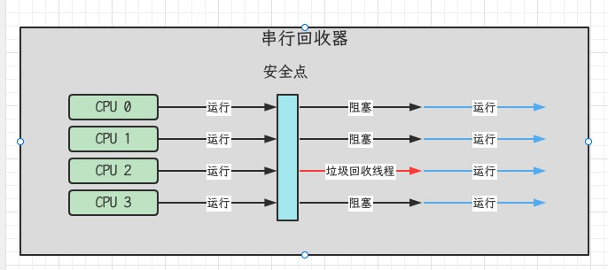
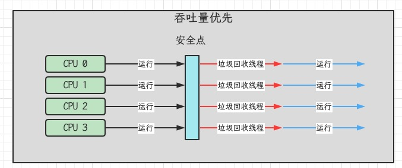
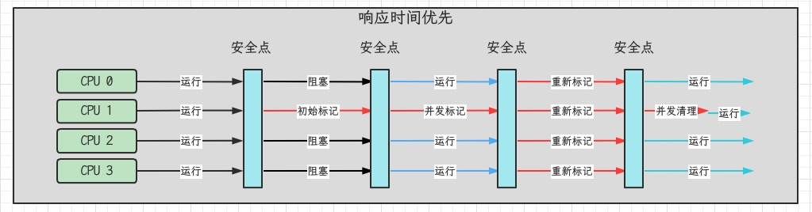
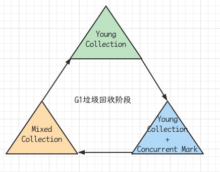
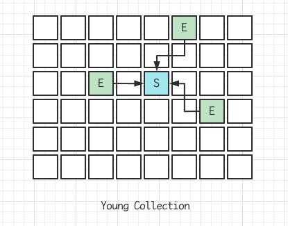
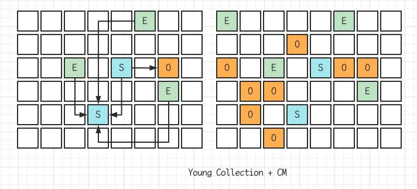
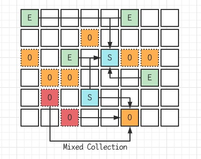
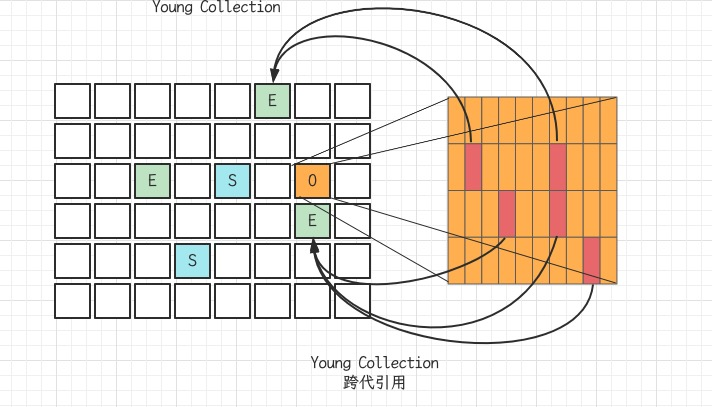

## 1. 如何判断对象可以回收

### 1.1引用计数法

### 1.2 可达性分析算法

- Java虚拟机中的垃圾回收器采用可达性分析来探索所有存活的对象
- 扫描堆中的对象，看是否能够沿着GC Root对象为起点的引用链找到该对象，找不到，表示可以回收
- 哪些对象可以作为GC Root
  1. 虚拟机栈中引用的对象：比如各个线程被调用的方法中使用到的参数，局部变量等
  2. 本地方法栈内JNI引用的对象
  3. 方法区中类静态属性引用的对象。比如：Java类的引用类型静态变量
  4. 方法区中常量引用的对象：比如：字符串常量池String Table里的引用
  5. 所有被同步锁synchronized持有的对象
  6. Java虚拟机内部的引用。基本数据类型对应的Class对象，一些常驻的异常对象(NullPointerException, OutOfMemoryException),系统加载类
  7. 反映Java虚拟机内部情况的JMXBean, JVM中注册的回调，本地代码缓存等
  8. 除了这些固定的GC Roots集合以外，根据用户所选用的垃圾收集器以及当前回收的内存区域不同，还可以有其他对象临时性地加入，共同构成完整GC Roots集合。比如：分代收集和局部回收Partial GC.。如果只针对Java堆中的某一块区域进行垃圾回收(典型的只针对新生代)，必须考虑到内存区域是虚拟机自己的实现细节，更不是孤立封闭的，这个区域的对象完全有可能被其他区域的对象所引用，这时候就需要一并将关联的区域对象也加入GC Roots集合中去考虑，才能保证可达性分析的准确性
  9. 由于Root采用栈方式存放变量和指针，所以如果一个指针，它保存了堆内存里面的对象，但是自己又不存放在堆内存里面，那它就是一个Root
  10. 如果要使用可达性分析算法来判断内存是否可回收，那么分析工作必须在一个能保障一致性的快照中进行。这点不满足的话分析结果的准确性就无法保证。这点也是导致GC进行时必须Stop The World的一个重要原因。即使是号称几乎不会发生停顿的CMS收集器中，枚举根节点时也是必须要停顿的

```java
public class Demo1 {
    public static void main(String[] args) throws IOException {
        List<Object> list = new ArrayList<>();
        list.add("a");
        list.add("b");
        System.out.println(1);
        System.in.read();

        list = null;
        System.out.println(2);
        System.in.read();
        System.out.println("end...");
    }
}
```

`jmap -dump:format=b,live,file=1.bin 82058`

### 1.3 四种引用

- 强引用
  - 只有GC Roots对象都不通过【强引用】引用该对象，该对象才能被垃圾回收
- 软引用(SoftReference)
  - 仅有软引用引用该对象时，在垃圾回收后，内存仍不足时会再次触发垃圾回收，回收软引用对象
  - 可以配合引用队列来释放软引用自身
- 弱引用(WeakReference)
  - 仅有弱引用引用该对象时，在垃圾回收时，无论内存是否充足，都会回收弱引用对象
  - 可以配合引用队列来释放弱引用自身
- 虚引用(PhantomReference)
  - 必须配合引用队列使用，主要配合ByteBuffer使用，被引用对象回收时，会将虚引用入队，由ReferenceHandler线程调用虚引用相关方法释放直接内存
- 终结器引用(FinalReference)
  - 无需手动编码，但其内部配合引用队列使用，在垃圾回收时，终结器引用入队（被引用对象暂时没有被回收），再由Finalizer线程通过终结器引用找打被引用对象并调用它的finialize方法，第二次GC时才能回收被引用对象

##2. 垃圾回收算法

### 2.1 标记清除

- Mark Sweep
- 速度快，会造成内存碎片

### 2.2 标记整理

- Mark Compact
- 速度慢，没有内存碎片

### 2.3 复制

- Copy
- 不会有内存碎片，需要占用双倍内存空间

## 3. 分代垃圾回收

- 对象首先分配在Eden区域
- 新生代空间不足时，触发minor gc，Eden和from存活的对象使用copy复制到to中，存活的对象年龄加1并且交换from to
- minor gc会引发stop the world,暂停其它用户线程，等待回收结束，用户线程才恢复运行
- 当对象寿命超过阈值时，会晋升至老年代，最大寿命15
- 当老年代空间不足，会先尝试触发minor gc,如果之后扔空间不足，那么会触发full gc, STW的时间更长

### 3.1相关VM参数

| 参数                                                      | 含义               |
| --------------------------------------------------------- | ------------------ |
| -Xms                                                      | 堆初始大小         |
| -Xmx或-XX:MaxHeapSize=size                                | 堆最大大小         |
| -Xmn或(-XX:NewSize=size -XX:MaxNewSize=size)              | 新生代大小         |
| -XX:InitialSurvivorRatio=ratio -XX:+UseAdaptiveSizePolicy | 幸存区比例（动态） |
| -XX:SurvivorRation=ratio                                  | 幸存区比例         |
| -XX:MaxTenuringThreshold=threshold                        | 晋升阈值           |
| -XX:+PrintTenuringDistribution                            | 晋升详情           |
| -XX:+PrintGCDetails -verbose:gc                           | GC详情             |
| -XX:+ScavengeBeforeFullGC                                 | FullGC前MinorGC    |

## 4. 垃圾回收器

### 4.1串行

- 单线程
- 堆内存较小，适合个人电脑
- -XX:+UseSerialGC = Serial + SerialOld



### 4.2吞吐量优先

- 多线程
- 堆内存较大，多核CPU
- 让单位时间内，STW的时间最短0.2 0.2 = 0.4
- -XX:+UseParallelGC  -XX:+UseParallelOldGC
- -XX:+UseAdaptivePolicy
- -XX:GCTimeRatio=ratio
- -XX:MaxGCPauseMillis=ms
- -XX:ParallelGCThreads=n



### 4.3响应时间优先

- 多线程
- 堆内存较大，多核CPU
- 尽可能让单次STW的时间最短 0.1 0.1 0.1 0.1 0.1 = 0.5
- -XX:+UseConcMarkSweepGC -XX:+UseParNewGC  SerialOld
- -XX:ParallelGCThreads=n    -XX:ConcGCThreads=threads
- -XX:CMSInitiatingOccupancyFraction=percent
- -XX:+CMSScavengeBeforeRemark
- 初始标记：仅仅标记GC Roots的直接关联对象，并且世界暂停
- 并发标记：使用GC Roots Tracing算法，进行跟踪标记，世界不暂停
- 重新标记：因为之前并发标记，其他用户线程不暂停，可能产生了新垃圾，所以重新标记，世界暂停



### 4.4 G1

- Garbage First: 2004论文发布，2009JDK6u14体验，2012JDK7u4官方支持，2017JDK9默认
- 适用场景
  - 同时关注吞吐量(throughput)和低延迟(low latency),默认的暂停目标是200ms
  - 超大堆内存，会将堆划分为多个大小相等的Region
  - 整体上是标记+整理算法，两个区域之间是复制算法
- 相关JVM参数
  - -XX:+UseG1GC
  - -XX:G1HeapRegionSize=size
  - -XX:MaxGCPauseMillis=time
- 1）G1垃圾回收阶段



- 2）Young Collection



- 3）Young Collection + CM
  - 在Young GC时会进行GC Root的初始标记
  - 老年代占用堆空间比例达到阈值时，进行并发标记（不会STW），由下面的JVM参数决定 -XX:InitiatingHeapOccupancyPercent=percent(默认45%)



- 4）Mixed Collection
  - 会对E,S,O进行全面垃圾回收
  - 最终标记(Remark)会STW
  - 拷贝存活(Evacuation)会STW
  - -XX:MaxGCPauseMillis=ms



- 5）Full GC

  - SerialGC
    - 新生代内存不足发生的垃圾收集 - minor gc
    - 老年代内存不足发生的垃圾收集 - full gc
  - ParallelGC
    - 新生代内存不足发生的垃圾收集 - minor gc
    - 老年代内存不足发生的垃圾收集 - full gc
  - CMS
    - 新生代内存不足发生的垃圾收集 - minor gc
    - 老年代内存不足
  - G1
    - 新生代内存不足发生的垃圾收集 - minor gc
    - 老年代内存不足

- 6）Young Collection跨代引用

  - 新生代回收的跨代引用（老年代引用新生代）问题
  - 卡表与Remembered Set 
  - 在引用变更时通过post-write barrier + dirty card queue
  - concurrent refinement threads 更新 Remembered Set

  

- 7）Remark

  - pre-write barrier+satb_mark_queue

- 8）JDK8u20字符串去重

  - 优点：节省大量内存
  - 缺点：略微多占用了cpu时间，新生代回收时间略微增加
  - -XX:+UseStringDeduplication

  ```java
  String s1 = new String("hello"); // char[]{'h', 'e', 'l', 'l', 'o'}
  String s1 = new String("hello"); // char[]{'h', 'e', 'l', 'l', 'o'}
  ```

  - 将所有新分配的字符串放入一个队列
  - 当新生代回收时，G1并发检查是否有字符串重复
  - 如果它们值一样，让它们引用同一个char[]
  - 注意，与String.intern()不一样：String.intern()关注的是字符串对象，而字符串去重关注的是char[]，在JVM内部，使用了不同的字符串表

- 9）JDK8u40并发标记类卸载

  - 所有对象都经过并发标记后，就能知道哪些类不再被使用，当一个类加载器的所有类都不再使用，则卸载它所加载的所有类
  - -XX:+ClassUnloadingWithConcurrentMark 默认启动

- 10）JDK8u60回收巨型对象

  - 一个对象大于region的一半时，称之为巨型对象
  - G1不会对巨型对象进行拷贝
  - 回收时优先被考虑
  - G1会跟踪老年代所有incoming引用，这样老年代incoming引用为0的巨型对象就可以在新生代垃圾回收时处理掉

- 11）JDK9并发标记起始时间的调整

  - 并发标记必须在堆空间占满前完成，否则退化为FullGC
  - JDK9之前需要使用-XX:InitiatingHeapOccupancyPercent
  - JDK9可以动态调整-XX:InitiatingHeapOccupancyPercent用来设置初始值；进行数据采样并动态调整；总会添加一个安全的空挡空间

- 12）JDK9更高效的回收

## 5. 垃圾回收调优

- 查看虚拟机运行参数 `java -XX:+PrintFlagsFinal -version | grep GC`

### 5.1调优领域

- 内存
- 锁竞争
- cpu占用
- io

### 5.2 确定目标

- 【低延迟】还是【高吞吐量】，选择合适的回收器
- CMS, G1, ZGC
- ParallelGC

### 5.3 最快的GC是不发生GC

- 查看FullGC前后的内存占用，考虑下面几个问题
- 数据是不是太多？
  - resultSet = statement.executeQuery("select * from 大表 limit n")
- 数据表示是否太臃肿？对象图，对象大小
- 是否存在内存泄露？
  - static Map map = 
  - 软
  - 弱
  - 第三方缓存实现

### 5.4 新生代调优

- 所有的new操作的内存分配非常廉价
- TLAB thread-local allocation buffer
- 死亡对象的回收代价是零
- 大部分对象用过即死
- MinorGC的时间远远低于Full GC

### 5.5 老年代调优

- CMS的老年代内存越大越好
- 先尝试不做调优，如果没有FullGC那么已经。。，否则先尝试调优新生代
- 观察发送FullGC时老年代内存占用，将老年代内存预设调大1/4 ~ 1/3
- -XX:CMSInitiatingOccupancyFraction=percent
