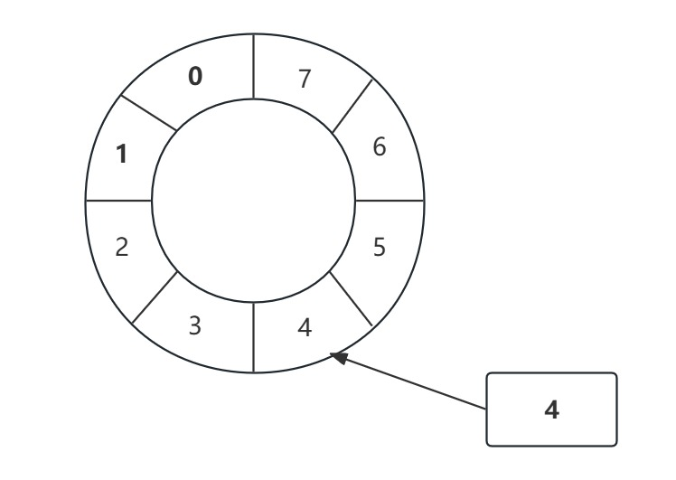

# Quick Start Demo

- 建立一个工厂Event类，用于创建Event类示例对象
- 需要有一个监听事件类，用于处理数据(Event类)
- 实例化Disruptor实例，配置一系列参数，编写Disruptor核心组件
- 编写生产者组件，向Disruptor容器中去投递数据

```Java
@Data
public class OrderEvent {
    private long value;
}

public class OrderEventFactory implements EventFactory<OrderEvent> {
    @Override
    public OrderEvent newInstance() {
        return new OrderEvent();
    }
}

@Slf4j
public class OrderEventHandler implements EventHandler<OrderEvent> {
    @Override
    public void onEvent(OrderEvent orderEvent, long l, boolean b) throws Exception {
        log.info("消费者: {}", orderEvent.getValue());
    }
}

public class OrderEventProducer {
    private final RingBuffer<OrderEvent> ringBuffer;
    public OrderEventProducer(RingBuffer<OrderEvent> ringBuffer) {
        this.ringBuffer = ringBuffer;
    }

    public void sendData(long value) {
        //1. 在生产者发送消息的时候，首先需要从我们的ringBuffer里面获取一个可用的序号
        long sequence = ringBuffer.next();
        try {
            //2 根据这个序号，找到具体的"OrderEvent"元素 注意：此时获取的OrderEvent对象是一个没有被赋值的"空"对象
            OrderEvent orderEvent = ringBuffer.get(sequence);
            //3 进行实际的赋值处理
            orderEvent.setValue(value);
        } finally {
            //4 提交发布操作
            ringBuffer.publish(sequence);
        }
    }
}

public class Main {
    public static void main(String[] args) {
        // 参数准备工作
        OrderEventFactory orderEventFactory = new OrderEventFactory();
        int ringBufferSize = 1024 * 1024;
        final ExecutorService executor = Executors.newFixedThreadPool(Runtime.getRuntime().availableProcessors());

        /**
         * 1. eventFactory: 消息(event)工厂对象
         * 2. ringBufferSize: 容器长度
         * 3. executor: 线程池(建议使用自定义线程池) RejectedExecutionHandler
         * 4. ProducerType: 单生产者还是多生产者
         * 5. waitStrategy: 等待策略
         */
        // 1. 实例化Disruptor对象
        Disruptor<OrderEvent> disruptor = new Disruptor<>(orderEventFactory,
                ringBufferSize,
                executor,
                ProducerType.SINGLE,
                new BlockingWaitStrategy());
        //2. 添加消费者的监听(构建disruptor与消费者的一个关联关系)
        disruptor.handleEventsWith(new OrderEventHandler());
        //3. 启动disruptor
        disruptor.start();
        //4. 获取实际存储数据的容器: RingBuffer
        final RingBuffer<OrderEvent> ringBuffer = disruptor.getRingBuffer();
        // 生产者生产数据
        final OrderEventProducer producer = new OrderEventProducer(ringBuffer);
        for (int i = 0; i < 100; i++) {
            producer.sendData(i);
        }
        // 关闭disruptor和executor
        disruptor.shutdown();
        executor.shutdown();
    }
}
```

# Disruptor核心原理

## RingBuffer

- 初看Disruptor给人的印象就是RingBuffer是其核心，生产者向RingBuffer中写入元素，消费者从RingBuffer中消费元素
- RingBuffer是一个环（首尾相接的环）
- RingBuffer用做在不同上下文（线程）间传递数据的buffer
- RingBuffer拥有一个序号，这个序号指向数组中下一个可用元素



- RingBuffer: 基于数组的缓存事件，也是创建sequence与定义WaitStrategy的入口
- Disruptor: 持有RingBuffer,消费者线程池Executor, 消费者集合ConsumerRepository等引用

## Sequence

- 通过顺序递增的序号来编号，管理进行交换的数据（事件）
- 对数据（事件）的处理过程总是沿着序号逐个递增处理
- 一个Sequence用于跟踪标识某个特定的事件处理者（RingBuffer/Producer/Consumer）的处理进度
- Sequence可以看成是一个AtomicLong用于标识进度
- 还有另一个目的就是防止不同Sequence之间CPU缓存伪共享(Flase Sharing)的问题

## Sequencer

- Sequencer是Disruptor的真正核心
- 此接口有两个实现类：
  - SingleProducerSequencer
  - MultiProducerSequencer
- 主要实现生产者和消费者之间快速、正确的传递数据的并发算法

## Sequence Barrier

- 用于保持对RIngBuffer的Main Published Sequence(Producer)和Consumer之间的平衡关系；Sequence Barrier还定义了决定Consumer是否还有可处理的事件的逻辑

## WaitStrategy

- 决定一个消费者将如何等待生产者将Event置入Disruptor
- 主要策略有 BlockingWaitStrategy, SleepingWaitStrategy, YieldWaitStrategy
- BlockingWaitStrategy是最低效的策略，但其对CPU的消耗最小并且在各种不同部署环境中能提供更加一致的性能表现
- SleepingWaitStrategy的性能表现跟BlockingWaitStrategy差不多，对CPU的消耗也类似，但其对生产者线程的影响最小，适合用于异步日志类似的场景
- YieldWaitStrategy的性能最好，适用于低延迟的系统。在要求极高性能且事件处理线程数小于CPU逻辑核心数的场景中，推荐使用此策略；例如，CPU开启超线程的特性