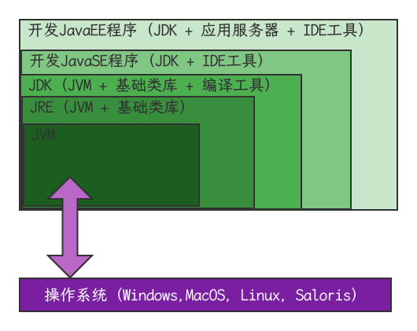
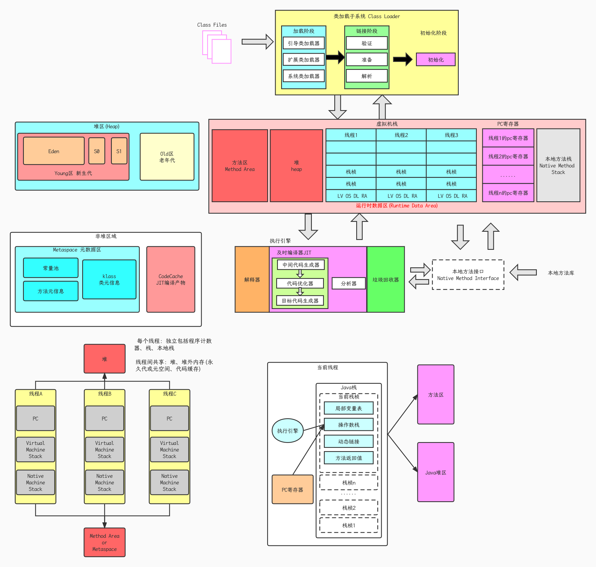

## 什么是JVM

- 定义：Java Virtual Machine - Java程序的运行环境（Java二进制字节码的运行环境）

- 优点：

  - 一次编写，到处运行
  - 自动内存管理，垃圾回收功能
  - 数组下标越界检查
  - 多态

- 比较：jvm jre jdk

  

## 学习JVM有什么用

- 面试
- 理解底层的实现原理
- 中高级程序员的必备技能

## JVM架构图

