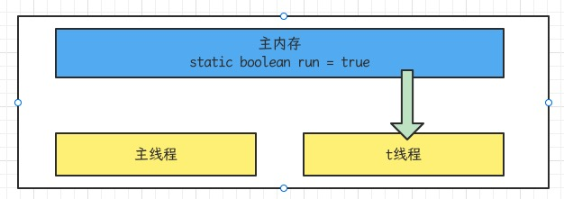
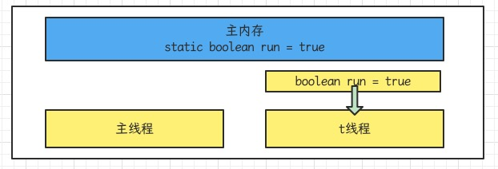
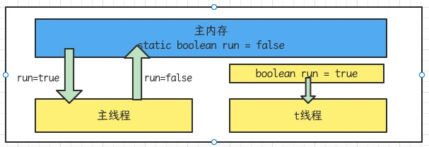

## 1. Java内存模型

Java Memory Model(JMM)定义了一套在多线程读写与共享数据时（成员变量、数组）时，对数据的可见性，有序性，和原子性的规则和保障

## 2. 可见性

### 2.1 退不出的循环

先来看一个现象，main线程对run变量的修改对于t线程不可见，导致了t线程无法停止

```java
public class Test1 {
    static boolean run = true;

    public static void main(String[] args) throws Exception {
        Thread t = new Thread(() -> {
            while (run) {
                //...
            }
        });
        t.start();
        Thread.sleep(1000);
        run = false;
    }
}
```

原因分析

1. 初始状态，t线程刚开始从主存读取了run的值到工作内存



2. 因为t线程要频繁从主内存中读取run的值，JIT编译器会将run的值缓存在自己的工作内存中的高速缓存中，减少对主存中run的访问，提高效率



3. 1秒之后，main线程修改了run的值，并同步至主存，而t是从自己工作内存中的高速缓存中读取这个变量的值，结果永远是旧值



### 2.2 解决方法

volatile(易变关键字)：它可以用来修饰成员变量和静态成员变量，可以避免线程从自己的工作内存中查找变量的值，必须到主存中获取它的值，线程操作volatile变量都是直接操作主存

### 2.3 可见性

前面例子体现的实际就是可见性，它保证是在多个线程之间，一个线程对volatile变量的修改对另一个线程可见，不能保证原子性，仅用在一个写线程，多个读线程的情况

> 注意：synchronized语句块既可以保证代码块的原子性，也同时保证代码块内变量的可见性，但缺点是synchronized是属于重量级操作，性能相对更低
>
> 如果前面实例的死循环中加入System.out.println()会发现即使不加入volatile修饰，线程t也能正确看到对run变量的修改，println函数用了synchronized修饰

## 3. 有序性

- volatile修饰的变量，可以禁用指令重排

### happens-before

happens-before规定了哪些写操作对其它线程的读操作可见，它是可见性与有序性的一套规则总结

1. 线程解锁m之前对变量的写，对于接下来对m加锁的其它线程对改变量的读可见

```java
public class HappensBefore1 {
    static int x;
    static Object m = new Object();

    public static void main(String[] args) {
        new Thread(() -> {
            synchronized (m) {
                x = 10;
            }
        }).start();
        new Thread(() -> {
            synchronized (m) {
                System.out.println(x); //10
            }
        }).start();
    }
}
```

2. 线程对volatile变量的写，对接下来其它线程对该变量的读可见

```java
public class HappensBefore2 {
    volatile static int x;
    public static void main(String[] args) {
        new Thread(() -> {
            x = 11;
        }).start();
        new Thread(() -> {
            System.out.println(x);
        }).start();
    }
}
```

3. 线程start前对变量的写，对该线程开始后对该变量的读可见

```java
public class HappensBefore3 {
    static int x;
    public static void main(String[] args) {
        x = 10;
        new Thread(() -> {
            System.out.println(x);
        }).start();
    }
}
```

4. 线程结束前对变量的写，对其它线程得知它结束后的读可见（比如其它线程调用t1.isAlive()或t1.join()等待它结束）

```java
public class HappensBefore4 {
    static int x;
    public static void main(String[] args) throws Exception {
        Thread t1 = new Thread(() -> {
            x = 10;
        });
        t1.start();
        t1.join();
        System.out.println(x);
    }
}
```

5. 线程t1打断t2(interrupt)前对变量的写，对于其他线程得知t2被打断后对变量的读可见（通过t2.interrupted或t2.isInterrupted）

```java
public class HappensBefore5 {
    static int x;
    public static void main(String[] args) throws Exception {
        Thread t2 = new Thread(() -> {
            while (true) {
                if (Thread.currentThread().isInterrupted()) {
                    System.out.println(x);
                    break;
                }
            }
        }, "t2");
        t2.start();
        new Thread(() -> {
            try {
                Thread.sleep(100);
            } catch (InterruptedException e) {
                e.printStackTrace();
            }
            x = 10;
            t2.interrupt();
        }, "t1").start();
        while (!t2.isInterrupted()) {
            Thread.yield();
        }
        System.out.println(x);
    }
}
```

6. 对变量默认值(0, false, null)的写，对其他线程对该变量的读可见
7. 具有传递性，如果x hb -> y, y hb -> z, 则x hb -> z

> 注：变量都是指成员变量或静态成员变量

## 4. CAS与原子类

### 4.1 CAS

CAS即Compare and Swap,它体现的是一种乐观锁的思想，比如多个线程要对一个共享的整型变量执行+1操作

```java
//需要不断的尝试
while(true) {
  int 旧值 = 共享变量; //比如拿到了当前值-
  int 结果值 = 旧值 + 1; //在旧值0的基础上加1，正确结果是1
  //这时候如果别的线程把共享变量改成了5，本线程的正确结果1就作废了，这时候compareAndSwap返回false,重新尝试，直到compareAndSwap返回true, 表示本线程做修改的同时，别的线程没有干扰
  if (compareAndSwap(旧值, 结果值)) {
    //成功，退出循环
  }
}
```

获取共享变量时，为了保证该变量的可见性，需要使用volatile修饰，结合CAS和volatile可以实现无锁并发，适用于竞争不激烈，多核CPU的场景下

因为没有使用synchronized,所以线程不会陷入阻塞，这是效率提升的因素之一

但如果竞争激烈，可以想到重试必然频繁发生，反而效率会受影响

CAS底层依赖一个Unsafe类来直接调用操作系统底层的CAS指令，下面是直接使用Unsafe对象进行线程安全保护的一个例子

```java
public class TestCAS {
    public static void main(String[] args) throws Exception {
        DataContainer dc = new DataContainer();
        int count = 5;
        Thread t1 = new Thread(() -> {
            for (int i = 0; i < count; i++) {
                dc.increase();
            }
        });
        t1.start();
        t1.join();
        System.out.println(dc.getData());
    }
}
class DataContainer {
    private volatile int data;
    static final Unsafe unsafe;
    static final long DATA_OFFSET;
    static {
        try {
            //Unsafe对象不能直接调用，只能通过反射获得
            Field theUnsafe = Unsafe.class.getDeclaredField("theUnsafe");
            theUnsafe.setAccessible(true);
            unsafe = (Unsafe) theUnsafe.get(null);
        } catch (Exception e) {
            throw new Error(e);
        }
        try {
            //data属性在DataContainer对象中的偏移量，用于Unsafe直接访问该属性
            DATA_OFFSET = unsafe.objectFieldOffset(DataContainer.class.getDeclaredField("data"));
        } catch (Exception e) {
            throw new Error(e);
        }
    }
    public void increase() {
        int oldValue;
        while (true) {
            //获取共享变量旧值，可以在这一行加入断点，修改data调试来加深理解
            oldValue = data;
            //cas尝试修改data为旧值+1,如果期间旧值被别的线程改了，返回false
            if(unsafe.compareAndSwapInt(this, DATA_OFFSET, oldValue, oldValue + 1)) {
                return;
            }
        }
    }
    public void decrease() {
        int oldValue;
        while (true) {
            //获取共享变量旧值，可以在这一行加入断点，修改data调试来加深理解
            oldValue = data;
            //cas尝试修改data为旧值-1,如果期间旧值被别的线程改了，返回false
            if(unsafe.compareAndSwapInt(this, DATA_OFFSET, oldValue, oldValue - 1)) {
                return;
            }
        }
    }
    public int getData() {
        return data;
    }
}

```

### 4.2 乐观锁与悲观锁

- CAS是基于乐观锁的思想：最乐观的估计，不怕别的线程来修改共享变量，就算改了也没关系，我吃亏点再重试
- synchronized是基于悲观锁的思想：最悲观的估计，得防着其他线程来修改共享变量，我上了锁你们都别想改，我改完了解开锁，你们才有机会

### 4.3 原子操作类

java.util.concurrent(juc)中提供了原子操作类，可以提供线程安全的操作，例如AtomicInteger, AtomicBoolean等。他们底层就是采用了CAS技术+volatile来实现的，用AtomicInteger改写之前的例子

```java
public class TestCAS2 {
    private static AtomicInteger atomic = new AtomicInteger(0);

    public static void main(String[] args) throws Exception {
        Thread t1 = new Thread(() -> {
            for (int i = 0; i < 5000; i++) {
                atomic.getAndIncrement();
            }
        });
        Thread t2 = new Thread(() -> {
            for (int i = 0; i < 5000; i++) {
                atomic.getAndIncrement();
            }
        });
        t1.start();
        t2.start();
        t1.join();
        t2.join();
        System.out.println(atomic.get());
    }
}
```

## 5. synchronized 优化

Java Hotspot虚拟机中，每个对象都有对象头(包括class指针和Mark Word).Mark Word平时存储这个对象的哈希码，分代年龄，当加锁时，这些信息就根据情况被替换为标记位，线程锁记录指针，重量级锁指针，线程ID等内容

### 5.1 轻量级锁

```java
static Object obj = new Object();
public static void method1() {
  synchronized(obj) {
    //同步块A
    method2();
  }
}
public static void method2() {
  synchronized(obj) {
    //同步块B
  }
}
```

每个线程的栈桢都会包含一个锁记录的结构，内部可以存储锁定对象的MarkWord

| 线程1                                     | 对象MarkWord                | 线程2                                      |
| ----------------------------------------- | --------------------------- | ------------------------------------------ |
| 访问同步代码块A,把Mark复制到线程1的锁记录 | 01（无锁）                  | -                                          |
| CAS修改Mark为线程1锁记录地址              | 01（无锁）                  | -                                          |
| 成功（加锁）                              | 00（轻量锁）线程1锁记录地址 | -                                          |
| 执行同步代码块A                           | 00（轻量锁）线程1锁记录地址 | -                                          |
| 访问同步代码块B,把Mark复制到线程1的锁记录 | 00（轻量锁）线程1锁记录地址 | -                                          |
| CAS修改Mark为线程1锁记录地址              | 00（轻量锁）线程1锁记录地址 | -                                          |
| 失败（发现是自己的锁）                    | 00（轻量锁）线程1锁记录地址 | -                                          |
| 锁重入                                    | 00（轻量锁）线程1锁记录地址 | -                                          |
| 执行同步代码块B                           | 00（轻量锁）线程1锁记录地址 | -                                          |
| 同步代码块B执行完毕                       | 00（轻量锁）线程1锁记录地址 | -                                          |
| 同步代码块A执行完毕                       | 00（轻量锁）线程1锁记录地址 | -                                          |
| 成功（解锁）                              | 01（无锁）                  | -                                          |
| 0                                         | 01（无锁）                  | 访问同步代码块A, 把Mark复制到线程2的锁记录 |
| -                                         | 01（无锁）                  | CAS修改Mark为线程2锁记录地址               |
| -                                         | 00（轻量锁）线程1锁记录地址 | 成功（加锁）                               |

### 5.2 锁膨胀

如果在尝试加轻量级锁的过程中，CAS操作无法成功，这时一种情况就是有其它线程为此对象上加了轻量级锁（有竞争），这时需要进行锁膨胀，将轻量级锁变为重量级锁

```java
static Object obj = new Object();
public static void method1() {
  synchronized(obj) {
    //同步块
  }
}
```

| 线程1                                 | 对象Mark                    | 线程2                                       |
| ------------------------------------- | --------------------------- | ------------------------------------------- |
| 访问同步块，把Mark复制到线程1的锁记录 | 01（无锁）                  | -                                           |
| CAS修改Mark为线程1锁记录地址          | 01（无锁）                  | -                                           |
| 成功（加锁）                          | 00（轻量锁）线程1锁记录地址 | -                                           |
| 执行同步代码块                        | 00（轻量锁）线程1锁记录地址 | -                                           |
| 执行同步代码块                        | 00（轻量锁）线程1锁记录地址 | 访问同步代码块，把Mark复制到线程2锁记录地址 |
| 执行同步代码块                        | 00（轻量锁）线程1锁记录地址 | CAS修改Mark为线程2锁记录地址                |
| 执行同步代码块                        | 00（轻量锁）线程1锁记录地址 | 失败（发现是别人已经占了锁）                |
| 执行同步代码块                        | 00（轻量锁）线程1锁记录地址 | CAS修改Mark为重量锁                         |
| 执行同步代码块                        | 10（重量锁）重量锁指针      | 阻塞中                                      |
| 执行完毕                              | 10（重量锁）重量锁指针      | 阻塞中                                      |

### 5.3 重量锁

重量级锁竞争的时候，还可以使用自旋来进行优化，如果当前线程自旋成功（即这时候持锁线程已经退出了同步块，释放了锁），这时当前线程就可以避免阻塞

在Java6之后自旋锁是自适应的，比如对象刚刚的一次自旋操作成功，那么认为这次自旋成功的可能性会搞，就多自旋几次；反之，就少自旋甚至不自旋，总之，比较智能

- 自旋会占用CPU时间，单核CPU自旋就是浪费，多核CPU自旋才能发挥优势
- 好比等红灯时汽车是不是熄火，不熄火相当于自旋（等待时间短了划算），熄火了相当于阻塞（等待时间长了划算）
- Java7之后不能控制是否开启自旋功能

自旋重试成功的情况

| 线程1(cpu1上)               | 对象Mark               | 线程2(cpu2上)           |
| --------------------------- | ---------------------- | ----------------------- |
| -                           | 10（重量锁）           | -                       |
| 访问同步代码块，获取monitor | 10（重量锁）重量锁指针 | -                       |
| 成功（加锁）                | 10（重量锁）重量锁指针 | -                       |
| 执行同步代码块              | 10（重量锁）重量锁指针 | -                       |
| 执行同步代码块              | 10（重量锁）重量锁指针 | 访问同步块，获取monitor |
| 执行同步代码块              | 10（重量锁）重量锁指针 | 自旋重试                |
| 执行完毕                    | 10（重量锁）重量锁指针 | 自旋重试                |
| 成功（解锁）                | 10（重量锁）           | 自旋重试                |
| -                           | 10（重量锁）重量锁指针 | 成功（加锁）            |
| -                           | 10（重量锁）重量锁指针 | 执行同步代码块          |

自旋失败的情况

| 线程1(cpu1上)               | 对象Mark               | 线程2(cpu2上)           |
| --------------------------- | ---------------------- | ----------------------- |
| -                           | 10（重量锁）           | -                       |
| 访问同步代码块，获取monitor | 10（重量锁）重量锁指针 | -                       |
| 成功（加锁）                | 10（重量锁）重量锁指针 | -                       |
| 执行同步代码块              | 10（重量锁）重量锁指针 | -                       |
| 执行同步代码块              | 10（重量锁）重量锁指针 | 访问同步块，获取monitor |
| 执行同步代码块              | 10（重量锁）重量锁指针 | 自旋重试                |
| 执行同步代码块              | 10（重量锁）重量锁指针 | 自旋重试                |
| 执行同步代码块              | 10（重量锁）重量锁指针 | 自旋重试                |
| 执行同步代码块              | 10（重量锁）重量锁指针 | 阻塞                    |
| 执行同步代码块              | 10（重量锁）重量锁指针 | 阻塞                    |

### 5.4 偏向锁

轻量级锁在没有竞争的时候（就自己这个线程），每次重入仍然需要执行CAS操作。Java6中引入了偏向锁来做进一步优化：只有第一次使用CAS将线程ID设置到对象的Mark Word头，之后发现这个线程ID是自己的就表示没有竞争，不用重新CAS

- 撤销偏向需要将持锁线程升级为轻量级锁，这个过程中所有线程需要暂停(STW)
- 访问对象的hashCode也会撤销偏向锁
- 如果对象虽然被多个线程访问，但没有竞争，这时偏向了线程T1的对象仍有机会重新偏向T2,重偏向会重置对象的Thread ID
- 撤销偏向和重偏向都是批量进行的，以类为单位
- 如果撤销偏向到达某个阈值，整个类的所有对象都会变为不可偏向的
- 可以主动使用-XX:-UseBiasedLocking禁用偏向锁

```java
static Object obj = new Object();
public static void method1() {
  synchronized(obj) {
    //同步块A
    method2();
  }
}
public static void method2() {
  synchronized(obj) {
    //同步块B
  }
}
```

| 线程1                                   | 对象Mark                    |
| --------------------------------------- | --------------------------- |
| 访问同步块A, 检查Mark中是否有线程ID     | 101(无锁可偏向)             |
| 尝试加偏向锁                            | 101(无锁可偏向)对象hashCode |
| 成功                                    | 101(无锁可偏向)线程ID       |
| 执行同步块A                             | 101(无锁可偏向)线程ID       |
| 访问同步块B,检查Mark中是否有线程ID      | 101(无锁可偏向)线程ID       |
| 是自己的线程ID,锁是自己的，无需更多操作 | 101(无锁可偏向)线程ID       |
| 执行同步块B                             | 101(无锁可偏向)线程ID       |
| 执行完毕                                | 101(无锁可偏向)对象hashCode |

### 5.5 其它优化

1. 减少上锁时间：同步代码块中尽量短
2. 减少锁的粒度：将一个锁拆分为多个锁提高并发度

- ConcurrentHashMap
- LongAdder分为base和cells两部分。没有并发争用的时候或者是cells数组正在初始化的时候，会使用CAS来累加值到base,有并发争用，会初始化cells数组，数组有多少个cell,就允许有多少线程并行修改，最后将数组中每个cell累加，再加上base就是最终的值
- LinkedBlockingQueue入队和出队使用不同的锁，相对于LinkedBlockingArray只有一个锁效率高

3. 锁粗化：多次循环进入同步块不如同步块内多次循环，另外JVM可能会做如下优化，把多次append的加锁操作粗化为一次（因为都是对同一个对象加锁，没必要重入多次）

```java
new StringBuffer().append("a").append("b").append("c");
```

4. 锁消除：JVM会进行代码的逃逸分析，例如某个加锁对象是方法内局部变量，不会被其他线程所访问到，这时候就会被即时编译器忽略掉所有同步操作
5. 读写分离：CopyOnWriteArrayList, CopyOnWriteSet