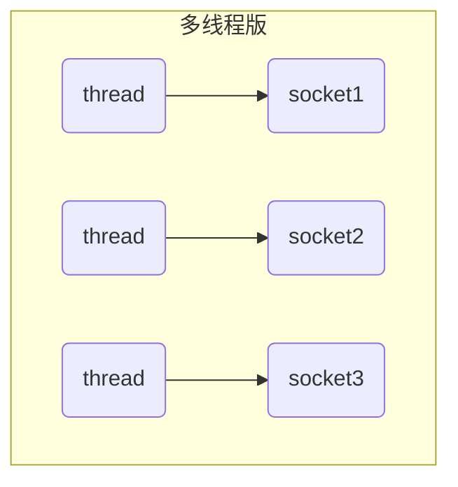
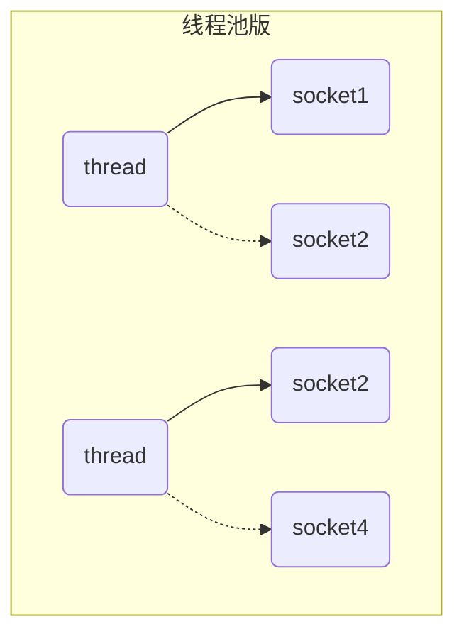
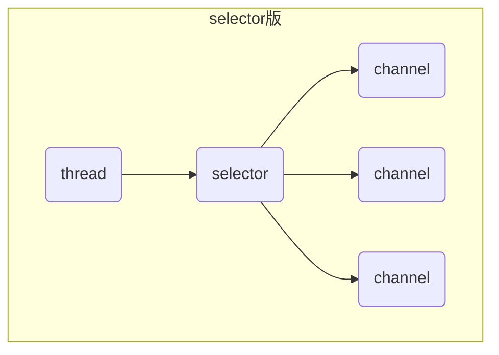

NIO: non blocking io 非阻塞IO

## Channel & Buffer

channel有一点类似于stream,它就是读写数据的双向通道，可以从channel将数据读入buffer,也可以将buffer的数据写入channel,而之前的stream要么是输入，要么是输出，channel比stream更为底层

常见的channel有：FileChannel, DatagramChannel, SocketChannel, ServerSocketChannel
buffer则用来缓冲读写数据，常见的buffer有

- ByteBuffer
  - MappedByteBuffer
  - DirectByteBuffer
  - HeapByteBuffer
- ShortBuffer, IntBuffer, LongBuffer, FloatBuffer, DoubleBuffer, CharBuffer

## Selector

selector单从字面意思不好理解，需要结合服务器的设计演化来理解它的用途

### 多线程版设计

缺点：内存占用高；线程上下文切换成本高；只适合连接线程数少的场景

### 线程池版设计

缺点：阻塞模式下，线程仅能处理一个socket连接；仅适合短连接的场景

### selector版设计

selector的作用就是配合一个线程来管理多个channel, 获取这些channel上发生的事件，这些channel工作在非阻塞模式下，不会让线程吊死在一个channel上。适合连接数特别多，但流量低的场景(low traffic)

调用 selector的select()方法会阻塞直到channel发生了读写事件，这些事件发生，select方法就会返回这些事件交给thread来处理