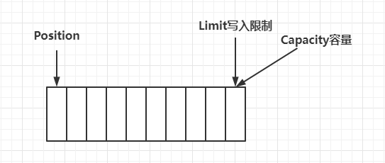
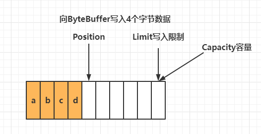
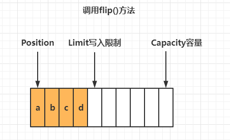
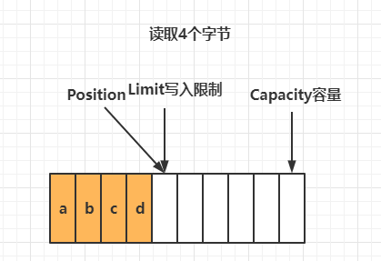
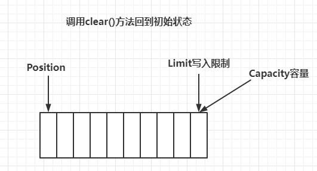
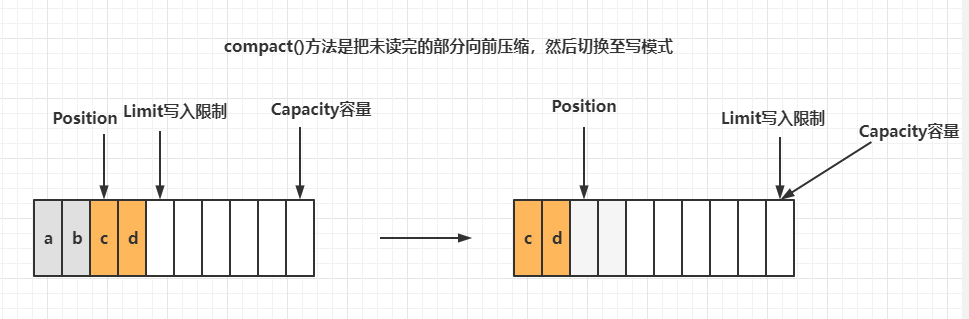

使用FileChannel来读取文件内容

```java
public class TestByteBuffer {
    public static void main(String[] args) {
        try (FileChannel channel = new FileInputStream("data.txt").getChannel()) {
            // 准备缓冲区
            ByteBuffer buffer = ByteBuffer.allocate(10);
            while (true) {
                // 从channel中读取数据，向buffer写入
                int len = channel.read(buffer);
                if (len == -1) {
                    break;
                }
                // 打印buffer的内容
                // 切换至读模式
                buffer.flip();
                while (buffer.hasRemaining()) {
                    byte b = buffer.get();
                    System.out.println((char) b);
                }
                // 切换至写模式
                buffer.clear();
            }
        } catch (IOException e) {
        }
    }
}
```

## ByteBuffer正确使用姿势

1. 向buffer写入数据，例如调用channel.read(buffer)
2. 调用flip()切换至读模式
3. 从buffer读取数据，例如调用buffer.get()
4. 调用clear()或compact()切换至写模式
5. 重复1-4步骤

## ByteBuffer结构

ByteBuffer有以下重要属性：capacity, position, limit

一开始



写模式下，position是写入位置，limit等于容量，下图表示写入了4个字节后的状态



flip动作发生后，position切换为读取模式，limit切换为读取限制



读取4个字节后



clear动作发生后，状态



compact方法，是把未读完的部分向前压缩，然后切换至写模式



## 调试工具类

```java
import io.netty.util.internal.MathUtil;
import io.netty.util.internal.StringUtil;

import java.nio.ByteBuffer;

public class ByteBufferUtil {
    private static final String NEWLINE = "\n";
    private static final char[] BYTE2CHAR = new char[256];
    private static final char[] HEXDUMP_TABLE = new char[256 * 4];
    private static final String[] HEXPADDING = new String[16];
    private static final String[] HEXDUMP_ROWPREFIXES = new String[65536 >>> 4];
    private static final String[] BYTE2HEX = new String[256];
    private static final String[] BYTEPADDING = new String[16];

    static {
        final char[] DIGITS = "0123456789abcdef".toCharArray();
        for (int i = 0; i < 256; i++) {
            HEXDUMP_TABLE[i << 1] = DIGITS[i >>> 4 & 0x0F];
            HEXDUMP_TABLE[(i << 1) + 1] = DIGITS[i & 0x0F];
        }

        int i;

        // Generate the lookup table for hex dump paddings
        for (i = 0; i < HEXPADDING.length; i++) {
            int padding = HEXPADDING.length - i;
            StringBuilder buf = new StringBuilder(padding * 3);
            for (int j = 0; j < padding; j++) {
                buf.append("   ");
            }
            HEXPADDING[i] = buf.toString();
        }

        // Generate the lookup table for the start-offset header in each row (up to 64KiB).
        for (i = 0; i < HEXDUMP_ROWPREFIXES.length; i++) {
            StringBuilder buf = new StringBuilder(12);
            buf.append(NEWLINE);
            buf.append(Long.toHexString(i << 4 & 0xFFFFFFFFL | 0x100000000L));
            buf.setCharAt(buf.length() - 9, '|');
            buf.append('|');
            HEXDUMP_ROWPREFIXES[i] = buf.toString();
        }

        // Generate the lookup table for byte-to-hex-dump conversion
        for (i = 0; i < BYTE2HEX.length; i++) {
            BYTE2HEX[i] = ' ' + StringUtil.byteToHexStringPadded(i);
        }

        // Generate the lookup table for byte dump paddings
        for (i = 0; i < BYTEPADDING.length; i++) {
            int padding = BYTEPADDING.length - i;
            StringBuilder buf = new StringBuilder(padding);
            for (int j = 0; j < padding; j++) {
                buf.append(' ');
            }
            BYTEPADDING[i] = buf.toString();
        }

        // Generate the lookup table for byte-to-char conversion
        for (i = 0; i < BYTE2CHAR.length; i++) {
            if (i <= 0x1f || i >= 0x7f) {
                BYTE2CHAR[i] = '.';
            } else {
                BYTE2CHAR[i] = (char) i;
            }
        }
    }

    /**
     * 打印所有内容
     * @param buffer
     */
    public static void debugAll(ByteBuffer buffer) {
        int oldlimit = buffer.limit();
        buffer.limit(buffer.capacity());
        StringBuilder origin = new StringBuilder(256);
        appendPrettyHexDump(origin, buffer, 0, buffer.capacity());
        System.out.println("+--------+-------------------- all ------------------------+----------------+");
        System.out.printf("position: [%d], limit: [%d]\n", buffer.position(), oldlimit);
        System.out.println(origin);
        buffer.limit(oldlimit);
    }

    /**
     * 打印可读取内容
     * @param buffer
     */
    public static void debugRead(ByteBuffer buffer) {
        StringBuilder builder = new StringBuilder(256);
        appendPrettyHexDump(builder, buffer, buffer.position(), buffer.limit() - buffer.position());
        System.out.println("+--------+-------------------- read -----------------------+----------------+");
        System.out.printf("position: [%d], limit: [%d]\n", buffer.position(), buffer.limit());
        System.out.println(builder);
    }

    private static void appendPrettyHexDump(StringBuilder dump, ByteBuffer buf, int offset, int length) {
        if (MathUtil.isOutOfBounds(offset, length, buf.capacity())) {
            throw new IndexOutOfBoundsException(
                    "expected: " + "0 <= offset(" + offset + ") <= offset + length(" + length
                            + ") <= " + "buf.capacity(" + buf.capacity() + ')');
        }
        if (length == 0) {
            return;
        }
        dump.append(
                "         +-------------------------------------------------+" +
                        NEWLINE + "         |  0  1  2  3  4  5  6  7  8  9  a  b  c  d  e  f |" +
                        NEWLINE + "+--------+-------------------------------------------------+----------------+");

        final int startIndex = offset;
        final int fullRows = length >>> 4;
        final int remainder = length & 0xF;

        // Dump the rows which have 16 bytes.
        for (int row = 0; row < fullRows; row++) {
            int rowStartIndex = (row << 4) + startIndex;

            // Per-row prefix.
            appendHexDumpRowPrefix(dump, row, rowStartIndex);

            // Hex dump
            int rowEndIndex = rowStartIndex + 16;
            for (int j = rowStartIndex; j < rowEndIndex; j++) {
                dump.append(BYTE2HEX[getUnsignedByte(buf, j)]);
            }
            dump.append(" |");

            // ASCII dump
            for (int j = rowStartIndex; j < rowEndIndex; j++) {
                dump.append(BYTE2CHAR[getUnsignedByte(buf, j)]);
            }
            dump.append('|');
        }

        // Dump the last row which has less than 16 bytes.
        if (remainder != 0) {
            int rowStartIndex = (fullRows << 4) + startIndex;
            appendHexDumpRowPrefix(dump, fullRows, rowStartIndex);

            // Hex dump
            int rowEndIndex = rowStartIndex + remainder;
            for (int j = rowStartIndex; j < rowEndIndex; j++) {
                dump.append(BYTE2HEX[getUnsignedByte(buf, j)]);
            }
            dump.append(HEXPADDING[remainder]);
            dump.append(" |");

            // Ascii dump
            for (int j = rowStartIndex; j < rowEndIndex; j++) {
                dump.append(BYTE2CHAR[getUnsignedByte(buf, j)]);
            }
            dump.append(BYTEPADDING[remainder]);
            dump.append('|');
        }

        dump.append(NEWLINE +
                "+--------+-------------------------------------------------+----------------+");
    }

    private static void appendHexDumpRowPrefix(StringBuilder dump, int row, int rowStartIndex) {
        if (row < HEXDUMP_ROWPREFIXES.length) {
            dump.append(HEXDUMP_ROWPREFIXES[row]);
        } else {
            dump.append(NEWLINE);
            dump.append(Long.toHexString(rowStartIndex & 0xFFFFFFFFL | 0x100000000L));
            dump.setCharAt(dump.length() - 9, '|');
            dump.append('|');
        }
    }

    public static short getUnsignedByte(ByteBuffer buffer, int index) {
        return (short) (buffer.get(index) & 0xFF);
    }
}
```

```java
@Slf4j
public class TestByteBufferReadWrite {
    public static void main(String[] args) {
        ByteBuffer buffer = ByteBuffer.allocate(10);
        buffer.put((byte) 0x61);
        debugAll(buffer);
        buffer.put(new byte[]{0x62, 0x63, 0x64});
        debugAll(buffer);
        // 切换读模式
        buffer.flip();
        log.debug("{}", buffer.get());
        debugAll(buffer);
        // 切换写模式
        buffer.compact();
        debugAll(buffer);
        buffer.put(new byte[]{0x65, 0x66});
        debugAll(buffer);
    }
}
```

## ByteBuffer常见方法

### 分配空间

可以使用allocate方法为ByteBuffer分配空间，其它buffer类也有该方法

```java
ByteBuffer buf = ByteBuffer.allocate(16);
```

```java
public class TestByteBufferAllocate {
    public static void main(String[] args) {
        // class java.nio.HeapByteBuffer java堆内存，读写效率较低，受到GC影响
        System.out.println(ByteBuffer.allocate(16).getClass());
        // class java.nio.DirectByteBuffer 直接内存，读写效率高（少一次拷贝），不会受GC影响，分配的效率低
        System.out.println(ByteBuffer.allocateDirect(16).getClass());
    }
}
```

### 向buffer写入数据

有两种方法

- 调用channel的read方法
- 调用buffer自己的put方法

```java
int readBytes = channel.read(buffer);
buffer.put((byte)127);
```

### 从buffer读取数据

有两种方法

- 调用channel的write方法
- 调用buffer自己的get方法

```java
int writeBytes = channel.write(buffer);
byte b = buffer.get();	
```

get方法会让position读指针向后走，如果想重复读取数据

- 可以调用rewind方法将position重置为0
- 或者调用get(int i)方法获取索引i的内容，它不会移动读指针

### mark 和 reset

mark 是在读取时，做一个标记，即使 position 改变，只要调用 reset 就能回到 mark 的位置

> **注意**
>
> rewind 和 flip 都会清除 mark 位置

```java
public class TestByteBufferRead {
    public static void main(String[] args) {
        ByteBuffer buffer = ByteBuffer.allocate(16);
        buffer.put(new byte[]{0x61, 0x62, 0x63, 0x64});
        debugAll(buffer);
        buffer.flip();
        System.out.println((char) buffer.get());
        System.out.println((char) buffer.get());
        debugAll(buffer);
        buffer.rewind();
        debugAll(buffer);
        // mark & reset
        // mark做一个标记，记录position位置，reset是将position重置到mark的位置
        System.out.println((char) buffer.get());
        System.out.println((char) buffer.get());
        // 加标记，索引2的位置
        buffer.mark();
        System.out.println((char) buffer.get());
        System.out.println((char) buffer.get());
        buffer.reset();
        System.out.println((char) buffer.get());
        System.out.println((char) buffer.get());
        // get(i)不会改变读索引的位置
        System.out.println((char) buffer.get(3));
        debugAll(buffer);
    }
}
```

### 字符串与ByteBuffer互转

```java
public class TestByteBufferString {
    public static void main(String[] args) {
        // 1. 字符串转为ByteBuffer
        ByteBuffer buffer1 = ByteBuffer.allocate(16);
        buffer1.put("hello".getBytes(StandardCharsets.UTF_8));
        debugAll(buffer1);
        // 2. Charset
        ByteBuffer buffer2 = StandardCharsets.UTF_8.encode("hello");
        debugAll(buffer2);
        // 3. wrap
        ByteBuffer buffer3 = ByteBuffer.wrap("hello".getBytes(StandardCharsets.UTF_8));
        debugAll(buffer3);

        // buffer转String
        // StandardCharsets.decode
        String string2 = StandardCharsets.UTF_8.decode(buffer2).toString();
        System.out.println(string2);
        // buffer1要切换为读模式才行
        buffer1.flip();
        System.out.println(StandardCharsets.UTF_8.decode(buffer1));
    }
}
```

## Scattering Reads

分散读取，有一个文件parts.txt

```
onetwothree
```

使用如下方式读取，可以将数据填充至多个buffer

```java
public class TestScatteringReads {
    public static void main(String[] args) {
        try (RandomAccessFile file = new RandomAccessFile("parts.txt", "rw")) {
            FileChannel channel = file.getChannel();
            ByteBuffer a = ByteBuffer.allocate(3);
            ByteBuffer b = ByteBuffer.allocate(3);
            ByteBuffer c = ByteBuffer.allocate(5);
            channel.read(new ByteBuffer[]{a, b, c});
            a.flip();
            b.flip();
            c.flip();
            debugAll(a);
            debugAll(b);
            debugAll(c);
        } catch (IOException e) {
        }
    }
}
```

## Gathering Writes

使用如下方式写入，可以将多个buffer写入一个Channel

```java
public class TestGatheringWrites {
    public static void main(String[] args) {
        ByteBuffer buffer1 = StandardCharsets.UTF_8.encode("hello");
        ByteBuffer buffer2 = StandardCharsets.UTF_8.encode("world");
        ByteBuffer buffer3 = StandardCharsets.UTF_8.encode("你好");
        try (FileChannel channel = new RandomAccessFile("words.txt", "rw").getChannel()) {
            channel.write(new ByteBuffer[]{buffer1, buffer2, buffer3});
        } catch (IOException e) {
        }
    }
}
```

## 练习

网络上有多条数据发送给服务器，数据之间使用\n进行分割，但由于某种原因这些数据在接收时，被进行了重新组合，例如原始数据有3条为

Hello, world\n

I'm zhangsan\n

How are you?\n

变成了下面的两个ByteBuffer(粘包，半包)

Hello,world\nI'm zhangsan\nHo

w are you?\n

现在编写程序，将错乱的数据恢复成原始的按\n分隔的数据

```java
public class TestByteBufferExam {
    public static void main(String[] args) {
        ByteBuffer source = ByteBuffer.allocate(32);
        source.put("Hello,world\nI'm zhangsan\nHo".getBytes(StandardCharsets.UTF_8));
        split(source);
        source.put("w are you?\n".getBytes(StandardCharsets.UTF_8));
        split(source);
    }
    private static void split(ByteBuffer source) {
        source.flip();
        for (int i = 0; i < source.limit(); i++) {
            // 找到一条完整的消息
            if (source.get(i) == '\n') {
                int length = i + 1 - source.position();
                // 把这条完整消息存入新的ByteBuffer
                ByteBuffer target = ByteBuffer.allocate(length);
                // 从source读，向target写
                for (int j = 0; j < length; j++) {
                    target.put(source.get());
                }
                debugAll(target);
            }
        }
        source.compact();
    }
}
```

