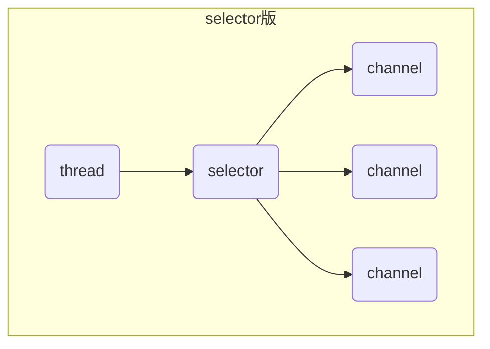
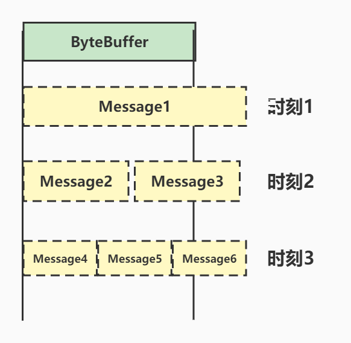
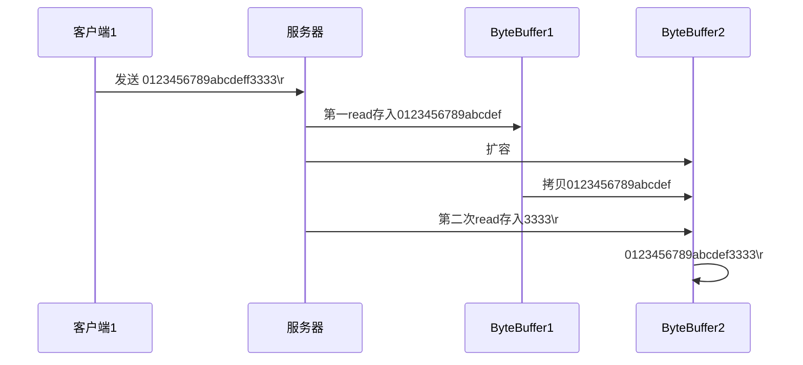

## 非阻塞 vs 阻塞

### 阻塞

- 阻塞模式下，相关方法都会导致线程暂停
  - ServerSocketChannel.accept会在没有连接建立时让线程暂停
  - SocketChannel.read会在没有数据可读时让线程暂停
  - 阻塞的表现其实就是线程暂停了，暂停期间不会占用CPU,但线程相当于闲置

- 单线程下，阻塞方法之间相互影响，几乎不能正常工作，需要多线程支持
- 但多线程下，有新的问题，体现在以下方面
  - 32位JVM一个线程320k, 64位JVM一个线程1024K, 如果连接数过多，必然导致OOM, 并且线程太多，反而会因为频繁上下文切换导致性能降低
  - 可以采用线程池技术来减少线程数和线程上下文切换，但治标不治本，如果有很多连接建立，但长时间inactive(无效)，会阻塞线程池中所有线程，因此不适合长连接，只适合短连接


```java
@Slf4j
public class Server {
    public static void main(String[] args) throws IOException {
        // 使用NIO来理解阻塞模式，单线程
        // 1. 准备ByteBuffer
        ByteBuffer buffer = ByteBuffer.allocate(16);
        // 2. 创建了服务器
        ServerSocketChannel ssc = ServerSocketChannel.open();
        // 3. 绑定监听端口
        ssc.bind(new InetSocketAddress(8080));
        // 4. 连接集合
        List<SocketChannel> channels = new ArrayList<>();
        while (true) {
            // 5. accept 建立与客户端连接，SocketChannel 用来与客户端之间通信
            log.debug("connecting...");
            SocketChannel sc = ssc.accept();
            log.debug("connected...{}", sc);
            channels.add(sc);
            for (SocketChannel channel : channels) {
                // 6. 接收客户端发送的数据
                log.debug("before read...{}", channel);
                channel.read(buffer);
                buffer.flip();
                debugAll(buffer);
                buffer.clear();
                log.debug("after read...{}", channel);
            }
        }
    }
}
public class Client {
    public static void main(String[] args) throws IOException {
        SocketChannel sc = SocketChannel.open();
        sc.connect(new InetSocketAddress("localhost", 8080));
        sc.write(StandardCharsets.UTF_8.encode("hello world"));
        System.in.read();
    }
}
```

### 非阻塞

- 非阻塞模式下，相关方法都会不会让线程暂停
  - 在ServerSocketChannel.accept在没有连接建立时，会返回null,继续运行
  - SocketChannel.read在没有数据可读时，会返回0，但线程不会阻塞，可以去执行其它SocketChannel的read或是去执行ServerSocketChannel.accpet
  - 写数据时，线程只是等待数据写入Channel即可，无需等待Channel通过网络把数据发送出去

- 但非阻塞模式下，即使没有连接建立，和可读数据，线程仍然在不断运行，白白浪费了CPU
- 数据复制过程中，线程实际还是阻塞的(AIO改进的地方)
- 以下代码如果没有客户端连接，会导致CPU一直空转

```java
@Slf4j
public class Server {
    public static void main(String[] args) throws IOException {
        // 使用NIO来理解阻塞模式，单线程
        // 1. 准备ByteBuffer
        ByteBuffer buffer = ByteBuffer.allocate(16);
        // 2. 创建了服务器
        ServerSocketChannel ssc = ServerSocketChannel.open();
        // 非阻塞模式
        ssc.configureBlocking(false);
        // 3. 绑定监听端口
        ssc.bind(new InetSocketAddress(8080));
        // 4. 连接集合
        List<SocketChannel> channels = new ArrayList<>();
        while (true) {
            // 5. accept 建立与客户端连接，SocketChannel 用来与客户端之间通信
            log.debug("connecting...");
            SocketChannel sc = ssc.accept();
            if (sc != null) {
                log.debug("connected...{}", sc);
                // 非阻塞，线程还会继续运行，如果没有连接建立，但sc会为null
                sc.configureBlocking(false);
                channels.add(sc);
            }
            for (SocketChannel channel : channels) {
                // 6. 接收客户端发送的数据
                log.debug("before read...{}", channel);
                // 非阻塞，线程仍然会继续运行，如果没有读到数据，read会返回0
                int read = channel.read(buffer);
                if (read > 0) {
                    buffer.flip();
                    debugAll(buffer);
                    buffer.clear();
                    log.debug("after read...{}", channel);
                }
            }
        }
    }
}
```

## 多路复用

线程必须配合Selector才能完成对多个Channel可读可写事件的监控，这称之为多路复用

- 多路复用仅针对网络IO, 普通文件IO没法利用多路复用
- 如果不用Selector的非阻塞模式，那么Channel读取到的字节很多时候都是0， 而Selector保证了有可读事件才去读取
  - 有可连接事件时才去连接
  - 有可读事件才去读取
  - 有可写事件才去写入
  - 限于网络传输能力，Channel未必时时可写，一旦Channel可写，会触发Selector的可写事件
- Channel输入的数据一旦准备好，会触发Selector的可读事件

## Selector



### 优点

- 一个线程配合selector就可以监控多个channel的事件，事件发生线程才去处理。避免非阻塞模式下所作无用功
- 让这个线程能够被充分利用
- 节约了线程的数量
- 减少了线程上下文切换

### 创建

```java
Selector selector = Selector.open();
```

### 绑定Channel事件

也称为注册事件，绑定的事件selector才会关心

```java
channel.configBlocking(false);
SelectioinKey key = channel.register(selector, 绑定事件);
```

- channel必须工作在非阻塞
- FileChannel没有非阻塞模式，因此不能配合selector一起使用
- 绑定的事件类型可以有
  - connect - 客户端连接成功时触发
  - accept - 服务器短成功接受连接时触发
  - read - 数据可读入时触发，有因为接收能力弱，数据暂不能读入的情况
  - write - 数据可写出时触发，有因为发送能力弱，数据暂不能写出的情况

### 监听Channel事件

可以通过下面三种方法来监听是否有事件发生，方法的返回值代表有多少channel发生了事件

- 阻塞直到绑定事件发生

```java
int count = selector.select();
```

- 阻塞直到绑定事件发生，或是超时(时间单位ms)

```java
int count = selector.select(long timeout);
```

- 不会阻塞，也就是不管有没有事件，立刻返回，自己根据返回值检索是否有事件

```java
int count = selector.selectNow();
```

> select 何时不阻塞
>
> - 事件发生时
>   - 客户端发起连接请求，会触发accept事件
>   - 客户端发送数据过来，客户端正常，异常关闭时，都会触发read事件，另外如果发送的数据大于buffer缓冲区，会触发多次读取事件
>   - channel可写，会触发write事件
>   - 在linux下nio bug发生时
> - 调用selector.wakeup();
> - 调用selector.close();
> - selector所在线程interrutpt()

### 处理accept事件

```java
@Slf4j
public class SelectorServer {
    public static void main(String[] args) throws IOException {
        //1. 创建selector, 管理多个channel
        Selector selector = Selector.open();
        ServerSocketChannel ssc = ServerSocketChannel.open();
        ssc.configureBlocking(false);
        // 2. 建立selector和channel的联系（注册）
        SelectionKey sscKey = ssc.register(selector, 0, null);
        // sscKey只关注accept事件
        sscKey.interestOps(SelectionKey.OP_ACCEPT);
        log.debug("register key: {}", sscKey);
        ssc.bind(new InetSocketAddress(8080));
        while (true) {
            // 3. select方法，没有事件发生时，线程会阻塞，有事件，线程才会恢复运行
            selector.select();
            // 4. 处理事件，selectedKeys内部包含了所有发生的事件
            Iterator<SelectionKey> iterator = selector.selectedKeys().iterator();
            while (iterator.hasNext()) {
                SelectionKey key = iterator.next();
                log.debug("key: {}", key);
                // 以下4行代码如果都注释掉的话，当客户端连接过来，会一直打印key.
                // 要么调用key.cancel()取消注册在selector上的channel,并从keys集合中删除key后续不会再监听事件
                // 要么处理当前key,二者必须存在一个
                //ServerSocketChannel channel = (ServerSocketChannel) key.channel();
                //SocketChannel sc = channel.accept();
                //log.debug("{}", sc);
                // key.cancel();
            }
        }
    }
}
```

> 事件发生后，要么处理，要么取消，不能什么都不做，否则下次该事件仍会触发(select方法里一直会有事件存在)，这时因为nio底层使用的水平触发

### 处理read事件

```java
@Slf4j
public class Server {
    public static void main(String[] args) throws IOException {
        // 1. 创建Selector,管理多个channel
        Selector selector = Selector.open();
        ServerSocketChannel ssc = ServerSocketChannel.open();
        ssc.configureBlocking(false);
        // 2. 建立selector和channel的联系（注册）
        SelectionKey sscKey = ssc.register(selector, 0, null);
        // sscKey只关注accept事件
        sscKey.interestOps(SelectionKey.OP_ACCEPT);
        log.debug("register key: {}", sscKey);
        ssc.bind(new InetSocketAddress(8080));
        while (true) {
            // 3. select方法，没有事件发生，线程阻塞，有事件，线程才会恢复运行
            // select方法在事件未处理时，他不会阻塞，事件发生后要么处理，要么取消
            selector.select();
            // 4. 处理事件，selectedKey内部包含了所有发生的事件
            Set<SelectionKey> selectedKeys = selector.selectedKeys();
            Iterator<SelectionKey> iterator = selectedKeys.iterator();
            while (iterator.hasNext()) {
                SelectionKey selectedKey = iterator.next();
                log.debug("selectionKey : {}", selectionKey);
                // 处理selectedKey时，要从selectedKeys集合中删除，否则下次处理还会进入对应的事件
                iterator.remove();
                // 5. 区分事件类型
                if (selectionKey.isAcceptable()) {
                    ServerSocketChannel channel = (ServerSocketChannel) selectionKey.channel();
                    SocketChannel sc = channel.accept();
                    sc.configureBlocking(false);
                    SelectionKey scKey = sc.register(selector, 0, null);
                    scKey.interestOps(SelectionKey.OP_READ);
                    log.debug("{}", sc);
                } else if (selectionKey.isReadable()) {
                    SocketChannel channel = (SocketChannel) selectionKey.channel();
                    ByteBuffer buffer = ByteBuffer.allocate(16);
                    channel.read(buffer);
                    buffer.flip();
                    debugRead(buffer);
                } else {
                    selectionKey.cancel();
                }
            }
        }
    }
}
```

- 为何要iterator.remove(): 因为select在事件发生后，就会将相关的key放入selectedKeys集合，但不会在处理完后从selectedKeys集合中移除，需要我们自己编码删除。如上面的例子：
  - 第一次触发了sscKey上的accept事件，没有移除sscKey
  - 第二次触发了scKey上的read事件，但这时selectedKeys中还有上次的sscKey,在处理时因为没有真正的serverSocket连上了，就会导致空指针异常
- 上述代码在客户端正常连接发送数据时是没有问题的，但是正常断开的情况下，channe.read(buffer)会返回-1，此时需要强制取消注册在selector上的SocketChannel,要不select放入依然会选择出此channel上的可读事件，但是当前连接已经断开了
- 在处理可读事件时应该catch一下异常，捕获异常后也有强制执行key.cancel方法

```java
@Slf4j
public class Server {
    public static void main(String[] args) throws IOException {
        // 1. 创建Selector,管理多个channel
        Selector selector = Selector.open();
        ServerSocketChannel ssc = ServerSocketChannel.open();
        ssc.configureBlocking(false);
        // 2. 建立selector和channel的联系（注册）
        SelectionKey sscKey = ssc.register(selector, 0, null);
        // sscKey只关注accept事件
        sscKey.interestOps(SelectionKey.OP_ACCEPT);
        log.debug("register key: {}", sscKey);
        ssc.bind(new InetSocketAddress(8080));
        while (true) {
            // 3. select方法，没有事件发生，线程阻塞，有事件，线程才会恢复运行
            // select方法在事件未处理时，他不会阻塞，事件发生后要么处理，要么取消
            selector.select();
            // 4. 处理事件，selectedKey内部包含了所有发生的事件
            Set<SelectionKey> selectionKeys = selector.selectedKeys();
            Iterator<SelectionKey> iterator = selectionKeys.iterator();
            while (iterator.hasNext()) {
                SelectionKey selectionKey = iterator.next();
                log.debug("selectionKey : {}", selectionKey);
                // 处理selectionKey时，要从selectionKeys集合中删除，否则下次处理还会进入对应的事件
                iterator.remove();
                // 5. 区分事件类型
                if (selectionKey.isAcceptable()) {
                    ServerSocketChannel channel = (ServerSocketChannel) selectionKey.channel();
                    SocketChannel sc = channel.accept();
                    sc.configureBlocking(false);
                    SelectionKey scKey = sc.register(selector, 0, null);
                    scKey.interestOps(SelectionKey.OP_READ);
                    log.debug("{}", sc);
                } else if (selectionKey.isReadable()) {
                    try {
                        SocketChannel channel = (SocketChannel) selectionKey.channel();
                        ByteBuffer buffer = ByteBuffer.allocate(16);
                        int read = channel.read(buffer);
                        // 如果在读取过程中断开连接，此时read方法的返回值是-1，
                        // 需要强制取消注册在selector上的SocketChannel,要不select方法依然会选择出此channel的可读事件，但是当前连接已经断开了
                        if (read == -1) {
                            selectionKey.cancel();
                        } else {
                            buffer.flip();
                            debugRead(buffer);
                        }
                    } catch (IOException e) {
                        e.printStackTrace();
                        selectionKey.cancel();
                    }
                } else {
                    selectionKey.cancel();
                }
            }
        }
    }
}
```

### 处理边界消息



- 一种思路是固定消息长度，数据包大小一样，服务器按长度读取，缺点是浪费带宽
- 另一种思路是按分隔符拆分、缺点是效率低
- TLV格式，即Type类型，Length长度，Value数据，类型和长度已知的情况下，就可以方便获取消息大小，分配合适的Buffer,缺点是buffer需要提前分配，如果内容过大，则影响server吞吐量
  - http 1.1是TLV格式
  - http 2.0是LTV格式



```java
@Slf4j
public class SelectorServer {
    public static void main(String[] args) throws IOException {
        //1. 创建selector, 管理多个channel
        Selector selector = Selector.open();
        ServerSocketChannel ssc = ServerSocketChannel.open();
        ssc.configureBlocking(false);
        // 2. 建立selector和channel的联系（注册）
        SelectionKey sscKey = ssc.register(selector, 0, null);
        // sscKey只关注accept事件
        sscKey.interestOps(SelectionKey.OP_ACCEPT);
        log.debug("register key: {}", sscKey);
        ssc.bind(new InetSocketAddress(8080));
        while (true) {
            // 3. select方法，没有事件发生时，线程会阻塞，有事件，线程才会恢复运行
            selector.select();
            // 4. 处理事件，selectedKeys内部包含了所有发生的事件
            Set<SelectionKey> selectionKeys = selector.selectedKeys();
            Iterator<SelectionKey> iterator = selectionKeys.iterator();
            while (iterator.hasNext()) {
                SelectionKey selectionKey = iterator.next();
                log.debug("selectionKey : {}", selectionKey);
                // 处理selectionKey时，要从selectionKeys集合中删除，否则下次处理还会进入对应的事件
                iterator.remove();
                // 5. 区分事件类型
                if (selectionKey.isAcceptable()) {
                    ServerSocketChannel channel = (ServerSocketChannel) selectionKey.channel();
                    SocketChannel sc = channel.accept();
                    sc.configureBlocking(false);
                    ByteBuffer buffer = ByteBuffer.allocate(16);
                    // 将一个ByteBuffer作为附件关联到selectionKey上
                    SelectionKey scKey = sc.register(selector, 0, buffer);
                    scKey.interestOps(SelectionKey.OP_READ);
                    log.debug("{}", sc);
                } else if (selectionKey.isReadable()) {
                    try {
                        SocketChannel channel = (SocketChannel) selectionKey.channel();
                        // 获取selectionKey上关联的附件
                        ByteBuffer buffer = (ByteBuffer) selectionKey.attachment();
                        int read = channel.read(buffer);
                        // 如果在读取过程中断开连接，此时read方法的返回值是-1，
                        // 需要强制取消注册在selector上的SocketChannel,要不select方法依然会选择出此channel的可读事件，但是当前连接已经断开了
                        if (read == -1) {
                            selectionKey.cancel();
                        } else {
                            split(buffer);
                            if (buffer.position() == buffer.limit()) {
                                ByteBuffer newBuffer = ByteBuffer.allocate(buffer.capacity() * 2);
                                buffer.flip();
                                newBuffer.put(buffer);
                                selectionKey.attach(newBuffer);
                            }
                        }
                    } catch (IOException e) {
                        e.printStackTrace();
                        selectionKey.cancel();
                    }
                } else {
                    selectionKey.cancel();
                }
            }
        }
    }
    private static void split(ByteBuffer source) {
        source.flip();
        for (int i = 0; i < source.limit(); i++) {
            // 找到一条完整的消息
            if (source.get(i) == '\n') {
                int length = i + 1 - source.position();
                // 把这条完整消息存入新的ByteBuffer
                ByteBuffer target = ByteBuffer.allocate(length);
                // 从source读，向target写
                for (int j = 0; j < length; j++) {
                    target.put(source.get());
                }
                debugAll(target);
            }
        }
        source.compact();
    }
}
@Slf4j
public class Client {
    public static void main(String[] args) throws IOException {
        SocketChannel sc = SocketChannel.open();
        sc.connect(new InetSocketAddress("localhost", 8080));
        log.debug("{}", sc);
        sc.write(StandardCharsets.UTF_8.encode("0123456789333abcdef666\n"));
        System.in.read();
    }
}
```

### ByteBuffer大小分配

- 每个channel都需要记录可能被切分的消息，因为ByteBuffer不能被多个channel共同使用，因此需要为每个channel维护一个独立的ByteBuffer
- ByteBuffer不能太大，比如一个ByteBuffer 1MB的话，要支持百万连接就要1TB内存，因此需要设计大小可变的ByteBuffer
  - 一种思路是首先分配一个较小的buffer，比如4k,如果发现数据不够，再分配8k的buffer,将4k buffer内容拷贝至8k buffer,优点是消息连续容易处理，缺点是数据拷贝耗费性能
  - 另一种思路用多个数组组成的buffer,一个数组不够，把多出来的内容写入新的数组，与前面的区别是消息存储不连续解析复杂，优点是避免了拷贝引起的性能损耗

### 处理write事件

一次无法写完的例子

```java
@Slf4j
public class WriteServer {
    public static void main(String[] args) throws IOException {
        Selector selector = Selector.open();
        ServerSocketChannel ssc = ServerSocketChannel.open();
        ssc.configureBlocking(false);
        SelectionKey selectionKey = ssc.register(selector, 0, null);
        selectionKey.interestOps(SelectionKey.OP_ACCEPT);
        ssc.bind(new InetSocketAddress(8080));
        while (true) {
            selector.select();
            Iterator<SelectionKey> iterator = selector.selectedKeys().iterator();
            while (iterator.hasNext()) {
                SelectionKey key = iterator.next();
                iterator.remove();
                if (key.isAcceptable()) {
                    SocketChannel sc = ssc.accept();
                    sc.configureBlocking(false);
                    // 1. 向客户端发送大量数据
                    StringBuilder sb = new StringBuilder();
                    for (int i = 0; i < 8000000; i++) {
                        sb.append("a");
                    }
                    ByteBuffer buffer = Charset.defaultCharset().encode(sb.toString());
                    while (buffer.hasRemaining()) {
                        // 2. 返回值代表实际写入的字节数
                        int write = sc.write(buffer);
                        log.debug("write count: {}", write);
                    }
                }
            }
        }
    }
}
@Slf4j
public class WriteClient {
    public static void main(String[] args) throws IOException  {
        SocketChannel sc = SocketChannel.open();
        sc.connect(new InetSocketAddress("localhost", 8080));
        int count = 0;
        while (true) {
            ByteBuffer buffer = ByteBuffer.allocate(1024 * 1024);
            count += sc.read(buffer);
            log.debug("count: {}", count);
            buffer.clear();
        }
    }
}
```

服务器端打印结果

```java
15:44:48.549 [main] DEBUG com.bytebuf.nio.WriteServer - write count: 2621420
15:44:48.564 [main] DEBUG com.bytebuf.nio.WriteServer - write count: 2490349
15:44:48.564 [main] DEBUG com.bytebuf.nio.WriteServer - write count: 0
15:44:48.564 [main] DEBUG com.bytebuf.nio.WriteServer - write count: 0
15:44:48.564 [main] DEBUG com.bytebuf.nio.WriteServer - write count: 0
15:44:48.564 [main] DEBUG com.bytebuf.nio.WriteServer - write count: 0
15:44:48.564 [main] DEBUG com.bytebuf.nio.WriteServer - write count: 0
15:44:48.564 [main] DEBUG com.bytebuf.nio.WriteServer - write count: 0
15:44:48.564 [main] DEBUG com.bytebuf.nio.WriteServer - write count: 0
15:44:48.564 [main] DEBUG com.bytebuf.nio.WriteServer - write count: 0
15:44:48.564 [main] DEBUG com.bytebuf.nio.WriteServer - write count: 0
15:44:48.564 [main] DEBUG com.bytebuf.nio.WriteServer - write count: 2888231

```

从结果上看服务器不是一次将结果全部写给客户端，是根据tcp发送缓冲区的大小来决定的，如果发送缓冲区没有发送完毕，服务器端每次会发送0个字节，表明没有发送出去，下次还得接着发，这就造成了cpu浪费，一直等到tcp发送缓冲区有空闲时才能发送

- 非阻塞模式下，无法保证把buffer中所有数据都写入channel,因此要追踪write方法的返回值（代表实际写入字节数）
- 用selector监听所有channel的可写事件，每个channel都需要一个key来追踪buffer，但这样又会导致占用内存过多，就有两阶段策略
  - 当消息处理器第一次写入消息时，才将channel注册到selector上
  - selector检查channel上的可写事件，如果所有的数据写完了，就取消channel的注册
  - 如果不取消，会每次可写均会触发write事件

```java
@Slf4j
public class WriteServer {
    public static void main(String[] args) throws IOException {
        Selector selector = Selector.open();
        ServerSocketChannel ssc = ServerSocketChannel.open();
        ssc.configureBlocking(false);
        SelectionKey selectionKey = ssc.register(selector, 0, null);
        selectionKey.interestOps(SelectionKey.OP_ACCEPT);
        ssc.bind(new InetSocketAddress(8080));
        while (true) {
            selector.select();
            Iterator<SelectionKey> iterator = selector.selectedKeys().iterator();
            while (iterator.hasNext()) {
                SelectionKey key = iterator.next();
                iterator.remove();
                if (key.isAcceptable()) {
                    SocketChannel sc = ssc.accept();
                    sc.configureBlocking(false);
                    SelectionKey scKey = sc.register(selector, SelectionKey.OP_READ);
                    // 1. 向客户端发送大量数据
                    StringBuilder sb = new StringBuilder();
                    for (int i = 0; i < 8000000; i++) {
                        sb.append("a");
                    }
                    ByteBuffer buffer = Charset.defaultCharset().encode(sb.toString());
                    // 2. 返回值代表实际写入的字节数
                    int write = sc.write(buffer);
                    log.debug("write count: {}", write);
                    // 3. 判断是否有剩余内容
                    if (buffer.hasRemaining()) {
                        // 4. 关注可写事件
                        scKey.interestOps(scKey.interestOps() + SelectionKey.OP_WRITE);
                        // 5 把未写完的数据挂到scKey上
                        scKey.attach(buffer);
                    }
                } else if (key.isWritable()) {
                    ByteBuffer buffer = (ByteBuffer) key.attachment();
                    SocketChannel sc = (SocketChannel) key.channel();
                    int write = sc.write(buffer);
                    log.debug("write count: {}", write);
                    // 6. 清理操作
                    if (!buffer.hasRemaining()) {
                        key.attach(null);
                        key.interestOps(key.interestOps() - SelectionKey.OP_WRITE);
                    }
                }
            }
        }
    }
}
```

打印结果

```
15:58:34.181 [main] DEBUG com.bytebuf.nio.WriteServer - write count: 2621420
15:58:34.196 [main] DEBUG com.bytebuf.nio.WriteServer - write count: 2490349
15:58:34.196 [main] DEBUG com.bytebuf.nio.WriteServer - write count: 2888231
```

### 多线程优化

> 现在都是多核cpu,设计时要充分考虑到别让cpu被白白浪费

前面的代码只有一个选择器，没有充分利用多核cpu,如何改进？

分两组选择器

- 单线程配一个选择器，专门处理accept事件
- 创建cpu核心数的线程，每个线程配一个选择器，轮流处理read事件

```java
@Slf4j
public class MultiThreadServer {
    public static void main(String[] args) throws IOException {
        Thread.currentThread().setName("boss");
        ServerSocketChannel ssc = ServerSocketChannel.open();
        ssc.configureBlocking(false);
        Selector boss = Selector.open();
        SelectionKey bossKey = ssc.register(boss, 0, null);
        bossKey.interestOps(SelectionKey.OP_ACCEPT);
        ssc.bind(new InetSocketAddress(8080));
        // 1. 创建固定数量的worker并进行初始化
        Worker[] workers = new Worker[2];
        for (int i = 0; i < workers.length; i++) {
            workers[i] = new Worker("worker-" + i);
        }
        AtomicInteger index = new AtomicInteger();
        while (true) {
            boss.select();
            Iterator<SelectionKey> iterator = boss.selectedKeys().iterator();
            while (iterator.hasNext()) {
                SelectionKey key = iterator.next();
                iterator.remove();
                if (key.isAcceptable()) {
                    SocketChannel sc = ssc.accept();
                    sc.configureBlocking(false);
                    log.debug("connected...{}", sc.getRemoteAddress());
                    // 2. 关联selector
                    log.debug("before register...{}", sc.getRemoteAddress());
                    workers[index.getAndIncrement() % workers.length].register(sc);
                    log.debug("after register...{}", sc.getRemoteAddress());
                }
            }
        }
    }
    static class Worker implements Runnable {
        private Thread thread;
        private Selector selector;
        private String name;
        private volatile boolean start = false;
        public Worker(String name) {
            this.name = name;
        }
        public void register(SocketChannel sc) throws IOException {
            if (!start) {
                selector = Selector.open();
                thread = new Thread(this, name);
                thread.start();
                start = true;
            }
            // 唤醒select方法
            selector.wakeup();
            sc.register(selector, SelectionKey.OP_READ, null);;
        }
        @Override
        public void run() {
            while (true) {
                try {
                    selector.select(); // worker-0 阻塞， wakeup
                    Iterator<SelectionKey> iterator = selector.selectedKeys().iterator();
                    while (iterator.hasNext()) {
                        SelectionKey key = iterator.next();
                        iterator.remove();
                        if (key.isReadable()) {
                            ByteBuffer buffer = ByteBuffer.allocate(16);
                            SocketChannel sc = (SocketChannel) key.channel();
                            int read = sc.read(buffer);
                            if (read == -1) {
                                key.cancel();
                                sc.close();
                            } else {
                                buffer.flip();
                                debugRead(buffer);
                            }
                        }
                    }
                } catch (IOException e) {
                    e.printStackTrace();
                }
            }
        }
    }
}
```

> 如何拿到CPU个数
>
> - Runtime.getRuntime().availableProcessors()如果工作在docker容器下，因为容器不是物理隔离的，会拿到物理cpu个数，而不是容器申请的个数
> - 这个问题直到jdk10才修复，使用jvm参数UseContainerSupport配置，默认开启

## UDP

- UDP是无连接的，client发送数据不会管server是否开启
- server这边的receive方法会将接收到的数据存入ByteBuffer,但如果数据报文超过buffer大小，多出来的数据会被默认丢弃

```java
@Slf4j
public class UdpServer {
    public static void main(String[] args) throws IOException {
        DatagramChannel channel = DatagramChannel.open();
        DatagramSocket socket = channel.socket();
        socket.bind(new InetSocketAddress(9999));
        ByteBuffer buffer = ByteBuffer.allocate(16);
        log.debug("waiting...");
        SocketAddress receive = channel.receive(buffer);
        log.debug("{}", receive);
        buffer.flip();
        debugRead(buffer);
    }
}
@Slf4j
public class UdpClient {
    public static void main(String[] args) throws IOException {
        DatagramChannel channel = DatagramChannel.open();
        ByteBuffer buffer = StandardCharsets.UTF_8.encode("hello");
        channel.send(buffer, new InetSocketAddress("localhost", 9999));
    }
}
```

