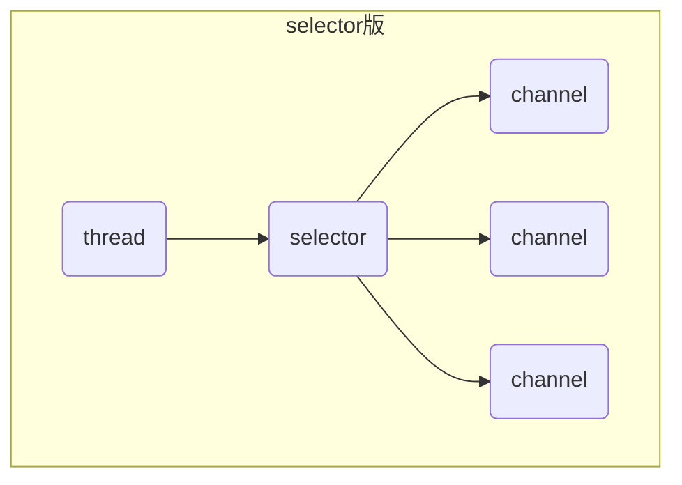

## 非阻塞 vs 阻塞

### 阻塞

- 阻塞模式下，相关方法都会导致线程暂停
  - ServerSocketChannel.accept会在没有连接建立时让线程暂停
  - SocketChannel.read会在没有数据可读时让线程暂停
  - 阻塞的表现其实就是线程暂停了，暂停期间不会占用CPU,但线程相当于闲置

- 单线程下，阻塞方法之间相互影响，几乎不能正常工作，需要多线程支持
- 但多线程下，有新的问题，体现在以下方面
  - 32位JVM一个线程320k, 64位JVM一个线程1024K, 如果连接数过多，必然导致OOM, 并且线程太多，反而会因为频繁上下文切换导致性能降低
  - 可以采用线程池技术来减少线程数和线程上下文切换，但治标不治本，如果有很多连接建立，但长时间inactive(无效)，会阻塞线程池中所有线程，因此不适合长连接，只适合短连接


```java
@Slf4j
public class Server {
    public static void main(String[] args) throws IOException {
        // 使用NIO来理解阻塞模式，单线程
        // 1. 准备ByteBuffer
        ByteBuffer buffer = ByteBuffer.allocate(16);
        // 2. 创建了服务器
        ServerSocketChannel ssc = ServerSocketChannel.open();
        // 3. 绑定监听端口
        ssc.bind(new InetSocketAddress(8080));
        // 4. 连接集合
        List<SocketChannel> channels = new ArrayList<>();
        while (true) {
            // 5. accept 建立与客户端连接，SocketChannel 用来与客户端之间通信
            log.debug("connecting...");
            SocketChannel sc = ssc.accept();
            log.debug("connected...{}", sc);
            channels.add(sc);
            for (SocketChannel channel : channels) {
                // 6. 接收客户端发送的数据
                log.debug("before read...{}", channel);
                channel.read(buffer);
                buffer.flip();
                debugAll(buffer);
                buffer.clear();
                log.debug("after read...{}", channel);
            }
        }
    }
}
public class Client {
    public static void main(String[] args) throws IOException {
        SocketChannel sc = SocketChannel.open();
        sc.connect(new InetSocketAddress("localhost", 8080));
        sc.write(StandardCharsets.UTF_8.encode("hello world"));
        System.in.read();
    }
}
```

### 非阻塞

- 非阻塞模式下，相关方法都会不会让线程暂停
  - 在ServerSocketChannel.accept在没有连接建立时，会返回null,继续运行
  - SocketChannel.read在没有数据可读时，会返回0，但线程不会阻塞，可以去执行其它SocketChannel的read或是去执行ServerSocketChannel.accpet
  - 写数据时，线程只是等待数据写入Channel即可，无需等待Channel通过网络把数据发送出去

- 但非阻塞模式下，即使没有连接建立，和可读数据，线程仍然在不断运行，白白浪费了CPU
- 数据复制过程中，线程实际还是阻塞的(AIO改进的地方)
- 以下代码如果没有客户端连接，会导致CPU一直空转

```java
@Slf4j
public class Server {
    public static void main(String[] args) throws IOException {
        // 使用NIO来理解阻塞模式，单线程
        // 1. 准备ByteBuffer
        ByteBuffer buffer = ByteBuffer.allocate(16);
        // 2. 创建了服务器
        ServerSocketChannel ssc = ServerSocketChannel.open();
        // 非阻塞模式
        ssc.configureBlocking(false);
        // 3. 绑定监听端口
        ssc.bind(new InetSocketAddress(8080));
        // 4. 连接集合
        List<SocketChannel> channels = new ArrayList<>();
        while (true) {
            // 5. accept 建立与客户端连接，SocketChannel 用来与客户端之间通信
            log.debug("connecting...");
            SocketChannel sc = ssc.accept();
            if (sc != null) {
                log.debug("connected...{}", sc);
                // 非阻塞，线程还会继续运行，如果没有连接建立，但sc会为null
                sc.configureBlocking(false);
                channels.add(sc);
            }
            for (SocketChannel channel : channels) {
                // 6. 接收客户端发送的数据
                log.debug("before read...{}", channel);
                // 非阻塞，线程仍然会继续运行，如果没有读到数据，read会返回0
                int read = channel.read(buffer);
                if (read > 0) {
                    buffer.flip();
                    debugAll(buffer);
                    buffer.clear();
                    log.debug("after read...{}", channel);
                }
            }
        }
    }
}
```

## 多路复用

线程必须配合Selector才能完成对多个Channel可读可写事件的监控，这称之为多路复用

- 多路复用仅针对网络IO, 普通文件IO没法利用多路复用
- 如果不用Selector的非阻塞模式，那么Channel读取到的字节很多时候都是0， 而Selector保证了有可读事件才去读取
  - 有可连接事件时才去连接
  - 有可读事件才去读取
  - 有可写事件才去写入
  - 限于网络传输能力，Channel未必时时可写，一旦Channel可写，会触发Selector的可写事件
- Channel输入的数据一旦准备好，会触发Selector的可读事件

## Selector



### 优点

- 一个线程配合selector就可以监控多个channel的事件，事件发生线程才去处理。避免非阻塞模式下所作无用功
- 让这个线程能够被充分利用
- 节约了线程的数量
- 减少了线程上下文切换

### 创建

```java
Selector selector = Selector.open();
```

### 绑定Channel事件

也称为注册事件，绑定的事件selector才会关心

```java
channel.configBlocking(false);
SelectioinKey key = channel.register(selector, 绑定事件);
```

- channel必须工作在非阻塞
- FileChannel没有非阻塞模式，因此不能配合selector一起使用
- 绑定的事件类型可以有
  - connect - 客户端连接成功时触发
  - accept - 服务器短成功接受连接时触发
  - read - 数据可读入时触发，有因为接收能力弱，数据暂不能读入的情况
  - write - 数据可写出时触发，有因为发送能力弱，数据暂不能写出的情况

### 监听Channel事件

可以通过下面三种方法来监听是否有事件发生，方法的返回值代表有多少channel发生了事件

- 阻塞直到绑定事件发生

```java
int count = selector.select();
```

- 阻塞直到绑定事件发生，或是超时(时间单位ms)

```java
int count = selector.select(long timeout);
```

- 不会阻塞，也就是不管有没有事件，立刻返回，自己根据返回值检索是否有事件

```java
int count = selector.selectNow();
```

> select 何时不阻塞
>
> - 事件发生时
>   - 客户端发起连接请求，会触发accept事件
>   - 客户端发送数据过来，客户端正常，异常关闭时，都会触发read事件，另外如果发送的数据大于buffer缓冲区，会触发多次读取事件
>   - channel可写，会触发write事件
>   - 在linux下nio bug发生时
> - 调用selector.wakeup();
> - 调用selector.close();
> - selector所在线程interrutpt()

### 处理accept事件

```java
@Slf4j
public class SelectorServer {
    public static void main(String[] args) throws IOException {
        //1. 创建selector, 管理多个channel
        Selector selector = Selector.open();
        ServerSocketChannel ssc = ServerSocketChannel.open();
        ssc.configureBlocking(false);
        // 2. 建立selector和channel的联系（注册）
        SelectionKey sscKey = ssc.register(selector, 0, null);
        // sscKey只关注accept事件
        sscKey.interestOps(SelectionKey.OP_ACCEPT);
        log.debug("register key: {}", sscKey);
        ssc.bind(new InetSocketAddress(8080));
        while (true) {
            // 3. select方法，没有事件发生时，线程会阻塞，有事件，线程才会恢复运行
            selector.select();
            // 4. 处理事件，selectedKeys内部包含了所有发生的事件
            Iterator<SelectionKey> iterator = selector.selectedKeys().iterator();
            while (iterator.hasNext()) {
                SelectionKey key = iterator.next();
                log.debug("key: {}", key);
                // 以下4行代码如果都注释掉的话，当客户端连接过来，会一直打印key.
                // 要么调用key.cancel()取消注册在selector上的channel,并从keys集合中删除key后续不会再监听事件
                // 要么处理当前key,二者必须存在一个
                //ServerSocketChannel channel = (ServerSocketChannel) key.channel();
                //SocketChannel sc = channel.accept();
                //log.debug("{}", sc);
                // key.cancel();
            }
        }
    }
}
```

> 事件发生后，要么处理，要么取消，不能什么都不做，否则下次该事件仍会触发，这时因为nio底层使用的水平触发
