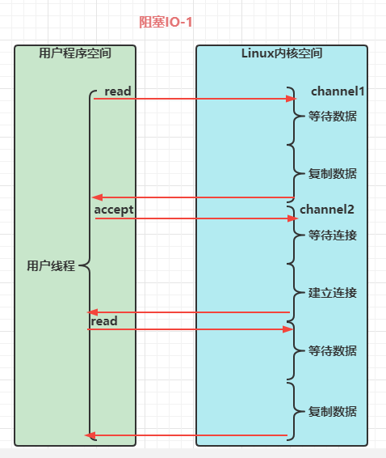

## stream vs channel

- stream 不会自动缓冲数据，channel会利用系统提供的发送缓冲区，接收缓冲区（更为底层）
- stream仅支持阻塞API,channel同时支持阻塞，非阻塞API,网络channel可配合selector实现多路复用
- 二者均为全双工，即读写可以同时进行

## IO模型

同步阻塞，同步非阻塞，异步阻塞（没有此种情况），异步非阻塞

- 同步：线程自己去获取结果（一个线程）
- 异步：线程自己不去获取结果，而是由其它线程送结果（至少两个线程）

当调用一次channel.read或stream.read后，会切换至操作系统内核态来完成真正数据读取，而读取又分为两个阶段，分别为

- 等待数据阶段
- 复制数据阶段

### 阻塞IO


### 非阻塞IO


### 多路复用


### 信号驱动

### 异步IO


### 阻塞IO vs 多路复用




## 零拷贝

### 传统IO问题

传统的IO将一个文件通过socket写出

```java
File f = new File("data.txt");
RandomAccessFile file = new RandomAccessFile(f, "r");
byte[] buf = new byte[(int)f.length()];
file.read(buf);
Socket socket = ...;
socket.getOutputStream().write(buf);
```

内部工作流程是这样的：


1. Java本身并不具备IO读写能力，因此read方法调用后，要从java程序的用户态切换至内核态，去调用操作系统(Kernel)的读能力，将数据读入内核缓冲区。这期间用户线程阻塞，操作系统使用DMA(Direct Memory Access)来实现文件读，期间也不会使用CPU

   > DMA也可以理解为硬件单元，用来解放CPU完成文件IO

2. 从内核态切换回用户态，将数据从内核缓冲区读入用户缓冲区（即byte[] buf），这期间CPU会参与拷贝，无法利用DMA

3. 调用write方法，这时将数据从用户缓冲区(byte[] buf)写入socket缓冲区，CPU会参与拷贝

4. 接下来要向网卡写数据，这项能力java又不具备，因此又得从用户态切换至内核态，调用操作系统的写能力，使用DMA将socket缓冲区的数据写入网卡，不会使用CPU

可以看到中间环节较多，Java的IO实际不是物理设备级别的读写，而是缓冲的复制，底层的真正读写时操作系统来完成的

- 用户态与内核态的切换发生了3此，这个操作比较重量级
- 数据拷贝了4次

### NIO优化

通过DirectByteBuffer

- ByteBuffer.allocate(10) HeapByteBuffer使用的还是java内存
- ByteBuffer.allocateDirect(10) DirectByteBuffer使用的是操作系统内存


大部分步骤与优化前相同，不再赘述。唯有一点：java可以使用DirectByteBuffer将堆外内存映射到jvm内存中来直接访问使用

- 这块内存不受JVM垃圾回收的影响，因此内存地址固定，有助于IO读写
- java中的DirectByteBuffer对象仅维护了此内存的虚引用，内存回收分成两步
  - DirectByteBuffer对象被垃圾回收，将虚引用加入引用队列
  - 通过专门线程访问引用队列，根据虚引用释放堆外内存
- 减少一次数据拷贝，用户态与内核态的切换次数没有减少

### Linux2.1 sendFile

进一步优化（底层采用了linux 2.1后提供的sendFile方法），java中对应着两个channel调用transferTo/transferFrom方法拷贝数据


1. Java调用transferTo方法后，要从Java程序的用户态切换至内核态，使用DMA将数据读入内核缓冲区，不会使用CPU
2. 数据从内核缓冲区传输到socket缓冲区，CPU会参与拷贝
3. 最后使用DMA将socket缓冲区的数据写入网卡，不会使用CPU

可以看到

- 只发生了一次用户态与内核态的切换
- 数据拷贝发生了3次

### Linux2.4进一步优化 （零拷贝）


1. java调用transferTo方法后，要从java程序的用户态切换至内核态，使用DMA将数据读入内核缓冲区，不会使用CPU
2. 只会将一些offset核length信息拷入socket缓冲区，几乎无性能消耗
3. 使用DMA将内核缓冲区的数据写入网卡，不会使用CPU

整个过程只发生了一次用户态与内核态的切换，数据拷贝了2次。所谓的【零拷贝】，并不是真正无拷贝，而是在不会拷贝重复数据到JVM内存中，零拷贝的优点有

- 更少的用户态与内核态的切换
- 不利用CPU计算，减少CPU缓冲伪共享
- 零拷贝适合小文件传输