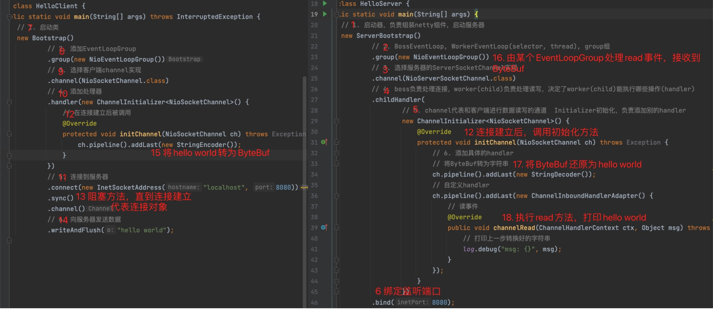

## 概述

### Netty是什么

```
Netty is an asynchronous event driven network application framework for rapid development of maintainable high performance protocol server & clients
```

Netty是一个异步的，基于事件驱动的网络应用程序框架，用于快速开发可维护，高性能的网络服务器和客户端

### Netty的地位

Netty在Java网络应用框架中的地位就好比：Spring框架在JavaEE开发中的地位

以下框架都使用了Netty，因为它们有网络通信需求

- Cassandra - nosql数据库
- Spark - 大数据分布式计算框架
- Hadoop - 大数据分布式存储框架
- RocketMQ - ali开源的消息队列
- ElasticSearch - 搜索引擎
- gRPC - rpc框架
- Dubbo - rpc框架
- Spring 5.x - flux api框架完全抛弃了Tomcat, 使用Netty作为服务器端
- Zookeeper - 分布式协调框架

### Netty优势

- Netty vs NIO, 工作量大，bug多
  - 需要自己构建协议
  - 解决TCP传输问题，如粘包，半包
  - epoll空轮询导致CPU 100%
  - 对API进行增强，使之更易用，如FastThreadLocal => ThreadLocal, ByteBuf => ByteBuffer
- Netty vs其它网络应用框架
  - Mina由Apache维护，将来3.x版本可能会有较大重构，破坏API不兼容性，Netty的开发迭代更迅速，API更简洁，文档更优秀
  - 久经考验
    - 2.x 2004
    - 3.x 2008
    - 4.x 2013
    - 5.x 已废弃（没有明显性能提升，维护成本高）

## Hello World

### 目标

开发一个简单的服务器端和客户端

- 客户端向服务器发送hell world
- 服务器仅接收，不返回

加入依赖

```xml
<dependency>
    <groupId>io.netty</groupId>
    <artifactId>netty-all</artifactId>
    <version>4.1.42.Final</version>
</dependency>
```

服务器端

```java
@Slf4j
public class HelloServer {
    public static void main(String[] args) {
        // 1. 启动器，负责组装netty组件，启动服务器
        new ServerBootstrap()
                // 2. BossEventLoop, WorkerEventLoop(selector, thread), group组
                .group(new NioEventLoopGroup())
                // 3. 选择服务器的ServerSocketChannel实现
                .channel(NioServerSocketChannel.class)
                // 4. boss负责处理连接，worker(child)负责处理读写，决定了worker(child)能执行哪些操作(handler)
                .childHandler(
                        // 5. channel代表和客户端进行数据读写的通道  Initializer初始化，负责添加别的handler
                        new ChannelInitializer<NioSocketChannel>() {
                            @Override
                            protected void initChannel(NioSocketChannel ch) throws Exception {
                                // 6. 添加具体的handler
                                // 将ByteBuf转为字符串
                                ch.pipeline().addLast(new StringDecoder());
                                // 自定义handler
                                ch.pipeline().addLast(new ChannelInboundHandlerAdapter() {
                                    // 读事件
                                    @Override
                                    public void channelRead(ChannelHandlerContext ctx, Object msg) throws Exception {
                                        // 打印上一步转换好的字符串
                                        log.debug("msg: {}", msg);
                                    }
                                });
                            }
                        })
                .bind(8080);
    }
}
```

客户端

```java
@Slf4j
public class HelloClient {
    public static void main(String[] args) throws InterruptedException {
        // 1. 启动类
        new Bootstrap()
                // 2. 添加EventLoopGroup
                .group(new NioEventLoopGroup())
                // 3. 选择客户端channel实现
                .channel(NioSocketChannel.class)
                // 4. 添加处理器
                .handler(new ChannelInitializer<NioSocketChannel>() {
                    // 在连接建立后被调用
                    @Override
                    protected void initChannel(NioSocketChannel ch) throws Exception {
                        ch.pipeline().addLast(new StringEncoder());
                    }
                })
                // 5. 连接到服务器
                .connect(new InetSocketAddress("localhost", 8080))
                .sync()
                .channel()
                // 6. 向服务器发送数据
                .writeAndFlush("hello world");
    }
}
```

### 执行流程



- 把channel理解为数据的通道
- 把msg理解为流动的数据，最开始输入是ByteBuf, 但经过pipeline的加工，会变成其他类型对象，最后输出又变成ByteBuf
- 把handler理解为数据的处理工序
  - 工序有多道，合在一起就是pipeline, pipeline负责发布事件（读，读取完成。。。）传播给每个handler, handler对自己感兴趣的事件进行处理（重写了相应事件处理方法）
  - handler又分为Inbound和Outbound两类
- 把eventLoop理解为处理数据的工人
  - 工人可以管理多个channel的io操作，并且一旦工人负责了某个channel,就要负责到底（绑定）
  - 工人既可以执行io操作，也可以进行任务处理，每位工人有任务队列，队列里可以堆放多个channel的待处理任务，任务分为普通任务，定时任务
  - 工人按照pipeline顺序，依次按照handler的规划（代码）处理任务，可以为每道工序指定不同的工人
