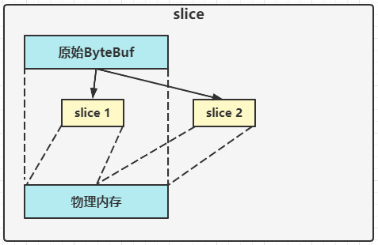
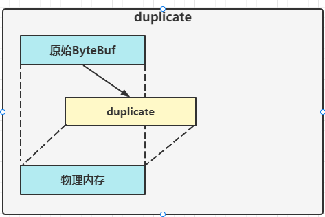

ByteBuf是对字节数据的封装，扩展了NIO中ByteBuffer的功能

## 创建

```java
ByteBuf buffer = ByteBufAllocator.DEFAULT.buffer(10);
log(buffer);
```

上面代码创建了一个默认的ByteBuf(池化基于直接内存的ByteBuf),初始容量10

输出

```
read index:0 write index:0 capacity:10
```

```java
public class TestByteBuf {
    public static void main(String[] args) {
        ByteBuf buf = ByteBufAllocator.DEFAULT.buffer(10);
        log(buf);
        StringBuilder sb = new StringBuilder();
        for (int i = 0; i < 20; i++) {
            sb.append("a");
        }
        buf.writeBytes(sb.toString().getBytes());
        log(buf);
    }
    private static void log(ByteBuf buffer) {
        int length = buffer.readableBytes();
        int rows = length / 16 + (length % 15 == 0 ? 0 : 1) + 4;
        StringBuilder buf = new StringBuilder(rows * 80 * 2)
                .append("read index:").append(buffer.readerIndex())
                .append(" write index:").append(buffer.writerIndex())
                .append(" capacity:").append(buffer.capacity())
                .append(NEWLINE);
        appendPrettyHexDump(buf, buffer);
        System.out.println(buf);
    }
}
```

输出

```
read index:0 write index:0 capacity:10

read index:0 write index:20 capacity:64
         +-------------------------------------------------+
         |  0  1  2  3  4  5  6  7  8  9  a  b  c  d  e  f |
+--------+-------------------------------------------------+----------------+
|00000000| 61 61 61 61 61 61 61 61 61 61 61 61 61 61 61 61 |aaaaaaaaaaaaaaaa|
|00000010| 61 61 61 61                                     |aaaa            |
+--------+-------------------------------------------------+----------------+
```

## 直接内存 VS 堆内存

可以使用下面的代码来创建池化基于堆的ByteBuf]

```java
ByteBuf buffer = ByteBufAllocator.DEFAULT.heapBuffer(10);
```

也可以使用下面的代码来创建池化基于直接内存的ByteBuf

```java
ByteBuf buffer = ByteBufAllocator.DEFAULT.directBuffer(10);
```

- 直接内存创建和销毁的代价昂贵，但读写性能高（少一次内存复制），适合配合池化功能一起用
- 直接内存堆GC压力小，因为这部分内存不受JVM垃圾回收的管理，但也要注意及时主动释放

## 池化 vs 非池化

池化的最大意义在于可以重用ByteBuf,优点有

- 没有池化，则每次都得创建新的ByteBuf实例，这个操作对直接内存代价昂贵，就算是堆内存，也会增加GC压力
- 有了池化，则可以重用池中ByteBuf实例，并且采用了与jemalloc类似的内存分配算法提升分配效率
- 高并发时，池化功能更节约内存，减少内存溢出的可能

池化功能是否开启，可以通过下面的系统环境变量来设置

```
-Dio.netty.allocator.type={pooled|unpooled}
```

- 4.1以后，非Android平台默认启用池化实现，Android平台启用非池化实现
- 4.1之前，池化功能还不成熟，默认是非池化实现

## 组成

ByteBuf有四部分组成

- capacity
- max capacity
- readerIndex
- writerIndex

最开始读写指针都在0的位置

## 写入

| 方法签名                                                     | 含义                | 备注                                    |
| ------------------------------------------------------------ | ------------------- | --------------------------------------- |
| writeBoolean(boolean value)                                  | 写入boolean值       | 用一字节01\|00代表true\|false           |
| writeByte(int value)                                         | 写入byte值          |                                         |
| writeShort(int value)                                        | 写入short值         |                                         |
| writeInt(int value)                                          | 写入int值           | Big Endian,即0x250,写入后 00 00 02 50   |
| writeIntLE(int value)                                        | 写入int值           | Little Endian,即0x250,写入后50 02 00 00 |
| writeLong(long value)                                        | 写入long值          |                                         |
| writeChar(int value)                                         | 写入char值          |                                         |
| writeFloat(float value)                                      | 写入float值         |                                         |
| writeDouble(double value)                                    | 写入double值        |                                         |
| writeBytes(ByteBuf src)                                      | 写入netty的ByteBuf  |                                         |
| writeBytes(byte[] src)                                       | 写入byte[]          |                                         |
| writeBytes(ByteBuffer src)                                   | 写入NIO的ByteBuffer |                                         |
| int writeCharSequence(CharSequence sequence, <br />Carset charset) | 写入字符串          |                                         |

- 这些方法未指明返回值的，其返回值都是ByteBuf,意味着可以链式调用
- 网络传输，默认习惯是Big Endian

先写入4个字节

```java
ByteBuf buf = ByteBufAllocator.DEFAULT.buffer(10);
buf.writeBytes(new byte[] {1, 2, 3, 4});
log(buf);
```

结果是

```
read index:0 write index:4 capacity:10
         +-------------------------------------------------+
         |  0  1  2  3  4  5  6  7  8  9  a  b  c  d  e  f |
+--------+-------------------------------------------------+----------------+
|00000000| 01 02 03 04                                     |....            |
+--------+-------------------------------------------------+----------------+
```

再写入一个int整数，也是4个字节

```java
buf.writeInt(5);
log(buf);
```

结果是

```
read index:0 write index:8 capacity:10
         +-------------------------------------------------+
         |  0  1  2  3  4  5  6  7  8  9  a  b  c  d  e  f |
+--------+-------------------------------------------------+----------------+
|00000000| 01 02 03 04 00 00 00 05                         |........        |
+--------+-------------------------------------------------+----------------+
```

还有一类方法是set开头的一系列方法，也可以写入数据，但不会改变写指针位置

## 扩容

再写入一个int整数时，容量不够了（初始容量为10），这时会引发扩容

```
buf.writeInt(6);
log(buf);
```

结果是

```
read index:0 write index:12 capacity:16
         +-------------------------------------------------+
         |  0  1  2  3  4  5  6  7  8  9  a  b  c  d  e  f |
+--------+-------------------------------------------------+----------------+
|00000000| 01 02 03 04 00 00 00 05 00 00 00 06             |............    |
+--------+-------------------------------------------------+----------------+
```

扩容规则是

- 如果写入后数据大小未超过512，则选择下一个16的整数倍，例如写入后大小为12，则扩容后capacity是16
- 如果写入后数据大小超过512，则下一个2^n,例如写入后大小为513，则扩容后capacity是1024
- 扩容不能超过max capacity

## 读取

读取4次，每次读取一个字节

```java
System.out.println(buf.readByte());
System.out.println(buf.readByte());
System.out.println(buf.readByte());
System.out.println(buf.readByte());
log(buf);
```

读过的内容，就属于废弃部分了，再读只能读那些尚未读取的部分

```
1
2
3
4
read index:4 write index:12 capacity:16
         +-------------------------------------------------+
         |  0  1  2  3  4  5  6  7  8  9  a  b  c  d  e  f |
+--------+-------------------------------------------------+----------------+
|00000000| 00 00 00 05 00 00 00 06                         |........        |
+--------+-------------------------------------------------+----------------+

```

如果需要重复读取int整数5，可以在read前先做个标记mark

```java
buf.markReaderIndex();
System.out.println(buf.readInt());
log(buf);
```

结果

```
5
read index:8 write index:12 capacity:16
         +-------------------------------------------------+
         |  0  1  2  3  4  5  6  7  8  9  a  b  c  d  e  f |
+--------+-------------------------------------------------+----------------+
|00000000| 00 00 00 06                                     |....            |
+--------+-------------------------------------------------+----------------+
```

这时要重复读取的话，重置到标记位置reset

```java
buf.resetReaderIndex();
System.out.println(buf.readInt());
log(buf);
```

这时

```
5
read index:8 write index:12 capacity:16
         +-------------------------------------------------+
         |  0  1  2  3  4  5  6  7  8  9  a  b  c  d  e  f |
+--------+-------------------------------------------------+----------------+
|00000000| 00 00 00 06                                     |....            |
+--------+-------------------------------------------------+----------------+
```

还有种办法是采用get开头的一系列方法，这些方法不会改变readerIndex

## retain & release

由于Netty中有堆外内存的ByteBuf实现，堆外内存最好是手动释放，而不是等GC垃圾回收

- UnpooledHeapByteBuf使用的是JVM内存，只需要等GC回收内存即可
- UnpooledDirectByteBuf使用的是直接内存，需要特殊的方法来回收内存
- PooledByteBuf和它的子类使用了池化机制，需要更复杂的规则来回收内存

> 回收内存的源码实现，请关注下面方法的不同实现
>
> `protected abstract void deallocate()`

Netty这里采用了引用计数来控制回收内存，每个ByteBuf都实现了ReferenceCounted接口

- 每个ByteBuf对象的初始计数为1
- 调用release方法计数减1，如果计数为0，ByteBuf内存被回收
- 调用retain方法计数加1，表示调用者没有用完之前，其它handler即使调用了release也不会造成回收
- 当计数为0时，底层内存会被回收，这时即使ByteBuf对象还在，其它各个方法均无法正常使用

因为pipeline的存在，一般需要将ByteBuf传递给下一个ChannelHandler,如果在finally中release了，就失去了传递性

## slice

【零拷贝】的体现之一，对原始ByteBuf进行切片成多个ByteBuf,切片后的ByteBuf并没有发生内存复制，还是使用原始ByteBuf的内存，切片后的ByteBuf维护独立的reader, writer指针



```java
ByteBuf buffer = ByteBufAllocator.DEFAULT.buffer(10);
buffer.writeBytes(new byte[] {'a', 'b', 'c', 'd', 'e', 'f', 'g', 'h', 'i', 'j'});
// 在切片过程中没有发生数据复制
ByteBuf f1 = buffer.slice(0, 5);
ByteBuf f2 = buffer.slice(5, 5);
log(f1);
log(f2);
```

结果

```
read index:0 write index:5 capacity:5
         +-------------------------------------------------+
         |  0  1  2  3  4  5  6  7  8  9  a  b  c  d  e  f |
+--------+-------------------------------------------------+----------------+
|00000000| 61 62 63 64 65                                  |abcde           |
+--------+-------------------------------------------------+----------------+
read index:0 write index:5 capacity:5
         +-------------------------------------------------+
         |  0  1  2  3  4  5  6  7  8  9  a  b  c  d  e  f |
+--------+-------------------------------------------------+----------------+
|00000000| 66 67 68 69 6a                                  |fghij           |
+--------+-------------------------------------------------+----------------+

```

## duplicate

【零拷贝】的体现之一，就好比截取了原始ByteBuf所有内存，并且没有max capacity的限制，也是与原始ByteBuf使用同一块底层内存，只是读写指针是独立的



## copy

会将底层内存数据进行深拷贝，因此无论读写，都与原始ByteBuf无关

## CompositeByteBuf

【零拷贝】的体现之一，可以将多个ByteBuf合并为一个逻辑上的ByteBuf,避免拷贝

```java
ByteBuf buf1 = ByteBufAllocator.DEFAULT.buffer();
buf1.writeBytes(new byte[] {1, 2, 3, 4, 5});
ByteBuf buf2 = ByteBufAllocator.DEFAULT.buffer();
buf2.writeBytes(new byte[] {6, 7, 8, 9, 10});
// 这种方式会发生内存复制
//ByteBuf buf3 = ByteBufAllocator.DEFAULT.buffer();
//buf3.writeBytes(buf1).writeBytes(buf2);

// CompositeByteBuf 将多个ByteBuf合成一个没有发生内存复制
CompositeByteBuf buf3 = ByteBufAllocator.DEFAULT.compositeBuffer();
buf3.addComponents(true, buf1, buf2);
log(buf3);
```

结果

```
read index:0 write index:10 capacity:10
         +-------------------------------------------------+
         |  0  1  2  3  4  5  6  7  8  9  a  b  c  d  e  f |
+--------+-------------------------------------------------+----------------+
|00000000| 01 02 03 04 05 06 07 08 09 0a                   |..........      |
+--------+-------------------------------------------------+----------------+
```

CompositeByteBuf是一个组合的ByteBuf,它内部维护了一个Component数组，每个Component管理一个ByteBuf，记录了这个ByteBuf相对于整体偏移量等信息，代表着整体中某一段的数据

- 优点：对外是一个虚拟视图，组合这些ByteBuf不会产生内存复制
- 缺点：复杂了很多，多次操作会带来性能的损耗

## Unpooled

Unpooled是一个工具类，类如其名，提供了非池化的ByteBuf创建，组合，复制等操作

这里仅介绍其跟【零拷贝】相关的wrappedBuffer方法，可以用来包装ByteBuf

```java
ByteBuf buf1 = ByteBufAllocator.DEFAULT.buffer();
buf1.writeBytes(new byte[] {1, 2, 3, 4, 5});
ByteBuf buf2 = ByteBufAllocator.DEFAULT.buffer();
buf2.writeBytes(new byte[] {6, 7, 8, 9, 10});
ByteBuf buf4 = Unpooled.wrappedBuffer(buf1, buf2);
log(buf4);
```

结果

```
read index:0 write index:10 capacity:10
         +-------------------------------------------------+
         |  0  1  2  3  4  5  6  7  8  9  a  b  c  d  e  f |
+--------+-------------------------------------------------+----------------+
|00000000| 01 02 03 04 05 06 07 08 09 0a                   |..........      |
+--------+-------------------------------------------------+----------------+
```

也可以用来包装普通字节数组，底层不会有拷贝操作

```java
ByteBuf buf5 = Unpooled.wrappedBuffer(new byte[] {1, 2, 3, 4}, new byte[] {5, 6, 7, 8});
log(buf5);
```

结果

```
read index:0 write index:8 capacity:8
         +-------------------------------------------------+
         |  0  1  2  3  4  5  6  7  8  9  a  b  c  d  e  f |
+--------+-------------------------------------------------+----------------+
|00000000| 01 02 03 04 05 06 07 08                         |........        |
+--------+-------------------------------------------------+----------------+
```

## ByteBuf优势

- 池化-可以重用池中ByteBuf实例，更节约内存，减少内存溢出的可能
- 读写指针分离，不需要像ByteBuffer一样切换读写模式
- 可以自动扩容
- 支持链式调用，使用更流畅
- 很多地方体现零拷贝，例如slice, duplicate,CompositeByteBuf

## Echo

### EchoServer

```java
@Slf4j
public class EchoServer {
    public static void main(String[] args) {
        new ServerBootstrap()
                .group(new NioEventLoopGroup())
                .channel(NioServerSocketChannel.class)
                .childHandler(new ChannelInitializer<NioSocketChannel>() {
                    @Override
                    protected void initChannel(NioSocketChannel channel) throws Exception {
                        channel.pipeline().addLast(new StringDecoder());
                        channel.pipeline().addLast(new ChannelInboundHandlerAdapter() {
                            @Override
                            public void channelRead(ChannelHandlerContext ctx, Object msg) throws Exception {
                                log.debug("receive {}", msg);

                                ByteBuf response = ctx.alloc().buffer();
                                response.writeBytes(msg.toString().getBytes(StandardCharsets.UTF_8));
                                ctx.writeAndFlush(response);
                            }
                        });

                    }
                }).bind(8080);
    }
}
```

### EchoClient

```java
@Slf4j
public class EchoClient {
    public static void main(String[] args) throws InterruptedException {
        NioEventLoopGroup group = new NioEventLoopGroup();
        Channel channel = new Bootstrap()
                .group(group)
                .channel(NioSocketChannel.class)
                .handler(new ChannelInitializer<NioSocketChannel>() {
                    @Override
                    protected void initChannel(NioSocketChannel channel) throws Exception {
                        channel.pipeline().addLast(new StringEncoder());
                        channel.pipeline().addLast(new ChannelInboundHandlerAdapter() {
                            @Override
                            public void channelRead(ChannelHandlerContext ctx, Object msg) throws Exception {
                                ByteBuf buf = (ByteBuf) msg;
                                log.debug("receive {}", buf.toString(Charset.defaultCharset()));
                            }
                        });
                    }
                }).connect("127.0.0.1", 8080).sync().channel();
        channel.closeFuture().addListener(future -> {
            group.shutdownGracefully();
        });

        new Thread(() -> {
            Scanner scanner = new Scanner(System.in);
            while (true) {
                String line = scanner.nextLine();
                if ("q".equals(line)) {
                    channel.close();
                    break;
                }
                channel.writeAndFlush(line);
            }
        }).start();
    }
}
```

## 读写的疑惑

Java Socket是全双工的；在任意时刻，线路上存在A到B, B到A的双向信号传输，即使是阻塞IO,读和写是可以同时进行的，只要分别采用读线程和写线程即可，读不会阻塞，写也不会阻塞