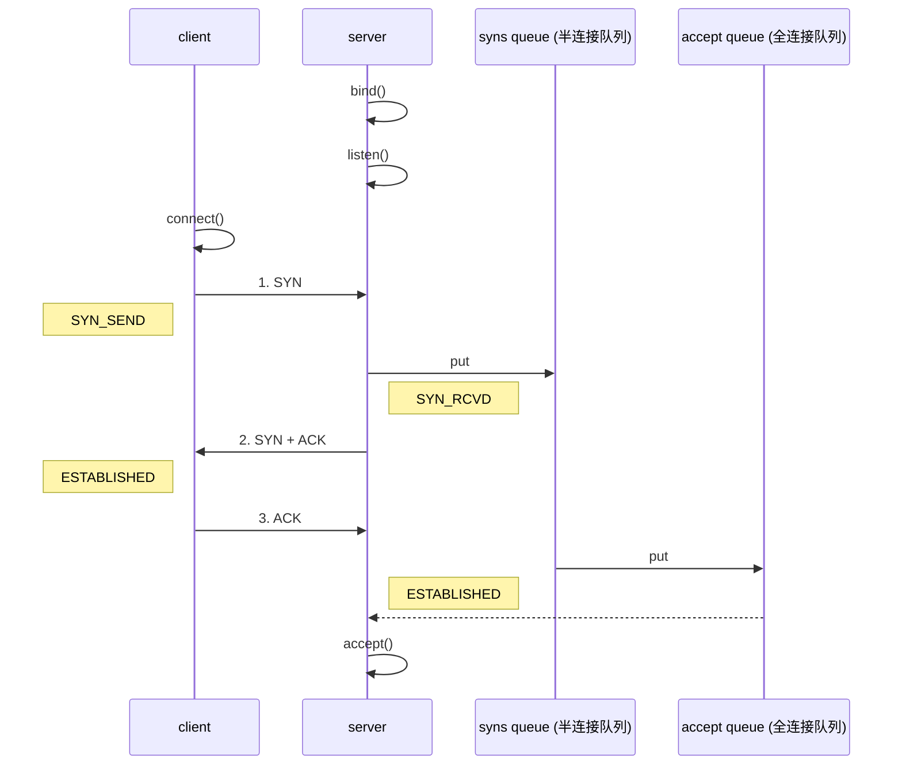

- 客户端通过.option()方法配置参数， 给SocketChannel配置参数
- 服务器端
  - new ServerBootstrap().option() 是给ServerSocketChannel配置参数
  - new ServerBootstrap().childOption()是给SocketChannel配置参数

## CONNECT_TIMEOUT_MILLIS

- 属于SocketChannel参数
- 用在客户端建立连接时，如果在指定毫秒内无法连接，会抛出timeout异常
- SO_TIMEOUT主要用在阻塞IO，阻塞IO中accept, read等都是无限等待的，如果不希望永远阻塞，使用它调整时间

```java
@Slf4j
public class TestConnectionTimeout {
    public static void main(String[] args) {
        NioEventLoopGroup group = new NioEventLoopGroup();
        try {
						ChannelFuture future = new Bootstrap()
                    .group(group)
                    .option(ChannelOption.CONNECT_TIMEOUT_MILLIS, 1000)
                    .channel(NioSocketChannel.class)
                    .handler(new ChannelInitializer<NioSocketChannel>() {
                        @Override
                        protected void initChannel(NioSocketChannel ch) throws Exception {
                            ch.pipeline().addLast(new LoggingHandler());
                        }
                    }).connect("localhost", 8080);
            future.sync().channel().closeFuture().sync();
        } catch (Exception e) {
            e.printStackTrace();
            log.debug("timeout");
        } finally {
            group.shutdownGracefully();
        }
    }
}
```

## SO_BACKLOG

- 属于ServerSocketChannel参数



1. 第一次握手，client发送SYN到server,状态修改为SYN_SEND, server收到, 状态改为SYN_RCVD,并将请求放入sync queue半连接队列
2. 第二次握手，server回复SYN+ACK给client, client收到，状态改为ESTABLISHED, 并发送ACK给server
3. 第三次握手，server收到ACK,状态改为ESTABLISHED,将该请求从sync queue半连接队列放入accept queue全连接队列

> accept queue全连接队列，只有accept来不及处理的socket才会放入accept queue

其中

- 在linux 2.2之前，backlog大小包括了两个队列的大小，在2.2之后，分别用下面两个参数来控制
- sync queue - 半连接队列，大小通过`/proc/sys/net/ipv4/tcp_max_syn_backlog`,在syncookies启用的情况下，逻辑上没有最大限制，这个设置便被忽略
- accept queue - 全连接队列，其大小通过`/proc/sys/net/core/somaxconn`指定，在使用listen函数时，内核会根据传入的backlog参数与系统参数，取二者的较小值。如果accept queue队列满了，server发送一个拒绝连接的错误信息到client

netty中，可以通过option(ChannelOption.SO_BACKLOG, value)来设置大小

## ulimit -n

- 属于操作系统参数，表示操作系统支持打开文件描述符的上限(FD)

## TCP_NODELAY

- 属于SocketChannel参数
- false开启了nagle算法，true关闭nagle算法。nagle算法表示tcp会累积一定的包然后再发送

## SO_SNDBUF & SO_RCVBUF

- SO_SNDBUF属于SocketChannel参数
- SO_RCVBUF既可以用于SocketChannel参数，也可以用于ServerSocketChannel参数（建议设置到ServerSocketChannel上）

## ALLOCATOR

- 用于ctx.alloc()分配ByteBuf类型
- 属于SocketChannel参数

## RCVBUF_ALLOCATOR

- 属于SocketChannel参数
- 负责入站数据的分配，决定入站缓冲区的大小（可动态调整），统一采用direct直接内存，具体池化还是非池化由allocator决定
- 控制netty接收缓冲区大小
