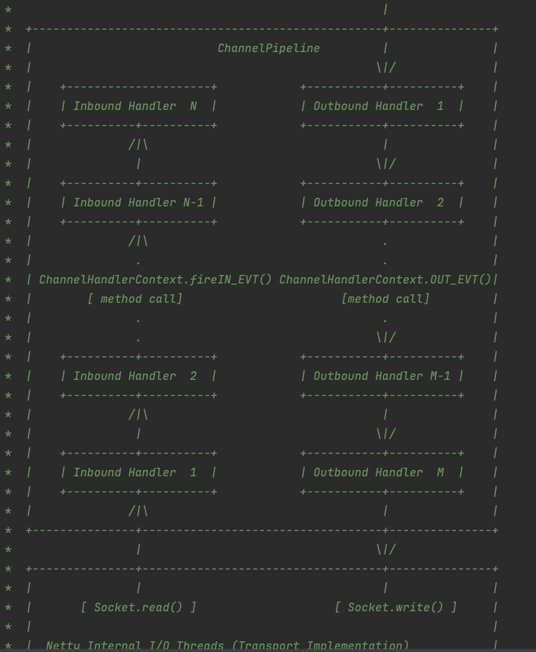

# Netty知识点大纲

# 为什么选择Netty

## Linux IO请求

- IO调用阶段：用户进程向内核发起系统调用
- IO执行阶段：内核等待IO请求处理完成返回

## Linux IO模型

## Netty IO模型

- 基于非阻塞I/O实现
- 底层依赖的是JDK NIO框架多路复用器Selector
- 一个多路复用器Selector可以同时轮询多个Channel

## 事件分发器(Event Dispatcher)

- 负责将读写事件分发给对应的读写事件处理器(Event Handler)
- Reactor 和 Proactor

## Netty主从Reactor模型

## Netty相比JDK NIO优势

- 易用性：
  - 屏蔽了NIO的复杂性
  - 封装更加人性化的API
  - 降级开发者的上手难度
- 稳定性：修复和完善较多问题
- 可扩展性
  - 可定制化的线程模型
  - 可扩展的事件驱动模型
- 更低的资源消耗
  - 面临大量的网络对象需要创建和销毁的问题
  - 对象池复用技术
  - 零拷贝技术

## 网络框架的选型

- Tomcat : 一个Http Server主要解决HTTP协议层的传输
- Netty: HTTP, SSH, TLS/SSL等多种应用层协议，能够自定义应用层协议

## Netty发展现状

- 项目结构：模块化程度高
- 常用API: 大多API都已支持流式风格
- Buffer相关优化
  - ChannelBuffer变更为ByteBuf, Buffer相关的工具类可以独立使用
  - Buffer统一为动态变化，更安全的更改Buffer容量
  - 增加的数据类型CompositeBuf,用于减少数据拷贝
  - GC更加友好，增加池化缓存，4.1版本开始jemalloc成为默认内存分配方式
  - 内存泄露检测工具
- 通用工具类：io.netty.util.concurrent包中提供了较多异步编程的数据结构
- 严谨的线程模型控制：降低用户编写ChannelHandler的心智

## Netty整体架构

### Core核心层

- 提供底层网络通信的通用抽象和实现
- 包括可扩展的事件模型，通用的通信API, 支持零拷贝的ByteBuf等

### Protocol Support 协议支持层

- 覆盖了主流协议的编码实现：如HTTP, SSL, Protobuf, 压缩, 大文件传输, WebSocket, 文本, 二进制等
- 支持自定义应用层协议

### Transport Service传输服务层

- 传输服务层提供了网络传输能力的定义和实现方法，支持Socket, HTTP隧道, 虚拟机管道等传输方式
- Netty的模块设计具备较高的通用性和可扩展性

## Netty逻辑架构

### 网络通信层

#### BootStrap和ServerBootStrap分别负责客户端和服务端的启动

- 网络通信层的职责是执行网络I/O的操作，支持多种网络协议和I/O模型的连接操作
- BootStrap & ServerBootStrap: 主要负责整个Netty程序的启动，初始化，服务器连接等过程
- BootStrap可用于连接远端服务器，只能绑定一个EventLoopGroup(Boss)
- ServerBootStrap用于服务端启动绑定本地端口，绑定两个EventLoopGroup(Boos, Worker)
- 每个服务器中都会有一个Boss, 会有一群做事情的Worker
- Boss会不停的接收新的连接，将连接分配给一个个Worker处理连接

#### Channel是网络通信的载体，提供了与底层Socket交互的能力

- Channel是网络通信的载体，提供了基本的API用于网络I/O操作。如register, bind, connect, read, write, flush等
- Netty自己实现的Channel是以JDK NIO Channel为基础的
- NioServerSocketChannel异步TCP服务端
- NioSocketChannel异步TCP客户端
- OioServerSocketChannel同步TCP服务端
- OioSocketChannel同步TCP客户端
- NioDatagramChannel异步UDP连接
- OioDatagramChannel同步UDP连接
- Channel会有多种状态，如连接建立，连接注册，数据读写，连接销毁等
  - channelRegistered: Channel创建后被注册到EventLoop上
  - channelUnregistered: Channel创建后未注册或者从EventLoop上取消注册
  - channelActive: Channel处于就绪状态，可以被读写
  - channelInactive: Channel处于非就绪状态
  - channelRead: Channel可以从远端读取到数据
  - channelReadComplete: Channel读取数据完成

### 事件调度层

#### 事件调度层的职责

- 通过Reactor线程模型对各类事件进行聚合处理
- 通过Selector主循环线程集成多种事件
- 核心组件包括EventLoopGroup, EventLoop
- EventLoopGroup是Netty Reactor线程模型的具体实现方式
  - 单线程模型：EventLoopGroup只包含一个EventLoop,Boss和Worker使用同一个EventLoopGroup
  - 多线程模型：EventLoopGroup包含多个EventLoop, Boss和Worker使用同一个EventLoopGroup
  - 主从多线程模型：EventLoopGroup包含多个EventLoop, Boss是主Reactor, Worker是从Reactor 主Reactor负责新的网络连接Channel创建，然后把Channel注册到从Reactor

### 服务编排层

- 负责组装各类服务，用以实现网络事件的动态编排和有序传播

- ChannelPipeline, ChannelHandler, ChannelHandlerContext

#### ChannelPipeline

- ChannelPipeline负责组装各种ChannelHandler：实际数据的编解码以及加工处理操作由ChannelHandler完成
- 当IO读写事件触发时，ChannelPipeline会依次调用ChannelHandler列表对Channel的数据进行拦截和处理
- 每一个新的Channel会对应绑定一个新的ChannelPipeline
- 一个ChannelPipeline关联一个EventLoop，一个EventLoop仅会绑定一个线程

- 客户端和服务端一次完整的请求应答过程：
  - 客户端出站（请求数据）
  - 服务端入站（解析数据并执行业务逻辑）
  - 服务端出站（响应结果）