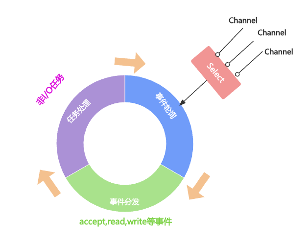

# 引导器Bootstrap

- 作为Netty客户端和服务端的程序入库
- Netty的引导器Bootstrap

# HTTP服务器

## HTTP服务器示例

- 搭建HTTP服务器，配置相关参数并启动
- 从浏览器或者终端发起HTTP请求
- 成功得到服务端响应结果

```java
public class HttpServer {
    public void start(int port) throws Exception {
        EventLoopGroup bossGroup = new NioEventLoopGroup(1);
        EventLoopGroup workerGroup = new NioEventLoopGroup();
        try {
            ServerBootstrap b = new ServerBootstrap();
            b.group(bossGroup, workerGroup)
                    .channel(NioServerSocketChannel.class)
                    .localAddress(new InetSocketAddress(port))
                    .childHandler(new ChannelInitializer<SocketChannel>() {
                        @Override
                        protected void initChannel(SocketChannel ch) throws Exception {
                            //HTTP编解码器
                            ch.pipeline().addLast("codec", new HttpServerCodec());
                            //HttpContext压缩
                            ch.pipeline().addLast("compressor", new HttpContentCompressor());
                            //HTTP消息聚合
                            ch.pipeline().addLast("aggregator", new HttpObjectAggregator(65536));
                            //自定义业务处理器
                            ch.pipeline().addLast("handler", new HttpServerHandler());
                        }
                    }).childOption(ChannelOption.SO_KEEPALIVE, true);
            ChannelFuture f = b.bind().sync();
            System.out.println("Http Server started, Listening on " + port);
            f.channel().closeFuture().sync();
        } finally {
            bossGroup.shutdownGracefully().sync();
            workerGroup.shutdownGracefully().sync();
        }
    }

    public static void main(String[] args) throws Exception {
        new HttpServer().start(8088);
    }
}

public class HttpServerHandler extends SimpleChannelInboundHandler<FullHttpRequest> {
    @Override
    protected void channelRead0(ChannelHandlerContext ctx, FullHttpRequest msg) throws Exception {
        String content = String.format("Receive http request, uri: %s, method: %s, content: %s",
                msg.uri(), msg.method(), msg.content().toString(CharsetUtil.UTF_8));
        DefaultFullHttpResponse response = new DefaultFullHttpResponse(HttpVersion.HTTP_1_1, HttpResponseStatus.OK, Unpooled.wrappedBuffer(content.getBytes("UTF-8")));
        ctx.writeAndFlush(response).addListener(ChannelFutureListener.CLOSE);
    }
}

public class HttpClient {
    public void connect(String host, int port) throws Exception {
        EventLoopGroup group = new NioEventLoopGroup();
        try {
            Bootstrap b = new Bootstrap();
            b.group(group)
                    .channel(NioSocketChannel.class)
                    .option(ChannelOption.SO_KEEPALIVE, true)
                    .handler(new ChannelInitializer<SocketChannel>() {
                        @Override
                        protected void initChannel(SocketChannel ch) throws Exception {
                            ch.pipeline().addLast(new HttpResponseDecoder());
                            ch.pipeline().addLast(new HttpRequestEncoder());
                            ch.pipeline().addLast(new HttpClientHandler());;
                        }
                    });
            ChannelFuture f = b.connect(host, port).sync();
            URI uri = new URI("http://127.0.0.1:8088");
            String msg = "Are you ok?";
            DefaultFullHttpRequest request = new DefaultFullHttpRequest(
                    io.netty.handler.codec.http.HttpVersion.HTTP_1_1,
                    io.netty.handler.codec.http.HttpMethod.GET,
                    uri.toASCIIString(),
                    Unpooled.wrappedBuffer(msg.getBytes("UTF-8")));
            request.headers().set(HttpHeaderNames.HOST, host);
            request.headers().set(HttpHeaderNames.CONNECTION, HttpHeaderValues.KEEP_ALIVE);
            request.headers().set(HttpHeaderNames.CONTENT_LENGTH, request.content().readableBytes());
            f.channel().write(request);
            f.channel().flush();
            f.channel().closeFuture().sync();
        } finally {
            group.shutdownGracefully().sync();
        }
    }

    public static void main(String[] args) throws Exception {
        HttpClient client = new HttpClient();
        client.connect("127.0.0.1", 8088);
    }
}
public class HttpClientHandler extends ChannelInboundHandlerAdapter {
    @Override
    public void channelRead(ChannelHandlerContext ctx, Object msg) throws Exception {
        if (msg instanceof HttpContent) {
            HttpContent content = (HttpContent) msg;
            ByteBuf buf = content.content();
            System.out.println(buf.toString(io.netty.util.CharsetUtil.UTF_8));
            content.release();
        }
    }
}
```

## Netty服务端的启动流程

- 配置线程池
- Channel初始化
  - 设置Channel类型 `b.channel(NioServerSocketChannel.class);`
  - 注册ChannelHandler:在Netty中可以通过ChannelPipeline去注册多个ChannelHandler每个ChannelHandler各司其职，这样就可以实现最大化的代码复用充分体现了Netty设计的优雅之处
  - 设置Channel参数 `b.option(ChannelOption.SO_KEEPALIVE, true);`
- 端口绑定
  - `ChannelFuture f = b.bind().sync();`

# 三种Reactor模式

## 单线程模式

```java
EventLoopGroup group = new EventLoopGroup(1);
ServerBootstrap b = new ServerBootstrap();
b.group(group);
```

## 多线程模式

```java
EventLoopGroup group = new EventLoopGroup();
ServerBootstrap b = new ServerBootstrap();
b.group(group);
```

## 主从多线程模式

```java
EventLoopGroup bossGroup = new EventLoopGroup();
EventLoopGroup workerGroup = new EventLoopGroup();
ServerBootstrap b = new ServerBootstrap();
b.group(bossGroup, workerGroup);
```

# Channel参数

| 参数                   | 含义                                                         |
| ---------------------- | ------------------------------------------------------------ |
| SO_KEEPALIVE           | 设置为true代表启用了TCP SO_KEEPALIVE属性，TCP会主动探测连接，即连接保活 |
| SO_BACKLOG             | 已完成三次握手的请求队列的最大长度，同一时刻服务端可能会处理多个连接，在高并发海量连接的场景下，该参数适当调大 |
| TCP_NODELAY            | 设置为true标识TCP会将网络数据表积累到一定量才会发送，会造成一定的数据延迟。如果对数据传输延迟敏感，那么应该禁用该参数 |
| SO_SNDBUF              | TCP数据发送缓冲区大小                                        |
| SO_RCVBUF              | TCP数据接收缓存区大小，TCP数据接收缓冲区大小                 |
| SO_LINGER              | 设置延迟关闭的时间，等待缓冲区中的数据发送完成               |
| CONNECT_TIMEOUT_MILLIS | 建立连接的超时时间                                           |

# Reactor线程模型

- 线程模型的优劣直接决定了系统的吞吐量，可扩展性，安全性等
- Reactor模式负责将读写事件分发给对应的读写事件处理者



- 连接注册：Channel建立后，注册至Reactor线程中的Selector选择器
- 事件轮询：轮询Selector选择器中已注册的所有Channel的I/O事件
- 事件分发：为准备就绪的I/O事件分配相应的处理线程
- 任务处理：每个Worker线程从各自维护的任务队列中取出任务异步执行