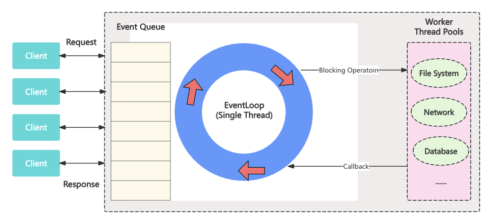
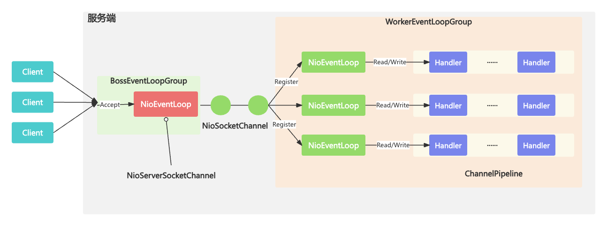

# EventLoop



- 是一种事件等待和处理程序模型
- 可以解决多线程资源消耗高的问题

# Netty如何实现EventLoop

- Reactor线程模型的事件处理引擎
- 每个EventLoop线程都维护一个Selector选择器和任务队列taskQueue
- 主要负责处理I/O事件、普通任务和定时任务

# 事件处理机制



- Channel生命周期的所有事件处理都是线程独立的，不同的NioEventLoop线程之间不会发生任何交集
- NioEventLoop无锁串行化设计
  - 优点：使系统吞吐量达到最大化；降低了用户开发业务逻辑的难度
  - 缺点：不能执行时间过长的I/O操作，一旦某个I/O事件发生阻塞，后续的所有I/O事件都无法执行
- 在JDK中，Epoll的实现是存在漏洞的，即使Selector轮询的事件列表为空，NIO线程一样可以被唤醒，导致CPU 100%占用
- Netty作为一个高性能，高可靠的网络框架，需要保证I/O线程的安全性

# 任务处理机制

- 普通任务：通过NioEventLoop的execute()方法向任务队列taskQueue中添加任务，taskQueue的实现类是多生产者单消费者队列MpscChunkedArrayQueue
- 定时任务：通过调用NioEventLoop的schedule()方法向定时任务队列scheduledTaskQueue添加一个定时任务，用于周期性执行该任务
- 尾部队列：tailTasks相比于普通任务队列优先级较低，在每次执行完taskQueue中任务会去获取尾部队列中任务执行

```java
protected boolean runAllTasks(long timeoutNanos) {
  // 1. 合并定时任务队列到普通任务队列
  fetchFromScheduledTaskQueue();
  // 2. 从普通任务队列中取出任务
  Runnable task = pollTask();
  if (task == null) {
    afterRunningAllTasks();
    return false;
  }
  // 3. 计算任务处理的超时时间
  final long deadline = timeoutNanos > 0 ? getCurrentTimeNanos() + timeoutNanos : 0;
  long runTasks = 0;
  long lastExecutionTime;
  for (;;) {
    // 4. 安全执行任务
    safeExecute(task);
    runTasks ++;
    // 5. 每执行64个任务检查一下是否超时
    if ((runTasks & 0x3F) == 0) {
      lastExecutionTime = getCurrentTimeNanos();
      if (lastExecutionTime >= deadline) {
        break;
      }
    }
    task = pollTask();
    if (task == null) {
      lastExecutionTime = getCurrentTimeNanos();
      break;
    }
  }
  // 6. 收尾工作
  afterRunningAllTasks();
  this.lastExecutionTime = lastExecutionTime;
  return true;
}
```

# EventLoop最佳实践

- 网络连接建立过程中三次握手，安全认证的过程，建议采用Boss和Worker两个EventLoopGroup
- 对于耗时较长的ChannelHandler可以考虑维护一个业务线程池将编解码后的数据封装成Task进行异步处理
- 如果业务逻辑执行时间较短，建议直接在ChannelHandler中执行
- 不宜设计过多的ChannelHandler

# 总结

- MainReactor线程：处理客户端请求接入
- SubReactor线程：数据读取，IO事件的分发与执行
- 任务处理线程：执行普通任务或者定时任务，如空闲连接检测，心跳上报等
- EventLoop是Netty的调度中心，IO事件，信号事件，定时事件由ChannelPipeline中所定义的ChannelHandler完成的