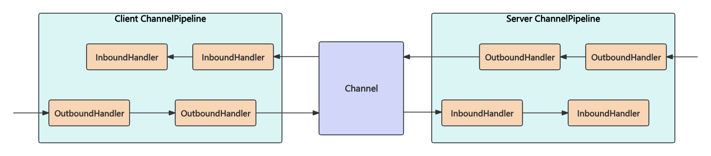

# 前言

- ChannelPipeline与ChannelHandler的关系是什么？他们之间是如何协同工作的？
- ChannelHandler的类型有哪些？有什么区别？
- Netty中IO事件是如何传播的？

# ChannelPipeline概述

- 原始的网络字节流经过Pipeline
- 被一步步加工包装，最后得到加工后的成品
- 他是Netty的核心处理链
- 用以实现网络事件的动态编排和有序传播

## ChannelPipeline内部结构


- ChannelPipeline作为Netty的核心编排组件，负责调度各种类型的ChannelHandler,实际数据的加工处理操作则是由ChannelHandler完成的
- ChannelHandlerContext用于保存ChannelHandler上下文
- ChannelHandlerContext则包含了ChannelHandler生命周期的所有事件(connect, flush, bind, read, close, write)
- 数据从客户端发向服务端的过程叫出站，反之成为入站
- 数据先由一系列InboundHandler处理后入站
- 然后再由反方向的OutboundHandler处理完成后出站



- 分别维护了HeadContext和TailContext的头尾节点
- 自定义的ChannelHandler会插入到Head和Tail之间
- ChannelPipeline调用链路：如果由Channel直接触发事件传播，那么调用链路将贯穿整个ChannelPipeline,然而也可以在其中某一个ChannelHandlerContext触发同样的方法，这样只会从当前的ChannelHandler开始执行事件传播，该过程不会从头贯穿到尾

## ChannelHandler接口设计

### IO事件的生命周期

- 建立连接
- 写数据
- 读数据
- 连接销毁

### ChannelInboundHandler的事件回调方法与触发时机

| 事件回调方法              | 触发时机                                         |
| ------------------------- | ------------------------------------------------ |
| channelRegistered         | Channel被注册到EventLoop                         |
| channlUnregistered        | Channel从EventLoop中取消注册                     |
| channelActive             | Channel处于就绪状态，可以被读写                  |
| channelInactive           | Channel处于非就绪状态Channel可以从远端读取到数据 |
| channelRead               | Channel可以从远端读取到数据                      |
| channelReadComplete       | Channel读取数据完成                              |
| userEventTriggered        | 用户事件触发时                                   |
| channelWritabilityChanged | Channel的写状态发生变化                          |

### ChannelOutboundHandler的事件回调方法与触发时机

- bind
- close
- connect
- deregister
- disconnect
- flush
- read
- Write

## ChannelPipeline事件传播机制


```java
public class TestServer {
    public static void main(String[] args) {
        //1. 创建启动器类
        new ServerBootstrap()
                //2. 添加EventLoop
                .group(new NioEventLoopGroup())
                //3. 选择服务器channel实现
                .channel(NioServerSocketChannel.class)
                //4. 添加处理器
                .childHandler(new ChannelInitializer<NioSocketChannel>() {
                    @Override //连接建立后被调用
                    protected void initChannel(NioSocketChannel channel) throws Exception {
                        //入站处理器
                        channel.pipeline().addLast(new SampleInBoundHandler("InBoundHandlerA", false));
                        channel.pipeline().addLast(new SampleInBoundHandler("InBoundHandlerB", false));
                        channel.pipeline().addLast(new SampleInBoundHandler("InBoundHandlerC", true));
                        //出站处理器
                        channel.pipeline().addLast(new SampleOutBoundHandler("OutBoundHandlerA"));
                        channel.pipeline().addLast(new SampleOutBoundHandler("OutBoundHandlerB"));
                        channel.pipeline().addLast(new SampleOutBoundHandler("OutBoundHandlerC"));
                    }
                })
                //5. 绑定监听端口
                .bind(8080);
    }
}
public class SampleInBoundHandler extends ChannelInboundHandlerAdapter {
    private final String name;
    private final boolean flush;
    public SampleInBoundHandler(String name, boolean flush) {
        this.name = name;
        this.flush = flush;
    }

    @Override
    public void channelRead(ChannelHandlerContext ctx, Object msg) throws Exception {
        System.out.println("InBoundHandler: " + name);
        if (flush) {
            ctx.channel().writeAndFlush(msg);
        } else {
            super.channelRead(ctx, msg);
        }
    }
}
public class SampleOutBoundHandler extends ChannelOutboundHandlerAdapter {
    private final String name;
    public SampleOutBoundHandler(String name) {
        this.name = name;
    }

    @Override
    public void write(ChannelHandlerContext ctx, Object msg, ChannelPromise promise) throws Exception {
        System.out.println("OutBoundHandler: " + name);
        super.write(ctx, msg, promise);
    }
}
/**
运行结果
InBoundHandler: InBoundHandlerA
InBoundHandler: InBoundHandlerB
InBoundHandler: InBoundHandlerC
OutBoundHandler: OutBoundHandlerC
OutBoundHandler: OutBoundHandlerB
OutBoundHandler: OutBoundHandlerA
*/
```


```java
public class SampleInBoundHandler extends ChannelInboundHandlerAdapter {
    private final String name;
    private final boolean flush;
    public SampleInBoundHandler(String name, boolean flush) {
        this.name = name;
        this.flush = flush;
    }

    @Override
    public void channelRead(ChannelHandlerContext ctx, Object msg) throws Exception {
        System.out.println("InBoundHandler: " + name);
        if (flush) {
            ctx.channel().writeAndFlush(msg);
        } else {
            throw new RuntimeException("InBoundHandler: " + name);
        }
    }

    @Override
    public void exceptionCaught(ChannelHandlerContext ctx, Throwable cause) throws Exception {
        System.out.println("InBoundHandlerException: " + name);
        ctx.fireExceptionCaught(cause);
    }
}
public class SampleOutBoundHandler extends ChannelOutboundHandlerAdapter {
    private final String name;
    public SampleOutBoundHandler(String name) {
        this.name = name;
    }

    @Override
    public void write(ChannelHandlerContext ctx, Object msg, ChannelPromise promise) throws Exception {
        System.out.println("OutBoundHandler: " + name);
        super.write(ctx, msg, promise);
    }
}
public class ExceptionHandler extends ChannelDuplexHandler {
    @Override
    public void exceptionCaught(ChannelHandlerContext ctx, Throwable cause) throws Exception {
        if (cause instanceof RuntimeException) {
            System.out.println("Handle Business Exception Success");
        }
    }
}
public class TestServer {
    public static void main(String[] args) {
        //1. 创建启动器类
        new ServerBootstrap()
                //2. 添加EventLoop
                .group(new NioEventLoopGroup())
                //3. 选择服务器channel实现
                .channel(NioServerSocketChannel.class)
                //4. 添加处理器
                .childHandler(new ChannelInitializer<NioSocketChannel>() {
                    @Override //连接建立后被调用
                    protected void initChannel(NioSocketChannel channel) throws Exception {
                        //入站处理器
                        channel.pipeline().addLast(new SampleInBoundHandler("InBoundHandlerA", false));
                        channel.pipeline().addLast(new SampleInBoundHandler("InBoundHandlerB", false));
                        channel.pipeline().addLast(new SampleInBoundHandler("InBoundHandlerC", true));
                        //出站处理器
                        channel.pipeline().addLast(new SampleOutBoundHandler("OutBoundHandlerA"));
                        channel.pipeline().addLast(new SampleOutBoundHandler("OutBoundHandlerB"));
                        channel.pipeline().addLast(new SampleOutBoundHandler("OutBoundHandlerC"));
                        //异常处理器
                        channel.pipeline().addLast(new ExceptionHandler());
                    }
                })
                //5. 绑定监听端口
                .bind(8080);
    }
}
```

# 总结

- ChannelPipeline是双向链表结构 ChannelInboundHandler ChannelOutboundHandler
- ChannelHandlerContext是对ChannelHandler的封装
- Inbound事件和Outbound事件的传播方向相反
- 异常事件的处理顺序与ChannelHandler的添加顺序相同，会依次向后传播