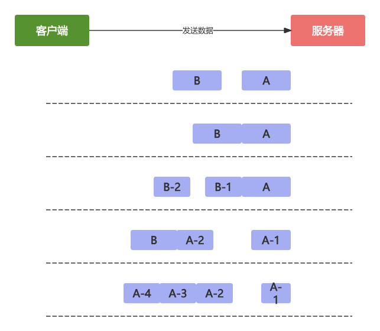

# 为什么有拆包/粘包

- 在网络通信的过程中，每次可以发送的数据包大小是受限制的
- 如MTU传输单元大小，MSS最大分段大小，滑动窗口等
- 如果依次传输的网络包数据大小超过传输单元大小，数据会拆分为多个数据包发送
- 如果每次请求的网络数据包都很小，TCP采用的Nagle算法会对此作出优化

# MTU, MSS

- MTU(Maxitum Transmission Unit):最大传输单元,是链路层一次最大传输数据的大小，一般大小为1500byte
- MSS(Maxitum Segment Size):最大分段大小,是指TCP最大报文段长度，是传输层一次发送最大数据的大小

# 滑动窗口

- 也被称为通告窗口
- 是数据接收方设置的窗口大小
- 接收方会把窗口大小告诉发送方
- 以此限制发送方每次发送数据的大小

# TCP怎么确保数据包按次到达和不丢失数据

- 所有的数据帧都是有编号的，TCP会对多个报文段回复依次ACK
- 假设三个报文段A,B,C，发送方先发送了B,C，接收方则必须等待A报文段到达
- 如果一定时间内仍未等到A报文段，那么B,C也会被丢弃，发送方会发起重试
- 如果已接收到A报文段，那么将会回复发送方一次ACK确认

# Nagle算法

- 1984年被福特航空和通信公司定义为TCP/IP拥塞控制方法
- 主要解决频繁发送小数据包而带来的网络拥塞问题
- Linux默认开启Nagle算法，可以通过TCP_NODELAY参数禁用Nagle算法
- Netty默认禁用Nagle算法

# 拆包粘包问题



- 解决拆包/粘包的唯一方法：定义应用层的通信协议

## 消息长度固定

- 没个数据报文都需要一个固定的长度：当发送方的数据小于固定长度时，则需要空位补齐

```java
/** 
 * +---+----+------+----+
 * | A | BC | DEFG | HI |
 * +---+----+------+----+
 */
/** 固定长度3解码
 * +-----+-----+-----+
 * | ABC | DEF | GHI |
 * +-----+-----+-----+
 */
```

## 特定分隔符

- 在每次发生报文的尾部加上特定分隔符，接收方就可以根据特殊分隔符进行消息拆分

```java 
/**
 * +--------------+
 * | ABC\nDEF\r\n |
 * +--------------+
 */
/** \n分割解码
 * +-----+-----+
 * | ABC | DEF |
 * +-----+-----+
 */
```

# 消息体 + 消息内容

```java
/**
 * BEFORE DECODE (14 bytes)         AFTER DECODE (14 bytes)
 * +--------+----------------+      +--------+----------------+
 * | Length | Actual Content |----->| Length | Actual Content |
 * | 0x000C | "HELLO, WORLD" |      | 0x000C | "HELLO, WORLD" |
 * +--------+----------------+      +--------+----------------+
 */
```

# 总结

- 详细讨论了TCP中的拆包/粘包问题，以及如何通过应用层的通信协议来解决拆包/粘包问题
- 基于消息长度+消息内容的变长协议是项目开发中最常用的一种方法