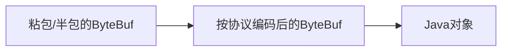

# 概述

- 通信双方事先商量好的接口暗语
- 在TCP网络编程中，发送方和接收方的数据包格式都是二进制
- 发送方将对象转化成二进制流发送给接收方，接收方获得二进制数据后需要知道如何解析成对象，所以协议是双方能够正常通信的基础
- HTTP, HTTPS, JSON-RPC, FTP, IMAP, Protobuf
- 极致性能：通用的通信协议考虑了很多兼容性的因素，在性能方面有所损失
- 扩展性：更好扩展，可以更好地满足自己的业务需求
- 安全性：通用协议是公开的，很多漏洞已经很多被黑客攻破

# 魔数

- 通常采用固定的几个字节表示
- 作用：防止任何人随便向服务器的端口上发送数据
- 服务端在接收到数据时会解析出前几个固定字节的魔数，然后做正确性对比

# 协议版本号

- 需要对结构或字段进行改动
- 不同版本的协议对应的解析方法也是不同的
- 在生产级项目中强烈建议预留协议版本号这个字段

# 序列号算法

- 数据发送方采用何种方法将请求的对象转化为二进制
- 如何再将二进制转化为对象
- 如JSON, Hessian, Java自带序列化等

# 报文类型

- 不同的业务场景中，报文可能存在不同的类型
- 在RPC框架中由请求，响应，心跳等类型的报文
- 在IM即时通信的场景中，登陆，创建群聊，发送消息，接收消息，退出群聊等

# 长度域字段

- 长度域字段代表请求数据的长度
- 接收方根据长度域字段获取一个完整的报文

# 请求数据

- 通常为序列化之后得到的二进制流
- 每种请求数据的内容是不一样的

# 状态

- 用于标识请求是否正常
- 一般由被调用方设置
- 例如一次RPC调用失败，状态字段可被服务提供方设置为异常状态

# 保留字段

- 保留字段是可选项
- 为了应对协议升级的可能性，可以预留若干字节的保留字段，以备不时之需

# Netty中如何实现自定义通信协议

## Netty常用编码器类型

- MessageToByteEncoder对象编码成字节流
- MessageToMessageEncoder一种消息类型编码成另一种消息类型

## Netty常用解码器类型

- ByteToMessageDecoder/ReplayingDecoder将字节流解码为消息对象
- MessageToMessageDecoder将一种消息类型解码为另外一种消息类型

## 编解码器

- 一次编解码器：MessageToByteEncoder/ByteToMessageDecoder
- 二次编解码器：MessageToMessageEncoder/MessageToMessageDecoder
- 一次解码器用于解决TCP拆包/粘包问题，按协议解析得到的字节数据
- 需要对解析后的字节数据做对象模型的转换，这时需要用到二次解码器

- MessageToByteEncoder核心源码

```java
public void write(ChannelHandlerContext ctx, Object msg, ChannelPromise promise) throws Exception {
  ByteBuf buf = null;
  try {
    // 1. 消息类型是否匹配
    if (acceptOutboundMessage(msg)) {
      @SuppressWarnings("unchecked")
      I cast = (I) msg;
      // 2. 分配 ByteBuf资源
      buf = allocateBuffer(ctx, cast, preferDirect);
      try {
        // 3. 执行encode方法完成数据编码
        encode(ctx, cast, buf);
      } finally {
        ReferenceCountUtil.release(cast);
      }

      if (buf.isReadable()) {
        // 4.向后传递事件
        ctx.write(buf, promise);
      } else {
        buf.release();
        ctx.write(Unpooled.EMPTY_BUFFER, promise);
      }
      buf = null;
    } else {
      ctx.write(msg, promise);
    }
  } catch (EncoderException e) {
    throw e;
  } catch (Throwable e) {
    throw new EncoderException(e);
  } finally {
    if (buf != null) {
      buf.release();
    }
  }
}
```

- MessageToMessageEncoder
  - 只需要实现encode方法
  - 将一种格式的消息转换为另外一种格式的消息
  - 任意一个对象如果该对象是ByteBuf类型，那么基本上和MessageToByteEncoder的实现原理是一样的
  - 常用的实现字类：StringEncoder, LineEncoder, Base64Encoder
- ByteToMessageDecoder
  - 定义了decode()抽象方法
  - 为什么抽象解码器要比编码器多一个decodeLast方法呢？因为decodeLast在Channel关闭后会被调用一次，主要用于处理ByteBuf最后剩余的字节数据
  - 抽象子类是ReplayingDecoder, 它封装了缓冲区的管理

```java
public abstract class ByteToMessageDecoder extends ChannelInboundHandlerAdapter {
		protected abstract void decode(ChannelHandlerContext ctx, ByteBuf in, List<Object> out) throws Exception;
    protected void decodeLast(ChannelHandlerContext ctx, ByteBuf in, List<Object> out) throws Exception {
        if (in.isReadable()) {
            decodeRemovalReentryProtection(ctx, in, out);
        }
    }
}
```

- MessageToMessageDecoder
  - 消息类型的编码成另外一种消息类型
  - 并不会对数据报文进行缓存，它主要用作转换消息模型



# 通信协议实战

<table>
  <tr>
  <td>魔术2byte</td>
  <td>协议版本号1byte</td>
  <td>序列化算法1byte</td>
  <td>报文类型1byte</td>    
  </tr>
  <tr>
  	<td>状态1byte</td>
    <td colspan=2>保留字段4byte</td>
    <td>数据长度4byte</td>
  </tr>
  <tr><td colspan=4>数据内容（长度不定）</td></tr>
</table>

```java
public final void decode(ChannelHandlerContext ctx, ByteBuf in, List<Object> out) {
  //判断ByteBuf可读字节
  if(in.readableBytes() < 14) {
    return;
  }
  in.markReaderIndex(); //标记ByteBuf读指针位置
  in.skipBytes(4); //跳过魔数
  in.skipBytes(1); //跳过协议版本号
  byte serializeType = in.readByte();
  in.skipBytes(1); // 跳过报文类型
  in.skipBytes(1); // 跳过状态字段
  in.skipBytes(4); // 跳过保留字段
  
	int dataLength = in.readInt();
  if (in.readableBytes() < dataLength) {
    in.resetReaderIndex(); //重置ByteBuf读指针位置
    return;
  }
  byte[] data = new byte[dataLength];
  in.readBytes(data);
  SerializeService serializeService = getSerializeServiceByByte(serializeType);
  Object obj = serializeService.deserialize(data);
  if (obj != null) {
    out.add(obj);
  }
}
```

