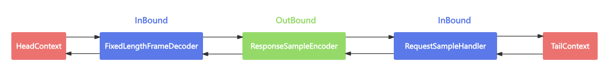

# Pipeline事件传播回顾

- writeAndFlush是如何触发事件传播的？数据是怎样写到Socket底层的？
- 为什么会由write和flush两个动作？执行flush之前数据是如何存储的？
- writeAndFlush是同步还是异步？它是线程安全的吗？

# writeAndFlush事件传播分析

```java
public class EchoServer {
    public void startEchoServer(int port) throws Exception{
        EventLoopGroup bossGroup = new NioEventLoopGroup(1);
        EventLoopGroup workerGroup = new NioEventLoopGroup();
        try {
            new ServerBootstrap()
                    .group(bossGroup, workerGroup)
                    .channel(NioServerSocketChannel.class)
                    .childHandler(new ChannelInitializer<NioSocketChannel>() {
                        @Override
                        protected void initChannel(NioSocketChannel channel) throws Exception {
                            channel.pipeline().addLast(new FixedLengthFrameDecoder(10));
                            channel.pipeline().addLast(new ResponseSampleEncoder());
                            channel.pipeline().addLast(new RequestSampleHandler());
                            //channel.pipeline().addLast(new EchoServerHandler());
                        }
                    })
                    .bind(port)
                    .sync()
                    .channel()
                    .closeFuture()
                    .sync();
        } finally {
            bossGroup.shutdownGracefully();
            workerGroup.shutdownGracefully();
        }
    }

    public static void main(String[] args) throws Exception{
        new EchoServer().startEchoServer(8088);
    }
}
public class RequestSampleHandler extends ChannelInboundHandlerAdapter {
    @Override
    public void channelRead(ChannelHandlerContext ctx, Object msg) throws Exception {
        String data = ((ByteBuf)msg).toString(CharsetUtil.UTF_8);
        ResponseSample response = new ResponseSample("OK", data, System.currentTimeMillis());
        ctx.channel().writeAndFlush(response);
    }
}
public class ResponseSampleEncoder extends MessageToByteEncoder<ResponseSample> {
    @Override
    protected void encode(ChannelHandlerContext ctx, ResponseSample msg, ByteBuf out) throws Exception {
        if (msg != null) {
            out.writeBytes(msg.getCode().getBytes(StandardCharsets.UTF_8));
            out.writeBytes(msg.getData().getBytes(StandardCharsets.UTF_8));
            out.writeLong(msg.getTimestamp());
        }
    }
}
@Data
@AllArgsConstructor
public class ResponseSample {
    private String code;
    private String data;
    private Long timestamp;
}
```



# writeAndFlush核心逻辑

```java
private void write(Object msg, boolean flush, ChannelPromise promise) {
  // 省略部分非核心代码
  // 找到Pipeline链表中下一个Outbound类型的ChannelHandler节点
  final AbstractChannelHandlerContext next = findContextOutbound(flush ?
                (MASK_WRITE | MASK_FLUSH) : MASK_WRITE);
  final Object m = pipeline.touch(msg, next);
  EventExecutor executor = next.executor();
  //判断当前线程是否是NioEventLoop中的线程
  if (executor.inEventLoop()) {
    if (flush) {
      //因为flush=true，所以流程走到这里
      next.invokeWriteAndFlush(m, promise);
    } else {
      next.invokeWrite(m, promise);
    }
  } else {
    final WriteTask task = WriteTask.newInstance(next, m, promise, flush);
    if (!safeExecute(executor, task, promise, m, !flush)) {
      task.cancel();
    }
  }
}

void invokeWriteAndFlush(Object msg, ChannelPromise promise) {
  if (invokeHandler()) {
    invokeWrite0(msg, promise);
    invokeFlush0();
  } else {
    writeAndFlush(msg, promise);
  }
}

private void invokeWrite0(Object msg, ChannelPromise promise) {
  try {
    ((ChannelOutboundHandler) handler()).write(this, msg, promise);
  } catch (Throwable t) {
    notifyOutboundHandlerException(t, promise);
  }
}

// HeadContext # write
@Override
public void write(ChannelHandlerContext ctx, Object msg, ChannelPromise promise) {
  unsafe.write(msg, promise);
}

// AbstractChannel # AbstractUnsafe # write
@Override
public final void write(Object msg, ChannelPromise promise) {
  assertEventLoop();
  ChannelOutboundBuffer outboundBuffer = this.outboundBuffer;
  if (outboundBuffer == null) {
    try {
      ReferenceCountUtil.release(msg);
    } finally {
      safeSetFailure(promise,
                     newClosedChannelException(initialCloseCause, "write(Object, ChannelPromise)"));
    }
    return;
  }
  int size;
  try {
    // 过滤消息
    msg = filterOutboundMessage(msg);
    size = pipeline.estimatorHandle().size(msg);
    if (size < 0) {
      size = 0;
    }
  } catch (Throwable t) {
    try {
      ReferenceCountUtil.release(msg);
    } finally {
      safeSetFailure(promise, t);
    }
    return;
  }
  // 向Buffer中添加数据
  outboundBuffer.addMessage(msg, size, promise);
}

public void addMessage(Object msg, int size, ChannelPromise promise) {
  Entry entry = Entry.newInstance(msg, size, total(msg), promise);
  if (tailEntry == null) {
    flushedEntry = null;
  } else {
    Entry tail = tailEntry;
    tail.next = entry;
  }
  tailEntry = entry;
  if (unflushedEntry == null) {
    unflushedEntry = entry;
  }
  incrementPendingOutboundBytes(entry.pendingSize, false);
}
```

