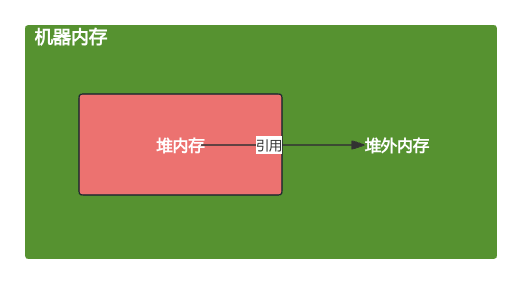
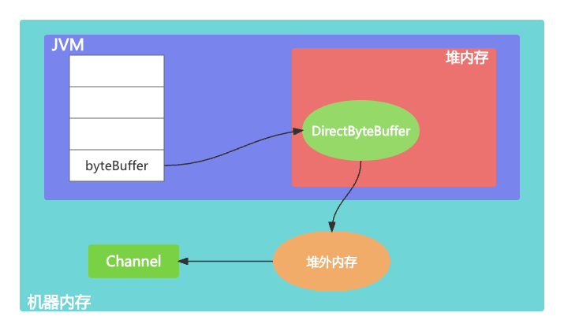
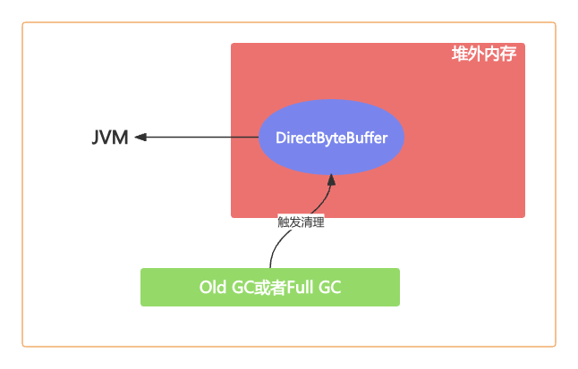
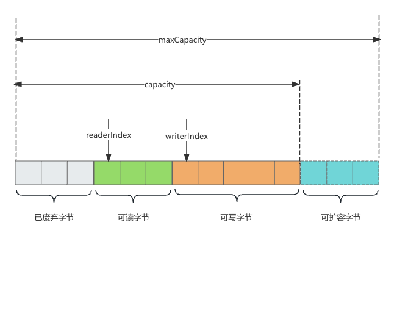

# 为什么需要堆外内存

- 在Java中对象都是在堆内分配的，通常JVM内存也就指的是堆内内存



- 堆内存由JVM GC自动回收内存降低了Java用户的使用心智
- 堆外内存需要手动释放，稍有不慎就会造成应用程序内存泄露
- 当进行网络IO操作，文件读写时堆内存都需要转换为堆外内存然后再与底层设备进行交互
- 堆外内存可以实现进程之间JVM多实例之间的数据共享

# 堆外内存的分配

- ByteBuffer#allocateDirect 和 Unsafe#allocateMemory (ByteBuffer类)

```java
//分配10M堆外内存
ByteBuffer buffer = ByteBuffer.allocateDirect(10 * 1024 * 1024);
```

- 跟进ByteBuffer.allocateDirect源码，直接调用的DirectByteBuffer构造函数

```java
DirectByteBuffer(int cap) {                   // package-private
  super(-1, 0, cap, cap);
  boolean pa = VM.isDirectMemoryPageAligned();
  int ps = Bits.pageSize();
  long size = Math.max(1L, (long)cap + (pa ? ps : 0));
  Bits.reserveMemory(size, cap);

  long base = 0;
  try {
    base = unsafe.allocateMemory(size);
  } catch (OutOfMemoryError x) {
    Bits.unreserveMemory(size, cap);
    throw x;
  }
  unsafe.setMemory(base, size, (byte) 0);
  if (pa && (base % ps != 0)) {
    // Round up to page boundary
    address = base + ps - (base & (ps - 1));
  } else {
    address = base;
  }
  cleaner = Cleaner.create(this, new Deallocator(base, size, cap));
  att = null;
}
```



- Unsafe是一个非常不安全的类，用于执行内存访问，分配，修改等敏感操作，可以越过JVM限制的枷锁
- 使用它时虽可以获取对底层资源的控制权，但也失去了安全性的保证
- 通过反射获取Unsafe实例

```java
private static Unsafe unsafe = null;
static {
  try{
    Field getUnsafe = Unsafe.class.getDeclaredField("theUnsafe");
    getUnsafe.setAccessible(true);
    unsafe = (Unsafe)getUnsafe.get(null);
  } catch(Exception e) {
    
  }
}
```

- allocateMemory方法

```java
//分配10M堆外内存
long address = unsafe.allocateMemory(10 * 1024 * 1024);
```

- freeMemory释放内存

```java
unsafe.freeMemory(address);
```

# 堆外内存的回收



- 通过JVM参数 -XX:MaxDirectMemorySize指定堆外内存的上限大小
- 当堆外内存的大小超过该阈值时，就会触发一次Full GC进行清理回收
- 如果在Full GC之后还是无法满足堆外内存的分配，那么程序就会抛出OOM异常

- 在ByteBuffer.allocateDirect分配的过程中，如果没有足够的空间分配堆外内存，在Bits.reserveMemory方法中也会主动调用System.gc()强制执行Full GC,但是在生产环境一般都是设置了 -XX:+DisableExplicitGC, System.gc()是不起作用的，所以依赖System.gc()并不是一个好办法

- Java对象四种引用方式

  - 强引用 StrongReference

  - 弱引用 WeakReference

  - 软引用 SoftReference

  - 虚引用 PhantomReference

```java
public class Cleaner extends PhantomReference<Object> {
  private static final ReferenceQueue<Object> dummyQueue = new ReferenceQueue<>();
  static private Cleaner first = null;
  private Cleaner next = null, prev = null;
  private final Runnable thunk;

  private Cleaner(Object referent, Runnable thunk) {
    super(referent, dummyQueue);
    this.thunk = thunk;
  }
}
```

- 在网络IO,文件读写，分布式缓存等领域，使用堆外内存不受JVM约束，可以避免JVM GC的压力，降低对业务应用的影响。需要关注内存回收问题

# ByteBuf

## 内部结构



- ByteBuf内部结构

  - 废弃字节： 表示已经丢弃的无效字节数据
  - 可读字节：表示ByteBuf中可以被读取的字节内容 writerIndex - readerIndex
  - 可写字节：向ByteBuf中写入数据会存储到可写字节区域
  - 可扩容字节：表示ByteBuf最多还可以扩容多少字节

- ByteBuffer分配的长度是固定的，无法动态扩缩容，很难可控制需要分配多大的容量

  - 如果分配太大容量，容易造成内存浪费
  - 如果分配太小，存放太大的数据就会抛出BufferOverflowException异常

- ByteBuffer只能通过position获取当前可操作的位置，因为读写共用的position指针，所以需要频繁调用flip, rewind方法切换读写状态

  - 开发者必须很小心处理ByteBuffer的数据读写，稍有不慎就会出错

- ByteBuf相比ByteBuffer优点

  - 容量可以按需动态扩展，类似于StringBuffer
  - 读写采用了不同的指针，读写模式可以随意切换，不需要调用flip方法
  - 通过内置的复合缓冲类型可以实现零拷贝
  - 支持引用技术
  - 支持缓存池

- 基于引用计数设计的，实现了ReferenceCounted接口，ByteBuf的生命周期是由引用计数所管理

  - 只要引用计数大于0，表示ByteBuf还在被使用
  - 当ByteBuf不再被其他对象所引用，引用计数为0，那么代表该对象可以被释放

  ```java
  ByteBuf buffer = ctx.alloc().directbuffer();
  assert buffer.refCnt() == 1;
  buffer.release();
  assert buffer.refCnt() == 1;
  ```

- Netty可以利用引用计数的特点实现内存泄露检测工具，当ByteBuf对象不可达时，一样会被GC回收掉，但是如果此时ByteBuf的引用计数不为0，那么该对象就不会释放或者被放入对象池，从而发生了内存泄露

## 分类

- Heap/Direct就是堆内和堆外内存
- Pooled/Unpooled表示池化还是非池化内存
- Unsafe/非Unsafe的区别在于操作方式是否安全

## 核心API

- readerIndex()返回的是当前的读指针的readerIndex位置
- writerIndex()返回的是当前写指针的writerIndex位置
- markReaderIndex()用于保存readerIndex的位置
- resetReaderIndex()则将当前readerIndex重置为之前保存的位置
- markWriteIndex() & resetWriteIndex()
- isReadable()用于判断ByteBuf是否可读，如果writeIndex大于readerIndex,那么ByteBuf是可读的，否则不可读
- readableBytes()可以获取ByteBuf当前可读取的字节数，可以通过writerIndex - readerIndex计算得到
- readBytes(byte[] dst) & writeBytes(byte[] src)两个最常用的方法，readBytes()是将ByteBuf的数据读取相应的字节到字节数组dst中，dst字节数组的大小通常等于readableBytes()的大小
- readByte() & writeByte(int value) : readByte()是从ByteBuf中读取一个字节，相应的readerIndex + 1, writeByte是向ByteBuf写入一个字节，相应的writerIndex + 1 (readChar(), readShort(), readInt(), readLong())
- getByte(int index) & setByte(int index, int value): read/write方法在读写时会改变readerIndex和writerIndex指针，get/set方法则不会改变指针位置
- release() & retain(): 每调用一次release引用计数-1， 每调用一次retain()引用计数+1
- slice() & duplicate()：slice()等同于slice(buffer.readerIndex(), buffer.readableBytes())默认截取readerIndex到writerIndex之间的数据，最大容量maxCapacity为原始ByteBuf的可读取字节数，duplicate()截取的是整个原始ByteBuf信息
- copy()会从原始的ByteBuf中拷贝所有信息，所有数据都是独立的，向copy()分配的ByteBuf中写数据不会影响原始的ByteBuf

## 使用demo

```java
public static void main(String[] args) {
  ByteBuf buffer = ByteBufAllocator.DEFAULT.buffer(6, 10);
  printByteBufInfo("ByteBufAllocator.buffer(6, 10)", buffer);
  buffer.writeBytes(new byte[]{1, 2});
  printByteBufInfo("write 2 Bytes", buffer);
  buffer.writeInt(100);
  printByteBufInfo("write Int 100", buffer);
  buffer.writeBytes(new byte[]{3, 4, 5});
  printByteBufInfo("write 3 Bytes", buffer);
  byte[] read = new byte[buffer.readableBytes()];
  buffer.readBytes(read);
  printByteBufInfo("readBytes(" + read.length + ")", buffer);
  printByteBufInfo("BeforeGetAndSet", buffer);
  System.out.println("getInt(2):" + buffer.getInt(2));
  buffer.setByte(1, 0);
  System.out.println("getByte(1):" + buffer.getByte(1));
  printByteBufInfo("AfterGetAndSet", buffer);
}

private static void printByteBufInfo(String step, ByteBuf buffer) {
  System.out.println("=======" + step + "=======");
  System.out.println("readerIndex:" + buffer.readerIndex());
  System.out.println("writerIndex:" + buffer.writerIndex());
  System.out.println("isReadable:" + buffer.isReadable());
  System.out.println("isWritable:" + buffer.isWritable());
  System.out.println("readableBytes:" + buffer.readableBytes());
  System.out.println("writableBytes:" + buffer.writableBytes());
  System.out.println("maxWriteableBytes:" + buffer.maxWritableBytes());
  System.out.println("maxCapacity:" + buffer.maxCapacity());
  System.out.println("maxWritableBytes:" + buffer.maxWritableBytes());
}
```

## 总结

- 数据容器解决了JDK NIO中ByteBuffer的缺陷，提供了易用性更强的接口
