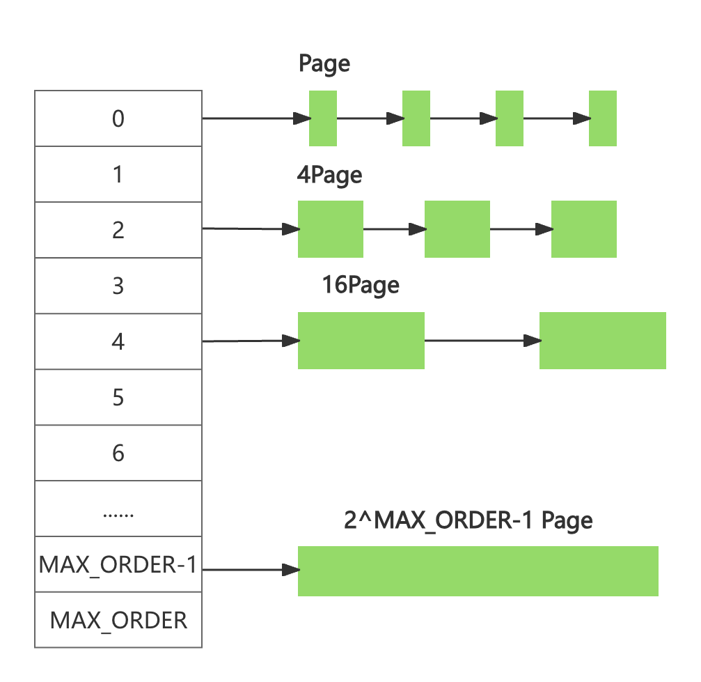
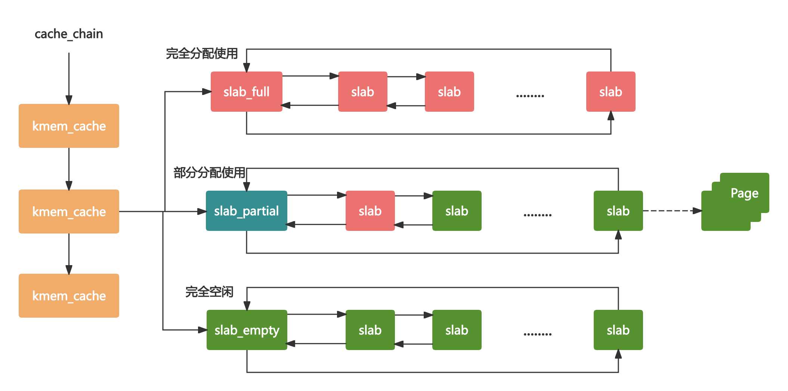
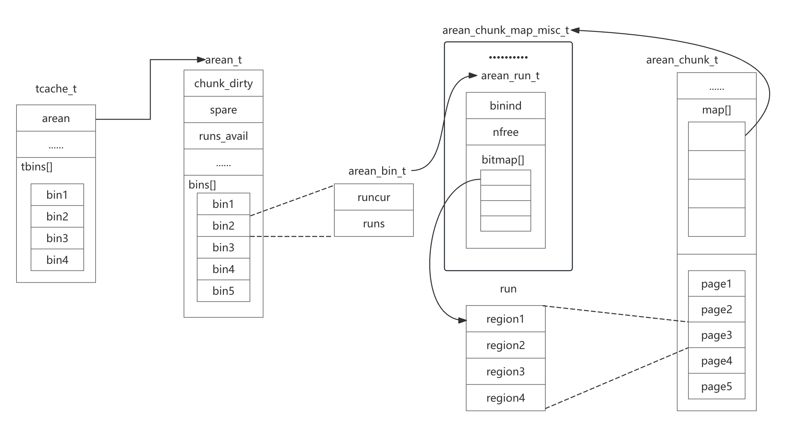

# 背景知识

- jemalloc由Jason Evans在FreeBSD项目中引入的新一代内存分配器。它是一个通用的malloc实现，侧重于减少内存碎片和提升高并发场景下内存的分配效率，其目标是能够替代malloc
- ptmalloc基于glibc实现的内存分配器，它是一个标准实现，所以兼容性好。pt表示per thread的意思，当然ptmalloc确实在多线程的性能优化上下了很多功夫，由于过于考虑性能问题，多线程之间内存无法实现共享，只能每个线程都独立使用各自的内存，所以在内存开销上是有很大浪费的
- tcmalloc出身于Google,全称是thread-caching malloc所以tcmalloc最大的特点是带有线程缓存
  - 对于小对象的分配，可以直接由线程局部缓存来完成
  - 对于大对象的分配场景，tcmalloc尝试采用自旋锁来减少多线程的锁竞争问题
- Jemalloc借鉴了tcmalloc优秀的设计思路，同样都包含thread cache的特性
  - jemalloc将内存分配粒度划分为small, large, huge三个分类并记录了很多meta数据，所以在空间占用上要略多于tcmalloc
  - tcmalloc内部采用红黑树管理内存块和分页，huge对象通过红黑树查找索引数据可以控制在指数级时间
- 核心目标
  - 高效的内存分配和回收，提升单线程或者多线程场景下的性能
  - 减少内存碎片，包括内部碎片和外部碎片，提高内存的有效利用率
- 什么是内存碎片
  - Linux中物理内存会被划分成若干个4K大小的内存页Page，物理内存的分配和回收都是基于Page完成的
  - Page内产生的内存碎片称为内部碎片
  - Page之间产生的内存碎片称为外部碎片

# 常用的内存分配器算法

## 动态内存分配

- 动态内存分配(Dynamic memory allocation)又称为堆内存分配，后面简称DMA操作系统根据运行过程中的需求即时分配内存，且分配的内存大小就是程序需求的大小
- DMA是从一整块内存中按需分配，对于分配出的内存会记录元数据，同时还会使用空闲分区维护空闲内存，便于在内存分配时查找可用的空闲分区

- 首次适应算法(first fit)
  - 空闲分区链以地址递增的顺序将空闲分区以双向链表的形式连接在一起，从空闲分区链中找到第一个满足分配条件的空闲分区，然后从空闲分区中划分出一块可用内存给请求进程，剩余的空闲分区仍然保留在空闲分区链中

- 循环首次适应算法(next fit)
  - 该算法是由首次适应算法的变种，循环首次适应算法不再是每次从链表的开始进行查找，而是从上次找到的空闲分区的下一个空闲分区查找
- 最佳适应算法(best fit)
  - 空闲分区链以空闲分区大小递增的顺序将空闲分区，以双向链表的形式链接在一起，每次从空闲分区链的开头进行查找，这样第一个满足分配条件的空间分区就是最优解

## 伙伴算法

- 伙伴算法是一种非常经典的内存分配算法，它采用了分离适配的设计思想，将物理内存按照2的次幂进行划分，内存分配时也是按照2的次幂大小进行按需分
- 例如4KB, 8KB, 16KB假设我们请求的内存大小为10KB, 那么会按照16KB分配

- 首先需要找到存储2^4连续Page所对应的链表即数组下标为4
- 查找2^4链表中是否有空闲的内存块，如果有则分配成功
- 如果2^4链表不存在空闲的内存块，则继续沿数组向上查找，即定位数组下标为5的链表，链表中每个节点存储2^5的连续Page
- 如果2^5链表中存在空闲的内存块，则取出该内存块，并将它分割为2个2^4大小的内存块，其中一块分配给进程使用，剩余的一块链接到2^4链表中
- 当进程适应完内存归还时，需要检查其伙伴块的内存是否释放
- 所谓伙伴块是不仅大小相同，而且两个块的地址是连续的，其中低地址的内存块起始地址必须为2的整数次幂
- 如果伙伴块是空闲的，那么就会将两个内存块合并成更大的块，然后重复执行上述伙伴块的检查机制直至伙伴块是非空闲的

## slab算法

- slab算法是在伙伴算法的基础上，对小内存的场景专门做了优化，采用了内存池的方案，解决内部碎片问题
- Linux内核使用的就是slab算法，所以slab算法提高了一种高速缓存机制，使用缓存存储内核对象

- 单个slab可以在不同的链表之间移动
- 当一个slab被分配完，就会从slab_partial移动到slabs_full
- 当一个slab中有对象被释放后，就会从slab_full再次回到slab_partial
- 所有对象都被释放完的话，就会从slab_partial移动到slab_empty

# jemalloc架构设计

- arena是jemalloc最重要的部分
- bin用于管理不同档位的内存单元
- chunk是负责管理用户内存块的数据结构
- run实际上是chunk中的一块内存区域
- region是每个run中对应的若干个小内存块
- tcache是每个线程私有的缓存

- jemalloc的几个核心的概念之间的关系
  - 内存是由一定数量的arenas负责管理，线程均匀分布在arenas当中
  - 每个arena都包含一个bin数组，每个bin管理不同档位的内存块
  - 每个arena被划分为若干个chunks，每个chunk又包含若干个runs,每个run由连续的Page组成，run才是实际分配内存的操作对象
  - 每个run会被划分为一定数量的regions,在小内存的分配场景，region相当于用户内存
  - 每个tcache对应一个arena,tcache中包含多种类型的bin
- small场景：如果请求分配内存的大小小于arena中的最小的bin,那么优先从线程中对应的tcache中挨个进行分配
- large场景：如果请求分配内存的大小大于arena中的最小的bin, 但是不大于tcache中能够缓存的最大块，依然会通过tcache进行分配，但是不同的是此时会分配chunk以及所对应的run, 从chunk中找到相应的内存空间进行分配
- huge场景：如果请求分配内存的大小大于chunk的大小，那么直接通过mmap进行分配，调用munmap进行回收

# 总结

- jemalloc的思想在很多场景都非常适用，在Redis, Netty等知名的高性能组件中都有它的原型，申请大块内存，避免细水长流
