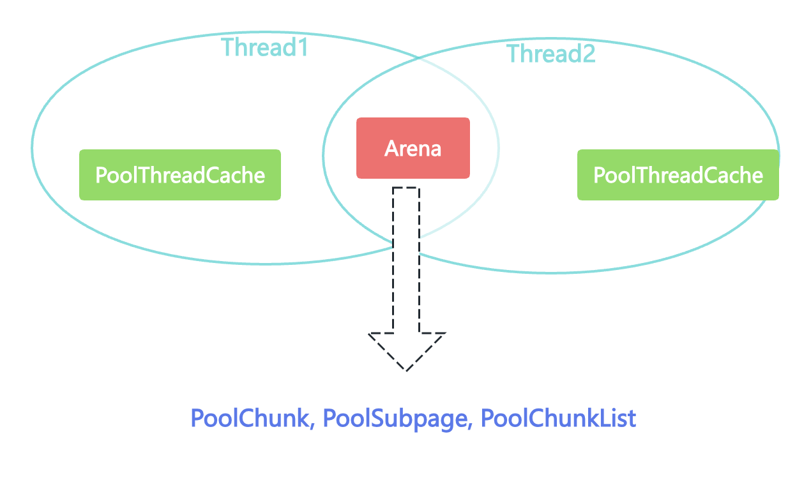

- 在单线程或者多线程的场景下，如何高效地进行内存分配和回收？
- 如何减少内存碎片，提高内存地有效利用率？

# 内存规格介绍


## Chunk

- Chunk：Netty向操作系统申请的单位，所有的内存分配操作也是基于Chunk完成的
- Chuck可以理解为Page的集合，每个Chunk默认大小为16M

## Page

- Chunk用于管理内存的单位
- Netty中的Page大小为8K, 不要与Liux中的内存页Page相混淆了、、

## SubPage

- 负责Page内的内存分配
- 在Tiny场景下，最小的划分单位为16B, 按16B依次递增， 16B, 32B, 48B, ...., 496B
- 在Small场景下，总共可以划分为512B, 1024B, 2048B, 4096B四种情况

# Netty内存池架构设计


- Netty借鉴了jemalloc中Arena的设计思想，采用了固定数量的多个Arena进行内存分配，Arena的默认数量与CPU核数有关，通过创建多个Arena来缓解资源竞争问题，从而 提高内存分配效率
- PoolSubpage: 用于分配小于8K的内存，安装Tiny和Small两种内存规格
  - tiny: 16B, 32B, 48B, ... , 496B共32种情况
  - small: 512B, 1KB, 2KB, 4KB 四种情况
- PoolChunkList:用于分配大于8K的内存
  - qInit: 内存使用率为0-25%的Chunk [0%, 25%)
  - q000: 内存使用率为1-50%的Chunk [1%, 50%)
  - q025: 内存使用率为25%-75%的Chunk [25%, 75%)
  - q050: 内存使用率为50%-100%的Chunk  [50%, 100%)
  - q075: 内存使用率为75%-100%的Chunk  [75%, 100%)
  - q100: 内存使用率为100%的Chunk
  - PoolChunkList负责管理多个PoolChunk的生命周期，同一个PoolChunkList中存放内存使用率相近的PoolChunk，这些PoolChunk同样以双向链表的形式连接在一起
- Netty内存的分配和回收都是基于PoolChunk完成的，PoolChunk是真正的存储内存数据的地方，每个PoolChunk的默认大小为16M
- PoolChunk数据结构定义

```java
final class PoolChunk<T> implements PoolChunkMetric {
    final PoolArena<T> arena;
    final T memory;  //存储的数据
    
    private final byte[] memoryMap; //满二叉树中的节点释放被分配，数组大小为4096
    private final byte[] depthMap; // 满二叉树中节点的高度，数组大小为4096
    private final PoolSubpage<T>[] subpages; // PoolChunk中管理的2048个8K内存块
  
	// ......
    private int freeBytes; // 剩余的内存大小

    PoolChunkList<T> parent;
    PoolChunk<T> prev;
    PoolChunk<T> next;
    // 省略其它代码
}
```

- PoolSubpage

  - 在小内存分配的场景下，即分配的内存大小小于一个Page8K, 会使用PoolSubpage进行管理

  ```java
  final class PoolSubpage<T> implements PoolSubpageMetric {
  
      final PoolChunk<T> chunk;
      private final int memoryMapIdx; // 对应满二叉树节点的下标
      private final int runOffset; //PoolSubpage在PoolChunk中memory的偏移量
      private final int pageSize;
      private final long[] bitmap; //记录每个小内存块的状态
  	//与PoolArena中tinySubpagePools或smallSubpagePools中元素连接成双向链表
      PoolSubpage<T> prev;
      PoolSubpage<T> next;
  
      boolean doNotDestroy;
      int elemSize; // 每个小内存块的大小
      private int maxNumElems; //最多可以存放多少小内存块：8K / elemSize
      private int bitmapLength; 
      private int nextAvail;
      private int numAvail; //可用于分配的内存块个数
  }
  ```

- PoolThreadCache & MemoryRegionCache: 对应的是jemalloc中本地线程缓存：

  - PoolThreadCache是如何被使用呢？他可以缓存哪些类型的数据呢？PoolThreadCache缓存tiny, small, normal三种类型的数据
  - MemoryRegionCache

  | Queue     | Queue<Entry<T>>        | Queue<Entry<T>>          | Queue<Entry<T>>             |
  | --------- | ---------------------- | ------------------------ | --------------------------- |
  | SizeClass | tiny(0-512B), tiny[32] | small(512B-8K), small[4] | normal(8K - 16M), normal[3] |
  | Size      | N * 16B                | 512B, 1K, 2K, 4K         | 8K, 16K, 32K                |

# 内存分配实现原理



- PoolArena中管理的内存单位为PoolChunk, 每个PoolChunk会被划分为2048个8K的Page
- 分配内存大于8K时，PoolChunk中采用的Page级别的内存分配策略
- 分配内存小于8K时，由PoolSubpage负责管理的内存分配策略
- 分配内存小于8K时，为了提高内存分配效率由PoolThreadCache本地线程缓存提供的内存分配策略
- 为了提高内存的分配效率，在分配小于8K内存时，PoolChunk不再分配单独的Page,而是将Page划分为更小的额内存块，由PoolSubpage进行管理
- PoolThreadCache的内存分配
  - PoolArena分配的内存被释放时，Netty并没有将缓存归还给PoolChunk,而是使用PoolThreadCache缓存起来，当下次有同样规格的内存分配时，直接从PoolThreadCache取出使用
- 当用户线程释放内存时会将内存块缓存到本地线程的私有缓存PoolThreadCache中，这样在下次分配内存时会提高分配效率，但是当内存块被用完一次后，再没有分配需求，那么一直驻留在内存中又会造成内存浪费

# Netty内存池的设计思想

- 分四种内存规格管理内存，分别为Tiny, Small, Normal, Huge
- 设计了本地线程缓存机制PoolThreadCache, 用于提升内存分配时的并发性能
- PoolChunk使用伙伴算法管理Page, 以二叉树数据结构实现，是整个内存池分配的核心所在
- 每调用PoolThreadCache的allocate()方法到一定次数会触发检查PoolThreadCache中缓存的使用效率，使用频率较低的内存块会被释放
- 线程退出时，Netty会回收该线程对应的所有内存
