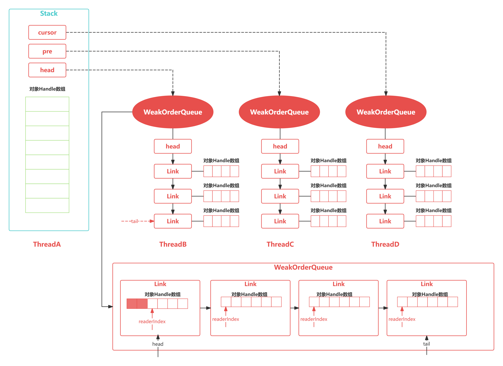

# 前言

- 对象池和内存池有什么区别？它们有什么联系？
- 实现对象池的方法有很多，Netty也是自己实现的吗？是如何实现的？
- 对象池在实践中我们应该怎么使用？

# Recycler快速上手

```java
import io.netty.util.Recycler;
import lombok.Getter;
import lombok.Setter;

public class TestRecycler {
    public static void main(String[] args) {
        // 1. 创建一个Recycler对象
        Recycler<User> recycler = new Recycler<User>() {
            @Override
            protected User newObject(Handle<User> handle) {
                return new User(handle);
            }
        };
        // 2. 从Recycler对象中获取一个User对象
        User user = recycler.get();
        user.setName("张三");
        // 3. 回收User对象
        user.recycle();
        // 4. 再次从Recycler对象中获取一个User对象
        User user1 = recycler.get();
        System.out.println(user1.getName());
        System.out.println(user == user1);
    }
}
class User {
    @Setter
    @Getter
     private String name;
     private Recycler.Handle<User> handle;

     public User(Recycler.Handle<User> handle) {
         this.handle = handle;
     }

    public void recycle() {
         handle.recycle(this);
     }
 }
```

- 对象池与内存池都是为了提高Netty的并发处理能力，当需要某个对象时，优先从对象池中获取对象实例
- Recycler时Netty提供的自定义实现的轻量级对象回收站，借助Recycler可以完成对象的获取和回收

# Recycler设计理念



```java
    static final class Stack<T> {
        final Recycler<T> parent; //所属的Recycler
        final WeakReference<Thread> threadRef; //所有线程的弱引用
        final AtomicInteger availableSharedCapacity; //异步线程回收对象时，其他线程能保存的被回收对象的最大个数
        final int maxDelayedQueues; //WeakOrderQueue最大个数

        private final int maxCapacity; //对象池的最大大小，默认最大为4K
        private final int ratioMask; //控制对象的回收比率，默认只回收1/8的对象
        private DefaultHandle<?>[] elements; //存储缓存数据的数组
        private int size; //缓存的DefaultHandle对象个数
        private int handleRecycleCount = -1; // Start with -1 so the first one will be recycled.
        // WeakOrderQueue链表的三个重要节点
        private WeakOrderQueue cursor, prev;
        private volatile WeakOrderQueue head;
    }
```

- WeakOrderQueue: 用于存储其他线程回收到当前线程所分配的对象，并且在合适的时机，Stack会从异线程的WeakOrderQueue中收割对象
- Link: 每个WeakOrderQueue中都包含一个Link链表，回收对象都会被存在Link链表中的节点上，每个Link节点默认存储16个对象，当每个Link节点存储满了会创建新的Link节点放入链表尾部
- DefaultHandle: 保存了时机回收的对象，Stack和WeakOrderQueue都使用DefaultHandle存储回收对象，在Stack中包含一个elements数组，该数组保存的时DefaultHandle实例

```java
public final T get() {
    if (maxCapacityPerThread == 0) {
        return newObject((Handle<T>) NOOP_HANDLE);
    }
    Stack<T> stack = threadLocal.get(); //获取当前线程缓存的Stack
    DefaultHandle<T> handle = stack.pop(); //从Stack中弹出一个DefaultHandle对象
    if (handle == null) {
        handle = stack.newHandle();
        handle.value = newObject(handle); //创建对象并保存到DefaultHandle
    }
    return (T) handle.value;
}
DefaultHandle<T> pop() {
    int size = this.size;
    if (size == 0) {
        //就尝试从其他线程回收的对象中转移一些到elements数组当中
        if (!scavenge()) {
            return null;
        }
        size = this.size;
    }
    size --;
    DefaultHandle ret = elements[size]; //将实例从栈顶弹出
    elements[size] = null;
    if (ret.lastRecycledId != ret.recycleId) {
        throw new IllegalStateException("recycled multiple times");
    }
    ret.recycleId = 0;
    ret.lastRecycledId = 0;
    this.size = size;
    return ret;
}

boolean scavenge() {
    // 尝试从WeakOrderQueue中转移对象实例到Stack中
    if (scavengeSome()) {
        return true;
    }

    // 如果转移失败，就会重置cursor指针到head节点
    prev = null;
    cursor = head;
    return false;
}

boolean scavengeSome() {
    WeakOrderQueue prev;
    WeakOrderQueue cursor = this.cursor; //cursor指针指向当前WeakOrderQueue链表的读取位置
    //如果cursor指针为null, 则是第一次从WeakOrderQueue链表中获取对象
    if (cursor == null) {
        prev = null;
        cursor = head;
        if (cursor == null) {
            return false;
        }
    } else {
        prev = this.prev;
    }

    boolean success = false;
    //不断循环从WeakOrderQueue链表中找到一个可用的对象实例
    do {
        //尝试迁移WeakOrderQueue中部分对象实例到Stack中
        if (cursor.transfer(this)) {
            success = true;
            break;
        }
        WeakOrderQueue next = cursor.next;
        if (cursor.owner.get() == null) {
            //如果已退出的线程还有数据
            if (cursor.hasFinalData()) {
                for (;;) {
                    if (cursor.transfer(this)) {
                        success = true;
                    } else {
                        break;
                    }
                }
            }
		   //将已退出的线程从WeakOrderQueue链表中移除
            if (prev != null) {
                prev.setNext(next);
            }
        } else {
            prev = cursor;
        }
		//将cursor指针指向下一个WeakOrderQueue
        cursor = next;

    } while (cursor != null && !success);

    this.prev = prev;
    this.cursor = cursor;
    return success;
}
```

- 当Stack中elements有数据时，直接从栈顶弹出
- 当Stack中elements没有数据时，尝试从WeakOrderQueue中回收一个Link包含的对象实例到Stack中，然后从栈顶弹出

# 总结

- 对象池有两个重要的组成部分：Stack和WeakOrderQueue
- 从Recycler获取对象时，优先从Stack中查找，如果Stack没有可用对象，会尝试从WeakOrderQueue迁移部分对象到Stack中
- Recycler回收对象时，分为同线程对象回收和异线程回收两种情况，同线程回收直接向Stack中添加对象，异线程回收向WeakOrderQueue中的Link添加对象
- 对象回收都会控制回收速率，每8个对象会回收一个，其他的全部丢弃