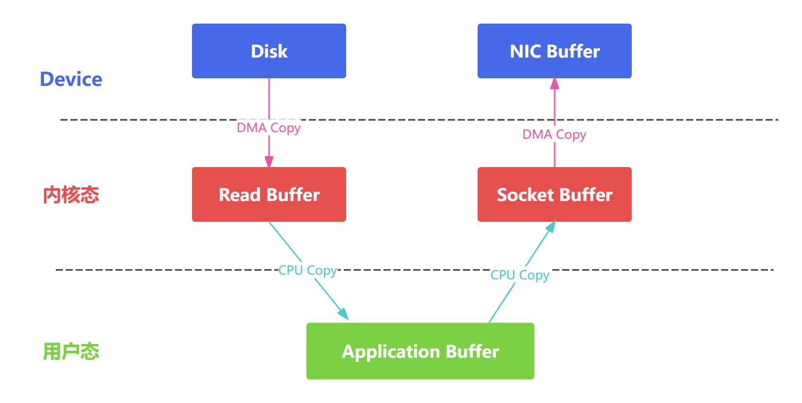
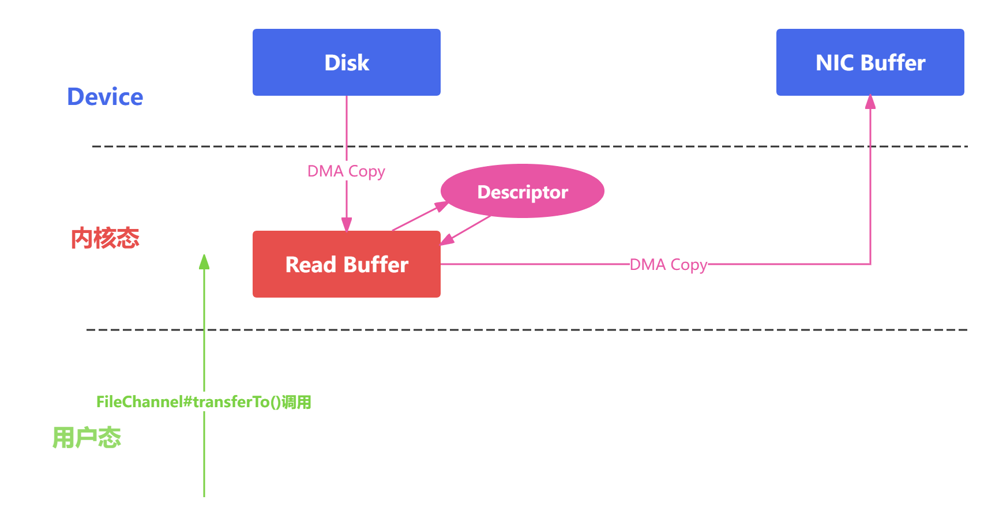
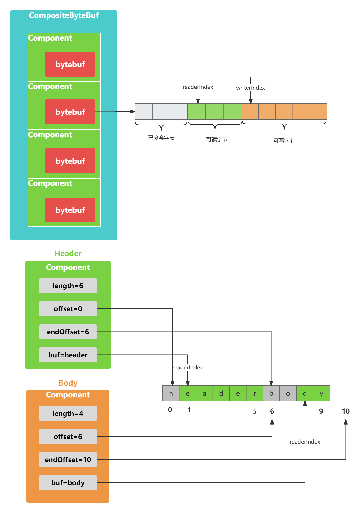
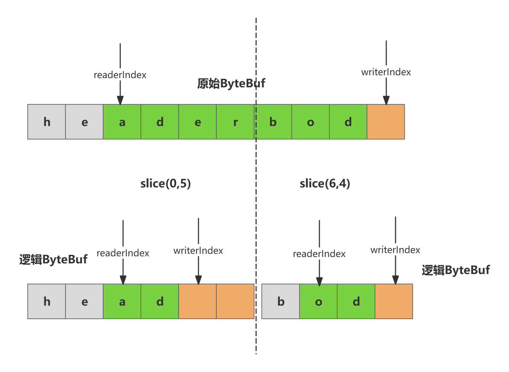

# 前言

- 零拷贝体现在哪些地方？
- Netty的零拷贝技术又是如何实现的？

# 传统Linux中的零拷贝技术

- 在数据操作时，不需要将数据从一个内存位置拷贝到另一个内存位置，这样可以减少一次内存拷贝的损耗，从而节省了CPU时钟周期和内存带宽



- DMA (Direct Memory Access, 直接内存存取)，DMA接管了数据读写的工作，不需要CPU再参与IO中断的处理，从而减轻了CPU的负担
- 传统的数据拷贝过程为什么不是将数据直接传输到用户缓冲区呢？引入内核缓冲区可以充当缓存的作用，可以实现文件数据的预读，提升IO性能
- 使用零拷贝技术之后数据传输的流程：DMA引擎从文件读取数据后放入到内核缓冲区，然后可以直接从内核缓冲区传输到Socket缓冲区，从而减少内存拷贝的次数



# Netty的零拷贝技术

- 堆外内存，避免JVM堆内存到堆外内存的数据拷贝

- CompositeByteBuf类，可以组合多个Buffer对象合并成一个逻辑上的对象

- 通过Unpooled.wrapperBuffer可以将byte数组包装成ByteBuf对象

- ByteBuf.slice操作与Unpooled.wrappedBuffer相反

- Netty使用FileRegion实现文件传输

- 堆外内存

  - 操作系统并不感知JVM的堆内存，而且JVM的内存布局与操作系统所分配的是不一样的，操作系统并不会按照JVM的行为来读写数据
  - 同一个对象的内存地址随着JVM GC的执行可能会随时发生变化，例如JVM GC的过程中会通过压缩来减少内存碎片，这就涉及对象移动的问题了

## CompositeByteBuf



  - Netty中实现零拷贝机制非常重要的一个数据结构
  - CompositeByteBuf可以理解为一个虚拟的Buffer对象
  - 例：HTTP协议数据可以分为头部信息header和消息体数据body

  ```java
  ByteBuf httpBuf = Unpooled.buffer(header.readableBytes() + body.readableBytes());
  httpBuf.writeBytes(header);
  httpBuf.writeBytes(body);
  ```

  - 如果使用CompositeByteBuf如何实现类似的需求？

  ```java
  CompositeByteBuf httpBuf = Unpooled.compositeByteBuffer();
  httpBuf.addComponents(true, header, body);
  ```

  ```java
  private static final class Component {
      //原始的ByteBuf
      final ByteBuf srcBuf; // the originally added buffer
      //srcBuf去除包装之后的ByteBuf
      final ByteBuf buf; // srcBuf unwrapped zero or more times
  
      //CompositeByteBuf的起始索引相对于srcBuf的读索引的便宜
      int srcAdjustment; // index of the start of this CompositeByteBuf relative to srcBuf
      //CompositeByteBuf的起始索引相对于buf的读索引的便宜
      int adjustment; // index of the start of this CompositeByteBuf relative to buf
  	//Component相对于CompositeByteBuf的起始索引位置
      int offset; // offset of this component within this CompositeByteBuf
      //Component相对于CompositeByteBuf的结束索引位置
      int endOffset; // end offset of this component within this CompositeByteBuf
  
      private ByteBuf slice; // cached slice, may be null
  }
  ```

## ByteBuf#slice

```java
public ByteBuf slice();
public ByteBuf slice(int index, int length);
```



## FileRegion

```java
public class DefaultFileRegion extends AbstractReferenceCounted implements FileRegion {

    private static final InternalLogger logger = InternalLoggerFactory.getInstance(DefaultFileRegion.class);
    private final File f; //传输的文件
    private final long position; //文件的起始位置
    private final long count; //传输的字节数
    private long transferred; //已经写入的字节数
    private FileChannel file; // 文件对应的FileChannel
        @Override
    public long transferTo(WritableByteChannel target, long position) throws IOException {
        long count = this.count - position;
        if (count < 0 || position < 0) {
            throw new IllegalArgumentException(
                    "position out of range: " + position +
                    " (expected: 0 - " + (this.count - 1) + ')');
        }
        if (count == 0) {
            return 0L;
        }
        if (refCnt() == 0) {
            throw new IllegalReferenceCountException(0);
        }
        // Call open to make sure fc is initialized. This is a no-oop if we called it before.
        open();

        long written = file.transferTo(this.position + position, count, target);
        if (written > 0) {
            transferred += written;
        } else if (written == 0) {
            validate(this, position);
        }
        return written;
    }
}
```

# 总结

- Netty零拷贝技术：堆外内存，CompositeByteBuf, Unpooled.wrappedBuffer, ByteBuf.slice, FileRegion