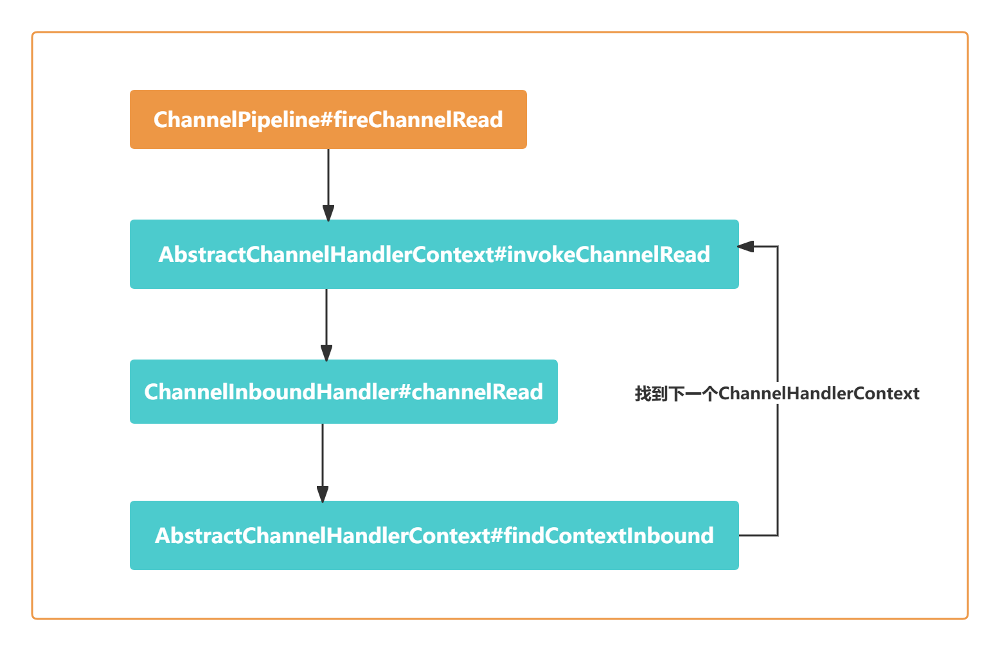

# 前言

- 在服务端启动时会为创建NioServerSocketChannel
- 当客户端连接接入时又会创建NioSocketChannel
- 不管是服务端还是客户端Channel在创建时都会初始化自己的ChannelPipeline

# 事件处理机制回顾


- 当客户端向服务端发送数据时，NioEventLoop会监听到OP_READ事件，然后分配ByteBuf并读取数据，读取完成后将数据传送给Pipeline处理
- 跟进addLast0()方法

```java
    private void addLast0(AbstractChannelHandlerContext newCtx) {
        AbstractChannelHandlerContext prev = tail.prev;
        newCtx.prev = prev;
        newCtx.next = tail;
        prev.next = newCtx;
        tail.prev = newCtx;
    }
```

- atomicRemoveFromHandlerList()方法

```java
    private synchronized void atomicRemoveFromHandlerList(AbstractChannelHandlerContext ctx) {
        AbstractChannelHandlerContext prev = ctx.prev;
        AbstractChannelHandlerContext next = ctx.next;
        prev.next = next;
        next.prev = prev;
    }
```

# 数据在Pipeline中的运转

- 入站ChannelInboundHandler和出战ChannelOutboundHandler, Inbound事件和Outbound事件的传播方向相反
  - Inbound事件的传播方向为Head - Tail
  - Outbound事件的传播方向为Tail -> Head
- 首先定位到NioEventLoop中源码的入口

```java
// NioEventLoop#processSelectedKey
if ((readyOps & (SelectionKey.OP_READ | SelectionKey.OP_ACCEPT)) != 0 || readyOps == 0) {
    unsafe.read();
}
```

- 跟进unsafe.read()的源码

```java
@Override
public final void read() {
    final ChannelConfig config = config();
    if (shouldBreakReadReady(config)) {
        clearReadPending();
        return;
    }
    final ChannelPipeline pipeline = pipeline();
    final ByteBufAllocator allocator = config.getAllocator();
    final RecvByteBufAllocator.Handle allocHandle = recvBufAllocHandle();
    allocHandle.reset(config);

    ByteBuf byteBuf = null;
    boolean close = false;
    try {
        do {
            byteBuf = allocHandle.allocate(allocator);
            allocHandle.lastBytesRead(doReadBytes(byteBuf)); //将 Channel中的数据读取到ByteBuf中
            if (allocHandle.lastBytesRead() <= 0) {
                byteBuf.release();
                byteBuf = null;
                close = allocHandle.lastBytesRead() < 0;
                if (close) {
                    readPending = false;
                }
                break;
            }
            allocHandle.incMessagesRead(1);
            readPending = false;
            pipeline.fireChannelRead(byteBuf); //传播ChannelRead事件
            byteBuf = null;
        } while (allocHandle.continueReading());
        allocHandle.readComplete();
        pipeline.fireChannelReadComplete(); //传播readComplete事件
        if (close) {
            closeOnRead(pipeline);
        }
    } catch (Throwable t) {
        handleReadException(pipeline, byteBuf, t, close, allocHandle);
    } finally {
        if (!readPending && !config.isAutoRead()) {
            removeReadOp();
        }
    }
}
```

- fireChannelRead()

```java
static void invokeChannelRead(final AbstractChannelHandlerContext next, Object msg) {
    final Object m = next.pipeline.touch(ObjectUtil.checkNotNull(msg, "msg"), next);
    EventExecutor executor = next.executor();
    if (executor.inEventLoop()) { //当前在Reactor线程内部，直接执行
        next.invokeChannelRead(m);
    } else {
        // 如果是外部线程，则提交给异步任务队列
        executor.execute(new Runnable() {
            @Override
            public void run() {
                next.invokeChannelRead(m);
            }
        });
    }
}
```

- 核心逻辑next.invokeChannelRead()

```java
private void invokeChannelRead(Object msg) {
    if (invokeHandler()) {
        try {
            ((ChannelInboundHandler) handler()).channelRead(this, msg);
        } catch (Throwable t) {
            notifyHandlerException(t);
        }
    } else {
        fireChannelRead(msg);
    }
}
```

- HeadContext.channelReead()是如何实现的

```java
//HeadContext
@Override
public void channelRead(ChannelHandlerContext ctx, Object msg) {
    ctx.fireChannelRead(msg);
}

//AbstractChannelHandlerContext
@Override
public ChannelHandlerContext fireChannelRead(final Object msg) {
    //找到下一个节点，执行invokeChannelRead
    invokeChannelRead(findContextInbound(MASK_CHANNEL_READ), msg);
    return this;
}
```



- findContextInbound()

```java
private AbstractChannelHandlerContext findContextInbound(int mask) {
    AbstractChannelHandlerContext ctx = this;
    do {
        ctx = ctx.next;
    } while ((ctx.executionMask & mask) == 0);
    return ctx;
}
```

- Inbound事件在上述递归调用的流程中什么时候能够结束呢？
  - 用户自定义的Handler没有执行fireChannelRead()操作，则在当前Handler终止Inbound事件传播
  - 如果用户自定义的Handler都执行了fireChannelRead()操作，Inbound事件传播最终会在TailContext节点终止
- TailContext节点做了哪些工作

```java
@Override
public void channelRead(ChannelHandlerContext ctx, Object msg) {
    onUnhandledInboundMessage(ctx, msg);
}

protected void onUnhandledInboundMessage(ChannelHandlerContext ctx, Object msg) {
    onUnhandledInboundMessage(msg);
    if (logger.isDebugEnabled()) {
        logger.debug("Discarded message pipeline : {}. Channel : {}.",ctx.pipeline().names(), ctx.channel());
    }
}
```

- 从TailContext跟进writeAndFlush()源码

```java
@Override
public final ChannelFuture writeAndFlush(Object msg, ChannelPromise promise) {
    return tail.writeAndFlush(msg, promise);
}
private void write(Object msg, boolean flush, ChannelPromise promise) {
    ObjectUtil.checkNotNull(msg, "msg");
    try {
        if (isNotValidPromise(promise, true)) {
            ReferenceCountUtil.release(msg);
            return;
        }
    } catch (RuntimeException e) {
        ReferenceCountUtil.release(msg);
        throw e;
    }
    final AbstractChannelHandlerContext next = findContextOutbound(flush ? (MASK_WRITE | MASK_FLUSH) : MASK_WRITE);
    final Object m = pipeline.touch(msg, next);
    EventExecutor executor = next.executor();
    // 判断当前线程是否是NioEventLoop中的线程
    if (executor.inEventLoop()) {
        if (flush) {
            //因为flush==true, 所以流程走到这里
            next.invokeWriteAndFlush(m, promise);
        } else {
            next.invokeWrite(m, promise);
        }
    } else {
        final AbstractWriteTask task;
        if (flush) {
            task = WriteAndFlushTask.newInstance(next, m, promise);
        }  else {
            task = WriteTask.newInstance(next, m, promise);
        }
        if (!safeExecute(executor, task, promise, m)) {
            task.cancel();
        }
    }
}
```

# 总结

- ChannelPipeline是双向链表结构，包含ChannelInboundHandler和ChannelOutboundHandler两种处理器
- Inbound事件和Outbound事件的传播方向相反，Inbound事件的传播方向为Head -> Tail, 而Outbound事件传播方向为Tail -> Head
- 异常事件的处理顺序与ChannelHandler的添加顺序相同，会依次向后传播与Inbound事件和Outbound事件无关
- ChannelPipeline中事件传播的实现原理
  - Inbound事件传播从HeadContext节点开始
  - Outbound事件传播从TailContext节点开始
  - AbstractChannelHandlerContext抽象类中实现了一系列fire和invoke方法，如果想让事件向下传播，只需要调用fire系列方法即可
