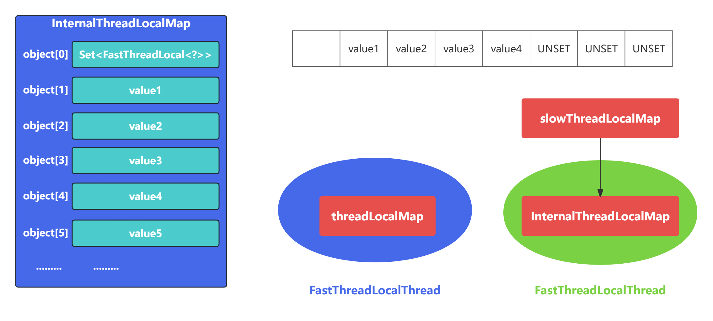

# JDK ThreadLocal

- ThreadLocal可以理解为线程本地变量
- ThreadLocal为变量在每个线程都创建了一个副本，该副本只能被当前线程访问
- ThreadLocal实现原理
  - 在ThreadLocal中维护一个Map,记录线程与实例之间的映射关系，JDK的ThreadLocal是这么实现的吗？
  - 答案是NO, 因为在高并发场景并发修改Map需要加锁，势必会降低性能

[ThreadLocal](../concurrent/22-ThreadLocal.md)

# FastThreadLocal为什么快

```java
public class FastThreadLocalThread extends Thread {
    private InternalThreadLocalMap threadLocalMap;
    //.......
}
public final class InternalThreadLocalMap extends UnpaddedInternalThreadLocalMap {
    private static final int DEFAULT_ARRAY_LIST_INITIAL_CAPACITY = 8;
    private static final int STRING_BUILDER_INITIAL_SIZE;
    private static final int STRING_BUILDER_MAX_SIZE;

    public static final Object UNSET = new Object();

    private BitSet cleanerFlags;
        private InternalThreadLocalMap() {
        super(newIndexedVariableTable());
    }
}
```



- FastThreadLocal.set()

```java
public final void set(V value) {
    if (value != InternalThreadLocalMap.UNSET) { // 1.value是否为缺省值
        InternalThreadLocalMap threadLocalMap = InternalThreadLocalMap.get(); //2.获取当前线程的InternalThreadLocalMap
        setKnownNotUnset(threadLocalMap, value); //3.将InternalThreadLocalMap中数据替换为新的value
    } else {
        remove();
    }
}
```

- InternalThreadLocalMap.get()

```java
public static InternalThreadLocalMap get() {
    Thread thread = Thread.currentThread();
    if (thread instanceof FastThreadLocalThread) { //当前线程是否为FastThreadLocal类型
        return fastGet((FastThreadLocalThread) thread);
    } else {
        return slowGet();
    }
}
```

- setKnownNotUnset()如何将数据添加到InternalThreadLocalMap的

```java
private void setKnownNotUnset(InternalThreadLocalMap threadLocalMap, V value) {
    if (threadLocalMap.setIndexedVariable(index, value)) { // 1.找到数组下标index位置，设置新的value
        addToVariablesToRemove(threadLocalMap, this); // 2.将FastThreadLocal对象保存到待清理的Set中
    }
}
```

- threadLocalMap.setIndexedVariable()

```java
public boolean setIndexedVariable(int index, Object value) {
    Object[] lookup = indexedVariables;
    if (index < lookup.length) {
        Object oldValue = lookup[index];
        lookup[index] = value; //直接将数组index位置设置为value,时间复杂度为O(1)
        return oldValue == UNSET;
    } else {
        expandIndexedVariableTableAndSet(index, value);//容量不够，先扩容再设置值
        return true;
    }
}
private void expandIndexedVariableTableAndSet(int index, Object value) {
    Object[] oldArray = indexedVariables;
    final int oldCapacity = oldArray.length;
    int newCapacity = index;
    newCapacity |= newCapacity >>>  1;
    newCapacity |= newCapacity >>>  2;
    newCapacity |= newCapacity >>>  4;
    newCapacity |= newCapacity >>>  8;
    newCapacity |= newCapacity >>> 16;
    newCapacity ++;

    Object[] newArray = Arrays.copyOf(oldArray, newCapacity);
    Arrays.fill(newArray, oldCapacity, newArray.length, UNSET);
    newArray[index] = value;
    indexedVariables = newArray;
}
```

- addToVariablesToRemove()是如何实现的

```java
private static void addToVariablesToRemove(InternalThreadLocalMap threadLocalMap, FastThreadLocal<?> variable) {
    //获取数组下标为0的元素
    Object v = threadLocalMap.indexedVariable(variablesToRemoveIndex);
    Set<FastThreadLocal<?>> variablesToRemove;
    if (v == InternalThreadLocalMap.UNSET || v == null) {
        //创建FastThreadLocal类型的Set集合
        variablesToRemove = Collections.newSetFromMap(new IdentityHashMap<FastThreadLocal<?>, Boolean>());
        //将Set集合填充到数组下标为0的位置
        threadLocalMap.setIndexedVariable(variablesToRemoveIndex, variablesToRemove);
    } else {
        //如果不是UNSET, Set集合已存在，直接强转获得Set集合
        variablesToRemove = (Set<FastThreadLocal<?>>) v;
    }
	//将FastThreadLocal添加到Set集合中
    variablesToRemove.add(variable);
}
```

- remove()方法

```java
public final void remove() {
    remove(InternalThreadLocalMap.getIfSet());
}
public static InternalThreadLocalMap getIfSet() {
    Thread thread = Thread.currentThread();
    if (thread instanceof FastThreadLocalThread) {
        return ((FastThreadLocalThread) thread).threadLocalMap();
    }
    return slowThreadLocalMap.get();
}
public final void remove(InternalThreadLocalMap threadLocalMap) {
    if (threadLocalMap == null) {
        return;
    }
	//删除数组下标index位置对应的value
    Object v = threadLocalMap.removeIndexedVariable(index);
    //从数组下标0的位置取出Set集合，并删除当前FastThreadLocal
    removeFromVariablesToRemove(threadLocalMap, this);

    if (v != InternalThreadLocalMap.UNSET) {
        try {
            onRemoval((V) v); //空方法，用户可以继承实现
        } catch (Exception e) {
            PlatformDependent.throwException(e);
        }
    }
}
```

- FastThreadLocal.get()

```java
public final V get() {
    InternalThreadLocalMap threadLocalMap = InternalThreadLocalMap.get();
    //从数组中取出index位置的元素
    Object v = threadLocalMap.indexedVariable(index);
    if (v != InternalThreadLocalMap.UNSET) {
        return (V) v;
    }
	//如果获取到的数组元素是缺省对象，执行初始化操作
    return initialize(threadLocalMap);
}
public Object indexedVariable(int index) {
    Object[] lookup = indexedVariables;
    return index < lookup.length? lookup[index] : UNSET;
}
private V initialize(InternalThreadLocalMap threadLocalMap) {
    V v = null;
    try {
        v = initialValue();
    } catch (Exception e) {
        PlatformDependent.throwException(e);
    }

    threadLocalMap.setIndexedVariable(index, v);
    addToVariablesToRemove(threadLocalMap, this);
    return v;
}
```

- initialize()方法会调用用户重写的initialValue方法构造需要存储的对象数据

```java
private final FastThreadLoccal<String> threadLocal = new FastThreadLocal<String>() {
    @Override
    protected String initialValue() {
        return "hello world";
    }
}
```

- FastThreadLocal真的一定比ThreadLocal快吗？只有使用FastThreadLocalThread类型的线程才会快，如果是普通线程反而会更慢
- FastThreadLocal会浪费很大的空间吗？虽然FastThreadLocal采用的空间换时间的思路，但是在FastThreadLocal设计之初就认为不会存在特别多的FastThreadLocal对象，而且在数据中没有使用的元素只是存放了同一个缺省对象的引用，并不会占用太多内存空间

# 总结

## 高效查找

- FastThreadLocal
  - 在定位数据的时候可以直接根据数组下标index获取，时间复杂度O(1)
  - 只需要把数据容量扩容2倍，然后把原数据拷贝到新数组
- ThreadLocal
  - 在数据较多时哈希表很容易发生Hash冲突，线性探测法在解决Hash冲突时需要不停的向下寻找，效率较低
  - 由于采用的哈希表，所以在扩容后需要再做一轮rehash

## 安全性更高

- FastThreadLocal
  - 不仅提供了remove()主动清除对象的方法
  - 而且再线程池场景中Netty还封装了FastThreadLocalRunnable
  - FastThreadLocalRunnable最后还执行FastThreadLocal.removeAll()
  - 将Set集合中所有FastThreadLocal对象都清理掉
- ThreadLocal
  - 使用不当可能造成内存泄漏，只能等待线程销毁
  - 只能通过主动检测的方式防止内存泄漏，从而造成一定的开销