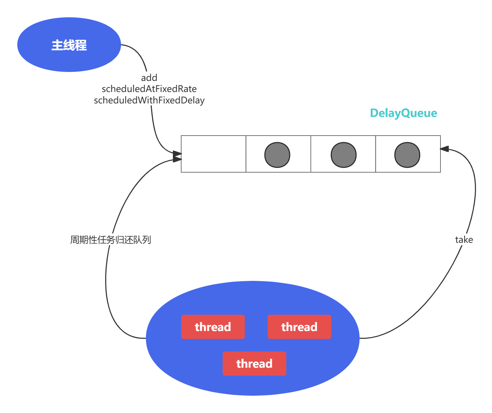
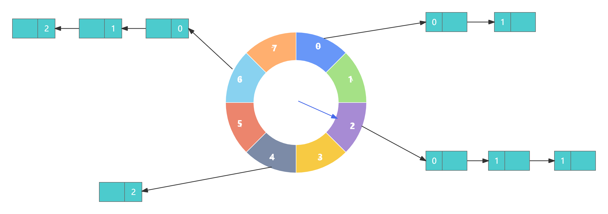
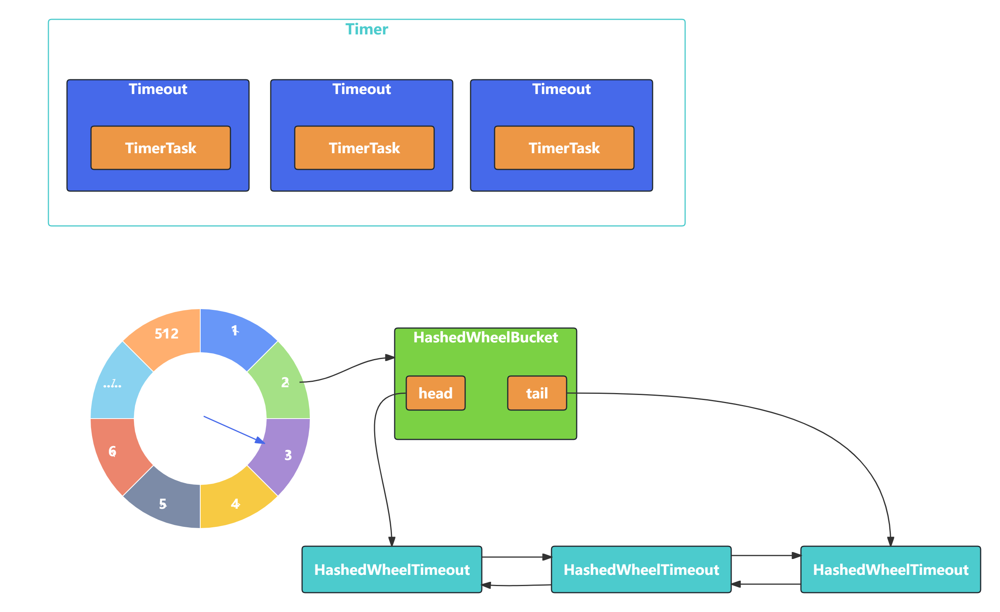

- 延迟任务处理神器之时间轮HashedWheelTimer

# 前言

- 客户端连接的超时控制、通信双方连接的心跳检测等场景
- 为了实现高性能的定时任务调度，Netty引入了时间轮算法驱动定时任务的执行
- 时间轮到底时什么
- 为什么Netty一定要用时间轮来处理定时任务
- JDK原生的实现方案不能满足要求吗

# 定时任务的基础知识

## 什么是定时任务

- 定时器：例如生成月统计报表，财务对账，会员积分结算，邮件推送等
- 按固定周期定时执行
- 延迟一定时间后执行
- 指定某个时刻执行
- Schedule新增任务至任务集合
- Cancel取消某个任务
- Run执行到期的任务

## JDK原生提供了三种常用的定时器实现方式

### Timer

- Timer属于JDK比较早期的版本实现，它可以实现固定周期的任务，以及延迟任务
- Timer是如何使用的

```java
Timer timer = new Timer();
timer.scheduleAtFixedRate(new TimerTask() {
    @Override
    public void run() {
        // do something
    }
}, 10000, 1000); // 10s后调度一个周期为1s的定时任务
```

- Timer的内部构造

```java
public class Timer {
    /**
     * The timer task queue.  This data structure is shared with the timer
     * thread.  The timer produces tasks, via its various schedule calls,
     * and the timer thread consumes, executing timer tasks as appropriate,
     * and removing them from the queue when they're obsolete.
     */
    private final TaskQueue queue = new TaskQueue();

    /**
     * The timer thread.
     */
    private final TimerThread thread = new TimerThread(queue);
}
```

- Timer是单线程模式，如果某个TimerTask执行时间很久，会影响其他任务的调度
- Timer的任务调度是基于系统绝对时间的，如果系统时间不正确，可能会出现问题
- TimerTask如果执行出现异常，Timer并不会捕获，会导致线程终止，其他任务永远不会执行

### DelayedQueue

- JDK中一种可以延迟获取对象的阻塞队列，其内部是采用优先队列PriorityQueue存储对象
- DelayedQueue的使用方法

```java
public class DelayQueueTest{
    public static void main(String[] args) {
        BlockingQueue<SampleTask> delayQueue = new DelayedQueue<>();
        long now = System.currentTimeMillis();
        delayQueue.put(new SampleTask(now + 1000));
        delayQueue.put(new SampleTask(now + 2000));
        delayQueue.put(new SampleTask(now + 3000));
        for(int i=0; i<3; i++) {
            System.out.println(new Date(delayQueue.take().getTime()));
        }
    }
}
@Data
class SampleTask implements Delayed {
    long time;
}
```

- 实现重试机制
  - 接口调用失败或者请求超时后
  - 可以将当前请求对象放入DelayQueue
  - 通过一个异步线程take()取出对象然后继续进行重试
  - 如果还是请求失败，继续放回DelayQueue
  - 为了限制重试的频率
  - 可以设置重试的最大次数以及采用指数退避算法设置对象的deadline
  - 如2s, 4s, 8s, 16s,...,以此类推

### ScheduledThreadPoolExecutor

- ScheduledThreadPoolExecutor如何使用

```java
public static void main(String[] args) {
    ScheduledExecutorService executor = Executors.newScheduledThreadPool(5);
    //1s后开始执行，每2s执行一次
    executor.scheduleAtFixedRate(() -> System.out.println("Hello"), 1000, 2000, TimeUnit.MILLISECONDS);
}
```



# 时间轮原理分析



- 时间轮被划分为8个slot, 每个slot代表1s, 当前指针指向2
- 假如现在需要调度一个3s后执行的任务，应该假如2+3=5的slot中
- 如果需要调度一个12s以后的任务，需要等待时针完整走完一圈round零4个slot，需要放入第(2+12)%8=6个slot
- 第6个slot的链表包含3个任务
  - 第一个任务round=0,需要立即执行
  - 第二个任务round=1,需要等待1*8=8s后执行
  - 第三个任务round=2,需要等待2*8=8s后执行
- 所以当时针转动到对应slot时，只执行round=0的任务
- slot中其余任务的round应当减1，等待下一个round之后执行
- 时间轮定时器最大的优势：
  - 任务的新增和取消都是O(1)时间复杂度
  - 而且只需要一个线程就可以驱动时间轮进行工作

# HashedWheelTimer源码解析



- 接口定义

```java
public interface Timer {
    Timeout newTimeout(TimerTask task, long delay, TimeUnit unit);
    Set<Timeout> stop();
}
public interface Timeout {
    Timer timer();
    TimerTask task();
    boolean isExpired();
    boolean isCancelled();
    boolean cancel();
}
public interface TimerTask {
    void run(Timeout timeout) throws Exception;
}

```

- HashedWheelTimer是如何使用的

```java
public static void main(String[] args) {
    Timer timer = new HashedWheelTimer();
    Timeout timeout1 = timer.newTimeout(timeout -> System.out.println("timeout1" + new Date()), 10, TimeUnit.SECONDS);
    if (timeout1.isExpired()) {
        timeout1.cancel();
    }
    timer.newTimeout(timeout -> {
        System.out.println("timeout2" + new Date());
    }, 1, TimeUnit.SECONDS);
    timer.newTimeout(timeout -> System.out.println("timeout3" + new Date()), 3, TimeUnit.SECONDS);
}
```

- HashedWheelTimer的内部实现结构

```java
public HashedWheelTimer(
        ThreadFactory threadFactory,
        long tickDuration, TimeUnit unit, int ticksPerWheel, boolean leakDetection,
        long maxPendingTimeouts) {
	// ...
    // 创建时间轮的环形数组结构
    wheel = createWheel(ticksPerWheel);
    //用于快速取模的掩码
    mask = wheel.length - 1;
    // 转换成纳秒处理
    long duration = unit.toNanos(tickDuration);
    //....
    //创建工作线程
    workerThread = threadFactory.newThread(worker);
	//是否开启内存泄漏检测
    leak = leakDetection || !workerThread.isDaemon() ? leakDetector.track(this) : null;
	//最大允许等待任务数，HashedWheelTimer中任务超出该阈值时会抛出异常
    this.maxPendingTimeouts = maxPendingTimeouts;
	//如果HashedWheelTimer的实例数超过64，会打印错误日志
    if (INSTANCE_COUNTER.incrementAndGet() > INSTANCE_COUNT_LIMIT &&
        WARNED_TOO_MANY_INSTANCES.compareAndSet(false, true)) {
        reportTooManyInstances();
    }
}
```

- createWheel()方法

```java
private static HashedWheelBucket[] createWheel(int ticksPerWheel) {
    if (ticksPerWheel <= 0) {
        throw new IllegalArgumentException(
            "ticksPerWheel must be greater than 0: " + ticksPerWheel);
    }
    if (ticksPerWheel > 1073741824) {
        throw new IllegalArgumentException(
            "ticksPerWheel may not be greater than 2^30: " + ticksPerWheel);
    }
    ticksPerWheel = normalizeTicksPerWheel(ticksPerWheel);
    HashedWheelBucket[] wheel = new HashedWheelBucket[ticksPerWheel];
    for (int i = 0; i < wheel.length; i ++) {
        wheel[i] = new HashedWheelBucket();
    }
    return wheel;
}
```

- 添加任务，HashedWheelTimer提供的newTimeout()方法
  - 根据用户传入的任务延迟时间
  - 可以计算出任务的deadline
  - 然后创建定时任务HashedWheelTimer对象
  - 最终把HashedWheelTimerout添加到Mpsc Queue中

```java
@Override
public Timeout newTimeout(TimerTask task, long delay, TimeUnit unit) {
    if (task == null) {
        throw new NullPointerException("task");
    }
    if (unit == null) {
        throw new NullPointerException("unit");
    }
    long pendingTimeoutsCount = pendingTimeouts.incrementAndGet();
    if (maxPendingTimeouts > 0 && pendingTimeoutsCount > maxPendingTimeouts) {
        pendingTimeouts.decrementAndGet();
        throw new RejectedExecutionException("Number of pending timeouts ("
                                             + pendingTimeoutsCount + ") is greater than or equal to maximum allowed pending "
                                             + "timeouts (" + maxPendingTimeouts + ")");
    }
	//1. 如果worker线程没有启动，需要启动
    start();
    //计算任务的deadline
    long deadline = System.nanoTime() + unit.toNanos(delay) - startTime;
    if (delay > 0 && deadline < 0) {
        deadline = Long.MAX_VALUE;
    }
    //2.创建定时任务
    HashedWheelTimeout timeout = new HashedWheelTimeout(this, task, deadline);
    //3.添加任务到Mpsc Queue
    timeouts.add(timeout);
    return timeout;
}
```

- 启动工作线程start()

```java
public void start() {
    switch (WORKER_STATE_UPDATER.get(this)) {
        case WORKER_STATE_INIT:
            if (WORKER_STATE_UPDATER.compareAndSet(this, WORKER_STATE_INIT, WORKER_STATE_STARTED)) {
                workerThread.start();
            }
            break;
        case WORKER_STATE_STARTED:
            break;
        case WORKER_STATE_SHUTDOWN:
            throw new IllegalStateException("cannot be started once stopped");
        default:
            throw new Error("Invalid WorkerState");
    }

    // Wait until the startTime is initialized by the worker.
    while (startTime == 0) {
        try {
            startTimeInitialized.await();
        } catch (InterruptedException ignore) {
            // Ignore - it will be ready very soon.
        }
    }
}
```

- 工作线程Worker, 定位到Worker的run()方法

```java
private final class Worker implements Runnable {
    //未处理任务列表
    private final Set<Timeout> unprocessedTimeouts = new HashSet<Timeout>();
    private long tick;
    @Override
    public void run() {
        startTime = System.nanoTime();
        if (startTime == 0) {
            startTime = 1;
        }
        startTimeInitialized.countDown();
        do {
            //1.计算下次tick的时间，然后sleep到下次tick
            final long deadline = waitForNextTick();
            //可能因为溢出或者线程中断，造成deadline<=0
            if (deadline > 0) {
                //2.获取当前tick在HashedWheelBucket数组中对应的下标
                int idx = (int) (tick & mask);
                //3.移除被取消的任务
                processCancelledTasks();
                HashedWheelBucket bucket = wheel[idx];
                //4.从Mpsc Queue中取出任务加入对应的slot中
                transferTimeoutsToBuckets();
                bucket.expireTimeouts(deadline);
                tick++;
            }
        } while (WORKER_STATE_UPDATER.get(HashedWheelTimer.this) == WORKER_STATE_STARTED);
		//时间轮退出后，取出slot中未执行且未被取消的任务，并加入未处理任务列表，以便stop()方法返回
        for (HashedWheelBucket bucket: wheel) {
            bucket.clearTimeouts(unprocessedTimeouts);
        }
        for (;;) {
            HashedWheelTimeout timeout = timeouts.poll();
            if (timeout == null) {
                break;
            }
            if (!timeout.isCancelled()) {
                unprocessedTimeouts.add(timeout);
            }
        }
        processCancelledTasks();
    }
}
```

- waitForNextTick()方法是如何计算等待时间的

```java
private long waitForNextTick() {
    long deadline = tickDuration * (tick + 1);
    for (;;) {
        final long currentTime = System.nanoTime() - startTime;
        long sleepTimeMs = (deadline - currentTime + 999999) / 1000000;
        if (sleepTimeMs <= 0) {
            if (currentTime == Long.MIN_VALUE) {
                return -Long.MAX_VALUE;
            } else {
                return currentTime;
            }
        }
        if (PlatformDependent.isWindows()) {
            sleepTimeMs = sleepTimeMs / 10 * 10;
        }
        try {
            Thread.sleep(sleepTimeMs);
        } catch (InterruptedException ignored) {
            if (WORKER_STATE_UPDATER.get(HashedWheelTimer.this) == WORKER_STATE_SHUTDOWN) {
                return Long.MIN_VALUE;
            }
        }
    }
}
```

- Worker#processCancelledTasks()方法处理被取消的任务

  - 所有取消的任务都会加入cancelledTimeouts队列中
  - Worker会从队列中取出任务
  - 然后将其从对应的HashedWheelBucket中删除，删除操作作为基本的链表操作

  ```java
  private void processCancelledTasks() {
      for (;;) {
          HashedWheelTimeout timeout = cancelledTimeouts.poll();
          if (timeout == null) {
              // all processed
              break;
          }
          try {
              timeout.remove();
          } catch (Throwable t) {
              if (logger.isWarnEnabled()) {
                  logger.warn("An exception was thrown while process a cancellation task", t);
              }
          }
      }
  }
  ```

- transferTimeoutsToBuckets()方法

```java
private void transferTimeoutsToBuckets() {
    //每次时针tick最多只处理100000个任务，以防阻塞Worker线程
    for (int i = 0; i < 100000; i++) {
        HashedWheelTimeout timeout = timeouts.poll();
        if (timeout == null) {
            // all processed
            break;
        }
        if (timeout.state() == HashedWheelTimeout.ST_CANCELLED) {
            // Was cancelled in the meantime.
            continue;
        }
		//计算任务需要经过多少个tick
        long calculated = timeout.deadline / tickDuration;
        //计算任务需要在时间轮中经历的圈数remainingRounds
        timeout.remainingRounds = (calculated - tick) / wheel.length;

        final long ticks = Math.max(calculated, tick); // Ensure we don't schedule for past.
        int stopIndex = (int) (ticks & mask);

        HashedWheelBucket bucket = wheel[stopIndex];
        bucket.addTimeout(timeout);
    }
}
```

- 根据HashedWheelBucket#expireTimeouts()方法

```java
public void expireTimeouts(long deadline) {
    HashedWheelTimeout timeout = head;

    // process all timeouts
    while (timeout != null) {
        HashedWheelTimeout next = timeout.next;
        if (timeout.remainingRounds <= 0) {
            next = remove(timeout);
            if (timeout.deadline <= deadline) {
                timeout.expire();
            } else {
                // The timeout was placed into a wrong slot. This should never happen.
                throw new IllegalStateException(String.format(
                    "timeout.deadline (%d) > deadline (%d)", timeout.deadline, deadline));
            }
        } else if (timeout.isCancelled()) {
            next = remove(timeout);
        } else {
            //未到执行时间，remainingRounds减1
            timeout.remainingRounds --;
        }
        timeout = next;
    }
}
```

- 停止时间轮，以stop()方法为入口

```java
@Override
public Set<Timeout> stop() {
    // Worker线程无法停止时间轮
    if (Thread.currentThread() == workerThread) {
        throw new IllegalStateException(
            HashedWheelTimer.class.getSimpleName() +
            ".stop() cannot be called from " +
            TimerTask.class.getSimpleName());
    }
	//尝试通过CAS操作将工作线程的状态更新为SHUTDOWN状态
    if (!WORKER_STATE_UPDATER.compareAndSet(this, WORKER_STATE_STARTED, WORKER_STATE_SHUTDOWN)) {
        // workerState can be 0 or 2 at this moment - let it always be 2.
        if (WORKER_STATE_UPDATER.getAndSet(this, WORKER_STATE_SHUTDOWN) != WORKER_STATE_SHUTDOWN) {
            INSTANCE_COUNTER.decrementAndGet();
            if (leak != null) {
                boolean closed = leak.close(this);
                assert closed;
            }
        }

        return Collections.emptySet();
    }

    try {
        boolean interrupted = false;
        while (workerThread.isAlive()) {
            workerThread.interrupt(); //中断Worker线程
            try {
                workerThread.join(100);
            } catch (InterruptedException ignored) {
                interrupted = true;
            }
        }

        if (interrupted) {
            Thread.currentThread().interrupt();
        }
    } finally {
        INSTANCE_COUNTER.decrementAndGet();
        if (leak != null) {
            boolean closed = leak.close(this);
            assert closed;
        }
    }
    //返回未处理任务的列表
    return worker.unprocessedTimeouts();
}
```

- HashedWheelTimeout:任务的封装类，包含任务的到期时间deadline, 需要经历的圈数remainingRounds等属性
- HashedWheelBucket:相当于时间轮的每个slot,内部采用双向链表保存了当前需要执行的HashedWheelTimeout列表
- Worker:HashedWheelTimer的核心工作引擎，负责处理定时任务

# 时间轮进阶应用

- Netty中的时间轮通过固定时间间隔tickDuration进行推动的
- 如果长时间没有到期任务，那么会存在时间轮空推进的现象，从而造成一定的性能损耗
- 如果任务的到期时间跨度很大，例如A任务1s后执行，B任务6小时之后执行，也会造成空推进的问题

# 总结

- 如果长时间没有到期任务，那么会存在时间轮空推进的现象
- 只适用于处理耗时较短的任务，由于Worker是单线程的，如果一个任务执行的时间过长，会造成Worker线程阻塞
- 相比传统定时器的实现方式，内存占用较大