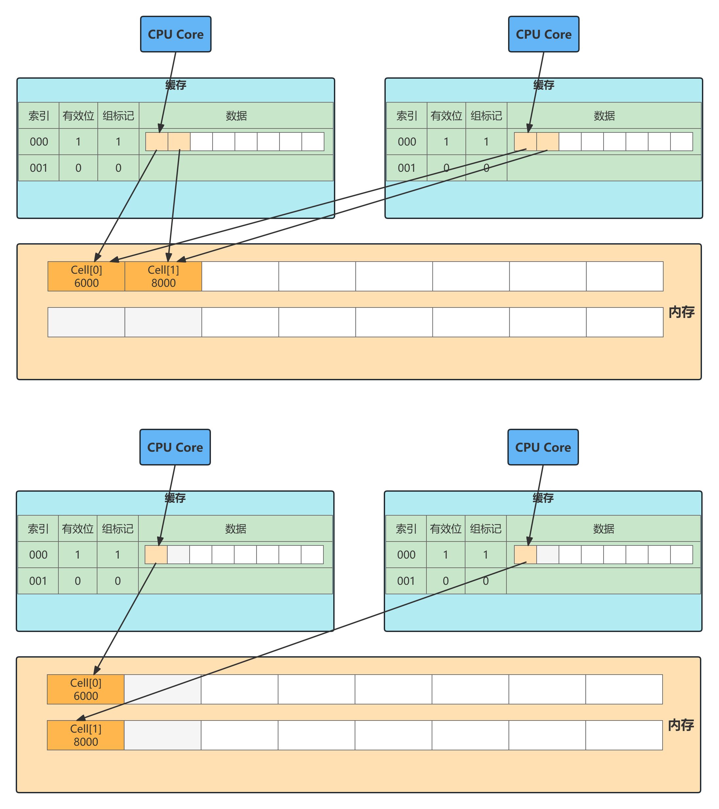

# JDK原生并发队列

## 阻塞队列

- ArrayBlockingQueue
  - 最基础且开发中最常用的阻塞队列
  - 底层采用数组实现的有界队列，初始化需要指定队列的容量
  - 内部是使用了一个重入锁ReentrantLock
  - 并搭配notEmpty, notFull两个条件变量Condition来控制并发访问
- LinkedBlockingQueue
  - 内部采用的数据结构是链表，队列的长度可以是有界或者无界的
  - 初始化不需要指定队列长度，默认是Integer.MAX_VALUE
  - 内部使用了takeLock, putLock两个重入锁ReentrantLock
  - 以及notEmpty, notFull两个条件变量Condition来控制并发访问
- PriorityBlockingQueue
  - 采用最小堆实现的优先队列，队列中的元素按照优先级进行排序
  - 每次出队都是返回优先级最高的元素
  - 内部是使用了一个ReentrantLock
  - 以及一个条件变量Condition notEmpty来控制并发访问
  - 不需要notFull是因为PriorityBlockingQueue是无界队列
- DelayQueue
  - 一种支持延迟获取元素的阻塞队列，常用于缓存，定时任务调度等场景
  - 内部是采用优先级队列PriorityQueue存储对象
  - 每个对象都必须实现Delayed接口，并重写compareTo和getDelay方法
- SynchronousQueue
  - 又称无缓冲队列
  - SynchronousQueue内部不会存储元素，直接使用CAS操作控制线程的安全访问
  - put和take操作都是阻塞的，每一个put操作都必须阻塞等待一个take操作
  - 生产者和消费者配对的场景，双方必须互相等待，直至配对成功
- LinkedTransferQueue
  - 一个特殊的无界阻塞队列
  - LinkedBlockingQueue, SynchronousQueue(公平模式)
  - 内部可以存储实际数据
  - 使用CAS无锁操作进一步提升了性能

## 非阻塞队列

- ConcurrentLinkedQueue
- ConcurrentLinkedDeque
  - 一种采用双向链表结构的无界并发非阻塞队列
  - ConcurrentLinkedDeque属于双端队列，同时支持FIFO和FILO两种模式
  - 可以从队列的头部插入和删除数据，也可以从队尾插入和删除数据

| 接口/行为 | 队列满抛出异常 | 返回元素 | 一直阻塞 | 阻塞一段时间 |
| --------- | -------------- | -------- | -------- | ------------ |
| 新增元素  | add            | offer    | put      | offer        |
| 删除元素  | remove         | poll     | take     | poll         |
| 查看元素  | element        | peek     | /        | /            |

## Disruptor

- 是LMAX公司开发的一款高性能无锁队列，称为RingBuffer
- Disruptor内部采用环形数组和CAS操作实现
- 环形数组可以复用内存，减少分配内存和释放内存带来的性能损耗

## JCTools

- 也是一个开源项目
- JCTools是适用于JVM并发开发的工具，主要提供了一些JDK缺失的并发数据结构，例如非阻塞Map, 非阻塞Queue等

# Mpsc Queue基础知识

- Mpsc(Multi Producer Single Consumer)多生产者单消费者
- Mpsc Queue可以保证多个生产者同时访问队列是线程安全的，而且同一时刻只允许一个消费者从队列中读取数据
- MpscArrayQueue, MpscUnboundArrayQueue, MpscChunkedArrayQueue

## MpscArrayQueue

```java
//ConcurrentCircularArrayQueueL0Pad
long p01,p02,p03,p04,p05,p06,p07;
long p10,p11,p12,p13,p14,p15,p16,p17;
//ConcurrentCircularArrayQueue
protected final long mask; //计算数组下标的掩码
protected final E[] buffer;//存放队列数据的数组
//MpmcArrayQueueL1Pad;
long p00,p01,p02,p03,p04,p05,p06,p07;
long p10,p11,p12,p13,p14,p15,p16;
//MpmcArrayQueueProducerIndexField
private volatile long producerIndex;//生产者索引
//MpscArrayQueueMidPad
long p01,p02,p03,p04,p05,p06,p07;
long p10,p11,p12,p13,p14,p15,p16,p17;
//MpscArrayQueueProducerLimitField
private volatile long producerLimit;//生产者索引最大值
//MpscArrayQueueL2Pad
long p00,p01,p02,p03,p04,p05,p06,p07;
long p10,p11,p12,p13,p14,p15,p16;
//MpscArrayQueueConsumerIndexField
protected long consumerIndex;//消费者索引
//MpscArrayQueueL3Pad
long p01,p02,p03,p04,p05,p06,p07;
long p10,p11,p12,p13,p14,p15,p16,p17;
```

- Cache Line是CPU缓存可操作的最小单位，CPU缓存由若干个Cache Line组成， Cache Line的大小与CPU架构有关
- 在目前主流的64位架构下，Cache Line的大小通常位64Byte
- 如果同一个Cache Line被越多的线程修改，那么造成的写竞争就会越激烈，数据会频繁写入内存，导致性能浪费



## MpscArrayQueue使用

```java
public static final MpscArrayQueue<String> queue = new MpscArrayQueue<>(2);
public static void main(String[] args) {
    for (int i = 0; i < 2; i++) {
        int index = i;
        new Thread(() -> queue.offer("data" + index), "thread-" + index).start();
    }
    try {
        Thread.sleep(1000);
        queue.add("data2");// 入队操作，队列满则抛出异常
    } catch (Exception e) {
        e.printStackTrace();
    }
    System.out.println("队列大小:" + queue.size() + "，队列容量:" + queue.capacity());
    System.out.println("出队:" + queue.remove()); //出队操作，队列为空则抛出异常
    System.out.println("出队：" + queue.poll()); //出队操作，队列为空则返回null
}
```

## 入队offer()方法

```java
public boolean offer(E e) {
    if (null == e) {
        throw new NullPointerException();
    } else {
        long mask = this.mask;
        long producerLimit = this.lvProducerLimit(); //获取生产者索引最大限制

        long pIndex;
        long offset;
        do {
            pIndex = this.lvProducerIndex(); //获取生产者索引
            if (pIndex >= producerLimit) {
                offset = this.lvConsumerIndex();//获取消费者索引
                producerLimit = offset + mask + 1L;
                if (pIndex >= producerLimit) {
                    return false;//队列已满
                }

                this.soProducerLimit(producerLimit);//更新producerLimit
            }
        } while(!this.casProducerIndex(pIndex, pIndex + 1L)); //CAS更新生产者索引，更新成功则退出，说明当前生产者已经占领索引值

        offset = calcElementOffset(pIndex, mask);//计算生产者索引在数组中下标
        UnsafeRefArrayAccess.soElement(this.buffer, offset, e);
        return true;
    }
}
```

- 内存屏障LoadLoad, StoreStore，LoadStore, StoreLoad
- LazySet机制是有代价的，就是写操作结果有纳秒级的延迟，不会立刻被其他线程以及自身线程可见
- do-while循环内的逻辑
  - 为什么需要两次if(pIndex >= producerLimit)判断呢？
  - producerLimit缓存值过期了或者队列已经满了
  - MpscArrayQueue采用了UNSAFE.getLongVolatile()方法保证获取消费者索引consumerIndex的准确性

##  出队poll

```java
public E poll() {
    long cIndex = this.lpConsumerIndex();//直接返回消费者索引consumerIndex
    long offset = this.calcElementOffset(cIndex);//计算数组对应的偏移量
    E[] buffer = this.buffer;
    E e = UnsafeRefArrayAccess.lvElement(buffer, offset);//取出数组中offset对应的元素
    if (null == e) {
        if (cIndex == this.lvProducerIndex()) {//队列已满
            return null;
        }

        do {
            e = UnsafeRefArrayAccess.lvElement(buffer, offset);
        } while(e == null);//等待生产者填充元素
    }

    UnsafeRefArrayAccess.spElement(buffer, offset, (Object)null);//消费成功后将当前位置置为NULL
    this.soConsumerIndex(cIndex + 1L);//更新consumerIndex到下一个位置
    return e;
}
//当调用lvElement()方法获取到的元素为NULL时，队列为空或者生产者填充的元素还没有对消费者可见
public static <E> E lvElement(E[] buffer, long offset) {
    return UnsafeAccess.UNSAFE.getObjectVolatile(buffer, offset);
}
```

# 总结

- 通过大量填充long类型变量解决伪共享问题
- 环形数组的容量设置为2的次幂，可以通过位运算快速定位到数组对应下标
- 入队offer()操作中producerLimit的巧妙设计大幅度减少了主动获取消费者索引consumerIndex的次数，性能提升显著
- 入队和出队操作中都大量使用了UNSAFE系列方法，针对生产者和消费者的场景不同，使用的UNSAFE方法也是不一样的